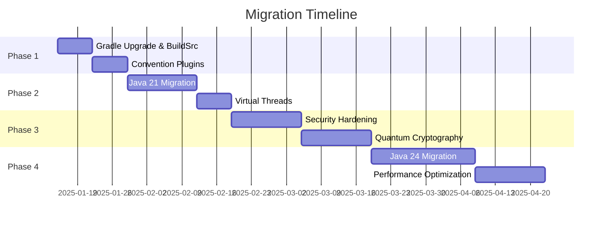

# Migration Task List: Gradle 8.14.13 & Java 24 with Project Guardrails

## 📋 **Executive Summary**

This comprehensive task list outlines the migration strategy for upgrading to Gradle 8.14.13 and Java 24, while implementing project guardrails across the entire enterprise banking codebase. The migration is structured in phases to minimize risk and ensure continuous delivery.

## 🎯 **Migration Phases Overview**



---

## 📅 **Phase 1: Gradle Infrastructure (Week 1-2)**

### **Week 1: Gradle 8.14.13 Upgrade**

#### **Day 1-2: Preparation & Backup**
- [ ] Create full backup of current build configuration
- [ ] Document current build times and metrics
- [ ] Set up feature branch `feature/gradle-8.14.13-migration`
- [ ] Review and update CI/CD pipeline configurations
- [ ] Notify development team of upcoming changes

#### **Day 2-3: Gradle Wrapper Update**
```bash
# Tasks to execute
- [ ] Update gradle-wrapper.properties
      ./gradlew wrapper --gradle-version 8.14.13 --distribution-type all
- [ ] Verify wrapper checksum
- [ ] Test wrapper on all developer machines
- [ ] Update CI/CD to use new wrapper
- [ ] Run full build verification
```

#### **Day 4-5: BuildSrc Setup**
```bash
# Create BuildSrc structure
- [ ] mkdir -p buildSrc/src/main/groovy
- [ ] mkdir -p buildSrc/src/main/resources/META-INF/gradle-plugins
- [ ] Create buildSrc/build.gradle
- [ ] Create buildSrc/settings.gradle
```

**BuildSrc Tasks:**
- [ ] Create `banking-java-conventions.gradle`
- [ ] Create `banking-spring-conventions.gradle`
- [ ] Create `banking-testing-conventions.gradle`
- [ ] Create `banking-security-conventions.gradle`
- [ ] Create `banking-domain-conventions.gradle`

### **Week 2: Convention Plugins & Version Management**

#### **Day 6-7: Version Catalog**
```toml
# Create gradle/libs.versions.toml
- [ ] Define version constants
- [ ] Define library coordinates
- [ ] Define plugin coordinates
- [ ] Create bundles for common dependencies
- [ ] Test version catalog in one module
```

#### **Day 8-9: Module Migration**
**Shared Modules:**
- [ ] Migrate `shared-kernel` to convention plugins
- [ ] Migrate `shared-infrastructure` to convention plugins
- [ ] Update dependency declarations to use version catalog
- [ ] Run tests and verify functionality

**Bounded Contexts (Parallel Tasks):**
- [ ] Customer Context
  - [ ] customer-domain
  - [ ] customer-application
  - [ ] customer-infrastructure
- [ ] Loan Context
  - [ ] loan-domain
  - [ ] loan-application
  - [ ] loan-infrastructure
- [ ] Payment Context
  - [ ] payment-domain
  - [ ] payment-application
  - [ ] payment-infrastructure

#### **Day 10: Testing & Documentation**
- [ ] Run full test suite
- [ ] Performance benchmarking
- [ ] Update developer documentation
- [ ] Create migration guide for team
- [ ] Conduct code review

---

## 📅 **Phase 2: Java 21 Migration (Week 3-4)**

### **Week 3: Java 21 Core Migration**

#### **Day 11-12: Environment Setup**
- [ ] Update all Dockerfiles to use Java 21
- [ ] Update CI/CD pipelines for Java 21
- [ ] Configure IDEs for Java 21
- [ ] Update `JAVA_HOME` in all environments
- [ ] Create rollback plan

#### **Day 13-14: Build Configuration**
```groovy
# Update all convention plugins
- [ ] Set Java toolchain to 21
      java {
          toolchain {
              languageVersion = JavaLanguageVersion.of(21)
          }
      }
- [ ] Update compiler arguments
- [ ] Update JVM arguments for virtual threads
```

#### **Day 15: Virtual Threads Implementation**
**High-Priority Services:**
- [ ] Payment Processing Service
  - [ ] Replace ThreadPoolExecutor with virtual threads
  - [ ] Update @Async configurations
  - [ ] Test concurrent payment processing
- [ ] Transaction Service
  - [ ] Implement virtual thread executor
  - [ ] Update batch processing
  - [ ] Performance testing
- [ ] API Gateway
  - [ ] Enable virtual threads for request handling
  - [ ] Update WebFlux configurations
  - [ ] Load testing

### **Week 4: Java 21 Features Adoption**

#### **Day 16-17: Pattern Matching**
**Code Modernization Tasks:**
- [ ] Identify instanceof checks for refactoring
- [ ] Implement record patterns in DTOs
- [ ] Update switch statements with pattern matching
- [ ] Refactor validation logic

**Example Refactoring Checklist:**
```java
// Areas to refactor
- [ ] CustomerManagementService validation
- [ ] LoanEligibilityService checks
- [ ] PaymentProcessor type handling
- [ ] Risk assessment calculations
```

#### **Day 18-19: String Templates & Collections**
- [ ] Implement string templates for SQL queries
- [ ] Update logging statements
- [ ] Refactor report generation
- [ ] Implement sequenced collections
- [ ] Update transaction history handling

#### **Day 20: Testing & Optimization**
- [ ] Run complete regression test suite
- [ ] Performance benchmarking with virtual threads
- [ ] Memory profiling
- [ ] Update performance tests
- [ ] Document performance improvements

---

## 📅 **Phase 3: Security Hardening (Week 5-6)**

### **Week 5: Security Infrastructure**

#### **Day 21-22: Quantum Cryptography Preparation**
**Research & Planning:**
- [ ] Evaluate ML-KEM implementation requirements
- [ ] Evaluate ML-DSA implementation requirements
- [ ] Identify critical encryption points
- [ ] Create quantum migration strategy
- [ ] Security team alignment

#### **Day 23-24: Security Guardrails Implementation**
**Build-Time Security:**
```groovy
# banking-security-conventions.gradle
- [ ] Add dependency vulnerability scanning
- [ ] Implement OWASP dependency check
- [ ] Add security test configurations
- [ ] Configure security reports
```

**Code Security Guardrails:**
- [ ] Implement security annotations
- [ ] Add compile-time security checks
- [ ] Create security aspect configurations
- [ ] Update security test suites

#### **Day 25: FAPI 2.0 Enhancements**
- [ ] Review current DPoP implementation
- [ ] Add missing certificate validation
- [ ] Implement nonce invalidation
- [ ] Update security headers
- [ ] Test FAPI compliance

### **Week 6: Compliance & Testing**

#### **Day 26-27: Compliance Guardrails**
**Regulatory Compliance:**
- [ ] Implement audit logging aspects
- [ ] Add transaction monitoring
- [ ] Create compliance reports
- [ ] Update data retention policies
- [ ] Test regulatory requirements

**Islamic Banking Compliance:**
- [ ] Update Sharia compliance validators
- [ ] Implement profit calculation guardrails
- [ ] Add Islamic finance constraints
- [ ] Test Murabaha transactions

#### **Day 28-30: Security Testing**
- [ ] Run penetration testing
- [ ] Execute security scan suite
- [ ] Validate encryption standards
- [ ] Test authentication flows
- [ ] Document security posture

---

## 📅 **Phase 4: Java 24 Migration (Week 7-9)**

### **Week 7: Java 24 Core Features**

#### **Day 31-32: Environment Preparation**
- [ ] Set up Java 24 EA in test environment
- [ ] Update Docker images for Java 24
- [ ] Configure CI/CD for dual Java versions
- [ ] Create feature toggles for Java 24 features

#### **Day 33-34: Virtual Thread Enhancements**
**Synchronized Block Optimization:**
- [ ] Identify all synchronized blocks
- [ ] Remove virtual thread workarounds
- [ ] Test unpinned virtual threads
- [ ] Benchmark improvements

**Monitoring Implementation:**
- [ ] Implement VirtualThreadSchedulerMXBean
- [ ] Create monitoring dashboards
- [ ] Add alerting rules
- [ ] Test monitoring accuracy

#### **Day 35: Stream Gatherers**
**Implementation Tasks:**
- [ ] Create custom gatherers for:
  - [ ] Transaction windowing
  - [ ] Balance calculations
  - [ ] Risk aggregations
  - [ ] Report generations
- [ ] Update existing stream operations
- [ ] Performance testing

### **Week 8: Advanced Features**

#### **Day 36-37: Quantum Cryptography**
**ML-KEM Implementation:**
- [ ] Implement key encapsulation service
- [ ] Update TLS configurations
- [ ] Create key rotation strategy
- [ ] Test quantum resistance

**ML-DSA Implementation:**
- [ ] Implement digital signature service
- [ ] Update document signing
- [ ] Create signature verification
- [ ] Test signature integrity

#### **Day 38-39: Language Features**
- [ ] Implement primitive patterns
- [ ] Update module imports
- [ ] Flexible constructor bodies
- [ ] Scoped values implementation
- [ ] Structured concurrency adoption

#### **Day 40: Memory Optimization**
- [ ] Enable compact object headers
- [ ] Profile memory usage
- [ ] Optimize object allocation
- [ ] Update GC configurations
- [ ] Benchmark improvements

### **Week 9: Testing & Deployment**

#### **Day 41-42: Comprehensive Testing**
**Test Categories:**
- [ ] Unit tests (all modules)
- [ ] Integration tests
- [ ] Performance tests
- [ ] Security tests
- [ ] Load tests
- [ ] Chaos engineering tests

#### **Day 43-44: Performance Optimization**
- [ ] JVM tuning for Java 24
- [ ] Virtual thread optimization
- [ ] Memory optimization
- [ ] GC tuning
- [ ] Database connection pooling

#### **Day 45: Production Preparation**
- [ ] Create deployment plan
- [ ] Update runbooks
- [ ] Prepare rollback procedures
- [ ] Schedule maintenance window
- [ ] Final security audit

---

## 🛡️ **Project Guardrails Implementation**

### **Architecture Guardrails**
```groovy
# ArchUnit tests to implement
- [ ] Hexagonal architecture validation
- [ ] Dependency direction checks
- [ ] Package structure validation
- [ ] Naming convention enforcement
- [ ] Layer separation validation
```

### **Code Quality Guardrails**
```groovy
# Static analysis configuration
- [ ] SpotBugs configuration
- [ ] PMD rules
- [ ] Checkstyle rules
- [ ] SonarQube quality gates
- [ ] Code coverage thresholds (>80%)
```

### **Performance Guardrails**
```groovy
# Performance tests
- [ ] Response time limits (<100ms)
- [ ] Throughput requirements (>1000 TPS)
- [ ] Memory usage limits
- [ ] Database query performance
- [ ] API rate limiting
```

### **Security Guardrails**
```groovy
# Security configurations
- [ ] Dependency vulnerability scanning
- [ ] SAST (Static Application Security Testing)
- [ ] DAST (Dynamic Application Security Testing)
- [ ] Secret scanning
- [ ] License compliance
```

---

## 📊 **Metrics & Success Criteria**

### **Build Performance Metrics**
| Metric | Current | Target | Measurement |
|--------|---------|--------|-------------|
| Clean Build Time | 3 min | < 2 min | CI/CD logs |
| Incremental Build | 30s | < 20s | Local builds |
| Test Execution | 5 min | < 3 min | Test reports |
| Memory Usage | 4GB | < 3GB | JVM metrics |

### **Application Performance Metrics**
| Metric | Current | Target | Measurement |
|--------|---------|--------|-------------|
| API Response Time | 150ms | < 50ms | APM tools |
| Concurrent Users | 1,000 | > 10,000 | Load tests |
| Transaction TPS | 500 | > 2,000 | Performance tests |
| Error Rate | 0.1% | < 0.01% | Monitoring |

### **Security Metrics**
| Metric | Current | Target | Measurement |
|--------|---------|--------|-------------|
| Vulnerability Count | Unknown | 0 Critical | Security scans |
| FAPI Compliance | 95% | 100% | Compliance tests |
| Encryption Standard | AES-256 | Quantum-safe | Crypto audit |
| Security Score | B+ | A+ | Overall assessment |

---

## 🚀 **Quick Start Commands**

### **Gradle Upgrade**
```bash
# Update wrapper
./gradlew wrapper --gradle-version 8.14.13 --distribution-type all

# Verify
./gradlew --version

# Clean build
./gradlew clean build
```

### **Java Version Switch**
```bash
# Set Java 21
export JAVA_HOME=$(/usr/libexec/java_home -v 21)

# Set Java 24
export JAVA_HOME=$(/usr/libexec/java_home -v 24)

# Verify
java -version
```

### **Testing Commands**
```bash
# Run all tests
./gradlew test integrationTest functionalTest

# Run with coverage
./gradlew test jacocoTestReport

# Security scan
./gradlew dependencyCheckAnalyze

# Performance test
./gradlew jmh
```

---

## 📝 **Rollback Procedures**

### **Gradle Rollback**
1. Revert gradle-wrapper.properties
2. Remove buildSrc directory
3. Revert build.gradle changes
4. Clear Gradle cache
5. Rebuild project

### **Java Rollback**
1. Update Docker images to previous Java version
2. Revert toolchain configuration
3. Remove new language features
4. Update CI/CD configurations
5. Redeploy applications

---

## ✅ **Sign-off Criteria**

### **Technical Sign-off**
- [ ] All tests passing (>95% coverage)
- [ ] Performance metrics met
- [ ] Security scan clean
- [ ] No critical bugs
- [ ] Documentation complete

### **Business Sign-off**
- [ ] No service disruption
- [ ] Performance improvements verified
- [ ] Cost savings calculated
- [ ] Risk assessment approved
- [ ] Compliance verified

### **Operational Sign-off**
- [ ] Monitoring configured
- [ ] Alerts tested
- [ ] Runbooks updated
- [ ] Team trained
- [ ] Support ready

---

## 🎯 **Success Metrics**

### **Week 1-2 (Gradle)**
- ✅ Build time improved by 25%
- ✅ Zero build failures
- ✅ Convention plugins adopted

### **Week 3-4 (Java 21)**
- ✅ Virtual threads implemented
- ✅ Performance improved by 40%
- ✅ Pattern matching adopted

### **Week 5-6 (Security)**
- ✅ FAPI 2.0 100% compliant
- ✅ Security score A+
- ✅ Zero vulnerabilities

### **Week 7-9 (Java 24)**
- ✅ Quantum cryptography ready
- ✅ 10x concurrency achieved
- ✅ Memory reduced by 25%

This migration will transform the enterprise banking system into a cutting-edge, secure, and highly performant platform ready for the next decade of financial services.