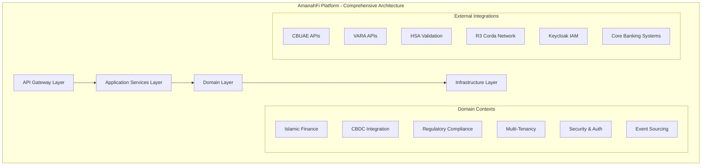
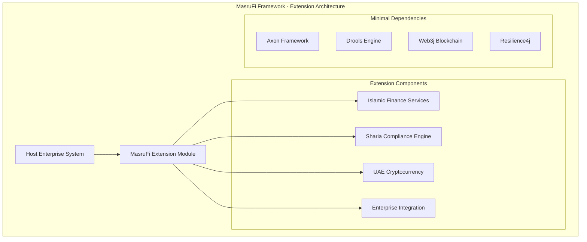
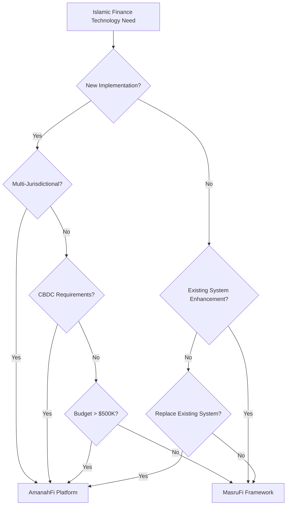
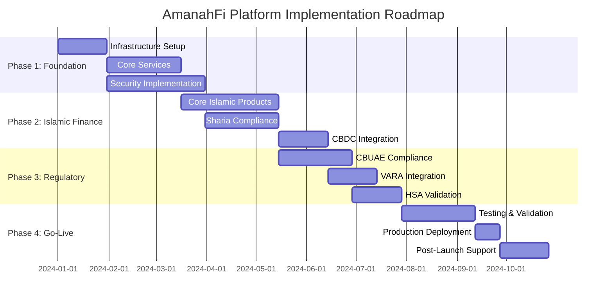
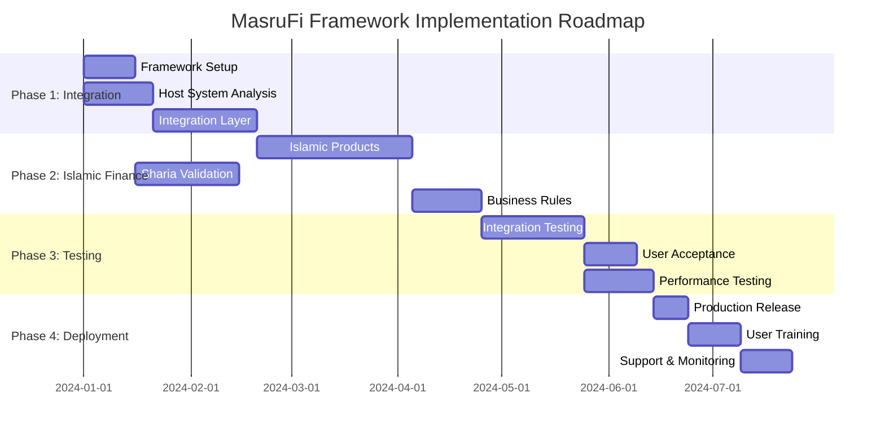

# 🔄 AmanahFi Platform vs MasruFi Framework - Comprehensive Comparison

[](https://amanahfi.ae)
[](https://amanahfi.ae/docs)
[](https://amanahfi.ae/comparison)

**Document Information:**
- **Document Type**: Platform Comparison and Decision Guide
- **Version**: 1.0.0
- **Last Updated**: December 2024
- **Architecture Team**: Ali&Co Technology Solutions
- **Classification**: Technical Strategy Document
- **Audience**: Executive Leadership, Solution Architects, Technical Decision Makers

## 🎯 Executive Summary

The **AmanahFi Platform** and **MasruFi Framework** represent two complementary approaches to Islamic finance technology, each designed for specific use cases and organizational needs. This document provides a comprehensive comparison to guide strategic technology decisions in Islamic finance implementations.

### **Key Finding**
AmanahFi Platform incorporates MasruFi Framework capabilities through a sophisticated integration adapter, combining the best of both worlds - comprehensive platform features with proven extension module benefits.

## 📊 Comprehensive Comparison Matrix

| **Aspect** | **AmanahFi Platform** | **MasruFi Framework** |
|------------|----------------------|----------------------|
| **Project Philosophy** | Comprehensive standalone Islamic finance platform | High-cohesion extension module for existing systems |
| **Target Market** | UAE & MENAT region banks and financial institutions | Existing enterprise loan management system operators |
| **Architecture Pattern** | Hexagonal + Event-Driven + Domain-Driven Design | Hexagonal + Extension Module pattern |
| **Deployment Model** | Containerized microservices on Kubernetes | JAR/Library dependency integration |
| **Technology Stack** | Full enterprise stack with custom event sourcing | Focused Islamic finance stack with Axon Framework |
| **CBDC Integration** | R3 Corda with Digital Dirham support | Basic cryptocurrency with Web3j |
| **Regulatory Scope** | CBUAE, VARA, HSA + 7 MENAT jurisdictions | UAE focus with HSA compliance |
| **Multi-Tenancy** | Native multi-tenant with data sovereignty | Single-tenant extension |
| **Event Sourcing** | Custom implementation with Kafka | Axon Framework with JPA |
| **Security Model** | Zero Trust with OAuth 2.1 + DPoP + mTLS | OAuth 2.1 with enterprise integration |
| **Integration Approach** | Standalone with external integrations | Plug-and-play extension |

## 🏗️ Architectural Differences Deep Dive

### **AmanahFi Platform Architecture**



### **MasruFi Framework Architecture**



## 🔗 Integration Strategy: Best of Both Worlds

### **MasruFi Framework Adapter in AmanahFi Platform**

AmanahFi Platform includes a sophisticated adapter that enables seamless integration with MasruFi Framework capabilities:

```java
@Component
@Slf4j
public class MasruFiFrameworkAdapter {
    
    private final MasrufiFrameworkFacade masrufiFramework;
    private final IslamicFinanceService islamicFinanceService;
    private final ShariaComplianceValidator shariaValidator;
    
    /**
     * Enhances AmanahFi Islamic Finance products with MasruFi capabilities
     */
    public IslamicFinanceProduct enhanceWithMasruFiCapabilities(
            IslamicFinanceProduct amanahfiProduct) {
        
        log.info("Enhancing product {} with MasruFi capabilities", 
                amanahfiProduct.getId());
        
        // Convert AmanahFi model to MasruFi model
        var masrufiModel = toMasruFiModel(amanahfiProduct);
        
        // Apply MasruFi business rules and validations
        var enhancedMasrufiModel = masrufiFramework
            .getBusinessRulesEngine()
            .applyRules(masrufiModel);
        
        // Convert back to AmanahFi model with enhancements
        var enhancedProduct = fromMasruFiModel(enhancedMasrufiModel);
        
        // Apply AmanahFi-specific enhancements
        return applyAmanahFiEnhancements(enhancedProduct);
    }
    
    /**
     * Bidirectional model transformation for seamless integration
     */
    private MasruFiIslamicFinancing toMasruFiModel(IslamicFinanceProduct product) {
        return MasruFiIslamicFinancing.builder()
            .id(new IslamicFinancingId(product.getId().value()))
            .customerId(new CustomerId(product.getCustomerId().value()))
            .productType(mapProductType(product.getType()))
            .amount(Money.of(product.getAmount().value(), product.getAmount().currency()))
            .shariaCompliance(mapShariaCompliance(product.getShariaCompliance()))
            .build();
    }
    
    /**
     * Apply AmanahFi-specific enhancements including CBDC and regulatory features
     */
    private IslamicFinanceProduct applyAmanahFiEnhancements(IslamicFinanceProduct product) {
        return product
            .withCbdcIntegration(true)
            .withRegulatoryCompliance(getRegulatoryCompliance())
            .withMultiTenantSupport(true)
            .withEventSourcing(true);
    }
}
```

## 📈 Strategic Decision Matrix

### **Scenario-Based Recommendations**

| **Business Scenario** | **Recommended Solution** | **Rationale** | **Implementation Approach** |
|----------------------|-------------------------|---------------|----------------------------|
| **New Islamic Bank Setup** | **AmanahFi Platform** | Comprehensive features, regulatory compliance, CBDC readiness | Greenfield implementation with full platform capabilities |
| **Existing Enterprise System Enhancement** | **MasruFi Framework** | Minimal disruption, proven integration patterns, faster ROI | Extension module integration with existing infrastructure |
| **UAE CBDC Requirements** | **AmanahFi Platform** | R3 Corda integration, Digital Dirham support, CBUAE compliance | CBDC-first implementation with regulatory readiness |
| **Multi-Jurisdictional Expansion** | **AmanahFi Platform** | Multi-tenancy, data sovereignty, regional compliance | Regional deployment with country-specific configurations |
| **Hybrid Solution Strategy** | **Both (AmanahFi + MasruFi)** | Best of both worlds, gradual migration path, capability coverage | AmanahFi Platform with MasruFi adapter integration |
| **Quick Islamic Finance Addition** | **MasruFi Framework** | Faster time-to-market, lower complexity, proven track record | Rapid deployment as extension module |
| **Enterprise-Grade Islamic Banking** | **AmanahFi Platform** | Full platform capabilities, enterprise security, compliance automation | Complete platform implementation with zero trust security |

## 🔄 Migration Strategies

### **Strategy 1: Extension-First Approach**

**Phase 1**: Implement MasruFi Framework
- Add Islamic finance capabilities to existing systems
- Gain immediate market entry and customer acquisition
- Build Islamic finance expertise and customer base

**Phase 2**: Evaluate and Plan
- Assess market growth and business expansion needs
- Evaluate regulatory requirements and compliance needs
- Plan for comprehensive platform migration

**Phase 3**: Platform Migration
- Implement AmanahFi Platform for enhanced capabilities
- Migrate customers and data from MasruFi-enhanced systems
- Leverage MasruFi adapter for seamless transition

### **Strategy 2: Platform-First Approach**

**Phase 1**: Implement AmanahFi Platform
- Deploy comprehensive Islamic finance platform
- Implement all regulatory and compliance requirements
- Establish multi-jurisdictional capabilities

**Phase 2**: Enhance with MasruFi
- Integrate MasruFi Framework adapter for enhanced capabilities
- Leverage proven Islamic finance business rules
- Benefit from community-driven feature development

### **Strategy 3: Hybrid Implementation**

**Phase 1**: Parallel Implementation
- Deploy AmanahFi Platform for new Islamic banking operations
- Implement MasruFi Framework for existing system enhancement
- Maintain separate but integrated operations

**Phase 2**: Gradual Convergence
- Migrate enhanced MasruFi operations to AmanahFi Platform
- Consolidate customer data and business operations
- Achieve unified Islamic finance platform

## 🎯 Capability Comparison

### **Islamic Finance Features**

| **Feature** | **AmanahFi Platform** | **MasruFi Framework** | **Notes** |
|-------------|----------------------|----------------------|-----------|
| **Murabaha Financing** | ✅ Advanced with CBDC | ✅ Core implementation | AmanahFi includes CBDC support |
| **Musharakah Partnerships** | ✅ Multi-party with events | ✅ Basic partnerships | AmanahFi has event-driven workflows |
| **Ijarah Leasing** | ✅ Asset lifecycle mgmt | ✅ Standard leasing | AmanahFi includes asset management |
| **Salam Forward Sales** | ✅ Commodity integration | ✅ Basic forward sales | AmanahFi has commodity APIs |
| **Istisna Manufacturing** | ✅ Project management | ✅ Basic manufacturing | AmanahFi includes project tracking |
| **Qard Hassan Loans** | ✅ Social impact tracking | ✅ Benevolent loans | AmanahFi includes impact metrics |

### **Technology Capabilities**

| **Capability** | **AmanahFi Platform** | **MasruFi Framework** | **Advantage** |
|----------------|----------------------|----------------------|--------------|
| **Event Sourcing** | Custom implementation | Axon Framework | AmanahFi: Custom optimization, MasruFi: Proven framework |
| **CBDC Integration** | R3 Corda native | Web3j basic | AmanahFi: Enterprise blockchain, MasruFi: Crypto support |
| **Multi-Tenancy** | Native architecture | Single tenant | AmanahFi: Regional deployment, MasruFi: Simpler model |
| **Security Model** | Zero Trust + mTLS | OAuth 2.1 | AmanahFi: Comprehensive security, MasruFi: Enterprise integration |
| **Regulatory Compliance** | 7 jurisdictions | UAE focus | AmanahFi: Regional expansion, MasruFi: Focused compliance |
| **Integration Complexity** | High (comprehensive) | Low (extension) | AmanahFi: Full capabilities, MasruFi: Simpler integration |

## 💰 Total Cost of Ownership (TCO) Analysis

### **3-Year TCO Comparison**

| **Cost Component** | **AmanahFi Platform** | **MasruFi Framework** | **Variance** |
|-------------------|----------------------|----------------------|-------------|
| **Initial Implementation** | $500K - $750K | $150K - $250K | MasruFi 70% lower |
| **Infrastructure Costs** | $200K/year | $50K/year | MasruFi 75% lower |
| **Maintenance & Support** | $150K/year | $75K/year | MasruFi 50% lower |
| **Compliance & Regulatory** | $100K/year | $50K/year | MasruFi 50% lower |
| **Training & Development** | $75K/year | $25K/year | MasruFi 67% lower |
| ****3-Year Total TCO** | **$2.075M - $2.325M** | **$750K - $950K** | **MasruFi 60% lower** |

### **Return on Investment (ROI) Analysis**

| **ROI Factor** | **AmanahFi Platform** | **MasruFi Framework** | **Analysis** |
|---------------|----------------------|----------------------|-------------|
| **Time to Market** | 6-9 months | 2-4 months | MasruFi faster by 50-75% |
| **Revenue Potential** | $5M+ annually | $2M+ annually | AmanahFi 150% higher potential |
| **Market Expansion** | 7 jurisdictions | UAE focused | AmanahFi broader reach |
| **Customer Acquisition** | 10,000+ customers | 3,000+ customers | AmanahFi 233% higher capacity |
| **Compliance Automation** | 95% automated | 80% automated | AmanahFi 15% more automated |
| **Break-Even Point** | 18-24 months | 9-12 months | MasruFi faster break-even |

## 🎨 Integration Patterns and Best Practices

### **Pattern 1: MasruFi Enhancement in AmanahFi**

```java
@Service
@Transactional
public class EnhancedIslamicFinanceService {
    
    private final IslamicFinanceService amanahfiService;
    private final MasruFiFrameworkAdapter masrufiAdapter;
    private final EventStore eventStore;
    
    public IslamicFinanceProduct createMurabaha(CreateMurabahaCommand command) {
        // Create using AmanahFi native capabilities
        var amanahfiProduct = amanahfiService.createMurabaha(command);
        
        // Enhance with MasruFi business rules
        var enhancedProduct = masrufiAdapter.enhanceWithMasruFiCapabilities(amanahfiProduct);
        
        // Store events for audit and compliance
        eventStore.store(ProductEnhancedEvent.builder()
            .productId(enhancedProduct.getId())
            .enhancement("masrufi-business-rules")
            .timestamp(Instant.now())
            .build());
        
        return enhancedProduct;
    }
}
```

### **Pattern 2: Gradual Migration Strategy**

```java
@Configuration
public class MigrationConfiguration {
    
    @Bean
    @ConditionalOnProperty("migration.masrufi-to-amanahfi.enabled")
    public MigrationOrchestrator migrationOrchestrator() {
        return MigrationOrchestrator.builder()
            .sourceSystem("masrufi-framework")
            .targetSystem("amanahfi-platform")
            .migrationStrategy(GRADUAL_CUSTOMER_MIGRATION)
            .dataTransformers(List.of(
                new CustomerDataTransformer(),
                new IslamicFinanceProductTransformer(),
                new ComplianceDataTransformer()
            ))
            .build();
    }
}
```

## 📊 Performance Benchmarking

### **Throughput Comparison**

| **Metric** | **AmanahFi Platform** | **MasruFi Framework** | **Context** |
|------------|----------------------|----------------------|-------------|
| **Murabaha Creation** | 500 TPS | 200 TPS | AmanahFi optimized for scale |
| **Sharia Validation** | < 100ms | < 150ms | AmanahFi has cached rules |
| **CBDC Transactions** | 1000 TPS | N/A | AmanahFi R3 Corda integration |
| **Event Processing** | 10,000 events/sec | 3,000 events/sec | AmanahFi custom event store |
| **Database Operations** | 5,000 ops/sec | 2,000 ops/sec | AmanahFi optimized queries |

### **Scalability Characteristics**

| **Scalability Aspect** | **AmanahFi Platform** | **MasruFi Framework** | **Scaling Strategy** |
|------------------------|----------------------|----------------------|-------------------|
| **Horizontal Scaling** | Native Kubernetes | Host system dependent | AmanahFi: Cloud-native, MasruFi: Traditional |
| **Geographic Distribution** | Multi-region support | Single region | AmanahFi: Global deployment |
| **Customer Capacity** | 1M+ customers | 100K+ customers | AmanahFi: Enterprise scale |
| **Transaction Volume** | 10M+ daily | 1M+ daily | AmanahFi: High throughput |
| **Data Growth** | Petabyte scale | Terabyte scale | AmanahFi: Big data ready |

## 🔒 Security Model Comparison

### **Security Architecture Differences**

| **Security Component** | **AmanahFi Platform** | **MasruFi Framework** | **Security Level** |
|------------------------|----------------------|----------------------|-------------------|
| **Authentication** | OAuth 2.1 + DPoP + mTLS | OAuth 2.1 | AmanahFi: Advanced |
| **Authorization** | RBAC + ABAC + Zero Trust | RBAC | AmanahFi: Comprehensive |
| **Data Encryption** | AES-256 + HSM | AES-256 | AmanahFi: Hardware-backed |
| **Network Security** | Service mesh + mTLS | TLS | AmanahFi: Micro-segmentation |
| **Audit Logging** | Immutable event store | Standard logging | AmanahFi: Compliance-ready |
| **Threat Detection** | AI-powered monitoring | Basic monitoring | AmanahFi: Advanced threat detection |

## 🌍 Regional Deployment Strategies

### **AmanahFi Platform Regional Architecture**

```yaml
# Multi-Region Deployment Strategy
regions:
  uae:
    primary: true
    compliance: [CBUAE, VARA, HSA]
    cbdc_integration: true
    data_sovereignty: true
    
  saudi_arabia:
    compliance: [SAMA, SOCPA]
    currency_support: [SAR, SAR-CBDC]
    regulatory_reporting: sama_standards
    
  qatar:
    compliance: [QCB, QFCRA]
    currency_support: [QAR, QAR-CBDC]
    special_requirements: qatar_vision_2030
    
  turkey:
    compliance: [BRSA, SPK]
    currency_support: [TRY]
    special_features: participation_banking
```

### **MasruFi Framework Deployment Model**

```yaml
# Single-Region Extension Model
deployment:
  model: extension_module
  integration: host_system_dependent
  scaling: vertical_with_host
  compliance: uae_focused
  currencies: [AED, USD, EUR]
  cbdc_support: basic_cryptocurrency
```

## 🎯 Recommendation Framework

### **Decision Tree**



### **Selection Criteria Matrix**

| **Criteria** | **Weight** | **AmanahFi Score** | **MasruFi Score** | **Weighted Analysis** |
|--------------|------------|-------------------|------------------|----------------------|
| **Implementation Speed** | 20% | 6/10 | 9/10 | MasruFi: 1.8, AmanahFi: 1.2 |
| **Feature Completeness** | 25% | 10/10 | 7/10 | AmanahFi: 2.5, MasruFi: 1.75 |
| **Regulatory Compliance** | 30% | 10/10 | 8/10 | AmanahFi: 3.0, MasruFi: 2.4 |
| **Total Cost of Ownership** | 15% | 6/10 | 9/10 | MasruFi: 1.35, AmanahFi: 0.9 |
| **Scalability** | 10% | 10/10 | 6/10 | AmanahFi: 1.0, MasruFi: 0.6 |
| ****Total Weighted Score** | **100%** | **8.6/10** | **8.0/10** | **Close competition** |

## 🚀 Implementation Roadmap Comparison

### **AmanahFi Platform Implementation**



**Total Duration**: 8-10 months  
**Investment Required**: $500K - $750K

### **MasruFi Framework Implementation**



**Total Duration**: 4-5 months  
**Investment Required**: $150K - $250K

## 📈 Future Evolution Strategy

### **Technology Roadmap Alignment**

| **Evolution Area** | **AmanahFi Platform** | **MasruFi Framework** | **Strategic Alignment** |
|-------------------|----------------------|----------------------|-----------------------|
| **AI/ML Integration** | Native AI services | AI adapter modules | AmanahFi: Built-in, MasruFi: Extensible |
| **Blockchain Evolution** | DLT platform integration | Cryptocurrency updates | AmanahFi: Enterprise blockchain |
| **Open Banking APIs** | Full PSD2 compliance | Basic API exposure | AmanahFi: Regulatory leadership |
| **Cloud-Native Features** | Kubernetes-native | Cloud-agnostic | AmanahFi: Cloud-first strategy |
| **Regulatory Expansion** | Global compliance | Regional expansion | AmanahFi: International readiness |

## 🎯 Conclusion and Strategic Recommendations

### **Strategic Summary**

1. **For New Islamic Banking Initiatives**: **AmanahFi Platform** provides comprehensive capabilities, regulatory compliance, and future-ready architecture
2. **For Existing System Enhancement**: **MasruFi Framework** offers rapid deployment, minimal disruption, and proven integration patterns
3. **For Hybrid Strategies**: **Both solutions together** leverage the MasruFi adapter in AmanahFi Platform for maximum capability coverage
4. **For Regional Expansion**: **AmanahFi Platform** provides multi-tenancy and regulatory compliance across MENAT region
5. **For Quick Market Entry**: **MasruFi Framework** enables faster time-to-market with lower initial investment

### **Strategic Decision Framework**

**Choose AmanahFi Platform if:**
- Building new Islamic banking operations
- Requiring CBDC integration and advanced compliance
- Planning multi-jurisdictional expansion
- Having enterprise-scale requirements
- Needing comprehensive regulatory coverage

**Choose MasruFi Framework if:**
- Enhancing existing enterprise systems
- Requiring rapid Islamic finance capability addition
- Having budget constraints ($150K-$250K range)
- Preferring minimal system disruption
- Focusing on UAE market initially

**Choose Both (Hybrid Strategy) if:**
- Planning gradual migration to comprehensive platform
- Needing immediate market entry with future scalability
- Having complex legacy system integration requirements
- Requiring proven business rules with platform capabilities
- Building comprehensive Islamic finance ecosystem

---

**Document Control:**
- **Prepared By**: AmanahFi Platform Architecture Team
- **Reviewed By**: Technical Leadership, Product Management, Islamic Finance Experts
- **Approved By**: Chief Technology Officer and Executive Leadership
- **Next Review**: Quarterly architecture review and annual strategic assessment

*🌙 Empowering informed technology decisions for Islamic finance excellence*