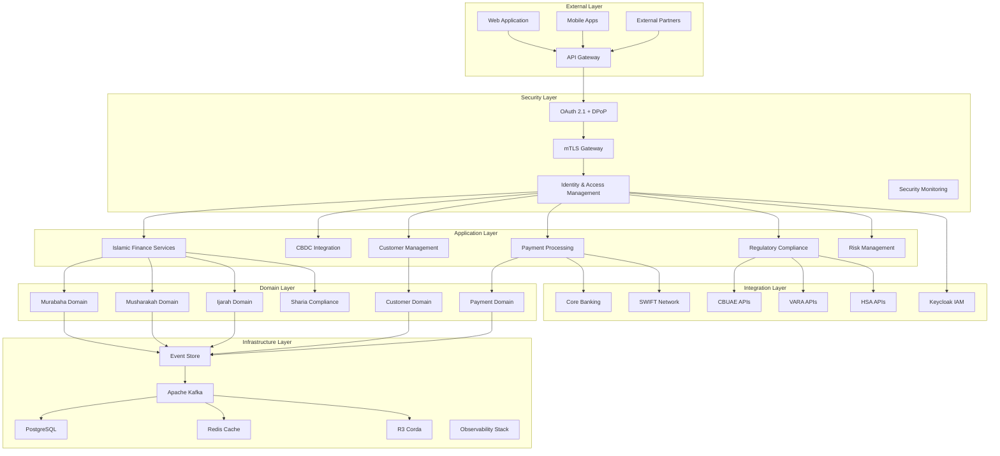

# 🏗️ System Architecture - AmanahFi Platform

## 🎯 Overview

This document outlines the comprehensive system architecture for the AmanahFi Platform, implementing a modern, scalable, and Sharia-compliant Islamic finance platform using Domain-Driven Design (DDD), Event Sourcing, and Zero Trust security principles for the UAE and MENAT region.

## 📊 Document Information

| Attribute | Value |
|-----------|-------|
| **Document Version** | 1.0.0 |
| **Last Updated** | December 2024 |
| **Owner** | Chief Technology Officer (CTO) |
| **Reviewers** | Architecture Team, Security Team, Development Leads |
| **Approval** | Technical Leadership Committee |
| **Classification** | Internal Technical |

## 🏛️ Architecture Principles

### Core Design Principles

1. **Domain-Driven Design (DDD)**
   - Ubiquitous language for Islamic finance
   - Bounded contexts for each business domain
   - Rich domain models with business logic encapsulation

2. **Hexagonal Architecture (Ports & Adapters)**
   - Clean separation of concerns
   - Technology-agnostic business logic
   - Testable and maintainable code structure

3. **Event-Driven Architecture**
   - Asynchronous communication between services
   - Event sourcing for audit trails and compliance
   - CQRS (Command Query Responsibility Segregation)

4. **Zero Trust Security**
   - Never trust, always verify
   - Micro-segmentation and least privilege access
   - Continuous security monitoring

5. **Cloud-Native Design**
   - Kubernetes orchestration
   - Microservices architecture
   - Auto-scaling and self-healing capabilities

## 🌟 High-Level Architecture



## 📐 Detailed Architecture Components

### 🌐 Presentation Layer

#### Web Application
- **Technology**: React 18 with TypeScript
- **Styling**: Tailwind CSS with Islamic design system
- **State Management**: Redux Toolkit
- **Authentication**: OAuth 2.1 with DPoP implementation
- **Localization**: Arabic (RTL) and English support

#### Mobile Applications
- **Technology**: React Native with Expo
- **Platforms**: iOS and Android
- **Biometric Auth**: Face ID, Touch ID, Fingerprint
- **Offline Support**: Local SQLite for critical operations
- **Push Notifications**: Firebase Cloud Messaging

#### API Gateway
- **Technology**: Kong Enterprise
- **Features**: Rate limiting, load balancing, request transformation
- **Security**: JWT validation, DPoP verification, mTLS termination
- **Monitoring**: Request/response logging, metrics collection

### 🔐 Security Layer

#### Authentication & Authorization
```yaml
OAuth 2.1 Implementation:
  - Authorization Server: Keycloak
  - DPoP Support: RFC 9449 compliant
  - Token Binding: Cryptographic proof-of-possession
  - Session Management: Secure session handling
  - MFA Support: TOTP, SMS, biometric

mTLS Configuration:
  - Client Certificates: X.509 PKI infrastructure
  - Certificate Validation: OCSP and CRL checking
  - Cipher Suites: TLS 1.3 with perfect forward secrecy
  - Mutual Authentication: Client and server verification
```

#### Zero Trust Architecture
```yaml
Security Zones:
  - DMZ: External-facing services
  - Application Zone: Business logic services
  - Data Zone: Database and storage systems
  - Management Zone: Admin and monitoring tools

Micro-segmentation:
  - Network policies per service
  - Service-to-service authentication
  - Encrypted communication (mTLS)
  - Continuous security monitoring
```

### 🏢 Application Layer

#### Islamic Finance Services

**Murabaha Service**
```java
@Service
@Transactional
public class MurabahaApplicationService {
    
    @Autowired
    private MurabahaRepository murabahaRepository;
    
    @Autowired
    private ShariaComplianceService shariaService;
    
    @Autowired
    private DomainEventPublisher eventPublisher;
    
    public MurabahaFinancing createMurabaha(CreateMurabahaCommand command) {
        // Validate Sharia compliance
        shariaService.validateMurabahaCompliance(command);
        
        // Create domain aggregate
        MurabahaFinancing murabaha = MurabahaFinancing.create(
            command.getCustomerProfile(),
            command.getAssetDetails(),
            command.getFinancingTerms()
        );
        
        // Save to repository
        murabahaRepository.save(murabaha);
        
        // Publish domain event
        eventPublisher.publish(new MurabahaCreatedEvent(murabaha));
        
        return murabaha;
    }
}
```

**CBDC Integration Service**
```java
@Service
public class CBDCIntegrationService {
    
    @Autowired
    private R3CordaGateway cordaGateway;
    
    @Autowired
    private UAECBDCAdapter cbdcAdapter;
    
    public CBDCTransaction processTransaction(CBDCTransactionCommand command) {
        // Create Corda transaction
        CordaTransaction cordaTx = cordaGateway.createTransaction(
            command.getAmount(),
            command.getSender(),
            command.getReceiver()
        );
        
        // Submit to UAE CBDC network
        CBDCTransactionResult result = cbdcAdapter.submitTransaction(cordaTx);
        
        // Create transaction record
        return CBDCTransaction.builder()
            .transactionId(result.getTransactionId())
            .blockchainHash(result.getBlockchainHash())
            .status(TransactionStatus.CONFIRMED)
            .build();
    }
}
```

### 🎯 Domain Layer

#### Core Domain Models

**Murabaha Aggregate**
```java
@Entity
@AggregateRoot
public class MurabahaFinancing {
    
    @EmbeddedId
    private FinancingId financingId;
    
    @Embedded
    private CustomerProfile customerProfile;
    
    @Embedded
    private AssetDetails assetDetails;
    
    @Embedded
    private FinancingTerms financingTerms;
    
    @Embedded
    private ShariaCompliance shariaCompliance;
    
    private FinancingStatus status;
    
    public static MurabahaFinancing create(
            CustomerProfile customer,
            AssetDetails asset,
            FinancingTerms terms) {
        
        // Business rule validation
        validateAssetPermissibility(asset);
        validateProfitMargin(terms);
        validateCustomerEligibility(customer);
        
        MurabahaFinancing financing = new MurabahaFinancing();
        financing.financingId = FinancingId.generate();
        financing.customerProfile = customer;
        financing.assetDetails = asset;
        financing.financingTerms = terms;
        financing.status = FinancingStatus.PENDING_APPROVAL;
        
        // Register domain event
        financing.registerEvent(new MurabahaCreatedEvent(financing));
        
        return financing;
    }
    
    public void approve(ShariaBoard shariaBoard) {
        if (!shariaCompliance.isCompliant()) {
            throw new ShariaComplianceViolationException(
                "Murabaha financing is not Sharia compliant"
            );
        }
        
        this.status = FinancingStatus.APPROVED;
        this.registerEvent(new MurabahaApprovedEvent(this));
    }
    
    private static void validateAssetPermissibility(AssetDetails asset) {
        if (!asset.isHalal()) {
            throw new NonHalalAssetException(
                "Asset must be Halal for Islamic financing"
            );
        }
    }
    
    private static void validateProfitMargin(FinancingTerms terms) {
        BigDecimal maxMargin = new BigDecimal("0.30"); // 30% HSA limit
        if (terms.getProfitMargin().compareTo(maxMargin) > 0) {
            throw new ExcessiveProfitMarginException(
                "Profit margin exceeds HSA maximum of 30%"
            );
        }
    }
}
```

**Sharia Compliance Value Object**
```java
@Embeddable
public class ShariaCompliance {
    
    private boolean ribaFree;
    private boolean ghararFree;
    private boolean assetBacked;
    private boolean halalAsset;
    private ShariaBoard approvedBy;
    private LocalDateTime approvalDate;
    
    public boolean isCompliant() {
        return ribaFree && ghararFree && assetBacked && halalAsset;
    }
    
    public static ShariaCompliance validate(
            AssetDetails asset,
            FinancingTerms terms) {
        
        ShariaCompliance compliance = new ShariaCompliance();
        compliance.ribaFree = !hasInterestElements(terms);
        compliance.ghararFree = !hasExcessiveUncertainty(asset, terms);
        compliance.assetBacked = hasPhysicalAssetBacking(asset);
        compliance.halalAsset = asset.isHalal();
        
        return compliance;
    }
}
```

### 🗄️ Data Layer

#### Event Store Implementation
```java
@Repository
public class EventStoreRepository {
    
    @Autowired
    private JdbcTemplate jdbcTemplate;
    
    @Autowired
    private ObjectMapper objectMapper;
    
    public void saveEvent(DomainEvent event) {
        String sql = """
            INSERT INTO event_store (
                event_id, aggregate_id, aggregate_type, 
                event_type, event_data, event_version, 
                created_at, correlation_id
            ) VALUES (?, ?, ?, ?, ?, ?, ?, ?)
            """;
        
        jdbcTemplate.update(sql,
            event.getEventId().toString(),
            event.getAggregateId().toString(),
            event.getAggregateType(),
            event.getEventType(),
            objectMapper.writeValueAsString(event.getData()),
            event.getVersion(),
            event.getCreatedAt(),
            event.getCorrelationId()
        );
    }
    
    public List<DomainEvent> getEvents(AggregateId aggregateId) {
        String sql = """
            SELECT * FROM event_store 
            WHERE aggregate_id = ? 
            ORDER BY event_version ASC
            """;
        
        return jdbcTemplate.query(sql, 
            new Object[]{aggregateId.toString()},
            this::mapRowToEvent
        );
    }
}
```

#### Database Schema Design
```sql
-- Event Store Table
CREATE TABLE event_store (
    event_id UUID PRIMARY KEY,
    aggregate_id UUID NOT NULL,
    aggregate_type VARCHAR(100) NOT NULL,
    event_type VARCHAR(100) NOT NULL,
    event_data JSONB NOT NULL,
    event_version INTEGER NOT NULL,
    created_at TIMESTAMP WITH TIME ZONE NOT NULL,
    correlation_id UUID,
    metadata JSONB,
    
    CONSTRAINT unique_version_per_aggregate 
        UNIQUE (aggregate_id, event_version)
);

-- Islamic Finance Projections
CREATE TABLE murabaha_financing (
    financing_id UUID PRIMARY KEY,
    customer_id UUID NOT NULL,
    asset_description TEXT NOT NULL,
    asset_cost DECIMAL(15,2) NOT NULL,
    profit_margin DECIMAL(5,4) NOT NULL,
    total_amount DECIMAL(15,2) NOT NULL,
    remaining_balance DECIMAL(15,2) NOT NULL,
    financing_status VARCHAR(50) NOT NULL,
    sharia_compliant BOOLEAN NOT NULL,
    approved_by UUID,
    approval_date TIMESTAMP WITH TIME ZONE,
    maturity_date DATE NOT NULL,
    created_at TIMESTAMP WITH TIME ZONE NOT NULL,
    updated_at TIMESTAMP WITH TIME ZONE NOT NULL
);

-- CBDC Transactions
CREATE TABLE cbdc_transactions (
    transaction_id UUID PRIMARY KEY,
    blockchain_hash VARCHAR(66) NOT NULL,
    block_number BIGINT,
    transaction_type VARCHAR(50) NOT NULL,
    amount DECIMAL(18,8) NOT NULL,
    currency_code VARCHAR(10) NOT NULL,
    sender_wallet_id VARCHAR(100) NOT NULL,
    receiver_wallet_id VARCHAR(100) NOT NULL,
    status VARCHAR(50) NOT NULL,
    confirmation_count INTEGER DEFAULT 0,
    network_fees DECIMAL(18,8),
    processing_fees DECIMAL(18,8),
    settled_at TIMESTAMP WITH TIME ZONE,
    created_at TIMESTAMP WITH TIME ZONE NOT NULL
);

-- Customer Management
CREATE TABLE customers (
    customer_id UUID PRIMARY KEY,
    national_id VARCHAR(50) UNIQUE NOT NULL,
    first_name VARCHAR(100) NOT NULL,
    last_name VARCHAR(100) NOT NULL,
    date_of_birth DATE NOT NULL,
    nationality VARCHAR(3) NOT NULL,
    phone_number VARCHAR(20) NOT NULL,
    email VARCHAR(255) NOT NULL,
    customer_status VARCHAR(50) NOT NULL,
    risk_profile VARCHAR(50),
    kyc_status VARCHAR(50) NOT NULL,
    aml_status VARCHAR(50) NOT NULL,
    onboarding_date TIMESTAMP WITH TIME ZONE NOT NULL,
    last_login TIMESTAMP WITH TIME ZONE,
    created_at TIMESTAMP WITH TIME ZONE NOT NULL,
    updated_at TIMESTAMP WITH TIME ZONE NOT NULL
);

-- Sharia Compliance Tracking
CREATE TABLE sharia_compliance_records (
    compliance_id UUID PRIMARY KEY,
    transaction_id UUID NOT NULL,
    transaction_type VARCHAR(100) NOT NULL,
    sharia_board VARCHAR(100) NOT NULL,
    compliance_checks JSONB NOT NULL,
    compliance_status VARCHAR(50) NOT NULL,
    validation_date TIMESTAMP WITH TIME ZONE NOT NULL,
    certificate_number VARCHAR(100),
    valid_until TIMESTAMP WITH TIME ZONE,
    created_at TIMESTAMP WITH TIME ZONE NOT NULL
);
```

### 🔄 Integration Layer

#### Keycloak Integration
```java
@Configuration
public class KeycloakConfig {
    
    @Bean
    public KeycloakSpringBootConfigResolver keycloakConfigResolver() {
        return new KeycloakSpringBootConfigResolver();
    }
    
    @Bean
    @Scope(ConfigurableBeanFactory.SCOPE_PROTOTYPE)
    public Keycloak keycloak() {
        return KeycloakBuilder.builder()
            .serverUrl("https://iam.amanahfi.ae/auth")
            .realm("amanahfi")
            .clientId("amanahfi-platform")
            .clientSecret(keycloakClientSecret)
            .build();
    }
}

@Service
public class KeycloakUserService {
    
    @Autowired
    private Keycloak keycloak;
    
    public KeycloakUser createUser(CreateUserCommand command) {
        UserRepresentation user = new UserRepresentation();
        user.setUsername(command.getUsername());
        user.setEmail(command.getEmail());
        user.setFirstName(command.getFirstName());
        user.setLastName(command.getLastName());
        user.setEnabled(true);
        user.setEmailVerified(false);
        
        // Set Islamic finance specific attributes
        Map<String, List<String>> attributes = new HashMap<>();
        attributes.put("nationalId", List.of(command.getNationalId()));
        attributes.put("customerType", List.of(command.getCustomerType().name()));
        attributes.put("shariaCompliant", List.of("true"));
        user.setAttributes(attributes);
        
        Response response = keycloak.realm("amanahfi")
            .users()
            .create(user);
        
        if (response.getStatus() == 201) {
            String userId = extractUserIdFromLocation(response.getLocation());
            assignIslamicFinanceRoles(userId, command.getRoles());
            return mapToKeycloakUser(user, userId);
        } else {
            throw new UserCreationException("Failed to create user in Keycloak");
        }
    }
    
    private void assignIslamicFinanceRoles(String userId, Set<Role> roles) {
        RoleResource roleResource = keycloak.realm("amanahfi").roles();
        UserResource userResource = keycloak.realm("amanahfi").users().get(userId);
        
        for (Role role : roles) {
            RoleRepresentation roleRep = roleResource.get(role.getName()).toRepresentation();
            userResource.roles().realmLevel().add(List.of(roleRep));
        }
    }
}
```

#### R3 Corda Integration
```java
@Component
public class R3CordaGateway {
    
    @Autowired
    private CordaRPCConnection cordaConnection;
    
    public CordaTransactionResult submitCBDCTransaction(CBDCTransactionCommand command) {
        try {
            // Create Corda flow
            DigitalCurrencyTransferFlow.Initiator flow = 
                new DigitalCurrencyTransferFlow.Initiator(
                    command.getAmount(),
                    command.getReceiverParty(),
                    command.getReference()
                );
            
            // Submit transaction to Corda network
            CordaFuture<SignedTransaction> future = cordaConnection
                .getProxy()
                .startFlowDynamic(DigitalCurrencyTransferFlow.Initiator.class, flow)
                .getReturnValue();
            
            SignedTransaction signedTx = future.get(30, TimeUnit.SECONDS);
            
            return CordaTransactionResult.builder()
                .transactionId(signedTx.getId().toString())
                .blockHeight(getCurrentBlockHeight())
                .status(TransactionStatus.CONFIRMED)
                .build();
                
        } catch (Exception e) {
            throw new CBDCTransactionException(
                "Failed to submit CBDC transaction to Corda network", e
            );
        }
    }
}
```

### 📊 Monitoring & Observability

#### Distributed Tracing
```yaml
Spring Cloud Sleuth Configuration:
  spring:
    sleuth:
      zipkin:
        base-url: https://zipkin.amanahfi.ae
      sampling:
        probability: 1.0
      trace-id128: true
      supports-join: false
```

#### Metrics Collection
```java
@Component
public class IslamicFinanceMetrics {
    
    private final MeterRegistry meterRegistry;
    private final Counter murabahaCreations;
    private final Timer shariaValidationTime;
    private final Gauge activeFinancingCount;
    
    public IslamicFinanceMetrics(MeterRegistry meterRegistry) {
        this.meterRegistry = meterRegistry;
        this.murabahaCreations = Counter.builder("islamic_finance.murabaha.created")
            .description("Number of Murabaha financings created")
            .register(meterRegistry);
            
        this.shariaValidationTime = Timer.builder("sharia.validation.duration")
            .description("Time taken for Sharia compliance validation")
            .register(meterRegistry);
            
        this.activeFinancingCount = Gauge.builder("islamic_finance.active.count")
            .description("Number of active Islamic financings")
            .register(meterRegistry, this, IslamicFinanceMetrics::getActiveFinancingCount);
    }
    
    public void recordMurabahaCreation() {
        murabahaCreations.increment();
    }
    
    public Timer.Sample startShariaValidation() {
        return Timer.start(meterRegistry);
    }
    
    public void recordShariaValidation(Timer.Sample sample) {
        sample.stop(shariaValidationTime);
    }
    
    private double getActiveFinancingCount() {
        // Implementation to get current active financing count
        return 0.0;
    }
}
```

## 🚀 Deployment Architecture

### Kubernetes Configuration

#### Namespace Setup
```yaml
apiVersion: v1
kind: Namespace
metadata:
  name: amanahfi-platform
  labels:
    name: amanahfi-platform
    environment: production
---
apiVersion: v1
kind: Namespace
metadata:
  name: amanahfi-security
  labels:
    name: amanahfi-security
    environment: production
```

#### Service Deployment
```yaml
apiVersion: apps/v1
kind: Deployment
metadata:
  name: islamic-finance-service
  namespace: amanahfi-platform
spec:
  replicas: 3
  selector:
    matchLabels:
      app: islamic-finance-service
  template:
    metadata:
      labels:
        app: islamic-finance-service
        version: v1
    spec:
      serviceAccountName: islamic-finance-sa
      containers:
      - name: islamic-finance
        image: amanahfi/islamic-finance-service:1.0.0
        ports:
        - containerPort: 8080
        env:
        - name: SPRING_PROFILES_ACTIVE
          value: "production,kubernetes"
        - name: DATABASE_URL
          valueFrom:
            secretKeyRef:
              name: database-credentials
              key: url
        - name: KEYCLOAK_AUTH_SERVER_URL
          value: "https://iam.amanahfi.ae/auth"
        resources:
          requests:
            memory: "512Mi"
            cpu: "250m"
          limits:
            memory: "1Gi"
            cpu: "500m"
        livenessProbe:
          httpGet:
            path: /actuator/health/liveness
            port: 8080
          initialDelaySeconds: 60
          periodSeconds: 30
        readinessProbe:
          httpGet:
            path: /actuator/health/readiness
            port: 8080
          initialDelaySeconds: 30
          periodSeconds: 10
```

### Service Mesh (Istio)

#### Virtual Service Configuration
```yaml
apiVersion: networking.istio.io/v1beta1
kind: VirtualService
metadata:
  name: islamic-finance-vs
  namespace: amanahfi-platform
spec:
  hosts:
  - islamic-finance-service
  http:
  - match:
    - uri:
        prefix: "/api/v1/islamic-finance"
    route:
    - destination:
        host: islamic-finance-service
        port:
          number: 8080
    timeout: 30s
    retries:
      attempts: 3
      perTryTimeout: 10s
```

#### Destination Rule
```yaml
apiVersion: networking.istio.io/v1beta1
kind: DestinationRule
metadata:
  name: islamic-finance-dr
  namespace: amanahfi-platform
spec:
  host: islamic-finance-service
  trafficPolicy:
    tls:
      mode: ISTIO_MUTUAL
    connectionPool:
      tcp:
        maxConnections: 100
      http:
        http1MaxPendingRequests: 50
        maxRequestsPerConnection: 10
    circuitBreaker:
      consecutiveErrors: 3
      interval: 30s
      baseEjectionTime: 30s
```

## 📈 Performance & Scalability

### Auto-scaling Configuration
```yaml
apiVersion: autoscaling/v2
kind: HorizontalPodAutoscaler
metadata:
  name: islamic-finance-hpa
  namespace: amanahfi-platform
spec:
  scaleTargetRef:
    apiVersion: apps/v1
    kind: Deployment
    name: islamic-finance-service
  minReplicas: 3
  maxReplicas: 20
  metrics:
  - type: Resource
    resource:
      name: cpu
      target:
        type: Utilization
        averageUtilization: 70
  - type: Resource
    resource:
      name: memory
      target:
        type: Utilization
        averageUtilization: 80
  - type: Pods
    pods:
      metric:
        name: active_requests_per_second
      target:
        type: AverageValue
        averageValue: "100"
```

### Caching Strategy
```java
@Configuration
@EnableCaching
public class CacheConfiguration {
    
    @Bean
    public CacheManager cacheManager() {
        RedisCacheManager.Builder builder = RedisCacheManager
            .RedisCacheManagerBuilder
            .fromConnectionFactory(redisConnectionFactory())
            .cacheDefaults(cacheConfiguration());
            
        return builder.build();
    }
    
    private RedisCacheConfiguration cacheConfiguration() {
        return RedisCacheConfiguration.defaultCacheConfig()
            .entryTtl(Duration.ofMinutes(15))
            .serializeKeysWith(RedisSerializationContext.SerializationPair
                .fromSerializer(new StringRedisSerializer()))
            .serializeValuesWith(RedisSerializationContext.SerializationPair
                .fromSerializer(new GenericJackson2JsonRedisSerializer()));
    }
    
    @Bean
    @Primary
    public RedisTemplate<String, Object> redisTemplate() {
        RedisTemplate<String, Object> template = new RedisTemplate<>();
        template.setConnectionFactory(redisConnectionFactory());
        template.setKeySerializer(new StringRedisSerializer());
        template.setValueSerializer(new GenericJackson2JsonRedisSerializer());
        return template;
    }
}
```

## 🔧 Configuration Management

### Application Configuration
```yaml
# application.yml
spring:
  application:
    name: amanahfi-platform
  profiles:
    active: ${SPRING_PROFILES_ACTIVE:development}
  
  datasource:
    url: ${DATABASE_URL}
    username: ${DATABASE_USERNAME}
    password: ${DATABASE_PASSWORD}
    hikari:
      maximum-pool-size: 20
      minimum-idle: 5
      idle-timeout: 600000
      max-lifetime: 1800000
  
  jpa:
    hibernate:
      ddl-auto: validate
    properties:
      hibernate:
        dialect: org.hibernate.dialect.PostgreSQLDialect
        format_sql: true
        jdbc:
          batch_size: 20
        order_inserts: true
        order_updates: true
  
  kafka:
    bootstrap-servers: ${KAFKA_BOOTSTRAP_SERVERS}
    producer:
      key-serializer: org.apache.kafka.common.serialization.StringSerializer
      value-serializer: org.springframework.kafka.support.serializer.JsonSerializer
      acks: all
      retries: 3
    consumer:
      group-id: amanahfi-platform
      key-deserializer: org.apache.kafka.common.serialization.StringDeserializer
      value-deserializer: org.springframework.kafka.support.serializer.JsonDeserializer
      auto-offset-reset: earliest

# Islamic Finance Configuration
amanahfi:
  islamic-finance:
    sharia-board: UAE_HIGHER_SHARIA_AUTHORITY
    max-profit-margin: 0.30
    supported-products:
      - MURABAHA
      - MUSHARAKAH
      - IJARAH
      - SALAM
      - ISTISNA
      - QARD_HASSAN
    
  cbdc:
    enabled: true
    digital-dirham:
      network: mainnet
      node-url: ${UAE_CBDC_NODE_URL}
      wallet-address: ${UAE_CBDC_WALLET_ADDRESS}
    
  security:
    oauth2:
      resourceserver:
        jwt:
          issuer-uri: ${KEYCLOAK_ISSUER_URI}
    dpop:
      enabled: true
      max-age: 60
      
  compliance:
    cbuae:
      api-endpoint: ${CBUAE_API_ENDPOINT}
      certificate-path: ${CBUAE_CERT_PATH}
    vara:
      api-endpoint: ${VARA_API_ENDPOINT}
      license-number: ${VARA_LICENSE_NUMBER}
    hsa:
      api-endpoint: ${HSA_API_ENDPOINT}
      board-certification: ${HSA_CERTIFICATION}
```

---

## 📋 Architecture Decision Records (ADRs)

### ADR-001: Event Sourcing for Audit Compliance
**Status**: Accepted  
**Date**: 2024-12-01

**Context**: Islamic finance requires comprehensive audit trails for regulatory compliance and Sharia board oversight.

**Decision**: Implement Event Sourcing pattern for all domain aggregates to maintain immutable audit trails.

**Consequences**: 
- ✅ Complete audit trail for all business transactions
- ✅ Ability to replay events for debugging and analysis
- ❌ Increased storage requirements
- ❌ More complex query patterns

### ADR-002: R3 Corda for CBDC Integration
**Status**: Accepted  
**Date**: 2024-12-03

**Context**: UAE CBDC infrastructure is built on R3 Corda platform requiring specialized integration.

**Decision**: Use R3 Corda SDK for direct blockchain integration rather than REST API approach.

**Consequences**:
- ✅ Native blockchain transaction support
- ✅ Better performance and reliability
- ❌ Vendor lock-in to R3 Corda
- ❌ Additional learning curve for development team

### ADR-003: Keycloak for Identity Management
**Status**: Accepted  
**Date**: 2024-12-05

**Context**: Need enterprise-grade identity management with OAuth 2.1 and DPoP support.

**Decision**: Deploy Keycloak as the central identity provider with custom Islamic finance extensions.

**Consequences**:
- ✅ Standard OAuth 2.1 compliance
- ✅ Extensive customization capabilities
- ✅ Strong community and enterprise support
- ❌ Additional infrastructure to manage

---

## 🔄 Migration Strategy

### Phase 1: Core Platform (Months 1-3)
- Deploy foundational infrastructure (Kubernetes, Istio, monitoring)
- Implement core Islamic finance services (Murabaha, Musharakah)
- Basic authentication and authorization
- PostgreSQL database with event store

### Phase 2: CBDC Integration (Months 4-6)
- R3 Corda node deployment
- Digital Dirham integration
- Cross-border payment capabilities
- Enhanced security measures

### Phase 3: Regulatory Compliance (Months 7-9)
- CBUAE API integration
- VARA compliance module
- HSA Sharia validation
- Automated reporting capabilities

### Phase 4: Advanced Features (Months 10-12)
- AI-powered risk assessment
- Advanced analytics dashboard
- Mobile applications
- Multi-region deployment

---

**📞 Architecture Support**

- **Chief Technology Officer**: [cto@amanahfi.ae](mailto:cto@amanahfi.ae)
- **Architecture Team**: [architecture@amanahfi.ae](mailto:architecture@amanahfi.ae)
- **DevOps Team**: [devops@amanahfi.ae](mailto:devops@amanahfi.ae)

---

*This architecture document is maintained by the Architecture Team and updated with each major platform release.*