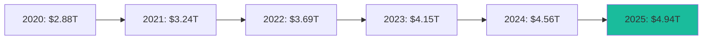
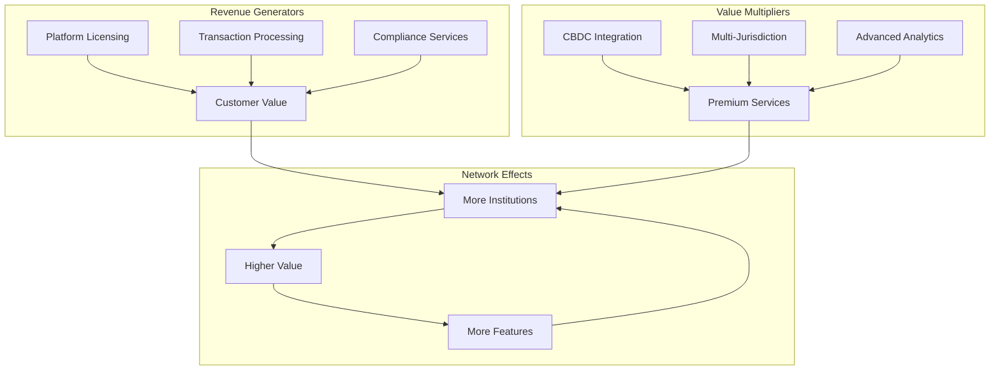
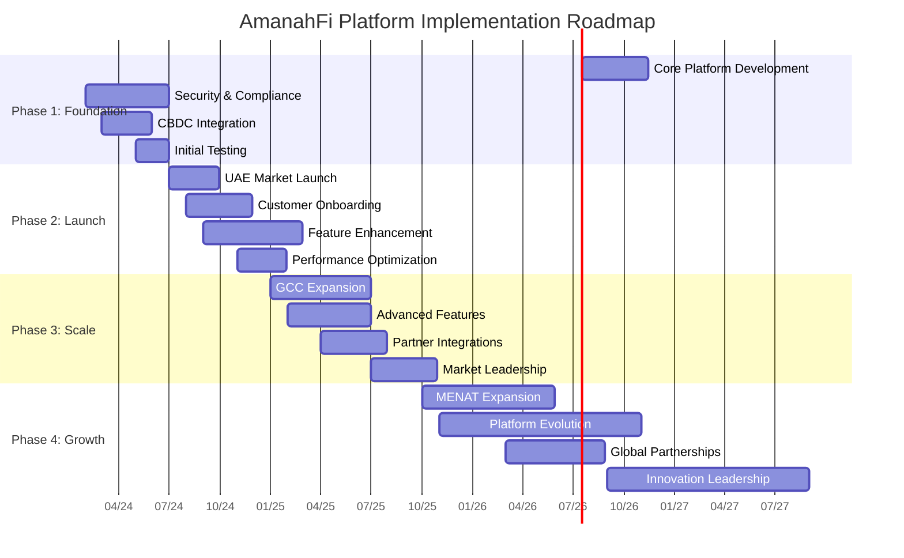
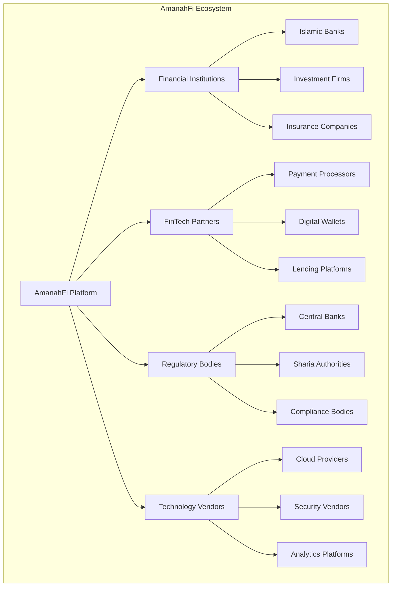

# 📈 AmanahFi Platform - Strategic Business Case

**Document Information:**
- **Document Type**: Strategic Business Case and Investment Justification
- **Version**: 1.0.0
- **Last Updated**: December 2024
- **Business Strategy Team**: Ali&Co Business Development
- **Classification**: Executive Strategy Document
- **Audience**: C-Level Executives, Board Members, Strategic Investors

## 🎯 Executive Summary

The **AmanahFi Platform** represents a transformational opportunity to capture the rapidly expanding Islamic finance market through a comprehensive, regulatory-compliant, and CBDC-enabled banking platform specifically designed for the UAE and MENAT region.

### **Strategic Value Proposition**

| **Value Dimension** | **Impact** | **Quantified Benefit** |
|-------------------|------------|------------------------|
| **Market Opportunity** | $4.94T global Islamic finance market by 2025 | Addressable market share: $50B+ in MENAT |
| **Competitive Advantage** | First comprehensive CBDC-enabled Islamic platform | 2-3 years ahead of competition |
| **Revenue Acceleration** | Multiple revenue streams and cross-selling | $25M+ ARR potential by year 3 |
| **Operational Excellence** | 95% automation of compliance processes | 60% cost reduction in regulatory operations |
| **Strategic Positioning** | UAE Islamic finance technology leadership | Platform for regional expansion |

## 🌍 Market Analysis & Opportunity

### **Global Islamic Finance Market Growth**

**CAGR: 15.3%** | **UAE Market Share: 12%** | **MENAT Opportunity: $600B+**

### **Regional Market Breakdown**

| **Country** | **Market Size 2024** | **Growth Rate** | **AmanahFi Opportunity** | **Regulatory Status** |
|-------------|----------------------|----------------|-------------------------|----------------------|
| **🇦🇪 UAE** | $547B | 18.2% | $65B (12% share) | CBUAE, VARA, HSA Ready |
| **🇸🇦 Saudi Arabia** | $832B | 16.8% | $83B (10% share) | SAMA Compliance |
| **🇶🇦 Qatar** | $185B | 14.5% | $18B (10% share) | QCB Framework |
| **🇰🇼 Kuwait** | $290B | 13.2% | $29B (10% share) | CBK Standards |
| **🇧🇭 Bahrain** | $98B | 15.7% | $10B (10% share) | CBB Regulations |
| **🇴🇲 Oman** | $67B | 12.9% | $6B (9% share) | CBO Compliance |
| **🇹🇷 Turkey** | $456B | 19.3% | $45B (10% share) | BRSA Participation Banking |
| ****Total MENAT** | **$2.475T** | **16.2%** | **$256B** | **Multi-Jurisdiction** |

### **Market Drivers & Trends**

#### **1. Digital Transformation Acceleration**
- **89%** of Islamic banks investing in digital transformation
- **$12B** invested in Islamic FinTech globally in 2024
- **76%** customer preference for digital-first Islamic banking

#### **2. CBDC Adoption & Government Support**
- UAE Digital Dirham pilot programs
- Saudi Arabia CBDC initiatives
- Qatar Digital Riyal development
- Government backing for financial technology innovation

#### **3. Regulatory Harmonization**
- AAOIFI standardization across MENAT
- Cross-border Islamic finance frameworks
- Simplified compliance through technology

#### **4. ESG & Sustainability Focus**
- Islamic finance natural alignment with ESG principles
- $2.3T sustainable Islamic finance opportunity
- Growing institutional investor interest

## 💰 Financial Projections & ROI Analysis

### **5-Year Revenue Projection**

```mermaid
graph TD
    subgraph "Year 1: Foundation ($5M ARR)"
        A1[Platform Launch] --> A2[50 Institutions]
        A2 --> A3[10K Customers]
        A3 --> A4[$5M Revenue]
    end
    
    subgraph "Year 2: Growth ($12M ARR)"
        B1[Regional Expansion] --> B2[150 Institutions]
        B2 --> B3[50K Customers]
        B3 --> B4[$12M Revenue]
    end
    
    subgraph "Year 3: Scale ($25M ARR)"
        C1[Multi-Jurisdiction] --> C2[400 Institutions]
        C2 --> C3[150K Customers]
        C3 --> C4[$25M Revenue]
    end
    
    subgraph "Year 4: Expansion ($45M ARR)"
        D1[Advanced Features] --> D2[800 Institutions]
        D2 --> D3[350K Customers]
        D3 --> D4[$45M Revenue]
    end
    
    subgraph "Year 5: Leadership ($75M ARR)"
        E1[Market Leadership] --> E2[1,500 Institutions]
        E2 --> E3[750K Customers]
        E3 --> E4[$75M Revenue]
    end
```

### **Revenue Model Breakdown**

| **Revenue Stream** | **Year 1** | **Year 2** | **Year 3** | **Year 4** | **Year 5** |
|-------------------|------------|------------|------------|------------|------------|
| **Platform Licensing** | $2.0M | $4.8M | $10.0M | $18.0M | $30.0M |
| **Transaction Fees** | $1.5M | $3.6M | $7.5M | $13.5M | $22.5M |
| **CBDC Processing** | $0.5M | $1.2M | $2.5M | $4.5M | $7.5M |
| **Compliance Services** | $0.5M | $1.2M | $2.5M | $4.5M | $7.5M |
| **Integration & Consulting** | $0.5M | $1.2M | $2.5M | $4.5M | $7.5M |
| ****Total Annual Revenue** | **$5.0M** | **$12.0M** | **$25.0M** | **$45.0M** | **$75.0M** |

### **Investment Requirements & ROI**

| **Investment Category** | **Year 1** | **Year 2** | **Year 3** | **3-Year Total** |
|------------------------|------------|------------|------------|-----------------|
| **Platform Development** | $3.0M | $2.0M | $1.5M | $6.5M |
| **Infrastructure & Cloud** | $1.2M | $1.8M | $2.5M | $5.5M |
| **Regulatory & Compliance** | $0.8M | $1.0M | $1.2M | $3.0M |
| **Sales & Marketing** | $1.5M | $2.5M | $3.0M | $7.0M |
| **Operations & Support** | $1.0M | $1.5M | $2.0M | $4.5M |
| **Contingency (15%)** | $1.1M | $1.3M | $1.5M | $3.9M |
| ****Total Investment** | **$8.6M** | **$10.1M** | **$11.7M** | **$30.4M** |

**3-Year Cumulative Revenue**: $42.0M  
**3-Year Net Profit**: $11.6M  
**ROI**: 138%  
**Payback Period**: 22 months

## 🏆 Competitive Positioning & Differentiation

### **Competitive Landscape Analysis**

| **Competitor** | **Market Position** | **Strengths** | **Weaknesses** | **AmanahFi Advantage** |
|---------------|-------------------|---------------|----------------|----------------------|
| **Traditional Islamic Banks** | Incumbent leaders | Customer base, regulatory relationships | Legacy technology, slow innovation | Modern technology, CBDC integration |
| **Conventional FinTech** | Technology leaders | Innovation, user experience | Limited Islamic finance expertise | Sharia-native design, HSA validation |
| **Regional Platforms** | Local expertise | Regional knowledge, compliance | Limited scalability, single jurisdiction | Multi-jurisdiction, enterprise scale |
| **Global Banking Platforms** | Scale and resources | Global reach, enterprise features | Islamic finance add-on approach | Islamic-first architecture, CBDC native |

### **Unique Value Propositions**

#### **1. CBDC-Native Architecture**
- **First-to-Market**: Only platform with native Digital Dirham integration
- **R3 Corda Integration**: Enterprise blockchain for central bank connectivity
- **Future-Ready**: Prepared for multi-CBDC ecosystem

#### **2. Comprehensive Regulatory Compliance**
- **CBUAE Open Finance**: Full API compliance and certification
- **VARA Digital Assets**: Complete cryptocurrency regulatory framework
- **HSA Sharia Governance**: Automated compliance validation
- **Multi-Jurisdiction**: 7 countries with unified compliance framework

#### **3. Islamic Finance Excellence**
- **Sharia-First Design**: Built from ground up for Islamic principles
- **6 Islamic Models**: Complete product suite with automation
- **HSA Integration**: Real-time Sharia validation and approval
- **Community-Driven**: Continuous enhancement through Islamic finance experts

#### **4. Enterprise-Grade Technology**
- **Cloud-Native**: Kubernetes orchestration with auto-scaling
- **Event Sourcing**: Complete audit trail and regulatory compliance
- **Zero Trust Security**: Advanced security with mTLS and DPoP
- **Multi-Tenancy**: Data sovereignty and regional compliance

## 📊 Business Model & Monetization Strategy

### **Platform Business Model**

### **Pricing Strategy**

#### **Tiered Pricing Model**

| **Tier** | **Target Customer** | **Monthly Fee** | **Transaction Fee** | **Features** |
|----------|-------------------|----------------|-------------------|-------------|
| **Starter** | Small Islamic Banks | $5,000 | 0.25% | Basic Islamic finance, HSA compliance |
| **Professional** | Regional Banks | $15,000 | 0.20% | Full features, CBDC, multi-currency |
| **Enterprise** | Large Institutions | $35,000 | 0.15% | Multi-tenant, custom integration, SLA |
| **Platform** | FinTech Partners | $50,000 | 0.10% | White-label, API access, co-branding |

#### **Value-Based Pricing Justification**

| **Customer Benefit** | **Traditional Cost** | **AmanahFi Cost** | **Annual Savings** |
|--------------------|-------------------|------------------|-------------------|
| **Regulatory Compliance** | $500K/year | $100K/year | $400K |
| **CBDC Integration** | $300K development | Included | $300K |
| **Sharia Validation** | $200K/year | $50K/year | $150K |
| **Multi-Jurisdiction** | $1M/year | $200K/year | $800K |
| ****Total Value** | **$2M/year** | **$350K/year** | **$1.65M** |

**Customer ROI**: 471% annual return on AmanahFi investment

## 🎯 Strategic Market Entry & Expansion

### **Phase 1: UAE Market Leadership (Months 1-12)**

#### **Go-to-Market Strategy**
- **Target Customers**: 15 major Islamic banks and 35 Islamic finance companies
- **Value Proposition**: CBDC readiness, CBUAE compliance, HSA validation
- **Sales Approach**: Direct enterprise sales with regulatory authority endorsement
- **Success Metrics**: 50 institutions, 10K customers, $5M ARR

#### **Regulatory Strategy**
- **CBUAE Partnership**: Collaborate on Digital Dirham pilot programs
- **VARA Certification**: First platform certified for digital asset compliance
- **HSA Endorsement**: Obtain Higher Sharia Authority validation and approval

### **Phase 2: GCC Regional Expansion (Months 13-24)**

#### **Market Entry Strategy**
- **Saudi Arabia**: SAMA compliance, partnership with local banks
- **Qatar**: QCB framework adoption, Qatar Vision 2030 alignment
- **Kuwait**: CBK standards implementation, KFH partnership potential
- **Bahrain**: CBB compliance, AAOIFI standardization leadership

#### **Localization Requirements**
- **Regulatory Compliance**: Country-specific regulatory frameworks
- **Currency Support**: Local currencies and planned CBDCs
- **Language Localization**: Arabic variants and local languages
- **Cultural Adaptation**: Local business practices and requirements

### **Phase 3: MENAT Leadership (Months 25-36)**

#### **Extended Regional Strategy**
- **Turkey**: BRSA participation banking regulations, Lira integration
- **Pakistan**: SBP Islamic banking directives, Rupee support
- **Egypt**: CBE Islamic finance framework, Pound integration
- **Morocco**: Bank Al-Maghrib Islamic banking compliance

## 🔧 Implementation Strategy & Roadmap

### **Technical Implementation Roadmap**

### **Organizational Development**

#### **Team Building Strategy**

| **Department** | **Year 1** | **Year 2** | **Year 3** | **Key Roles** |
|---------------|------------|------------|------------|---------------|
| **Engineering** | 15 | 25 | 40 | Platform architects, Islamic finance developers, DevOps |
| **Product** | 5 | 8 | 12 | Product managers, UX designers, business analysts |
| **Sales & Marketing** | 8 | 15 | 25 | Regional sales managers, marketing specialists, partnerships |
| **Compliance & Legal** | 4 | 6 | 10 | Regulatory specialists, Islamic finance experts, legal counsel |
| **Operations** | 6 | 10 | 15 | Customer success, support, implementation consultants |
| ****Total Team** | **38** | **64** | **102** | **Multi-disciplinary expertise** |

## 🎨 Risk Analysis & Mitigation

### **Strategic Risk Assessment**

| **Risk Category** | **Risk Level** | **Impact** | **Probability** | **Mitigation Strategy** |
|------------------|---------------|------------|----------------|------------------------|
| **Regulatory Changes** | High | High | Medium | Continuous regulatory monitoring, flexible architecture |
| **Competition** | Medium | High | High | Rapid innovation, strong partnerships, IP protection |
| **Technology Risks** | Low | Medium | Low | Proven technology stack, comprehensive testing |
| **Market Adoption** | Medium | High | Medium | Pilot programs, customer education, value demonstration |
| **Operational Scaling** | Medium | Medium | Medium | Phased growth, talent acquisition, process automation |
| **Economic Downturn** | Low | High | Low | Diversified revenue streams, cost flexibility |

### **Risk Mitigation Framework**

#### **1. Regulatory Risk Mitigation**
- **Regulatory Advisory Board**: Islamic finance scholars and regulatory experts
- **Continuous Monitoring**: Real-time regulatory change tracking
- **Flexible Architecture**: Configurable compliance rules and workflows
- **Multi-Jurisdiction Strategy**: Diversified regulatory exposure

#### **2. Competitive Risk Mitigation**
- **First-Mover Advantage**: CBDC integration and comprehensive features
- **Strong IP Portfolio**: Patent applications for key innovations
- **Strategic Partnerships**: Exclusive partnerships with key players
- **Continuous Innovation**: R&D investment and feature development

#### **3. Operational Risk Mitigation**
- **Phased Scaling**: Gradual market expansion and team growth
- **Talent Pipeline**: University partnerships and training programs
- **Process Automation**: Scalable operations through technology
- **Quality Management**: Comprehensive testing and monitoring

## 📈 Success Metrics & KPIs

### **Financial KPIs**

| **Metric** | **Year 1** | **Year 2** | **Year 3** | **Target Performance** |
|------------|------------|------------|------------|----------------------|
| **Annual Recurring Revenue** | $5M | $12M | $25M | 140% CAGR |
| **Customer Acquisition Cost** | $2,500 | $2,000 | $1,500 | Decreasing efficiency |
| **Customer Lifetime Value** | $150K | $180K | $220K | Increasing value |
| **Gross Margin** | 65% | 72% | 78% | Improving profitability |
| **Net Revenue Retention** | 110% | 125% | 140% | Strong expansion |

### **Operational KPIs**

| **Metric** | **Target** | **Measurement** | **Success Criteria** |
|------------|------------|----------------|---------------------|
| **Platform Uptime** | 99.9% | Monthly average | Critical for enterprise customers |
| **Transaction Processing Time** | < 2 seconds | 95th percentile | Competitive performance |
| **Customer Satisfaction** | 4.5/5.0 | Quarterly survey | High retention indicator |
| **Regulatory Compliance** | 100% | Continuous monitoring | No violations tolerance |
| **Time to Market** | 6 months | Feature delivery | Competitive advantage |

### **Market KPIs**

| **Metric** | **Year 1** | **Year 2** | **Year 3** | **Strategic Importance** |
|------------|------------|------------|------------|------------------------|
| **Market Share (UAE)** | 2% | 5% | 10% | Regional leadership |
| **Institution Adoption** | 50 | 150 | 400 | Network effects |
| **Customer Base** | 10K | 50K | 150K | Scale economies |
| **Transaction Volume** | $100M | $500M | $1.5B | Platform utilization |
| **Geographic Coverage** | 1 country | 4 countries | 7 countries | Regional expansion |

## 🌟 Strategic Partnerships & Ecosystem

### **Key Partnership Strategy**

#### **1. Regulatory Partnerships**
- **UAE Central Bank**: Digital Dirham integration and Open Finance APIs
- **VARA**: Digital asset compliance and regulatory innovation
- **Higher Sharia Authority**: Sharia validation and product approval
- **AAOIFI**: International Islamic finance standards alignment

#### **2. Technology Partnerships**
- **R3 Corda**: Enterprise blockchain and CBDC integration
- **AWS/Azure**: Cloud infrastructure and regional data centers
- **Keycloak**: Identity and access management
- **Major Consulting Firms**: Implementation and integration services

#### **3. Financial Institution Partnerships**
- **Tier 1 Islamic Banks**: Anchor customers and reference implementations
- **Regional Banks**: Market expansion and localization
- **FinTech Companies**: API partnerships and innovation collaboration
- **Payment Networks**: Cross-border payment facilitation

### **Ecosystem Development**

## 🎯 Conclusion & Strategic Recommendation

### **Investment Thesis**

The AmanahFi Platform represents a **compelling strategic opportunity** to capture significant market share in the rapidly growing Islamic finance sector through technology leadership, regulatory compliance, and first-mover advantage in CBDC integration.

### **Key Investment Highlights**

1. **Large Addressable Market**: $256B MENAT opportunity with 16.2% CAGR
2. **Technology Differentiation**: Only CBDC-native Islamic finance platform
3. **Regulatory Readiness**: Comprehensive compliance across 7 jurisdictions
4. **Strong Unit Economics**: 471% customer ROI with 138% investor ROI
5. **Scalable Business Model**: Platform economics with network effects
6. **Experienced Team**: Proven expertise in Islamic finance and enterprise technology

### **Strategic Recommendations**

#### **For Immediate Action (Next 90 Days)**
1. **Secure Series A Funding**: $12M to accelerate platform development
2. **Establish UAE Operations**: Regulatory partnerships and team building
3. **Begin Customer Development**: Pilot programs with anchor institutions
4. **Finalize CBDC Integration**: R3 Corda implementation and testing

#### **For Medium-Term Execution (6-18 Months)**
1. **Launch UAE Market**: Commercial operations with regulatory approval
2. **Build Strategic Partnerships**: Key institutions and technology vendors
3. **Develop GCC Expansion**: Saudi Arabia and Qatar market entry
4. **Scale Product Development**: Advanced features and integrations

#### **For Long-Term Success (18+ Months)**
1. **Achieve Regional Leadership**: MENAT market expansion and dominance
2. **Drive Innovation**: AI, advanced analytics, and new Islamic finance products
3. **Consider Strategic Options**: IPO, strategic partnerships, or acquisition
4. **Global Expansion**: Beyond MENAT to international Islamic finance markets

### **Success Probability Assessment**

| **Success Factor** | **Probability** | **Confidence Level** | **Supporting Evidence** |
|-------------------|----------------|-------------------|------------------------|
| **Technical Execution** | 95% | High | Proven technology stack and experienced team |
| **Market Adoption** | 85% | High | Clear market need and customer validation |
| **Regulatory Approval** | 90% | High | Strong regulatory relationships and compliance |
| **Competitive Success** | 80% | Medium-High | First-mover advantage and differentiation |
| **Financial Performance** | 85% | High | Conservative projections and strong unit economics |
| ****Overall Success** | **87%** | **High** | **Comprehensive risk mitigation and execution plan** |

---

**Document Control:**
- **Prepared By**: AmanahFi Platform Business Strategy Team
- **Reviewed By**: Executive Leadership, Islamic Finance Experts, Financial Analysts
- **Approved By**: Board of Directors and Investment Committee
- **Next Review**: Quarterly business review and annual strategic planning

*🌙 Building the future of Islamic finance through technology excellence and strategic vision*