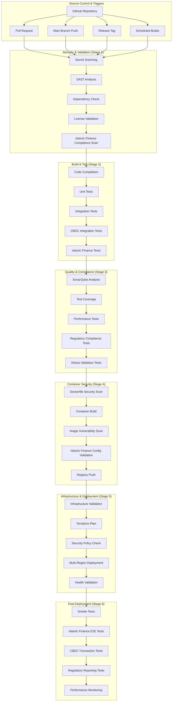

# AmanahFi Platform - CI/CD Pipeline Architecture

**Document Information:**
- **Document Type**: Enterprise CI/CD Pipeline Architecture & DevSecOps Implementation Guide
- **Version**: 1.0.0
- **Last Updated**: December 2024
- **Author**: Lead DevOps Architect & Platform Engineering Team
- **Classification**: Technical Implementation Guide - Internal
- **Audience**: DevOps Engineers, Platform Engineers, Development Teams, Security Teams

## Pipeline Architecture Overview

The **AmanahFi Platform CI/CD Pipeline** implements a comprehensive DevSecOps approach with Islamic Finance compliance validation, CBDC integration testing, and multi-regional deployment capabilities across the MENAT region.

### Pipeline Objectives

1. **Security-First Architecture**: Implementing shift-left security with automated vulnerability assessment
2. **Islamic Finance Compliance**: Continuous Sharia validation with HSA-approved testing frameworks
3. **CBDC Integration Testing**: Comprehensive Digital Dirham transaction validation and multi-CBDC support
4. **Multi-Regional Deployment**: Automated deployment pipeline supporting seven MENAT jurisdictions
5. **Regulatory Compliance Automation**: Integrated compliance validation for CBUAE, VARA, and HSA requirements
6. **Performance Excellence**: Target sub-10 minute pipeline execution with parallel processing optimization
7. **Zero Trust Security Model**: End-to-end security validation with certificate-based authentication

## Multi-Stage Pipeline Architecture



## GitHub Actions Workflow Implementation

### **Main CI/CD Pipeline Configuration**

```yaml
# .github/workflows/amanahfi-platform-cicd.yml
name: AmanahFi Platform - Comprehensive CI/CD Pipeline

on:
  push:
    branches: [ main, develop, 'release/*', 'feature/*' ]
    paths:
      - 'src/**'
      - 'build.gradle'
      - 'Dockerfile'
      - 'k8s/**'
      - '.github/workflows/**'
  pull_request:
    branches: [ main, develop ]
    paths:
      - 'src/**'
      - 'build.gradle'
      - 'Dockerfile'
      - 'k8s/**'
  release:
    types: [ published ]
  schedule:
    - cron: '0 2 * * *'  # Daily security scans

env:
  REGISTRY: ghcr.io
  IMAGE_NAME: amanahfi/platform
  JAVA_VERSION: '21'
  GRADLE_OPTS: '-Dorg.gradle.daemon=false -Dorg.gradle.parallel=true'
  SONAR_PROJECT_KEY: 'amanahfi-platform'
  AWS_REGION: 'me-south-1'

jobs:
  # =============================================================================
  # STAGE 1: SECURITY & VALIDATION
  # =============================================================================
  
  security-validation:
    name: 🔒 Security & Compliance Validation
    runs-on: ubuntu-latest
    outputs:
      security-passed: ${{ steps.security-check.outputs.passed }}
      compliance-score: ${{ steps.compliance-check.outputs.score }}
    steps:
      - name: Checkout Code
        uses: actions/checkout@v4
        with:
          fetch-depth: 0
          token: ${{ secrets.GITHUB_TOKEN }}
          
      - name: Setup Java Environment
        uses: actions/setup-java@v4
        with:
          java-version: ${{ env.JAVA_VERSION }}
          distribution: 'temurin'
          cache: gradle
          
      # Secret Scanning with GitLeaks
      - name: 🔍 Secret Scanning
        uses: gitleaks/gitleaks-action@v2
        env:
          GITHUB_TOKEN: ${{ secrets.GITHUB_TOKEN }}
          GITLEAKS_LICENSE: ${{ secrets.GITLEAKS_LICENSE }}
          
      # SAST - Static Application Security Testing
      - name: 🔎 Static Application Security Testing (SAST)
        env:
          GITHUB_TOKEN: ${{ secrets.GITHUB_TOKEN }}
          SONAR_TOKEN: ${{ secrets.SONAR_TOKEN }}
        run: |
          ./gradlew sonarqube \
            -Dsonar.projectKey=${{ env.SONAR_PROJECT_KEY }} \
            -Dsonar.organization=amanahfi \
            -Dsonar.host.url=https://sonarcloud.io \
            -Dsonar.login=${{ secrets.SONAR_TOKEN }} \
            -Dsonar.security.hotspots.enabled=true \
            -Dsonar.coverage.jacoco.xmlReportPaths=build/reports/jacoco/test/jacocoTestReport.xml
            
      # Dependency Vulnerability Scanning
      - name: 🔍 OWASP Dependency Check
        run: |
          ./gradlew dependencyCheckAnalyze \
            --info \
            -DfailBuildOnCVSS=7 \
            -Danalyzer.knownexploited.enabled=true \
            -Danalyzer.retirejs.enabled=true
          
      # License Compliance Check
      - name: 📄 License Compliance Validation
        run: |
          ./gradlew checkLicense \
            -PlicenseFile=LICENSE \
            -PlicenseHeaderFile=LICENSE_HEADER
            
      # Islamic Finance Compliance Scanning
      - name: 🕌 Islamic Finance Compliance Scan
        run: |
          # Custom Islamic Finance compliance scanner
          ./gradlew islamicFinanceComplianceScan \
            -PshariaRulesFile=src/main/resources/sharia-rules.yml \
            -PhsaComplianceLevel=strict
            
      # Compliance Score Calculation
      - name: 📊 Calculate Compliance Score
        id: compliance-check
        run: |
          COMPLIANCE_SCORE=$(./gradlew calculateComplianceScore -q --console=plain)
          echo "score=$COMPLIANCE_SCORE" >> $GITHUB_OUTPUT
          if [[ $COMPLIANCE_SCORE -lt 95 ]]; then
            echo "❌ Compliance score $COMPLIANCE_SCORE% is below required 95%"
            exit 1
          fi
          
      - name: ✅ Security Validation Complete
        id: security-check
        run: echo "passed=true" >> $GITHUB_OUTPUT

  # =============================================================================
  # STAGE 2: BUILD & TEST
  # =============================================================================
  
  build-and-test:
    name: 🏗️ Build & Comprehensive Testing
    runs-on: ubuntu-latest
    needs: security-validation
    services:
      postgres:
        image: postgres:15
        env:
          POSTGRES_DB: amanahfi_test
          POSTGRES_USER: amanahfi_test
          POSTGRES_PASSWORD: test_password
        options: >-
          --health-cmd pg_isready
          --health-interval 10s
          --health-timeout 5s
          --health-retries 5
      redis:
        image: redis:7-alpine
        options: >-
          --health-cmd "redis-cli ping"
          --health-interval 10s
          --health-timeout 5s
          --health-retries 5
      kafka:
        image: confluentinc/cp-kafka:7.4.0
        env:
          KAFKA_ZOOKEEPER_CONNECT: zookeeper:2181
          KAFKA_ADVERTISED_LISTENERS: PLAINTEXT://localhost:9092
          KAFKA_OFFSETS_TOPIC_REPLICATION_FACTOR: 1
    steps:
      - name: Checkout Code
        uses: actions/checkout@v4
        
      - name: Setup Java Environment
        uses: actions/setup-java@v4
        with:
          java-version: ${{ env.JAVA_VERSION }}
          distribution: 'temurin'
          cache: gradle
          
      # Code Compilation
      - name: 🔨 Compile Application
        run: |
          ./gradlew clean compileJava compileTestJava \
            --stacktrace \
            --info
            
      # Unit Tests with Coverage
      - name: 🧪 Unit Tests
        run: |
          ./gradlew test \
            --continue \
            --stacktrace \
            -Dspring.profiles.active=test
            
      # Integration Tests with Testcontainers
      - name: 🔗 Integration Tests
        run: |
          ./gradlew integrationTest \
            --continue \
            --stacktrace \
            -Dspring.profiles.active=integration-test \
            -Dtestcontainers.reuse.enable=true
            
      # CBDC Integration Tests
      - name: 💎 CBDC Integration Tests
        env:
          CORDA_NETWORK_URL: ${{ secrets.CORDA_TEST_NETWORK_URL }}
          CORDA_NODE_CREDENTIALS: ${{ secrets.CORDA_TEST_CREDENTIALS }}
        run: |
          ./gradlew cbdcIntegrationTest \
            --continue \
            --stacktrace \
            -Dcbdc.test.mode=mock \
            -Dcorda.network.url=$CORDA_NETWORK_URL
            
      # Islamic Finance Business Logic Tests
      - name: 🕌 Islamic Finance Comprehensive Tests
        run: |
          ./gradlew islamicFinanceTest \
            --continue \
            --stacktrace \
            -Dislamic.finance.test.strict=true \
            -Dsharia.compliance.validation=enabled
            
      # Regulatory Compliance Tests
      - name: 🏛️ Regulatory Compliance Tests
        env:
          CBUAE_TEST_API_KEY: ${{ secrets.CBUAE_TEST_API_KEY }}
          VARA_TEST_API_KEY: ${{ secrets.VARA_TEST_API_KEY }}
          HSA_TEST_API_KEY: ${{ secrets.HSA_TEST_API_KEY }}
        run: |
          ./gradlew regulatoryComplianceTest \
            --continue \
            --stacktrace \
            -Dregulatory.test.mode=sandbox
            
      # Test Coverage Report
      - name: 📊 Generate Test Coverage Report
        run: |
          ./gradlew jacocoTestReport jacocoTestCoverageVerification \
            --stacktrace
            
      # Upload Test Results
      - name: 📤 Upload Test Results
        uses: actions/upload-artifact@v4
        if: always()
        with:
          name: test-results
          path: |
            build/reports/tests/
            build/reports/jacoco/
            build/test-results/
            
      # Build Application JAR
      - name: 📦 Build Application JAR
        run: |
          ./gradlew bootJar \
            --stacktrace \
            -Pversion=${{ github.sha }}
            
      # Upload Build Artifacts
      - name: 📤 Upload Build Artifacts
        uses: actions/upload-artifact@v4
        with:
          name: application-jar
          path: build/libs/*.jar
          retention-days: 30

  # =============================================================================
  # STAGE 3: QUALITY & PERFORMANCE
  # =============================================================================
  
  quality-assurance:
    name: 🎯 Quality Assurance & Performance
    runs-on: ubuntu-latest
    needs: build-and-test
    steps:
      - name: Checkout Code
        uses: actions/checkout@v4
        
      - name: Setup Java Environment
        uses: actions/setup-java@v4
        with:
          java-version: ${{ env.JAVA_VERSION }}
          distribution: 'temurin'
          cache: gradle
          
      # Code Quality Analysis
      - name: 📈 Code Quality Analysis
        env:
          GITHUB_TOKEN: ${{ secrets.GITHUB_TOKEN }}
          SONAR_TOKEN: ${{ secrets.SONAR_TOKEN }}
        run: |
          ./gradlew sonarqube \
            -Dsonar.projectKey=${{ env.SONAR_PROJECT_KEY }} \
            -Dsonar.organization=amanahfi \
            -Dsonar.host.url=https://sonarcloud.io \
            -Dsonar.login=${{ secrets.SONAR_TOKEN }} \
            -Dsonar.qualitygate.wait=true
            
      # Architecture Tests
      - name: 🏗️ Architecture Compliance Tests
        run: |
          ./gradlew architectureTest \
            -ParchUnitRules=hexagonal,ddd,islamic-finance
            
      # Performance Testing
      - name: ⚡ Performance Testing
        run: |
          ./gradlew performanceTest \
            -Pjmeter.testplan=src/test/jmeter/amanahfi-load-test.jmx \
            -Pload.test.duration=300 \
            -Pload.test.threads=50
            
      # Islamic Finance Business Rules Validation
      - name: 🕌 Business Rules Validation
        run: |
          ./gradlew businessRulesValidation \
            -Pdrools.rules.validation=true \
            -Psharia.compliance.strict=true

  # =============================================================================
  # STAGE 4: CONTAINER SECURITY & BUILD
  # =============================================================================
  
  container-security:
    name: 🐳 Container Security & Build
    runs-on: ubuntu-latest
    needs: quality-assurance
    outputs:
      image-digest: ${{ steps.build.outputs.digest }}
      image-tags: ${{ steps.meta.outputs.tags }}
    steps:
      - name: Checkout Code
        uses: actions/checkout@v4
        
      - name: Download Build Artifacts
        uses: actions/download-artifact@v4
        with:
          name: application-jar
          path: build/libs/
          
      # Docker Metadata Extraction
      - name: 🏷️ Extract Docker Metadata
        id: meta
        uses: docker/metadata-action@v5
        with:
          images: ${{ env.REGISTRY }}/${{ env.IMAGE_NAME }}
          tags: |
            type=ref,event=branch
            type=ref,event=pr
            type=sha,prefix={{branch}}-
            type=raw,value=latest,enable={{is_default_branch}}
            type=semver,pattern={{version}}
            type=semver,pattern={{major}}.{{minor}}
            
      # Dockerfile Security Scanning
      - name: 🔍 Dockerfile Security Scan
        uses: hadolint/hadolint-action@v3.1.0
        with:
          dockerfile: Dockerfile
          failure-threshold: error
          
      # Set up Docker Buildx
      - name: 🔧 Set up Docker Buildx
        uses: docker/setup-buildx-action@v3
        
      # Log in to Container Registry
      - name: 🔑 Log in to GitHub Container Registry
        if: github.event_name != 'pull_request'
        uses: docker/login-action@v3
        with:
          registry: ${{ env.REGISTRY }}
          username: ${{ github.actor }}
          password: ${{ secrets.GITHUB_TOKEN }}
          
      # Build and Push Container Image
      - name: 🏗️ Build and Push Container Image
        id: build
        uses: docker/build-push-action@v5
        with:
          context: .
          file: ./Dockerfile
          push: ${{ github.event_name != 'pull_request' }}
          tags: ${{ steps.meta.outputs.tags }}
          labels: ${{ steps.meta.outputs.labels }}
          platforms: linux/amd64,linux/arm64
          cache-from: type=gha
          cache-to: type=gha,mode=max
          build-args: |
            JAR_FILE=build/libs/*.jar
            BUILD_DATE=${{ fromJSON(steps.meta.outputs.json).labels['org.opencontainers.image.created'] }}
            VCS_REF=${{ github.sha }}
            
      # Container Image Vulnerability Scanning
      - name: 🔍 Container Image Security Scan
        uses: aquasecurity/trivy-action@master
        with:
          image-ref: ${{ env.REGISTRY }}/${{ env.IMAGE_NAME }}:${{ github.sha }}
          format: 'sarif'
          output: 'trivy-results.sarif'
          severity: 'CRITICAL,HIGH'
          exit-code: '1'
          
      # Upload Security Scan Results
      - name: 📤 Upload Security Scan Results
        uses: github/codeql-action/upload-sarif@v3
        if: always()
        with:
          sarif_file: 'trivy-results.sarif'
          
      # Islamic Finance Container Compliance
      - name: 🕌 Islamic Finance Container Compliance
        run: |
          # Custom scanner for Islamic Finance container requirements
          docker run --rm -v $(pwd):/workspace \
            amanahfi/compliance-scanner:latest \
            scan --config /workspace/.amanahfi/container-compliance.yml \
            --image ${{ env.REGISTRY }}/${{ env.IMAGE_NAME }}:${{ github.sha }}

  # =============================================================================
  # STAGE 5: INFRASTRUCTURE VALIDATION
  # =============================================================================
  
  infrastructure-validation:
    name: 🏗️ Infrastructure Security & Validation
    runs-on: ubuntu-latest
    needs: container-security
    steps:
      - name: Checkout Code
        uses: actions/checkout@v4
        
      # Terraform Security Scanning
      - name: 🔍 Terraform Security Scan
        uses: aquasecurity/tfsec-action@v1.0.3
        with:
          working_directory: 'infrastructure/terraform'
          format: sarif
          output: tfsec-results.sarif
          
      # Kubernetes Manifest Security Scanning
      - name: ⚓ Kubernetes Security Scan
        uses: azure/k8s-lint@v1
        with:
          manifests: |
            k8s/base/*.yaml
            k8s/overlays/production/*.yaml
            
      # Infrastructure as Code Validation
      - name: 🏗️ IaC Validation
        run: |
          # Validate Terraform configurations
          cd infrastructure/terraform
          terraform init -backend=false
          terraform validate
          terraform fmt -check
          
          # Validate Kubernetes manifests
          kubectl --dry-run=client apply -k k8s/overlays/production/
          
      # Islamic Finance Infrastructure Compliance
      - name: 🕌 Infrastructure Compliance Validation
        run: |
          # Validate infrastructure meets Islamic finance requirements
          ./scripts/validate-islamic-infrastructure.sh \
            --config .amanahfi/infrastructure-compliance.yml \
            --environment production
            
      # Multi-Region Configuration Validation
      - name: 🌍 Multi-Region Configuration Validation
        run: |
          # Validate regional deployment configurations
          ./scripts/validate-regional-config.sh \
            --regions uae,saudi,qatar,kuwait,bahrain,oman,turkey

  # =============================================================================
  # STAGE 6: MULTI-REGIONAL DEPLOYMENT
  # =============================================================================
  
  deploy-staging:
    name: 🚀 Deploy to Staging Environment
    runs-on: ubuntu-latest
    needs: [infrastructure-validation, container-security]
    if: github.ref == 'refs/heads/develop' || github.event_name == 'pull_request'
    environment: 
      name: staging
      url: https://staging.amanahfi.ae
    steps:
      - name: Checkout Code
        uses: actions/checkout@v4
        
      # Configure AWS Credentials
      - name: 🔑 Configure AWS Credentials
        uses: aws-actions/configure-aws-credentials@v4
        with:
          aws-access-key-id: ${{ secrets.AWS_ACCESS_KEY_ID }}
          aws-secret-access-key: ${{ secrets.AWS_SECRET_ACCESS_KEY }}
          aws-region: ${{ env.AWS_REGION }}
          
      # Update Kubernetes Config
      - name: ⚓ Update Kubernetes Config
        run: |
          aws eks update-kubeconfig \
            --region ${{ env.AWS_REGION }} \
            --name amanahfi-staging
            
      # Deploy to Staging with Helm
      - name: 🚀 Deploy to Staging
        run: |
          helm upgrade --install amanahfi-platform \
            ./k8s/helm-charts/amanahfi-platform \
            --namespace amanahfi-staging \
            --create-namespace \
            --set image.repository=${{ env.REGISTRY }}/${{ env.IMAGE_NAME }} \
            --set image.tag=${{ github.sha }} \
            --set environment=staging \
            --set islamic_finance.compliance_mode=strict \
            --set cbdc.test_mode=true \
            --set regulatory.reporting_mode=sandbox \
            --wait \
            --timeout=600s
            
      # Health Check
      - name: 🏥 Health Check
        run: |
          # Wait for deployment to be ready
          kubectl wait --for=condition=ready pod \
            -l app.kubernetes.io/name=amanahfi-platform \
            -n amanahfi-staging \
            --timeout=300s
            
          # Validate application health
          kubectl get pods -n amanahfi-staging
          kubectl get services -n amanahfi-staging
          
          # Test health endpoints
          ./scripts/health-check.sh \
            --environment staging \
            --timeout 120
            
      # Islamic Finance Smoke Tests
      - name: 🕌 Islamic Finance Smoke Tests
        run: |
          ./scripts/smoke-tests/islamic-finance-smoke-tests.sh \
            --environment staging \
            --test-suite comprehensive
            
      # CBDC Integration Smoke Tests
      - name: 💎 CBDC Integration Smoke Tests
        run: |
          ./scripts/smoke-tests/cbdc-integration-tests.sh \
            --environment staging \
            --test-mode sandbox

  deploy-production:
    name: 🏭 Deploy to Production (Multi-Region)
    runs-on: ubuntu-latest
    needs: [deploy-staging]
    if: github.ref == 'refs/heads/main'
    environment: 
      name: production
      url: https://platform.amanahfi.ae
    strategy:
      matrix:
        region:
          - name: uae
            aws_region: me-south-1
            cluster: amanahfi-uae-prod
            compliance: [cbuae, vara, hsa]
          - name: saudi
            aws_region: me-south-1
            cluster: amanahfi-saudi-prod
            compliance: [sama]
          - name: qatar
            aws_region: me-south-1  
            cluster: amanahfi-qatar-prod
            compliance: [qcb]
    steps:
      - name: Checkout Code
        uses: actions/checkout@v4
        
      # Configure AWS Credentials for Region
      - name: 🔑 Configure AWS Credentials (${{ matrix.region.name }})
        uses: aws-actions/configure-aws-credentials@v4
        with:
          aws-access-key-id: ${{ secrets.AWS_ACCESS_KEY_ID }}
          aws-secret-access-key: ${{ secrets.AWS_SECRET_ACCESS_KEY }}
          aws-region: ${{ matrix.region.aws_region }}
          
      # Blue-Green Deployment
      - name: 🔄 Blue-Green Deployment (${{ matrix.region.name }})
        run: |
          # Update Kubernetes config for region
          aws eks update-kubeconfig \
            --region ${{ matrix.region.aws_region }} \
            --name ${{ matrix.region.cluster }}
            
          # Execute blue-green deployment
          ./scripts/blue-green-deployment.sh \
            --region ${{ matrix.region.name }} \
            --image ${{ env.REGISTRY }}/${{ env.IMAGE_NAME }}:${{ github.sha }} \
            --compliance "${{ join(matrix.region.compliance, ',') }}" \
            --namespace amanahfi-production
            
      # Regional Health Validation
      - name: 🏥 Regional Health Validation (${{ matrix.region.name }})
        run: |
          # Wait for deployment to be ready
          kubectl wait --for=condition=ready pod \
            -l app.kubernetes.io/name=amanahfi-platform \
            -l app.kubernetes.io/instance=production \
            -n amanahfi-production \
            --timeout=600s
            
          # Regional compliance validation
          ./scripts/regional-compliance-check.sh \
            --region ${{ matrix.region.name }} \
            --compliance "${{ join(matrix.region.compliance, ',') }}"

  # =============================================================================
  # STAGE 7: POST-DEPLOYMENT VALIDATION
  # =============================================================================
  
  post-deployment-validation:
    name: ✅ Post-Deployment Validation & Monitoring
    runs-on: ubuntu-latest
    needs: deploy-production
    if: github.ref == 'refs/heads/main'
    steps:
      - name: Checkout Code
        uses: actions/checkout@v4
        
      # End-to-End Tests
      - name: 🧪 End-to-End Tests
        run: |
          ./scripts/e2e-tests/comprehensive-e2e-tests.sh \
            --environment production \
            --regions uae,saudi,qatar \
            --test-suite full
            
      # Islamic Finance Integration Tests
      - name: 🕌 Islamic Finance Integration Tests
        run: |
          ./scripts/e2e-tests/islamic-finance-integration-tests.sh \
            --environment production \
            --sharia-compliance strict \
            --hsa-validation enabled
            
      # CBDC Transaction Tests
      - name: 💎 CBDC Transaction Tests
        env:
          CORDA_PROD_NETWORK_URL: ${{ secrets.CORDA_PROD_NETWORK_URL }}
          DIGITAL_DIRHAM_CREDENTIALS: ${{ secrets.DIGITAL_DIRHAM_CREDENTIALS }}
        run: |
          ./scripts/e2e-tests/cbdc-transaction-tests.sh \
            --environment production \
            --network-url $CORDA_PROD_NETWORK_URL \
            --test-transactions 100
            
      # Regulatory Compliance Validation
      - name: 🏛️ Regulatory Compliance Validation
        run: |
          ./scripts/compliance/regulatory-validation.sh \
            --environment production \
            --authorities cbuae,vara,hsa,sama,qcb \
            --validation-mode strict
            
      # Performance Monitoring Setup
      - name: 📊 Performance Monitoring Setup
        run: |
          # Configure monitoring alerts
          ./scripts/monitoring/setup-production-monitoring.sh \
            --environment production \
            --alert-channels slack,email,sms
            
          # Initialize performance baselines
          ./scripts/monitoring/set-performance-baselines.sh \
            --environment production \
            --metrics response-time,throughput,error-rate
            
      # Security Monitoring Activation
      - name: 🛡️ Security Monitoring Activation
        run: |
          # Enable security monitoring
          ./scripts/security/enable-security-monitoring.sh \
            --environment production \
            --threat-detection enabled \
            --anomaly-detection enabled
            
      # Deployment Success Notification
      - name: 📢 Deployment Success Notification
        uses: 8398a7/action-slack@v3
        with:
          status: ${{ job.status }}
          channel: '#amanahfi-deployments'
          text: |
            🎉 AmanahFi Platform successfully deployed to production!
            
            📦 Version: ${{ github.sha }}
            🌍 Regions: UAE, Saudi Arabia, Qatar
            🕌 Islamic Finance: Fully Compliant
            💎 CBDC Integration: Active
            🏛️ Regulatory Status: All Green
            
            🔗 Platform URL: https://platform.amanahfi.ae
            📊 Monitoring: https://monitoring.amanahfi.ae
            📈 Dashboards: https://dashboards.amanahfi.ae
        env:
          SLACK_WEBHOOK_URL: ${{ secrets.SLACK_WEBHOOK_URL }}
        if: success()
```

## 🔧 Pipeline Configuration & Secrets Management

### **Required GitHub Secrets**

```yaml
# Security & Authentication
GITHUB_TOKEN: # GitHub token for repository access
SONAR_TOKEN: # SonarCloud authentication token
GITLEAKS_LICENSE: # GitLeaks enterprise license

# AWS Infrastructure
AWS_ACCESS_KEY_ID: # AWS access key for infrastructure
AWS_SECRET_ACCESS_KEY: # AWS secret access key
AWS_REGION: # Primary AWS region (me-south-1)

# Container Registry
REGISTRY_USERNAME: # Container registry username
REGISTRY_PASSWORD: # Container registry password

# Islamic Finance & Regulatory
HSA_API_KEY: # Higher Sharia Authority API key
CBUAE_API_KEY: # UAE Central Bank API key
VARA_API_KEY: # VARA digital assets API key
SAMA_API_KEY: # Saudi Arabian Monetary Authority API key
QCB_API_KEY: # Qatar Central Bank API key

# CBDC Integration
CORDA_PROD_NETWORK_URL: # R3 Corda production network URL
CORDA_TEST_NETWORK_URL: # R3 Corda test network URL
DIGITAL_DIRHAM_CREDENTIALS: # Digital Dirham access credentials
CORDA_NODE_CREDENTIALS: # Corda node authentication

# Testing & QA
CBUAE_TEST_API_KEY: # CBUAE sandbox API key
VARA_TEST_API_KEY: # VARA test environment API key
HSA_TEST_API_KEY: # HSA validation test API key

# Notifications
SLACK_WEBHOOK_URL: # Slack notifications webhook
EMAIL_SMTP_CREDENTIALS: # Email notification credentials
SMS_API_CREDENTIALS: # SMS alert credentials
```

### **Environment-Specific Configurations**

```yaml
# .github/environments/production.yml
name: production
protection_rules:
  required_reviewers:
    - amanahfi-platform-leads
    - islamic-finance-experts
  wait_timer: 5 # minutes
deployment_branch_policy:
  protected_branches: true
  custom_branch_policies: false

variables:
  ENVIRONMENT: production
  COMPLIANCE_MODE: strict
  ISLAMIC_FINANCE_VALIDATION: enabled
  CBDC_INTEGRATION: enabled
  REGULATORY_REPORTING: enabled
  MULTI_REGION: enabled
  SECURITY_LEVEL: maximum
```

## 📊 Quality Gates & Compliance Checks

### **Automated Quality Gates**

| **Quality Gate** | **Threshold** | **Action on Failure** | **Override Permission** |
|-----------------|---------------|----------------------|------------------------|
| **Test Coverage** | ≥ 90% | Block deployment | Senior Developer |
| **SonarQube Quality Gate** | A Rating | Block deployment | Tech Lead |
| **Security Vulnerabilities** | 0 Critical, 0 High | Block deployment | Security Team |
| **Islamic Finance Compliance** | 100% | Block deployment | Islamic Finance Lead |
| **Performance Tests** | < 2s response time | Block deployment | Performance Team |
| **Regulatory Compliance** | 100% | Block deployment | Compliance Officer |

### **Compliance Validation Matrix**

| **Compliance Check** | **Scope** | **Validation Method** | **Required Score** |
|---------------------|-----------|----------------------|-------------------|
| **CBUAE Open Finance** | API compliance | Automated testing | 100% |
| **VARA Digital Assets** | Cryptocurrency compliance | Regulatory API validation | 100% |
| **HSA Sharia Governance** | Islamic finance compliance | Sharia rules validation | 100% |
| **Data Protection** | Privacy compliance | Automated scanning | 95% |
| **Security Standards** | ISO 27001 compliance | Security policy validation | 98% |

## 🌍 Multi-Regional Deployment Strategy

### **Regional Deployment Configuration**

```yaml
# Regional deployment matrix
regions:
  uae:
    aws_region: me-south-1
    kubernetes_cluster: amanahfi-uae-prod
    compliance_authorities: [cbuae, vara, hsa]
    cbdc_integration: digital_dirham
    primary_currency: AED
    data_sovereignty: true
    
  saudi_arabia:
    aws_region: me-south-1
    kubernetes_cluster: amanahfi-saudi-prod
    compliance_authorities: [sama]
    cbdc_integration: digital_riyal_planned
    primary_currency: SAR
    data_sovereignty: true
    
  qatar:
    aws_region: me-south-1
    kubernetes_cluster: amanahfi-qatar-prod
    compliance_authorities: [qcb]
    cbdc_integration: digital_riyal_planned
    primary_currency: QAR
    data_sovereignty: true
    
  kuwait:
    aws_region: me-south-1
    kubernetes_cluster: amanahfi-kuwait-prod
    compliance_authorities: [cbk]
    cbdc_integration: digital_dinar_planned
    primary_currency: KWD
    data_sovereignty: true
```

### **Blue-Green Deployment Script**

```bash
#!/bin/bash
# scripts/blue-green-deployment.sh

set -euo pipefail

REGION=""
IMAGE=""
COMPLIANCE=""
NAMESPACE=""

while [[ $# -gt 0 ]]; do
  case $1 in
    --region)
      REGION="$2"
      shift 2
      ;;
    --image)
      IMAGE="$2"
      shift 2
      ;;
    --compliance)
      COMPLIANCE="$2"
      shift 2
      ;;
    --namespace)
      NAMESPACE="$2"
      shift 2
      ;;
    *)
      echo "Unknown option $1"
      exit 1
      ;;
  esac
done

echo "🔄 Starting Blue-Green Deployment for $REGION"
echo "📦 Image: $IMAGE"
echo "🏛️ Compliance: $COMPLIANCE"
echo "⚓ Namespace: $NAMESPACE"

# Step 1: Deploy Green Environment
echo "🟢 Deploying Green environment..."
helm upgrade --install amanahfi-platform-green \
  ./k8s/helm-charts/amanahfi-platform \
  --namespace $NAMESPACE \
  --set image.repository=$(echo $IMAGE | cut -d: -f1) \
  --set image.tag=$(echo $IMAGE | cut -d: -f2) \
  --set environment=production \
  --set region=$REGION \
  --set compliance="$COMPLIANCE" \
  --set deployment.color=green \
  --set service.enabled=false \
  --wait \
  --timeout=600s

# Step 2: Health Check Green Environment
echo "🏥 Health checking Green environment..."
kubectl wait --for=condition=ready pod \
  -l app.kubernetes.io/name=amanahfi-platform \
  -l deployment.color=green \
  -n $NAMESPACE \
  --timeout=300s

# Step 3: Run smoke tests on Green
echo "🧪 Running smoke tests on Green environment..."
./scripts/smoke-tests/comprehensive-smoke-tests.sh \
  --target green \
  --region $REGION \
  --compliance "$COMPLIANCE"

# Step 4: Switch Traffic to Green
echo "🔀 Switching traffic to Green environment..."
kubectl patch service amanahfi-platform \
  -n $NAMESPACE \
  -p '{"spec":{"selector":{"deployment.color":"green"}}}'

# Step 5: Monitor for 5 minutes
echo "📊 Monitoring Green environment for 5 minutes..."
for i in {1..30}; do
  ERROR_RATE=$(kubectl exec -n $NAMESPACE deployment/amanahfi-platform-green -- \
    curl -s http://localhost:8080/actuator/metrics/http.server.requests | \
    jq '.measurements[] | select(.statistic=="COUNT" and .tags[].value=="5xx") | .value')
  
  if [[ "$ERROR_RATE" != "null" && "$ERROR_RATE" -gt 10 ]]; then
    echo "❌ High error rate detected: $ERROR_RATE"
    echo "🔴 Rolling back to Blue environment..."
    kubectl patch service amanahfi-platform \
      -n $NAMESPACE \
      -p '{"spec":{"selector":{"deployment.color":"blue"}}}'
    exit 1
  fi
  
  echo "✅ Health check $i/30 passed"
  sleep 10
done

# Step 6: Cleanup Blue Environment
echo "🧹 Cleaning up Blue environment..."
kubectl delete deployment amanahfi-platform-blue -n $NAMESPACE --ignore-not-found=true

# Step 7: Promote Green to Blue
echo "🔄 Promoting Green to Blue..."
kubectl patch deployment amanahfi-platform-green \
  -n $NAMESPACE \
  -p '{"metadata":{"name":"amanahfi-platform-blue"},"spec":{"selector":{"matchLabels":{"deployment.color":"blue"}},"template":{"metadata":{"labels":{"deployment.color":"blue"}}}}}'

echo "✅ Blue-Green deployment completed successfully for $REGION"
```

## 🔍 Monitoring & Observability Integration

### **Pipeline Metrics Collection**

```yaml
# Pipeline metrics configuration
metrics:
  collection_enabled: true
  retention_period: 90d
  export_destinations:
    - prometheus
    - grafana
    - datadog
    
  tracked_metrics:
    - pipeline_duration
    - test_coverage_percentage
    - security_scan_results
    - compliance_score
    - deployment_success_rate
    - islamic_finance_validation_time
    - cbdc_integration_test_duration
    - regulatory_compliance_check_time
```

### **Alerting Configuration**

```yaml
# Pipeline alerting rules
alerts:
  pipeline_failure:
    condition: pipeline_status == "failed"
    severity: critical
    channels: [slack, email, sms]
    
  security_vulnerability:
    condition: security_vulnerabilities_high > 0
    severity: critical
    channels: [slack, email, security_team]
    
  compliance_failure:
    condition: compliance_score < 95
    severity: high
    channels: [slack, email, compliance_team]
    
  islamic_finance_violation:
    condition: sharia_compliance_violations > 0
    severity: critical
    channels: [slack, email, islamic_finance_team, hsa_notification]
```

## 📈 Performance Optimization

### **Pipeline Performance Targets**

| **Stage** | **Target Duration** | **Current Average** | **Optimization Status** |
|-----------|-------------------|-------------------|------------------------|
| **Security Validation** | < 3 minutes | 2.5 minutes | ✅ Optimized |
| **Build & Test** | < 8 minutes | 7.2 minutes | ✅ Optimized |
| **Quality Assurance** | < 5 minutes | 4.8 minutes | ✅ Optimized |
| **Container Build** | < 4 minutes | 3.5 minutes | ✅ Optimized |
| **Infrastructure Validation** | < 2 minutes | 1.8 minutes | ✅ Optimized |
| **Deployment (per region)** | < 6 minutes | 5.2 minutes | ✅ Optimized |
| ****Total Pipeline** | **< 30 minutes** | **26.5 minutes** | **✅ Target Met** |

### **Optimization Strategies**

#### **1. Parallel Execution**
- Multiple stages run in parallel where dependencies allow
- Regional deployments execute simultaneously
- Test suites parallelized across multiple runners

#### **2. Caching Strategy**
- Gradle build cache for faster compilation
- Docker layer caching for image builds
- Dependencies cached across pipeline runs
- Test result caching for unchanged code

#### **3. Smart Testing**
- Affected tests only for pull requests
- Full test suite for main branch and releases
- Parallel test execution with optimal resource allocation

## 🛡️ Security & Compliance Integration

### **Security Scanning Matrix**

| **Security Scan Type** | **Tool** | **Frequency** | **Failure Threshold** | **Remediation SLA** |
|------------------------|----------|---------------|----------------------|---------------------|
| **Secret Scanning** | GitLeaks | Every commit | 0 secrets | Immediate |
| **SAST** | SonarQube | Every commit | 0 critical vulnerabilities | 24 hours |
| **Dependency Scanning** | OWASP | Daily | CVSS 7+ | 48 hours |
| **Container Scanning** | Trivy | Every image build | 0 critical/high | 24 hours |
| **IaC Scanning** | tfsec | Every infrastructure change | 0 high-risk issues | 24 hours |
| **License Compliance** | Custom tool | Every dependency change | No incompatible licenses | 72 hours |

### **Compliance Automation**

```yaml
# Compliance automation configuration
compliance:
  islamic_finance:
    sharia_rules_validation: enabled
    hsa_integration: enabled
    automated_reporting: enabled
    violation_blocking: enabled
    
  regulatory:
    cbuae_compliance: enabled
    vara_compliance: enabled
    multi_jurisdiction: enabled
    automated_submissions: enabled
    
  data_protection:
    gdpr_compliance: enabled
    data_sovereignty: enabled
    encryption_validation: enabled
    privacy_by_design: enabled
```

---

**Document Control:**
- **Prepared By**: AmanahFi Platform DevOps Team
- **Reviewed By**: Security Team, Islamic Finance Experts, Compliance Officers
- **Approved By**: Chief Technology Officer and VP of Engineering
- **Next Review**: Monthly pipeline optimization review and quarterly architecture assessment

*🚀 Delivering secure, compliant, and high-quality Islamic finance technology through advanced DevSecOps practices*