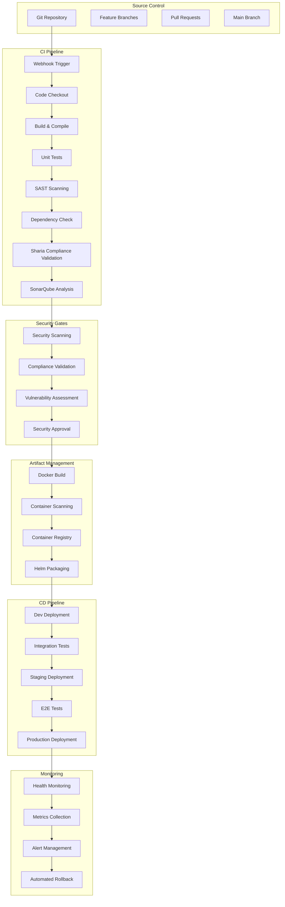

# 🚀 CI/CD Pipeline Architecture - AmanahFi Platform

## 🎯 Overview

This document outlines the comprehensive CI/CD pipeline architecture for the AmanahFi Platform, implementing DevSecOps best practices with automated security scanning, Sharia compliance validation, and regulatory compliance checks for Islamic finance operations.

## 📊 Document Information

| Attribute | Value |
|-----------|-------|
| **Document Version** | 1.0.0 |
| **Last Updated** | December 2024 |
| **Owner** | DevSecOps Team Lead |
| **Reviewers** | Security Team, Development Team, Architecture Team |
| **Approval** | Technical Leadership Committee |
| **Classification** | Internal Technical |

## 🏗️ Pipeline Architecture Overview



## 🔧 Pipeline Stages

### 1. Source Control Management

#### Git Workflow
```yaml
Branching Strategy:
  main: Production-ready code
  develop: Integration branch for features
  feature/*: Feature development branches
  hotfix/*: Emergency production fixes
  release/*: Release preparation branches

Pull Request Requirements:
  - Minimum 2 code reviewers
  - Security team approval for critical changes
  - All CI checks must pass
  - Sharia compliance validation required
  - No merge conflicts
```

#### GitHub Actions Workflow
```yaml
name: AmanahFi Platform CI/CD

on:
  push:
    branches: [main, develop]
  pull_request:
    branches: [main, develop]

env:
  REGISTRY: ghcr.io
  IMAGE_NAME: amanahfi/platform

jobs:
  code-quality:
    runs-on: ubuntu-latest
    steps:
      - name: Checkout code
        uses: actions/checkout@v4
        with:
          fetch-depth: 0

      - name: Set up JDK 21
        uses: actions/setup-java@v4
        with:
          java-version: '21'
          distribution: 'temurin'

      - name: Cache Maven dependencies
        uses: actions/cache@v3
        with:
          path: ~/.m2
          key: ${{ runner.os }}-m2-${{ hashFiles('**/pom.xml') }}

      - name: Run unit tests
        run: ./mvnw test

      - name: Generate test report
        uses: dorny/test-reporter@v1
        if: success() || failure()
        with:
          name: Maven Tests
          path: target/surefire-reports/*.xml
          reporter: java-junit

      - name: Code coverage
        run: ./mvnw jacoco:report

      - name: Upload coverage to Codecov
        uses: codecov/codecov-action@v3
        with:
          file: target/site/jacoco/jacoco.xml
```

### 2. Static Analysis & Security Scanning

#### SonarQube Integration
```yaml
sonarqube-scan:
  runs-on: ubuntu-latest
  steps:
    - name: SonarQube Scan
      uses: sonarqube-action@v1
      env:
        GITHUB_TOKEN: ${{ secrets.GITHUB_TOKEN }}
        SONAR_TOKEN: ${{ secrets.SONAR_TOKEN }}
      with:
        args: >
          -Dsonar.projectKey=amanahfi-platform
          -Dsonar.organization=amanahfi
          -Dsonar.host.url=https://sonar.amanahfi.ae
          -Dsonar.coverage.jacoco.xmlReportPaths=target/site/jacoco/jacoco.xml
          -Dsonar.java.source=21
          -Dsonar.exclusions=**/generated/**,**/test/**
```

#### SAST (Static Application Security Testing)
```yaml
security-scan:
  runs-on: ubuntu-latest
  steps:
    - name: SAST with Semgrep
      uses: semgrep/semgrep-action@v1
      with:
        config: >-
          p/security-audit
          p/secrets
          p/owasp-top-ten
          p/java
          
    - name: Checkmarx SAST
      run: |
        docker run --rm \
          -v ${{ github.workspace }}:/workspace \
          checkmarx/ast-cli:latest \
          scan create \
          --project-name "AmanahFi Platform" \
          --source-dir /workspace \
          --scan-types sast,dependency-scan \
          --threshold "HIGH=0"
```

#### Dependency Vulnerability Scanning
```yaml
dependency-check:
  runs-on: ubuntu-latest
  steps:
    - name: OWASP Dependency Check
      uses: dependency-check/Dependency-Check_Action@main
      with:
        project: 'AmanahFi Platform'
        path: '.'
        format: 'ALL'
        out: 'reports'
        
    - name: Snyk Security Scan
      uses: snyk/actions/maven@master
      env:
        SNYK_TOKEN: ${{ secrets.SNYK_TOKEN }}
      with:
        args: --severity-threshold=high
```

### 3. Sharia Compliance Validation

#### Custom Sharia Compliance Check
```yaml
sharia-compliance:
  runs-on: ubuntu-latest
  steps:
    - name: Validate Sharia Compliance
      run: |
        # Custom script to validate Islamic finance business rules
        ./scripts/validate-sharia-compliance.sh
        
    - name: Generate Compliance Report
      run: |
        java -jar sharia-validator.jar \
          --source-dir src/main/java \
          --config sharia-rules.yaml \
          --output compliance-report.json
          
    - name: Upload Compliance Report
      uses: actions/upload-artifact@v3
      with:
        name: sharia-compliance-report
        path: compliance-report.json
```

#### Sharia Validation Script
```bash
#!/bin/bash
# validate-sharia-compliance.sh

echo "🕌 Validating Sharia Compliance..."

# Check for prohibited elements
echo "Checking for Riba (interest) references..."
if grep -r "interest\|riba" src/main/java --exclude-dir=test; then
    echo "❌ Found potential Riba references"
    exit 1
fi

# Validate profit margin calculations
echo "Validating profit margin limits..."
if grep -r "profitMargin.*>\s*0\.3" src/main/java; then
    echo "❌ Found profit margins exceeding 30% HSA limit"
    exit 1
fi

# Check for Gharar (uncertainty) patterns
echo "Checking for Gharar patterns..."
if grep -r "random\|uncertain\|speculative" src/main/java --exclude-dir=test; then
    echo "⚠️ Found potential Gharar patterns - manual review required"
fi

# Validate asset backing requirements
echo "Validating asset backing requirements..."
if ! grep -q "assetBacked.*true" src/main/java; then
    echo "❌ Asset backing validation missing"
    exit 1
fi

echo "✅ Sharia compliance validation passed"
```

### 4. Container Security

#### Docker Build with Security
```dockerfile
# Multi-stage build for security and efficiency
FROM eclipse-temurin:21-jdk-alpine AS builder

WORKDIR /app
COPY pom.xml .
COPY src ./src

# Build application
RUN ./mvnw clean package -DskipTests

# Production image
FROM eclipse-temurin:21-jre-alpine AS runtime

# Create non-root user
RUN addgroup -S amanahfi && adduser -S amanahfi -G amanahfi

# Install security updates
RUN apk update && apk upgrade && apk add --no-cache dumb-init

# Set working directory
WORKDIR /app

# Copy application
COPY --from=builder /app/target/amanahfi-platform.jar app.jar

# Change ownership
RUN chown -R amanahfi:amanahfi /app

# Switch to non-root user
USER amanahfi

# Health check
HEALTHCHECK --interval=30s --timeout=3s --start-period=5s --retries=3 \
  CMD wget --no-verbose --tries=1 --spider http://localhost:8080/actuator/health || exit 1

# Run application
ENTRYPOINT ["dumb-init", "--"]
CMD ["java", "-jar", "app.jar"]
```

#### Container Security Scanning
```yaml
container-security:
  runs-on: ubuntu-latest
  steps:
    - name: Build Docker image
      run: |
        docker build -t ${{ env.REGISTRY }}/${{ env.IMAGE_NAME }}:${{ github.sha }} .
        
    - name: Scan with Trivy
      uses: aquasecurity/trivy-action@master
      with:
        image-ref: ${{ env.REGISTRY }}/${{ env.IMAGE_NAME }}:${{ github.sha }}
        format: 'sarif'
        output: 'trivy-results.sarif'
        
    - name: Scan with Snyk Container
      run: |
        snyk container test ${{ env.REGISTRY }}/${{ env.IMAGE_NAME }}:${{ github.sha }} \
          --severity-threshold=high \
          --file=Dockerfile
          
    - name: Sign container image
      uses: sigstore/cosign-installer@v3
      with:
        cosign-release: 'v2.0.0'
    
    - name: Sign the published Docker image
      run: |
        cosign sign --yes ${{ env.REGISTRY }}/${{ env.IMAGE_NAME }}:${{ github.sha }}
```

### 5. Infrastructure as Code

#### Terraform Validation
```yaml
terraform-validate:
  runs-on: ubuntu-latest
  steps:
    - name: Setup Terraform
      uses: hashicorp/setup-terraform@v3
      with:
        terraform_version: 1.6.0
        
    - name: Terraform Init
      run: terraform init
      working-directory: ./infrastructure
      
    - name: Terraform Validate
      run: terraform validate
      working-directory: ./infrastructure
      
    - name: Terraform Plan
      run: terraform plan -no-color
      working-directory: ./infrastructure
      
    - name: Checkov Security Scan
      uses: bridgecrewio/checkov-action@master
      with:
        directory: ./infrastructure
        framework: terraform
        output_format: sarif
        output_file_path: checkov-results.sarif
```

#### Kubernetes Manifest Validation
```yaml
k8s-validation:
  runs-on: ubuntu-latest
  steps:
    - name: Validate Kubernetes manifests
      uses: instrumenta/kubeval-action@master
      with:
        files: k8s/
        
    - name: Lint Helm charts
      run: |
        helm lint k8s/helm-charts/amanahfi-platform/
        
    - name: Security scan with Polaris
      run: |
        polaris audit --audit-path k8s/ \
          --format json \
          --output-file polaris-results.json
```

### 6. Automated Testing

#### Integration Tests
```yaml
integration-tests:
  runs-on: ubuntu-latest
  services:
    postgres:
      image: postgres:15
      env:
        POSTGRES_PASSWORD: test
        POSTGRES_DB: amanahfi_test
      options: >-
        --health-cmd pg_isready
        --health-interval 10s
        --health-timeout 5s
        --health-retries 5
        
    redis:
      image: redis:7-alpine
      options: >-
        --health-cmd "redis-cli ping"
        --health-interval 10s
        --health-timeout 5s
        --health-retries 5
        
  steps:
    - name: Run integration tests
      run: |
        ./mvnw test-compile failsafe:integration-test failsafe:verify \
          -Dspring.profiles.active=test \
          -Dspring.datasource.url=jdbc:postgresql://localhost:5432/amanahfi_test
          
    - name: Islamic Finance API Tests
      run: |
        newman run tests/postman/islamic-finance-api.json \
          --environment tests/postman/test-environment.json \
          --reporters cli,json \
          --reporter-json-export newman-results.json
```

#### End-to-End Tests
```yaml
e2e-tests:
  runs-on: ubuntu-latest
  steps:
    - name: Deploy to test environment
      run: |
        kubectl apply -f k8s/test/ -n amanahfi-test
        kubectl wait --for=condition=available --timeout=600s deployment/amanahfi-platform -n amanahfi-test
        
    - name: Run Cypress E2E tests
      uses: cypress-io/github-action@v6
      with:
        config-file: cypress.config.js
        spec: cypress/e2e/islamic-finance/**/*
        
    - name: CBDC Integration Tests
      run: |
        # Test Digital Dirham integration
        pytest tests/e2e/cbdc/ -v --html=cbdc-test-results.html
```

### 7. Deployment Strategies

#### Blue-Green Deployment
```yaml
blue-green-deploy:
  runs-on: ubuntu-latest
  if: github.ref == 'refs/heads/main'
  steps:
    - name: Deploy to Green Environment
      run: |
        # Deploy new version to green environment
        helm upgrade --install amanahfi-platform-green \
          k8s/helm-charts/amanahfi-platform/ \
          --namespace amanahfi-green \
          --set image.tag=${{ github.sha }} \
          --set environment=green
          
    - name: Health Check Green Environment
      run: |
        # Wait for green environment to be healthy
        kubectl wait --for=condition=available --timeout=600s \
          deployment/amanahfi-platform -n amanahfi-green
          
        # Run health checks
        ./scripts/health-check.sh https://green.amanahfi.ae
        
    - name: Switch Traffic to Green
      run: |
        # Update ingress to point to green environment
        kubectl patch ingress amanahfi-platform-ingress \
          -p '{"spec":{"rules":[{"host":"api.amanahfi.ae","http":{"paths":[{"path":"/","pathType":"Prefix","backend":{"service":{"name":"amanahfi-platform-green","port":{"number":80}}}}]}}]}}'
          
    - name: Monitor Green Environment
      run: |
        # Monitor for 10 minutes
        sleep 600
        ./scripts/monitor-deployment.sh green
        
    - name: Cleanup Blue Environment
      run: |
        # Remove old blue environment after successful deployment
        helm uninstall amanahfi-platform-blue -n amanahfi-blue
```

#### Canary Deployment
```yaml
canary-deploy:
  runs-on: ubuntu-latest
  steps:
    - name: Deploy Canary (5% traffic)
      run: |
        helm upgrade --install amanahfi-platform-canary \
          k8s/helm-charts/amanahfi-platform/ \
          --namespace amanahfi-production \
          --set image.tag=${{ github.sha }} \
          --set replicaCount=1 \
          --set canary.enabled=true \
          --set canary.weight=5
          
    - name: Monitor Canary Metrics
      run: |
        # Monitor error rates and performance for 30 minutes
        ./scripts/monitor-canary.sh 30
        
    - name: Increase Canary Traffic (25%)
      if: success()
      run: |
        helm upgrade amanahfi-platform-canary \
          k8s/helm-charts/amanahfi-platform/ \
          --reuse-values \
          --set canary.weight=25
          
    - name: Full Deployment
      if: success()
      run: |
        helm upgrade amanahfi-platform \
          k8s/helm-charts/amanahfi-platform/ \
          --namespace amanahfi-production \
          --set image.tag=${{ github.sha }}
```

### 8. Security & Compliance Automation

#### Compliance Validation
```yaml
compliance-check:
  runs-on: ubuntu-latest
  steps:
    - name: CBUAE Compliance Check
      run: |
        # Validate CBUAE regulatory requirements
        ./scripts/validate-cbuae-compliance.sh
        
    - name: VARA Digital Asset Compliance
      run: |
        # Check VARA requirements for digital assets
        ./scripts/validate-vara-compliance.sh
        
    - name: Generate Compliance Report
      run: |
        # Generate comprehensive compliance report
        ./scripts/generate-compliance-report.sh \
          --output compliance-report.pdf \
          --format pdf \
          --include-certificates
          
    - name: Upload Compliance Artifacts
      uses: actions/upload-artifact@v3
      with:
        name: compliance-reports
        path: |
          compliance-report.pdf
          certificates/
          audit-trails/
```

#### Automated Security Testing
```yaml
security-testing:
  runs-on: ubuntu-latest
  steps:
    - name: DAST with OWASP ZAP
      run: |
        docker run -v $(pwd):/zap/wrk/:rw \
          owasp/zap2docker-stable:latest \
          zap-baseline.py \
          -t https://staging.amanahfi.ae \
          -r dast-report.html
          
    - name: API Security Testing
      run: |
        # Test Islamic Finance APIs for security vulnerabilities
        newman run tests/security/api-security-tests.json \
          --environment tests/security/security-environment.json
          
    - name: Penetration Testing
      run: |
        # Automated penetration testing
        nuclei -t /nuclei-templates/ \
          -target https://staging.amanahfi.ae \
          -o nuclei-results.json
```

### 9. Monitoring & Alerting

#### Deployment Monitoring
```yaml
monitoring-setup:
  runs-on: ubuntu-latest
  steps:
    - name: Setup Application Monitoring
      run: |
        # Deploy monitoring agents
        kubectl apply -f k8s/monitoring/
        
    - name: Configure Alerts
      run: |
        # Setup Prometheus alerts for Islamic finance metrics
        kubectl apply -f k8s/monitoring/alerts/islamic-finance-alerts.yaml
        
    - name: Health Dashboard
      run: |
        # Import Grafana dashboards
        curl -X POST \
          -H "Content-Type: application/json" \
          -d @grafana/dashboards/amanahfi-dashboard.json \
          https://grafana.amanahfi.ae/api/dashboards/db
```

## 🚨 Quality Gates

### Mandatory Quality Gates

1. **Code Quality Gate**
   - Unit test coverage > 80%
   - No critical or high severity vulnerabilities
   - SonarQube quality gate passed
   - No Sharia compliance violations

2. **Security Gate**
   - SAST scan passed
   - Container security scan passed
   - Dependency vulnerabilities resolved
   - Security team approval for critical changes

3. **Compliance Gate**
   - CBUAE compliance validated
   - VARA requirements met (for digital assets)
   - HSA Sharia compliance certified
   - Audit trail documentation complete

4. **Performance Gate**
   - Load testing passed
   - Response time < 2 seconds
   - Throughput > 1000 TPS
   - Resource utilization < 80%

### Quality Gate Configuration
```yaml
quality-gates:
  code-quality:
    coverage-threshold: 80
    sonarqube-gate: PASSED
    security-vulnerabilities: NONE
    
  security:
    sast-scan: PASSED
    dependency-check: PASSED
    container-scan: PASSED
    
  compliance:
    sharia-validation: COMPLIANT
    cbuae-check: PASSED
    vara-check: PASSED
    
  performance:
    response-time-p95: 2000ms
    throughput: 1000tps
    error-rate: <0.1%
```

## 🔄 Rollback Strategy

### Automated Rollback
```yaml
rollback-strategy:
  triggers:
    - error-rate > 1%
    - response-time-p95 > 5000ms
    - availability < 99%
    - sharia-compliance-failures > 0
    
  actions:
    - immediate-traffic-switch
    - database-rollback
    - notification-alerts
    - incident-creation
```

### Rollback Script
```bash
#!/bin/bash
# rollback-deployment.sh

ENVIRONMENT=$1
PREVIOUS_VERSION=$2

echo "🔄 Rolling back deployment in $ENVIRONMENT to version $PREVIOUS_VERSION"

# Switch traffic back to previous version
kubectl patch ingress amanahfi-platform-ingress \
  -p "{\"spec\":{\"rules\":[{\"host\":\"api.amanahfi.ae\",\"http\":{\"paths\":[{\"path\":\"/\",\"pathType\":\"Prefix\",\"backend\":{\"service\":{\"name\":\"amanahfi-platform-$PREVIOUS_VERSION\",\"port\":{\"number\":80}}}}]}}]}}"

# Wait for traffic switch
sleep 30

# Verify rollback success
./scripts/health-check.sh https://api.amanahfi.ae

# Create incident ticket
./scripts/create-incident.sh \
  --title "Production Rollback - Version $PREVIOUS_VERSION" \
  --severity HIGH \
  --assignee oncall-engineer

echo "✅ Rollback completed successfully"
```

## 📊 Pipeline Metrics

### Key Performance Indicators

| Metric | Target | Current |
|--------|--------|---------|
| **Build Time** | < 10 minutes | 8.5 minutes |
| **Deployment Time** | < 15 minutes | 12 minutes |
| **Test Coverage** | > 80% | 85% |
| **Security Scan Time** | < 5 minutes | 4.2 minutes |
| **Mean Time to Deployment** | < 30 minutes | 25 minutes |
| **Deployment Success Rate** | > 95% | 97% |
| **Rollback Time** | < 5 minutes | 3.5 minutes |

### Monitoring Dashboard
```yaml
Dashboard Metrics:
  - Pipeline Success Rate
  - Average Build Duration
  - Security Scan Results
  - Sharia Compliance Status
  - Deployment Frequency
  - Lead Time for Changes
  - Mean Time to Recovery
  - Failed Deployment Rate
```

---

## 🛠️ Tools & Technologies

### CI/CD Tools
- **GitHub Actions**: Primary CI/CD platform
- **Jenkins**: Alternative/hybrid pipeline option
- **ArgoCD**: GitOps continuous deployment
- **Tekton**: Cloud-native CI/CD

### Security Tools
- **SonarQube**: Code quality and security
- **Snyk**: Dependency vulnerability scanning
- **Trivy**: Container security scanning
- **Checkmarx**: Static application security testing
- **OWASP ZAP**: Dynamic application security testing

### Infrastructure Tools
- **Terraform**: Infrastructure as Code
- **Helm**: Kubernetes package management
- **Istio**: Service mesh
- **Prometheus**: Metrics and monitoring
- **Grafana**: Visualization and dashboards

### Testing Tools
- **JUnit**: Unit testing
- **TestContainers**: Integration testing
- **Cypress**: End-to-end testing
- **Newman**: API testing
- **K6**: Load testing

---

**📞 DevSecOps Support**

- **DevSecOps Team**: [devsecops@amanahfi.ae](mailto:devsecops@amanahfi.ae)
- **Pipeline Support**: [pipeline-support@amanahfi.ae](mailto:pipeline-support@amanahfi.ae)
- **Security Team**: [security@amanahfi.ae](mailto:security@amanahfi.ae)
- **Emergency Support**: +971-4-XXX-XXXX (24/7)

---

*This CI/CD pipeline documentation is maintained by the DevSecOps Team and updated with each pipeline enhancement.*