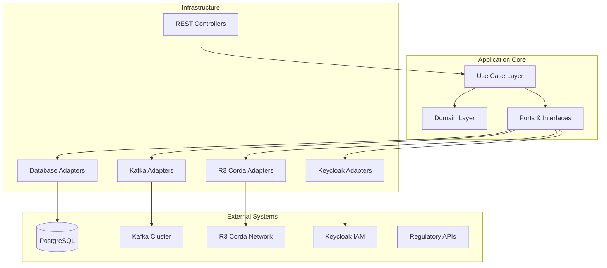

# 💻 Development Squad Guide - AmanahFi Platform

## 🎯 Overview

This comprehensive guide provides the development teams with essential knowledge, coding standards, architectural patterns, and best practices for building and maintaining the AmanahFi Platform's Islamic finance and CBDC capabilities.

## 📊 Document Information

| Attribute | Value |
|-----------|-------|
| **Document Version** | 1.0.0 |
| **Last Updated** | December 2024 |
| **Owner** | Lead Software Architect |
| **Reviewers** | Senior Developers, Architecture Team, Technical Leads |
| **Approval** | Chief Technology Officer (CTO) |
| **Classification** | Internal Development Documentation |

## 🏗️ Architecture Overview for Developers

### Hexagonal Architecture Implementation



### Domain-Driven Design Structure

```
src/main/java/ae/amanahfi/platform/
├── domain/
│   ├── islamic-finance/          # Islamic Finance Bounded Context
│   │   ├── murabaha/
│   │   │   ├── MurabahaFinancing.java          # Aggregate Root
│   │   │   ├── MurabahaRepository.java         # Repository Interface
│   │   │   ├── MurabahaCreatedEvent.java       # Domain Event
│   │   │   └── MurabahaService.java            # Domain Service
│   │   ├── musharakah/
│   │   ├── ijarah/
│   │   └── shared/
│   │       ├── Money.java                      # Value Object
│   │       ├── ShariaCompliance.java           # Value Object
│   │       └── FinancingTerms.java             # Value Object
│   ├── customer/                 # Customer Bounded Context
│   ├── payment/                  # Payment Bounded Context
│   └── cbdc/                     # CBDC Bounded Context
├── application/
│   ├── port/
│   │   ├── in/                   # Driving Ports (Use Cases)
│   │   └── out/                  # Driven Ports (Infrastructure)
│   └── service/                  # Application Services
├── infrastructure/
│   ├── adapter/
│   │   ├── in/                   # Incoming Adapters (Controllers)
│   │   └── out/                  # Outgoing Adapters (Repositories)
│   ├── configuration/            # Spring Configuration
│   └── security/                 # Security Implementation
└── shared/
    ├── exception/                # Common Exceptions
    ├── util/                     # Utilities
    └── event/                    # Event Infrastructure
```

## 🕌 Islamic Finance Development Guide

### 1. Murabaha Implementation

#### Domain Model
```java
@Entity
@Table(name = "murabaha_financing")
@AggregateRoot
public class MurabahaFinancing {
    
    @EmbeddedId
    private FinancingId financingId;
    
    @Embedded
    private CustomerProfile customerProfile;
    
    @Embedded
    private AssetDetails assetDetails;
    
    @Embedded
    private FinancingTerms financingTerms;
    
    @Embedded
    private ShariaCompliance shariaCompliance;
    
    @Enumerated(EnumType.STRING)
    private FinancingStatus status;
    
    @Embedded
    private AuditTrail auditTrail;
    
    // Private constructor for JPA
    protected MurabahaFinancing() {}
    
    // Factory method for creation
    public static MurabahaFinancing create(
            CustomerProfile customerProfile,
            AssetDetails assetDetails,
            FinancingTerms financingTerms) {
        
        // Business rule validation
        validateMurabahaBusinessRules(customerProfile, assetDetails, financingTerms);
        
        MurabahaFinancing financing = new MurabahaFinancing();
        financing.financingId = FinancingId.generate();
        financing.customerProfile = customerProfile;
        financing.assetDetails = assetDetails;
        financing.financingTerms = financingTerms;
        financing.status = FinancingStatus.PENDING_APPROVAL;
        financing.auditTrail = AuditTrail.create();
        
        // Validate Sharia compliance
        financing.shariaCompliance = ShariaCompliance.validate(assetDetails, financingTerms);
        
        // Register domain event
        financing.registerEvent(new MurabahaCreatedEvent(
            financing.financingId,
            financing.customerProfile.getCustomerId(),
            financing.assetDetails,
            financing.financingTerms,
            financing.shariaCompliance
        ));
        
        return financing;
    }
    
    public void approve(ShariaBoard shariaBoard, EmployeeId approvedBy) {
        if (!shariaCompliance.isCompliant()) {
            throw new ShariaComplianceViolationException(
                "Cannot approve non-Sharia compliant Murabaha financing"
            );
        }
        
        if (status != FinancingStatus.PENDING_APPROVAL) {
            throw new InvalidFinancingStatusException(
                "Cannot approve financing in status: " + status
            );
        }
        
        this.status = FinancingStatus.APPROVED;
        this.auditTrail = auditTrail.addEntry(
            AuditAction.APPROVED,
            approvedBy,
            "Murabaha financing approved by Sharia board: " + shariaBoard
        );
        
        // Register domain event
        this.registerEvent(new MurabahaApprovedEvent(
            this.financingId,
            shariaBoard,
            approvedBy,
            Instant.now()
        ));
    }
    
    public PaymentSchedule generatePaymentSchedule() {
        if (status != FinancingStatus.APPROVED) {
            throw new InvalidFinancingStatusException(
                "Cannot generate payment schedule for non-approved financing"
            );
        }
        
        return PaymentScheduleGenerator.generateMurabahaSchedule(
            financingTerms.getTotalAmount(),
            financingTerms.getMaturityDate(),
            financingTerms.getPaymentFrequency()
        );
    }
    
    private static void validateMurabahaBusinessRules(
            CustomerProfile customer,
            AssetDetails asset,
            FinancingTerms terms) {
        
        // Rule 1: Asset must be Halal
        if (!asset.isHalal()) {
            throw new NonHalalAssetException(
                "Asset must be Halal for Islamic financing: " + asset.getDescription()
            );
        }
        
        // Rule 2: Asset must have physical existence
        if (!asset.hasPhysicalExistence()) {
            throw new InvalidAssetException(
                "Asset must have physical existence for Murabaha"
            );
        }
        
        // Rule 3: Profit margin must not exceed HSA limits (30%)
        BigDecimal maxProfitMargin = new BigDecimal("0.30");
        if (terms.getProfitMargin().compareTo(maxProfitMargin) > 0) {
            throw new ExcessiveProfitMarginException(
                String.format("Profit margin %.2f%% exceeds HSA maximum of 30%%",
                    terms.getProfitMargin().multiply(BigDecimal.valueOf(100)))
            );
        }
        
        // Rule 4: Customer must be eligible
        if (!customer.isEligibleForIslamicFinancing()) {
            throw new CustomerIneligibleException(
                "Customer is not eligible for Islamic financing"
            );
        }
        
        // Rule 5: Financing amount must not exceed customer's limit
        if (terms.getTotalAmount().compareTo(customer.getMaxFinancingLimit()) > 0) {
            throw new ExcessiveFinancingAmountException(
                "Financing amount exceeds customer's maximum limit"
            );
        }
    }
}
```

#### Value Objects
```java
@Embeddable
public class AssetDetails {
    
    @Column(name = "asset_description", nullable = false)
    private String description;
    
    @Column(name = "asset_category", nullable = false)
    @Enumerated(EnumType.STRING)
    private AssetCategory category;
    
    @Embedded
    @AttributeOverrides({
        @AttributeOverride(name = "amount", column = @Column(name = "asset_cost_amount")),
        @AttributeOverride(name = "currency", column = @Column(name = "asset_cost_currency"))
    })
    private Money cost;
    
    @Column(name = "is_halal", nullable = false)
    private boolean halal;
    
    @Column(name = "has_physical_existence", nullable = false)
    private boolean physicalExistence;
    
    @Embedded
    private SupplierDetails supplier;
    
    @Type(JsonType.class)
    @Column(name = "asset_specifications", columnDefinition = "jsonb")
    private Map<String, Object> specifications;
    
    // Private constructor for JPA
    protected AssetDetails() {}
    
    private AssetDetails(String description, AssetCategory category, Money cost,
                        boolean halal, boolean physicalExistence,
                        SupplierDetails supplier, Map<String, Object> specifications) {
        this.description = description;
        this.category = category;
        this.cost = cost;
        this.halal = halal;
        this.physicalExistence = physicalExistence;
        this.supplier = supplier;
        this.specifications = specifications != null ? 
            Map.copyOf(specifications) : Map.of();
    }
    
    public static AssetDetails of(String description, AssetCategory category,
                                 Money cost, SupplierDetails supplier,
                                 Map<String, Object> specifications) {
        
        // Validate inputs
        Objects.requireNonNull(description, "Asset description cannot be null");
        Objects.requireNonNull(category, "Asset category cannot be null");
        Objects.requireNonNull(cost, "Asset cost cannot be null");
        Objects.requireNonNull(supplier, "Supplier details cannot be null");
        
        if (description.trim().isEmpty()) {
            throw new IllegalArgumentException("Asset description cannot be empty");
        }
        
        if (cost.isNegativeOrZero()) {
            throw new IllegalArgumentException("Asset cost must be positive");
        }
        
        // Determine if asset is Halal based on category and specifications
        boolean isHalal = determineHalalStatus(category, specifications);
        
        // Determine physical existence
        boolean hasPhysicalExistence = determinePhysicalExistence(category);
        
        return new AssetDetails(
            description.trim(),
            category,
            cost,
            isHalal,
            hasPhysicalExistence,
            supplier,
            specifications
        );
    }
    
    private static boolean determineHalalStatus(AssetCategory category,
                                              Map<String, Object> specifications) {
        // Implement Halal validation logic based on Islamic principles
        switch (category) {
            case VEHICLE:
                return true; // Vehicles are generally Halal
            case REAL_ESTATE:
                return !isUsedForHaramActivities(specifications);
            case MACHINERY:
                return !isUsedForHaramProduction(specifications);
            case COMMODITY:
                return !isHaramCommodity(specifications);
            default:
                return false; // Conservative approach for unknown categories
        }
    }
    
    private static boolean isUsedForHaramActivities(Map<String, Object> specifications) {
        String usage = (String) specifications.get("primaryUsage");
        if (usage == null) return false;
        
        Set<String> haramUsages = Set.of(
            "alcohol_production", "gambling", "interest_based_banking",
            "tobacco_production", "arms_manufacturing"
        );
        
        return haramUsages.contains(usage.toLowerCase());
    }
    
    // Getters
    public String getDescription() { return description; }
    public AssetCategory getCategory() { return category; }
    public Money getCost() { return cost; }
    public boolean isHalal() { return halal; }
    public boolean hasPhysicalExistence() { return physicalExistence; }
    public SupplierDetails getSupplier() { return supplier; }
    public Map<String, Object> getSpecifications() { return Map.copyOf(specifications); }
}
```

#### Application Service
```java
@Service
@Transactional
@Slf4j
public class MurabahaApplicationService implements CreateMurabahaUseCase {
    
    private final MurabahaRepository murabahaRepository;
    private final CustomerRepository customerRepository;
    private final ShariaComplianceService shariaService;
    private final DomainEventPublisher eventPublisher;
    private final MurabahaMapper murabahaMapper;
    
    public MurabahaApplicationService(
            MurabahaRepository murabahaRepository,
            CustomerRepository customerRepository,
            ShariaComplianceService shariaService,
            DomainEventPublisher eventPublisher,
            MurabahaMapper murabahaMapper) {
        this.murabahaRepository = murabahaRepository;
        this.customerRepository = customerRepository;
        this.shariaService = shariaService;
        this.eventPublisher = eventPublisher;
        this.murabahaMapper = murabahaMapper;
    }
    
    @Override
    public MurabahaFinancingResponse createMurabaha(CreateMurabahaCommand command) {
        log.info("Creating Murabaha financing for customer: {}", 
                command.getCustomerId());
        
        try {
            // Validate command
            validateCreateMurabahaCommand(command);
            
            // Load customer
            Customer customer = customerRepository
                .findById(command.getCustomerId())
                .orElseThrow(() -> new CustomerNotFoundException(
                    "Customer not found: " + command.getCustomerId()));
            
            // Map command to domain objects
            CustomerProfile customerProfile = murabahaMapper
                .toCustomerProfile(customer);
            AssetDetails assetDetails = murabahaMapper
                .toAssetDetails(command.getAssetDetails());
            FinancingTerms financingTerms = murabahaMapper
                .toFinancingTerms(command.getFinancingTerms());
            
            // Create domain aggregate
            MurabahaFinancing murabaha = MurabahaFinancing.create(
                customerProfile,
                assetDetails,
                financingTerms
            );
            
            // Additional Sharia validation
            ShariaValidationResult shariaResult = shariaService
                .validateMurabahaCompliance(murabaha);
            
            if (!shariaResult.isCompliant()) {
                log.warn("Sharia compliance validation failed for Murabaha: {}",
                        shariaResult.getViolations());
                throw new ShariaComplianceViolationException(
                    "Murabaha does not comply with Sharia principles",
                    shariaResult.getViolations()
                );
            }
            
            // Save to repository
            MurabahaFinancing savedMurabaha = murabahaRepository.save(murabaha);
            
            // Publish domain events
            eventPublisher.publishAll(savedMurabaha.getUncommittedEvents());
            savedMurabaha.markEventsAsCommitted();
            
            log.info("Murabaha financing created successfully: {}", 
                    savedMurabaha.getFinancingId());
            
            // Map to response
            return murabahaMapper.toMurabahaFinancingResponse(savedMurabaha);
            
        } catch (Exception e) {
            log.error("Failed to create Murabaha financing for customer: {}", 
                     command.getCustomerId(), e);
            throw e;
        }
    }
    
    @Override
    public MurabahaFinancingResponse approveMurabaha(ApproveMurabahaCommand command) {
        log.info("Approving Murabaha financing: {}", command.getFinancingId());
        
        try {
            // Load aggregate
            MurabahaFinancing murabaha = murabahaRepository
                .findById(command.getFinancingId())
                .orElseThrow(() -> new MurabahaNotFoundException(
                    "Murabaha financing not found: " + command.getFinancingId()));
            
            // Approve financing
            murabaha.approve(
                command.getShariaBoard(),
                command.getApprovedBy()
            );
            
            // Save changes
            MurabahaFinancing savedMurabaha = murabahaRepository.save(murabaha);
            
            // Publish events
            eventPublisher.publishAll(savedMurabaha.getUncommittedEvents());
            savedMurabaha.markEventsAsCommitted();
            
            log.info("Murabaha financing approved successfully: {}", 
                    command.getFinancingId());
            
            return murabahaMapper.toMurabahaFinancingResponse(savedMurabaha);
            
        } catch (Exception e) {
            log.error("Failed to approve Murabaha financing: {}", 
                     command.getFinancingId(), e);
            throw e;
        }
    }
    
    private void validateCreateMurabahaCommand(CreateMurabahaCommand command) {
        Objects.requireNonNull(command, "Command cannot be null");
        Objects.requireNonNull(command.getCustomerId(), 
                              "Customer ID cannot be null");
        Objects.requireNonNull(command.getAssetDetails(), 
                              "Asset details cannot be null");
        Objects.requireNonNull(command.getFinancingTerms(), 
                              "Financing terms cannot be null");
        
        // Additional validation logic
        if (command.getAssetDetails().getCost().isNegativeOrZero()) {
            throw new InvalidCommandException("Asset cost must be positive");
        }
        
        if (command.getFinancingTerms().getMaturityDate().isBefore(LocalDate.now())) {
            throw new InvalidCommandException("Maturity date cannot be in the past");
        }
    }
}
```

### 2. CBDC Integration Development

#### CBDC Transaction Model
```java
@Entity
@Table(name = "cbdc_transactions")
public class CBDCTransaction {
    
    @Id
    private CBDCTransactionId transactionId;
    
    @Column(name = "blockchain_hash", nullable = false, unique = true)
    private String blockchainHash;
    
    @Column(name = "block_number")
    private Long blockNumber;
    
    @Enumerated(EnumType.STRING)
    @Column(name = "transaction_type", nullable = false)
    private CBDCTransactionType transactionType;
    
    @Embedded
    @AttributeOverrides({
        @AttributeOverride(name = "amount", column = @Column(name = "amount")),
        @AttributeOverride(name = "currency", column = @Column(name = "currency_code"))
    })
    private Money amount;
    
    @Embedded
    private CBDCWalletDetails senderWallet;
    
    @Embedded
    private CBDCWalletDetails receiverWallet;
    
    @Enumerated(EnumType.STRING)
    @Column(name = "status", nullable = false)
    private CBDCTransactionStatus status;
    
    @Column(name = "confirmation_count")
    private Integer confirmationCount = 0;
    
    @Embedded
    private TransactionFees fees;
    
    @Column(name = "settled_at")
    private Instant settledAt;
    
    @Embedded
    private AuditTrail auditTrail;
    
    // Factory method for R3 Corda transactions
    public static CBDCTransaction createForDigitalDirham(
            Money amount,
            CBDCWalletDetails senderWallet,
            CBDCWalletDetails receiverWallet,
            String purpose) {
        
        validateCBDCTransactionInputs(amount, senderWallet, receiverWallet);
        
        CBDCTransaction transaction = new CBDCTransaction();
        transaction.transactionId = CBDCTransactionId.generate();
        transaction.transactionType = CBDCTransactionType.DIGITAL_DIRHAM_TRANSFER;
        transaction.amount = amount;
        transaction.senderWallet = senderWallet;
        transaction.receiverWallet = receiverWallet;
        transaction.status = CBDCTransactionStatus.PENDING;
        transaction.auditTrail = AuditTrail.create();
        
        // Register domain event
        transaction.registerEvent(new CBDCTransactionInitiatedEvent(
            transaction.transactionId,
            transaction.amount,
            transaction.senderWallet,
            transaction.receiverWallet,
            purpose
        ));
        
        return transaction;
    }
    
    public void confirmOnBlockchain(String blockchainHash, Long blockNumber) {
        if (status != CBDCTransactionStatus.PENDING) {
            throw new InvalidTransactionStatusException(
                "Cannot confirm transaction in status: " + status
            );
        }
        
        this.blockchainHash = blockchainHash;
        this.blockNumber = blockNumber;
        this.status = CBDCTransactionStatus.CONFIRMED;
        this.confirmationCount = 1;
        
        this.auditTrail = auditTrail.addEntry(
            AuditAction.CONFIRMED,
            SystemUser.BLOCKCHAIN_NODE,
            "Transaction confirmed on blockchain block: " + blockNumber
        );
        
        // Register domain event
        this.registerEvent(new CBDCTransactionConfirmedEvent(
            this.transactionId,
            this.blockchainHash,
            this.blockNumber
        ));
    }
    
    public void settle() {
        if (status != CBDCTransactionStatus.CONFIRMED) {
            throw new InvalidTransactionStatusException(
                "Cannot settle transaction in status: " + status
            );
        }
        
        if (confirmationCount < getRequiredConfirmations()) {
            throw new InsufficientConfirmationsException(
                String.format("Transaction requires %d confirmations, has %d",
                    getRequiredConfirmations(), confirmationCount)
            );
        }
        
        this.status = CBDCTransactionStatus.SETTLED;
        this.settledAt = Instant.now();
        
        this.auditTrail = auditTrail.addEntry(
            AuditAction.SETTLED,
            SystemUser.SETTLEMENT_SERVICE,
            "Transaction settled successfully"
        );
        
        // Register domain event
        this.registerEvent(new CBDCTransactionSettledEvent(
            this.transactionId,
            this.settledAt
        ));
    }
    
    private static void validateCBDCTransactionInputs(
            Money amount,
            CBDCWalletDetails senderWallet,
            CBDCWalletDetails receiverWallet) {
        
        Objects.requireNonNull(amount, "Transaction amount cannot be null");
        Objects.requireNonNull(senderWallet, "Sender wallet cannot be null");
        Objects.requireNonNull(receiverWallet, "Receiver wallet cannot be null");
        
        if (amount.isNegativeOrZero()) {
            throw new InvalidTransactionAmountException(
                "Transaction amount must be positive"
            );
        }
        
        if (senderWallet.equals(receiverWallet)) {
            throw new InvalidTransactionException(
                "Sender and receiver wallets cannot be the same"
            );
        }
        
        // Validate currency is supported CBDC
        if (!isSupportedCBDCCurrency(amount.getCurrency())) {
            throw new UnsupportedCurrencyException(
                "Currency not supported: " + amount.getCurrency()
            );
        }
    }
    
    private static boolean isSupportedCBDCCurrency(Currency currency) {
        return Set.of("AED-CBDC", "SAR-CBDC", "QAR-CBDC", "KWD-CBDC")
                 .contains(currency.getCurrencyCode());
    }
    
    private int getRequiredConfirmations() {
        // Different confirmation requirements based on amount
        if (amount.isGreaterThan(Money.of("100000", "AED-CBDC"))) {
            return 6; // High value transactions
        } else if (amount.isGreaterThan(Money.of("10000", "AED-CBDC"))) {
            return 3; // Medium value transactions
        } else {
            return 1; // Low value transactions
        }
    }
}
```

#### R3 Corda Integration Service
```java
@Service
@Slf4j
public class R3CordaIntegrationService implements CBDCTransactionPort {
    
    private final CordaRPCConnection cordaConnection;
    private final CBDCTransactionRepository transactionRepository;
    private final DomainEventPublisher eventPublisher;
    
    public R3CordaIntegrationService(
            CordaRPCConnection cordaConnection,
            CBDCTransactionRepository transactionRepository,
            DomainEventPublisher eventPublisher) {
        this.cordaConnection = cordaConnection;
        this.transactionRepository = transactionRepository;
        this.eventPublisher = eventPublisher;
    }
    
    @Override
    public CompletableFuture<CBDCTransactionResult> submitTransaction(
            CBDCTransactionCommand command) {
        
        log.info("Submitting CBDC transaction to R3 Corda network: {}", 
                command.getTransactionId());
        
        return CompletableFuture.supplyAsync(() -> {
            try {
                // Create domain transaction
                CBDCTransaction transaction = CBDCTransaction.createForDigitalDirham(
                    command.getAmount(),
                    command.getSenderWallet(),
                    command.getReceiverWallet(),
                    command.getPurpose()
                );
                
                // Save initial state
                transactionRepository.save(transaction);
                
                // Submit to Corda network
                DigitalDirhamTransferFlow.Initiator flow = 
                    new DigitalDirhamTransferFlow.Initiator(
                        mapToCordaAmount(command.getAmount()),
                        mapToCordaParty(command.getReceiverWallet()),
                        command.getPurpose()
                    );
                
                CordaFuture<SignedTransaction> cordaFuture = cordaConnection
                    .getProxy()
                    .startFlowDynamic(DigitalDirhamTransferFlow.Initiator.class)
                    .getReturnValue();
                
                // Wait for Corda transaction completion
                SignedTransaction signedTx = cordaFuture.get(30, TimeUnit.SECONDS);
                
                // Update transaction with blockchain details
                transaction.confirmOnBlockchain(
                    signedTx.getId().toString(),
                    getCurrentBlockHeight()
                );
                
                // Check for sufficient confirmations and settle
                if (hasRequiredConfirmations(signedTx)) {
                    transaction.settle();
                }
                
                // Save updated state
                transactionRepository.save(transaction);
                
                // Publish events
                eventPublisher.publishAll(transaction.getUncommittedEvents());
                transaction.markEventsAsCommitted();
                
                log.info("CBDC transaction submitted successfully: {}", 
                        transaction.getTransactionId());
                
                return CBDCTransactionResult.builder()
                    .transactionId(transaction.getTransactionId())
                    .blockchainHash(transaction.getBlockchainHash())
                    .status(transaction.getStatus())
                    .build();
                
            } catch (Exception e) {
                log.error("Failed to submit CBDC transaction: {}", 
                         command.getTransactionId(), e);
                throw new CBDCTransactionException(
                    "Failed to submit CBDC transaction", e
                );
            }
        }, cordaExecutor);
    }
    
    @Scheduled(fixedRate = 30000) // Every 30 seconds
    public void checkPendingTransactions() {
        List<CBDCTransaction> pendingTransactions = transactionRepository
            .findByStatus(CBDCTransactionStatus.CONFIRMED);
            
        for (CBDCTransaction transaction : pendingTransactions) {
            try {
                // Check current confirmation count
                int currentConfirmations = getCurrentConfirmations(
                    transaction.getBlockchainHash()
                );
                
                transaction.updateConfirmationCount(currentConfirmations);
                
                // Settle if sufficient confirmations
                if (currentConfirmations >= transaction.getRequiredConfirmations()) {
                    transaction.settle();
                    
                    // Publish settlement event
                    eventPublisher.publish(new CBDCTransactionSettledEvent(
                        transaction.getTransactionId(),
                        transaction.getSettledAt()
                    ));
                }
                
                transactionRepository.save(transaction);
                
            } catch (Exception e) {
                log.error("Error checking transaction confirmations: {}", 
                         transaction.getTransactionId(), e);
            }
        }
    }
    
    private Amount<Currency> mapToCordaAmount(Money money) {
        // Convert our Money value object to Corda Amount
        return Amount.fromDecimal(
            money.getAmount(),
            Currency.getInstance(money.getCurrency().getCurrencyCode())
        );
    }
    
    private Party mapToCordaParty(CBDCWalletDetails wallet) {
        // Resolve Corda party from wallet details
        return cordaConnection.getProxy()
            .wellKnownPartyFromX500Name(
                CordaX500Name.parse(wallet.getPartyName())
            );
    }
}
```

## 🔧 Development Standards & Practices

### 1. Coding Standards

#### Java Code Style
```java
// Class naming: PascalCase
public class MurabahaFinancingService {
    
    // Constants: UPPER_SNAKE_CASE
    private static final BigDecimal MAX_PROFIT_MARGIN = new BigDecimal("0.30");
    private static final String SHARIA_COMPLIANT_FLAG = "SHARIA_COMPLIANT";
    
    // Fields: camelCase with descriptive names
    private final MurabahaRepository murabahaRepository;
    private final ShariaComplianceValidator shariaValidator;
    
    // Methods: camelCase with verb + noun pattern
    public MurabahaFinancing createMurabahaFinancing(CreateMurabahaCommand command) {
        // Method implementation
    }
    
    public boolean validateShariaCompliance(FinancingDetails details) {
        // Validation logic
    }
    
    // Private methods: camelCase with descriptive names
    private void validateBusinessRules(FinancingTerms terms) {
        // Validation implementation
    }
}
```

#### Exception Handling
```java
// Domain-specific exceptions
public class ShariaComplianceViolationException extends DomainException {
    
    private final List<ShariaViolation> violations;
    
    public ShariaComplianceViolationException(String message, 
                                             List<ShariaViolation> violations) {
        super(message);
        this.violations = List.copyOf(violations);
    }
    
    public List<ShariaViolation> getViolations() {
        return violations;
    }
}

// Application service exception handling
@Service
public class MurabahaApplicationService {
    
    public MurabahaFinancingResponse createMurabaha(CreateMurabahaCommand command) {
        try {
            // Business logic
            return createMurabahaFinancing(command);
            
        } catch (ShariaComplianceViolationException e) {
            log.warn("Sharia compliance violation: {}", e.getMessage());
            throw new ApplicationException(
                "Cannot create Murabaha due to Sharia compliance issues",
                ErrorCode.SHARIA_COMPLIANCE_VIOLATION,
                e.getViolations()
            );
        } catch (CustomerNotFoundException e) {
            log.warn("Customer not found: {}", command.getCustomerId());
            throw new ApplicationException(
                "Customer not found",
                ErrorCode.CUSTOMER_NOT_FOUND,
                command.getCustomerId()
            );
        } catch (Exception e) {
            log.error("Unexpected error creating Murabaha", e);
            throw new ApplicationException(
                "Internal system error",
                ErrorCode.INTERNAL_ERROR
            );
        }
    }
}
```

### 2. Testing Guidelines

#### Unit Testing
```java
@ExtendWith(MockitoExtension.class)
class MurabahaFinancingTest {
    
    @Mock
    private ShariaComplianceService shariaService;
    
    @Mock
    private CustomerRepository customerRepository;
    
    @InjectMocks
    private MurabahaApplicationService murabahaService;
    
    @Test
    @DisplayName("Should create Murabaha financing when all conditions are met")
    void shouldCreateMurabahaFinancing_WhenAllConditionsMet() {
        // Given
        CreateMurabahaCommand command = createValidMurabahaCommand();
        Customer customer = createValidCustomer();
        ShariaValidationResult shariaResult = ShariaValidationResult.compliant();
        
        when(customerRepository.findById(command.getCustomerId()))
            .thenReturn(Optional.of(customer));
        when(shariaService.validateMurabahaCompliance(any()))
            .thenReturn(shariaResult);
        
        // When
        MurabahaFinancingResponse response = murabahaService.createMurabaha(command);
        
        // Then
        assertThat(response).isNotNull();
        assertThat(response.getFinancingId()).isNotNull();
        assertThat(response.getStatus()).isEqualTo(FinancingStatus.PENDING_APPROVAL);
        assertThat(response.getShariaCompliance().isCompliant()).isTrue();
        
        verify(customerRepository).findById(command.getCustomerId());
        verify(shariaService).validateMurabahaCompliance(any());
    }
    
    @Test
    @DisplayName("Should throw exception when profit margin exceeds HSA limit")
    void shouldThrowException_WhenProfitMarginExceedsLimit() {
        // Given
        CreateMurabahaCommand command = createMurabahaCommandWithExcessiveProfit();
        
        // When & Then
        assertThatThrownBy(() -> murabahaService.createMurabaha(command))
            .isInstanceOf(ShariaComplianceViolationException.class)
            .hasMessageContaining("Profit margin exceeds HSA maximum");
    }
    
    @Test
    @DisplayName("Should throw exception when asset is not Halal")
    void shouldThrowException_WhenAssetIsNotHalal() {
        // Given
        CreateMurabahaCommand command = createMurabahaCommandWithNonHalalAsset();
        
        // When & Then
        assertThatThrownBy(() -> murabahaService.createMurabaha(command))
            .isInstanceOf(NonHalalAssetException.class)
            .hasMessageContaining("Asset must be Halal");
    }
    
    private CreateMurabahaCommand createValidMurabahaCommand() {
        return CreateMurabahaCommand.builder()
            .customerId(CustomerId.of("CUST-001"))
            .assetDetails(createValidAssetDetails())
            .financingTerms(createValidFinancingTerms())
            .build();
    }
    
    private AssetDetailsCommand createValidAssetDetails() {
        return AssetDetailsCommand.builder()
            .description("Toyota Camry 2024")
            .category(AssetCategory.VEHICLE)
            .cost(Money.of("80000", "AED"))
            .supplier(createValidSupplier())
            .specifications(Map.of("make", "Toyota", "model", "Camry"))
            .build();
    }
}
```

#### Integration Testing
```java
@SpringBootTest(webEnvironment = SpringBootTest.WebEnvironment.RANDOM_PORT)
@Testcontainers
@Transactional
class MurabahaIntegrationTest {
    
    @Container
    static PostgreSQLContainer<?> postgres = new PostgreSQLContainer<>("postgres:15")
            .withDatabaseName("amanahfi_test")
            .withUsername("test")
            .withPassword("test");
    
    @Container
    static KafkaContainer kafka = new KafkaContainer(DockerImageName.parse("confluentinc/cp-kafka:latest"));
    
    @Autowired
    private TestRestTemplate restTemplate;
    
    @Autowired
    private MurabahaRepository murabahaRepository;
    
    @Autowired
    private CustomerRepository customerRepository;
    
    @DynamicPropertySource
    static void configureProperties(DynamicPropertyRegistry registry) {
        registry.add("spring.datasource.url", postgres::getJdbcUrl);
        registry.add("spring.datasource.username", postgres::getUsername);
        registry.add("spring.datasource.password", postgres::getPassword);
        registry.add("spring.kafka.bootstrap-servers", kafka::getBootstrapServers);
    }
    
    @Test
    @DisplayName("Should create Murabaha financing through REST API")
    void shouldCreateMurabahaFinancing_ThroughRestAPI() {
        // Given
        Customer customer = createAndSaveCustomer();
        CreateMurabahaRequest request = createValidMurabahaRequest(customer.getId());
        
        HttpHeaders headers = new HttpHeaders();
        headers.setContentType(MediaType.APPLICATION_JSON);
        headers.setBearerAuth(getValidJwtToken());
        
        HttpEntity<CreateMurabahaRequest> entity = new HttpEntity<>(request, headers);
        
        // When
        ResponseEntity<MurabahaFinancingResponse> response = restTemplate.exchange(
            "/api/v1/islamic-finance/murabaha",
            HttpMethod.POST,
            entity,
            MurabahaFinancingResponse.class
        );
        
        // Then
        assertThat(response.getStatusCode()).isEqualTo(HttpStatus.CREATED);
        assertThat(response.getBody()).isNotNull();
        assertThat(response.getBody().getFinancingId()).isNotNull();
        
        // Verify in database
        Optional<MurabahaFinancing> savedFinancing = murabahaRepository
            .findById(FinancingId.of(response.getBody().getFinancingId()));
        assertThat(savedFinancing).isPresent();
        assertThat(savedFinancing.get().getStatus())
            .isEqualTo(FinancingStatus.PENDING_APPROVAL);
    }
    
    @Test
    @DisplayName("Should validate CBDC transaction integration")
    void shouldValidateCBDCTransactionIntegration() {
        // Integration test for CBDC transaction flow
        // This would test the end-to-end flow including R3 Corda integration
        // (using mock Corda network for testing)
    }
}
```

### 3. Database Migration Guidelines

#### Flyway Migration Scripts
```sql
-- V1.001__Create_murabaha_financing_table.sql
CREATE TABLE murabaha_financing (
    financing_id UUID PRIMARY KEY,
    customer_id UUID NOT NULL,
    
    -- Asset details
    asset_description TEXT NOT NULL,
    asset_category VARCHAR(50) NOT NULL,
    asset_cost_amount DECIMAL(15,2) NOT NULL,
    asset_cost_currency VARCHAR(3) NOT NULL,
    is_halal BOOLEAN NOT NULL DEFAULT true,
    has_physical_existence BOOLEAN NOT NULL DEFAULT true,
    
    -- Supplier details
    supplier_name VARCHAR(255) NOT NULL,
    supplier_registration_number VARCHAR(100),
    supplier_contact VARCHAR(100),
    
    -- Financing terms
    financing_amount DECIMAL(15,2) NOT NULL,
    profit_margin DECIMAL(5,4) NOT NULL,
    total_amount DECIMAL(15,2) NOT NULL,
    maturity_date DATE NOT NULL,
    payment_frequency VARCHAR(20) NOT NULL,
    
    -- Sharia compliance
    sharia_compliant BOOLEAN NOT NULL DEFAULT false,
    sharia_board VARCHAR(100),
    compliance_certificate_number VARCHAR(100),
    
    -- Status and audit
    financing_status VARCHAR(50) NOT NULL,
    created_at TIMESTAMP WITH TIME ZONE NOT NULL DEFAULT NOW(),
    updated_at TIMESTAMP WITH TIME ZONE NOT NULL DEFAULT NOW(),
    created_by UUID,
    updated_by UUID,
    
    -- Constraints
    CONSTRAINT chk_positive_amounts CHECK (
        asset_cost_amount > 0 AND 
        financing_amount > 0 AND 
        total_amount > 0
    ),
    CONSTRAINT chk_profit_margin CHECK (
        profit_margin >= 0 AND profit_margin <= 0.30
    ),
    CONSTRAINT chk_future_maturity CHECK (
        maturity_date > CURRENT_DATE
    )
);

-- Indexes for performance
CREATE INDEX idx_murabaha_customer_id ON murabaha_financing(customer_id);
CREATE INDEX idx_murabaha_status ON murabaha_financing(financing_status);
CREATE INDEX idx_murabaha_created_at ON murabaha_financing(created_at);
CREATE INDEX idx_murabaha_maturity_date ON murabaha_financing(maturity_date);

-- Comments for documentation
COMMENT ON TABLE murabaha_financing IS 'Islamic Murabaha financing contracts';
COMMENT ON COLUMN murabaha_financing.profit_margin IS 'Profit margin must not exceed 30% per HSA guidelines';
COMMENT ON COLUMN murabaha_financing.sharia_compliant IS 'Indicates if financing complies with Sharia principles';
```

## 🌐 API Development Guidelines

### 1. REST Controller Implementation

#### Islamic Finance REST Controller
```java
@RestController
@RequestMapping("/api/v1/islamic-finance")
@Validated
@Tag(name = "Islamic Finance", description = "Sharia-compliant financial products")
@Slf4j
public class IslamicFinanceController {
    
    private final MurabahaApplicationService murabahaService;
    private final MusharakahApplicationService musharakahService;
    private final IslamicFinanceMapper mapper;
    
    public IslamicFinanceController(
            MurabahaApplicationService murabahaService,
            MusharakahApplicationService musharakahService,
            IslamicFinanceMapper mapper) {
        this.murabahaService = murabahaService;
        this.musharakahService = musharakahService;
        this.mapper = mapper;
    }
    
    @PostMapping("/murabaha")
    @Operation(
        summary = "Create Murabaha financing",
        description = "Creates a new Sharia-compliant Murabaha cost-plus financing arrangement"
    )
    @ApiResponses({
        @ApiResponse(responseCode = "201", description = "Murabaha created successfully"),
        @ApiResponse(responseCode = "400", description = "Invalid request data"),
        @ApiResponse(responseCode = "422", description = "Sharia compliance violation"),
        @ApiResponse(responseCode = "500", description = "Internal server error")
    })
    @PreAuthorize("hasRole('ISLAMIC_FINANCE_OFFICER') or hasRole('ADMIN')")
    public ResponseEntity<MurabahaFinancingResponse> createMurabaha(
            @Valid @RequestBody CreateMurabahaRequest request,
            @Parameter(hidden = true) Authentication authentication) {
        
        log.info("Creating Murabaha financing for customer: {}", 
                request.getCustomerId());
        
        try {
            // Map request to command
            CreateMurabahaCommand command = mapper.toCreateMurabahaCommand(request);
            
            // Execute use case
            MurabahaFinancingResponse response = murabahaService.createMurabaha(command);
            
            // Add links (HATEOAS)
            response.add(
                linkTo(methodOn(IslamicFinanceController.class)
                    .getMurabaha(response.getFinancingId())).withSelfRel(),
                linkTo(methodOn(IslamicFinanceController.class)
                    .approveMurabaha(response.getFinancingId(), null)).withRel("approve"),
                linkTo(methodOn(PaymentController.class)
                    .getPaymentSchedule(response.getFinancingId())).withRel("payment-schedule")
            );
            
            log.info("Murabaha financing created successfully: {}", 
                    response.getFinancingId());
            
            return ResponseEntity.status(HttpStatus.CREATED).body(response);
            
        } catch (ShariaComplianceViolationException e) {
            log.warn("Sharia compliance violation: {}", e.getMessage());
            throw new ResponseStatusException(
                HttpStatus.UNPROCESSABLE_ENTITY,
                "Sharia compliance violation: " + e.getMessage(),
                e
            );
        } catch (CustomerNotFoundException e) {
            log.warn("Customer not found: {}", request.getCustomerId());
            throw new ResponseStatusException(
                HttpStatus.BAD_REQUEST,
                "Customer not found: " + request.getCustomerId(),
                e
            );
        }
    }
    
    @GetMapping("/murabaha/{financingId}")
    @Operation(summary = "Get Murabaha financing details")
    @PreAuthorize("hasRole('ISLAMIC_FINANCE_OFFICER') or hasRole('CUSTOMER') or hasRole('ADMIN')")
    public ResponseEntity<MurabahaFinancingResponse> getMurabaha(
            @PathVariable @Valid @NotNull UUID financingId,
            Authentication authentication) {
        
        log.debug("Retrieving Murabaha financing: {}", financingId);
        
        GetMurabahaQuery query = new GetMurabahaQuery(FinancingId.of(financingId));
        MurabahaFinancingResponse response = murabahaService.getMurabaha(query);
        
        // Add HATEOAS links
        response.add(
            linkTo(methodOn(IslamicFinanceController.class)
                .getMurabaha(financingId)).withSelfRel()
        );
        
        if (response.getStatus() == FinancingStatus.PENDING_APPROVAL) {
            response.add(
                linkTo(methodOn(IslamicFinanceController.class)
                    .approveMurabaha(financingId, null)).withRel("approve")
            );
        }
        
        return ResponseEntity.ok(response);
    }
    
    @PostMapping("/murabaha/{financingId}/approve")
    @Operation(summary = "Approve Murabaha financing")
    @PreAuthorize("hasRole('SHARIA_BOARD_MEMBER') or hasRole('ADMIN')")
    public ResponseEntity<MurabahaFinancingResponse> approveMurabaha(
            @PathVariable @Valid @NotNull UUID financingId,
            @Valid @RequestBody ApproveMurabahaRequest request) {
        
        log.info("Approving Murabaha financing: {}", financingId);
        
        ApproveMurabahaCommand command = ApproveMurabahaCommand.builder()
            .financingId(FinancingId.of(financingId))
            .shariaBoard(request.getShariaBoard())
            .approvedBy(request.getApprovedBy())
            .comments(request.getComments())
            .build();
        
        MurabahaFinancingResponse response = murabahaService.approveMurabaha(command);
        
        log.info("Murabaha financing approved successfully: {}", financingId);
        
        return ResponseEntity.ok(response);
    }
}
```

### 2. Request/Response DTOs

#### Request DTOs with Validation
```java
@JsonInclude(JsonInclude.Include.NON_NULL)
@Schema(description = "Request to create a new Murabaha financing")
public class CreateMurabahaRequest {
    
    @NotNull(message = "Customer ID is required")
    @Schema(description = "Unique identifier of the customer", example = "123e4567-e89b-12d3-a456-426614174000")
    private UUID customerId;
    
    @NotNull(message = "Asset details are required")
    @Valid
    @Schema(description = "Details of the asset being financed")
    private AssetDetailsRequest assetDetails;
    
    @NotNull(message = "Financing terms are required")
    @Valid
    @Schema(description = "Terms and conditions of the financing")
    private FinancingTermsRequest financingTerms;
    
    @Schema(description = "Additional notes or comments")
    private String comments;
    
    // Constructors, getters, setters
}

@JsonInclude(JsonInclude.Include.NON_NULL)
@Schema(description = "Asset details for Islamic financing")
public class AssetDetailsRequest {
    
    @NotBlank(message = "Asset description is required")
    @Size(max = 500, message = "Asset description must not exceed 500 characters")
    @Schema(description = "Detailed description of the asset", example = "Toyota Camry 2024 - White Color")
    private String description;
    
    @NotNull(message = "Asset category is required")
    @Schema(description = "Category of the asset", example = "VEHICLE")
    private AssetCategory category;
    
    @NotNull(message = "Asset cost is required")
    @Valid
    @Schema(description = "Cost of the asset")
    private MoneyRequest cost;
    
    @NotNull(message = "Supplier details are required")
    @Valid
    @Schema(description = "Details of the asset supplier")
    private SupplierDetailsRequest supplier;
    
    @Schema(description = "Additional specifications of the asset")
    private Map<String, Object> specifications;
    
    // Constructors, getters, setters
}

@JsonInclude(JsonInclude.Include.NON_NULL)
public class MoneyRequest {
    
    @NotNull(message = "Amount is required")
    @DecimalMin(value = "0.01", message = "Amount must be positive")
    @Digits(integer = 15, fraction = 2, message = "Amount format is invalid")
    @Schema(description = "Monetary amount", example = "80000.00")
    private BigDecimal amount;
    
    @NotBlank(message = "Currency is required")
    @Pattern(regexp = "^[A-Z]{3}(-[A-Z]+)?$", message = "Invalid currency format")
    @Schema(description = "Currency code", example = "AED")
    private String currency;
    
    // Constructors, getters, setters
}
```

## 📋 Development Checklist

### Pre-Development Checklist
- [ ] Read and understand Islamic finance requirements
- [ ] Review Sharia compliance guidelines
- [ ] Understand CBDC integration requirements
- [ ] Set up development environment
- [ ] Configure IDE with coding standards
- [ ] Review architecture documentation
- [ ] Understand domain model boundaries

### During Development Checklist
- [ ] Follow hexagonal architecture patterns
- [ ] Implement proper domain events
- [ ] Add comprehensive unit tests (>80% coverage)
- [ ] Validate Sharia compliance in code
- [ ] Handle errors gracefully
- [ ] Add proper logging and monitoring
- [ ] Document API endpoints
- [ ] Follow security best practices

### Pre-Commit Checklist
- [ ] Run all tests (unit, integration)
- [ ] Check code coverage
- [ ] Run static analysis tools
- [ ] Validate Sharia compliance rules
- [ ] Review code for security vulnerabilities
- [ ] Update documentation if needed
- [ ] Ensure proper commit message format

### Code Review Checklist
- [ ] Business logic correctness
- [ ] Sharia compliance validation
- [ ] Security considerations
- [ ] Performance implications
- [ ] Error handling completeness
- [ ] Test coverage adequacy
- [ ] API documentation completeness
- [ ] Architectural compliance

## 🎓 Learning Resources

### Islamic Finance for Developers
- **Basic Islamic Finance Principles**: Understanding Riba, Gharar, and Halal concepts
- **Murabaha Mechanics**: Cost-plus financing structure and profit calculations
- **Musharakah Principles**: Partnership financing and profit/loss sharing
- **Regulatory Framework**: CBUAE, VARA, and HSA requirements
- **Sharia Compliance**: Validation rules and certification processes

### Technical Resources
- **Domain-Driven Design**: Eric Evans book and concepts
- **Hexagonal Architecture**: Ports and Adapters pattern
- **Event Sourcing**: Martin Fowler resources
- **R3 Corda Development**: Official Corda documentation
- **Spring Boot**: Official Spring guides and documentation
- **Testing Strategies**: TDD and BDD approaches

### Platform-Specific Training
- **AmanahFi Architecture**: Internal architecture documentation
- **Security Patterns**: OAuth 2.1, DPoP, and mTLS implementation
- **Deployment Processes**: Kubernetes and CI/CD pipelines
- **Monitoring & Observability**: Prometheus, Grafana, and alerting

---

**📞 Development Support**

- **Lead Architect**: [lead-architect@amanahfi.ae](mailto:lead-architect@amanahfi.ae)
- **Senior Developers**: [senior-devs@amanahfi.ae](mailto:senior-devs@amanahfi.ae)
- **Islamic Finance SME**: [islamic-finance@amanahfi.ae](mailto:islamic-finance@amanahfi.ae)
- **Technical Mentoring**: [tech-mentoring@amanahfi.ae](mailto:tech-mentoring@amanahfi.ae)

---

*This development guide is maintained by the Development Team and updated regularly to reflect evolving practices and platform enhancements.*