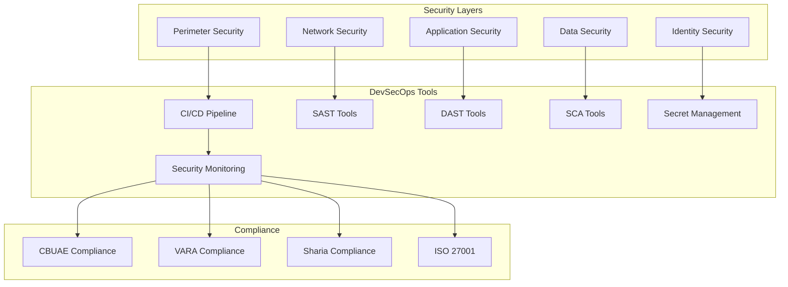

# 🛡️ DevSecOps Team Guide - AmanahFi Platform

## 🎯 Overview

This comprehensive guide provides the DevSecOps team with essential knowledge, procedures, and best practices for maintaining security, compliance, and operational excellence in the AmanahFi Platform's Islamic finance and CBDC operations.

## 📊 Document Information

| Attribute | Value |
|-----------|-------|
| **Document Version** | 1.0.0 |
| **Last Updated** | December 2024 |
| **Owner** | DevSecOps Team Lead |
| **Reviewers** | Security Team, Architecture Team, Operations Team |
| **Approval** | Chief Information Security Officer (CISO) |
| **Classification** | Internal Team Documentation |

## 🏗️ Platform Architecture for DevSecOps

### Security Architecture Overview



## 🔐 Security Implementation Guide

### 1. Zero Trust Architecture Implementation

#### Network Micro-Segmentation
```yaml
# Kubernetes Network Policies for Islamic Finance Services
apiVersion: networking.k8s.io/v1
kind: NetworkPolicy
metadata:
  name: islamic-finance-network-policy
  namespace: amanahfi-platform
spec:
  podSelector:
    matchLabels:
      app: islamic-finance-service
  policyTypes:
  - Ingress
  - Egress
  ingress:
  - from:
    - namespaceSelector:
        matchLabels:
          name: amanahfi-api-gateway
    - podSelector:
        matchLabels:
          app: api-gateway
    ports:
    - protocol: TCP
      port: 8080
  egress:
  - to:
    - namespaceSelector:
        matchLabels:
          name: amanahfi-database
    ports:
    - protocol: TCP
      port: 5432
  - to:
    - namespaceSelector:
        matchLabels:
          name: amanahfi-messaging
    ports:
    - protocol: TCP
      port: 9092
```

#### Service Mesh Security (Istio)
```yaml
# mTLS Policy for Islamic Finance Services
apiVersion: security.istio.io/v1beta1
kind: PeerAuthentication
metadata:
  name: islamic-finance-mtls
  namespace: amanahfi-platform
spec:
  selector:
    matchLabels:
      app: islamic-finance-service
  mtls:
    mode: STRICT

---
# Authorization Policy for Sharia Compliance
apiVersion: security.istio.io/v1beta1
kind: AuthorizationPolicy
metadata:
  name: sharia-compliance-authz
  namespace: amanahfi-platform
spec:
  selector:
    matchLabels:
      app: islamic-finance-service
  rules:
  - from:
    - source:
        principals: ["cluster.local/ns/amanahfi-platform/sa/sharia-service"]
  - to:
    - operation:
        methods: ["POST", "PUT"]
        paths: ["/api/v1/sharia/validate"]
  when:
  - key: custom.sharia_compliant
    values: ["true"]
```

### 2. DPoP Implementation Security

#### DPoP Token Validation
```java
@Component
public class DPoPSecurityValidator {
    
    private final DPoPTokenService dpopTokenService;
    private final RedisTemplate<String, String> redisTemplate;
    
    public boolean validateDPoPProof(String dpopProof, String accessToken, 
                                    String httpMethod, String uri) {
        try {
            // Parse DPoP proof JWT
            DPoPToken dpopToken = dpopTokenService.parseDPoPToken(dpopProof);
            
            // Validate JWT structure
            if (!dpopToken.isValid()) {
                logger.warn("Invalid DPoP token structure");
                return false;
            }
            
            // Check token binding
            if (!dpopToken.isTokenBound(accessToken)) {
                logger.warn("DPoP token not properly bound to access token");
                return false;
            }
            
            // Validate HTTP method and URI
            if (!dpopToken.matchesRequest(httpMethod, uri)) {
                logger.warn("DPoP token HTTP binding validation failed");
                return false;
            }
            
            // Check for replay attacks
            if (isReplayAttack(dpopToken.getJti())) {
                logger.warn("Potential DPoP replay attack detected");
                return false;
            }
            
            // Store JTI to prevent replay
            storeJtiForReplayPrevention(dpopToken.getJti(), dpopToken.getExpiration());
            
            return true;
            
        } catch (Exception e) {
            logger.error("DPoP validation failed", e);
            return false;
        }
    }
    
    private boolean isReplayAttack(String jti) {
        return redisTemplate.hasKey("dpop:jti:" + jti);
    }
    
    private void storeJtiForReplayPrevention(String jti, LocalDateTime expiration) {
        String key = "dpop:jti:" + jti;
        Duration ttl = Duration.between(LocalDateTime.now(), expiration);
        redisTemplate.opsForValue().set(key, "used", ttl);
    }
}
```

#### DPoP Security Filter
```java
@Component
@Order(SecurityProperties.BASIC_AUTH_ORDER - 10)
public class DPoPSecurityFilter implements Filter {
    
    @Override
    public void doFilter(ServletRequest request, ServletResponse response, 
                        FilterChain chain) throws IOException, ServletException {
        
        HttpServletRequest httpRequest = (HttpServletRequest) request;
        HttpServletResponse httpResponse = (HttpServletResponse) response;
        
        // Check if DPoP is required for this endpoint
        if (requiresDPoP(httpRequest.getRequestURI())) {
            String authHeader = httpRequest.getHeader("Authorization");
            String dpopHeader = httpRequest.getHeader("DPoP");
            
            if (authHeader == null || !authHeader.startsWith("DPoP ")) {
                sendDPoPError(httpResponse, "DPoP authentication required");
                return;
            }
            
            if (dpopHeader == null) {
                sendDPoPError(httpResponse, "DPoP proof required");
                return;
            }
            
            String accessToken = authHeader.substring(5);
            boolean isValid = dpopSecurityValidator.validateDPoPProof(
                dpopHeader, accessToken, 
                httpRequest.getMethod(), 
                httpRequest.getRequestURL().toString()
            );
            
            if (!isValid) {
                sendDPoPError(httpResponse, "Invalid DPoP proof");
                return;
            }
        }
        
        chain.doFilter(request, response);
    }
    
    private boolean requiresDPoP(String uri) {
        return uri.startsWith("/api/v1/islamic-finance") ||
               uri.startsWith("/api/v1/cbdc") ||
               uri.startsWith("/api/v1/customers");
    }
    
    private void sendDPoPError(HttpServletResponse response, String error) 
            throws IOException {
        response.setStatus(HttpStatus.UNAUTHORIZED.value());
        response.setHeader("WWW-Authenticate", "DPoP");
        response.setContentType("application/json");
        
        String errorResponse = String.format(
            "{\"error\":\"invalid_dpop_proof\",\"error_description\":\"%s\"}", 
            error
        );
        response.getWriter().write(errorResponse);
    }
}
```

### 3. Sharia Compliance Security Monitoring

#### Automated Sharia Validation
```java
@Component
public class ShariaComplianceMonitor {
    
    @Autowired
    private ShariaComplianceService shariaService;
    
    @Autowired
    private SecurityEventPublisher securityEventPublisher;
    
    @EventListener
    public void handleFinancingCreated(FinancingCreatedEvent event) {
        // Validate Sharia compliance in real-time
        ShariaValidationResult result = shariaService.validateCompliance(
            event.getFinancingDetails()
        );
        
        if (!result.isCompliant()) {
            // Log security violation
            SecurityViolationEvent violation = SecurityViolationEvent.builder()
                .violationType("SHARIA_COMPLIANCE_VIOLATION")
                .severity(SecuritySeverity.CRITICAL)
                .details(result.getViolationDetails())
                .financingId(event.getFinancingId())
                .timestamp(Instant.now())
                .build();
                
            securityEventPublisher.publishSecurityEvent(violation);
            
            // Block transaction
            throw new ShariaComplianceViolationException(
                "Transaction violates Sharia principles: " + 
                result.getViolationSummary()
            );
        }
        
        // Log successful validation
        logger.info("Sharia compliance validated for financing: {}", 
                   event.getFinancingId());
    }
    
    @Scheduled(fixedRate = 300000) // Every 5 minutes
    public void performShariaAudit() {
        List<ActiveFinancing> activeFinancings = financingRepository
            .findAllActiveFinancings();
            
        for (ActiveFinancing financing : activeFinancings) {
            ShariaValidationResult result = shariaService
                .revalidateCompliance(financing);
                
            if (!result.isCompliant()) {
                handleComplianceViolation(financing, result);
            }
        }
    }
}
```

## 🔍 Security Monitoring & Detection

### 1. SIEM Integration

#### Elasticsearch Security Configuration
```yaml
# Elasticsearch security settings for Islamic finance logs
elasticsearch:
  cluster.name: amanahfi-security-cluster
  node.name: amanahfi-node-1
  network.host: 0.0.0.0
  
  # Security settings
  xpack.security.enabled: true
  xpack.security.transport.ssl.enabled: true
  xpack.security.http.ssl.enabled: true
  
  # Islamic finance specific indices
  action.auto_create_index: >
    islamic-finance-*,
    cbdc-transactions-*,
    sharia-compliance-*,
    customer-events-*
    
  # Index lifecycle management
  xpack.ilm.enabled: true
```

#### Logstash Islamic Finance Pipeline
```ruby
# Logstash configuration for Islamic finance security events
input {
  kafka {
    bootstrap_servers => "kafka.amanahfi.ae:9092"
    topics => ["islamic-finance-events", "security-events", "compliance-events"]
    codec => "json"
    group_id => "amanahfi-security-logstash"
  }
}

filter {
  if [event_type] == "murabaha_created" {
    mutate {
      add_field => { "compliance_required" => "true" }
      add_field => { "sharia_validation_required" => "true" }
    }
    
    # Extract profit margin for compliance monitoring
    if [financing_terms][profit_margin] {
      ruby {
        code => "
          profit_margin = event.get('[financing_terms][profit_margin]')
          if profit_margin > 0.30
            event.set('compliance_violation', 'EXCESSIVE_PROFIT_MARGIN')
            event.set('severity', 'CRITICAL')
          end
        "
      }
    }
  }
  
  if [event_type] == "cbdc_transaction" {
    mutate {
      add_field => { "blockchain_validation_required" => "true" }
      add_field => { "aml_check_required" => "true" }
    }
    
    # Check transaction amount thresholds
    if [amount] and [amount][value] {
      ruby {
        code => "
          amount = event.get('[amount][value]').to_f
          if amount > 50000
            event.set('large_transaction_flag', 'true')
            event.set('enhanced_monitoring', 'required')
          end
        "
      }
    }
  }
  
  # Add geolocation for security analysis
  if [source_ip] {
    geoip {
      source => "source_ip"
      target => "geoip"
    }
  }
  
  # Enrich with threat intelligence
  if [source_ip] {
    elasticsearch {
      hosts => ["https://threat-intel.amanahfi.ae:9200"]
      index => "threat-indicators"
      query_template => "threat-indicators-template.json"
      fields => { "threat_score" => "threat_score" }
    }
  }
}

output {
  elasticsearch {
    hosts => ["https://elasticsearch.amanahfi.ae:9200"]
    index => "amanahfi-security-%{+YYYY.MM.dd}"
    template_name => "amanahfi-security"
    template => "/etc/logstash/templates/amanahfi-security-template.json"
  }
  
  # Alert on critical security events
  if [severity] == "CRITICAL" {
    email {
      from => "security-alerts@amanahfi.ae"
      to => ["security-team@amanahfi.ae", "devsecops@amanahfi.ae"]
      subject => "CRITICAL: AmanahFi Security Alert - %{event_type}"
      body => "Security event detected: %{message}"
    }
  }
}
```

### 2. Security Metrics & Dashboards

#### Prometheus Security Metrics
```yaml
# Islamic Finance Security Metrics
groups:
- name: islamic_finance_security
  rules:
  - alert: ShariaComplianceViolation
    expr: sharia_compliance_violations_total > 0
    for: 0m
    labels:
      severity: critical
      team: devsecops
    annotations:
      summary: "Sharia compliance violation detected"
      description: "{{ $value }} Sharia compliance violations detected in the last 5 minutes"
      
  - alert: ExcessiveProfitMargin
    expr: profit_margin_violations_total > 0
    for: 0m
    labels:
      severity: critical
      team: compliance
    annotations:
      summary: "Profit margin exceeds HSA limits"
      description: "Profit margins exceeding 30% HSA limit detected"
      
  - alert: CBDCTransactionAnomaly
    expr: rate(cbdc_transaction_failures_total[5m]) > 0.01
    for: 2m
    labels:
      severity: warning
      team: devsecops
    annotations:
      summary: "High CBDC transaction failure rate"
      description: "CBDC transaction failure rate is {{ $value }} per second"
      
  - alert: AuthenticationFailures
    expr: rate(authentication_failures_total[5m]) > 10
    for: 1m
    labels:
      severity: warning
      team: security
    annotations:
      summary: "High authentication failure rate"
      description: "{{ $value }} authentication failures per second"
      
  - alert: DPoPValidationFailures
    expr: rate(dpop_validation_failures_total[5m]) > 5
    for: 1m
    labels:
      severity: warning
      team: devsecops
    annotations:
      summary: "High DPoP validation failure rate"
      description: "{{ $value }} DPoP validation failures per second"
```

#### Grafana Security Dashboard
```json
{
  "dashboard": {
    "title": "AmanahFi Security Dashboard",
    "panels": [
      {
        "title": "Sharia Compliance Status",
        "type": "stat",
        "targets": [
          {
            "expr": "sharia_compliance_rate",
            "legendFormat": "Compliance Rate"
          }
        ],
        "fieldConfig": {
          "defaults": {
            "min": 0,
            "max": 100,
            "unit": "percent",
            "thresholds": {
              "steps": [
                {"color": "red", "value": 0},
                {"color": "yellow", "value": 95},
                {"color": "green", "value": 99}
              ]
            }
          }
        }
      },
      {
        "title": "Security Events Timeline",
        "type": "timeseries",
        "targets": [
          {
            "expr": "rate(security_events_total[5m])",
            "legendFormat": "{{event_type}}"
          }
        ]
      },
      {
        "title": "Authentication Methods",
        "type": "piechart",
        "targets": [
          {
            "expr": "sum by (auth_method) (authentication_attempts_total)",
            "legendFormat": "{{auth_method}}"
          }
        ]
      },
      {
        "title": "CBDC Transaction Security",
        "type": "timeseries",
        "targets": [
          {
            "expr": "rate(cbdc_transactions_total[5m])",
            "legendFormat": "Total Transactions"
          },
          {
            "expr": "rate(cbdc_transaction_failures_total[5m])",
            "legendFormat": "Failed Transactions"
          }
        ]
      }
    ]
  }
}
```

### 3. Incident Response Automation

#### Security Incident Playbook
```python
import json
import requests
from typing import Dict, List

class SecurityIncidentResponse:
    def __init__(self, config: Dict):
        self.config = config
        self.slack_webhook = config['slack_webhook']
        self.pagerduty_key = config['pagerduty_integration_key']
        
    def handle_sharia_compliance_violation(self, event: Dict):
        """Handle Sharia compliance violations"""
        
        # 1. Immediate containment
        financing_id = event.get('financing_id')
        self.freeze_financing(financing_id)
        
        # 2. Notify stakeholders
        self.notify_slack(
            channel="#sharia-compliance",
            message=f"🚨 CRITICAL: Sharia compliance violation detected\n"
                   f"Financing ID: {financing_id}\n"
                   f"Violation: {event.get('violation_type')}\n"
                   f"Action: Financing frozen pending review"
        )
        
        # 3. Create PagerDuty incident
        self.create_pagerduty_incident(
            title=f"Sharia Compliance Violation - {financing_id}",
            description=f"Violation Type: {event.get('violation_type')}",
            urgency="high"
        )
        
        # 4. Generate audit report
        self.generate_compliance_audit_report(financing_id, event)
        
        # 5. Notify HSA (Higher Sharia Authority)
        self.notify_regulatory_authority('HSA', event)
        
    def handle_dpop_security_breach(self, event: Dict):
        """Handle DPoP security breaches"""
        
        # 1. Block suspicious tokens
        access_token = event.get('access_token')
        self.revoke_access_token(access_token)
        
        # 2. Rate limit source IP
        source_ip = event.get('source_ip')
        self.apply_rate_limiting(source_ip, duration_minutes=30)
        
        # 3. Alert security team
        self.notify_slack(
            channel="#security-alerts",
            message=f"🔒 Security Alert: DPoP breach detected\n"
                   f"Source IP: {source_ip}\n"
                   f"Action: Token revoked, IP rate limited"
        )
        
        # 4. Investigate session
        self.initiate_security_investigation(event)
        
    def handle_cbdc_transaction_anomaly(self, event: Dict):
        """Handle CBDC transaction anomalies"""
        
        transaction_id = event.get('transaction_id')
        amount = event.get('amount', {}).get('value', 0)
        
        # 1. Flag transaction for review
        self.flag_transaction_for_review(transaction_id)
        
        # 2. Check AML requirements
        if amount > 10000:  # AED 10,000 threshold
            self.trigger_aml_investigation(transaction_id)
            
        # 3. Notify compliance team
        self.notify_slack(
            channel="#compliance-alerts",
            message=f"⚠️ CBDC Transaction Anomaly\n"
                   f"Transaction ID: {transaction_id}\n"
                   f"Amount: {amount} AED\n"
                   f"Status: Under review"
        )
        
    def freeze_financing(self, financing_id: str):
        """Freeze financing pending compliance review"""
        response = requests.post(
            f"{self.config['api_base_url']}/api/v1/islamic-finance/{financing_id}/freeze",
            headers={'Authorization': f"Bearer {self.config['service_token']}"},
            json={'reason': 'SHARIA_COMPLIANCE_VIOLATION'}
        )
        return response.status_code == 200
        
    def notify_slack(self, channel: str, message: str):
        """Send notification to Slack"""
        payload = {
            'channel': channel,
            'text': message,
            'username': 'AmanahFi Security Bot'
        }
        requests.post(self.slack_webhook, json=payload)
        
    def create_pagerduty_incident(self, title: str, description: str, urgency: str):
        """Create PagerDuty incident"""
        payload = {
            'incident': {
                'type': 'incident',
                'title': title,
                'service': {'id': self.config['pagerduty_service_id'], 'type': 'service_reference'},
                'urgency': urgency,
                'body': {'type': 'incident_body', 'details': description}
            }
        }
        
        headers = {
            'Authorization': f"Token token={self.pagerduty_key}",
            'Content-Type': 'application/json',
            'Accept': 'application/vnd.pagerduty+json;version=2',
            'From': 'security@amanahfi.ae'
        }
        
        requests.post(
            'https://api.pagerduty.com/incidents',
            headers=headers,
            json=payload
        )
```

## 🔧 DevSecOps Toolchain

### 1. Security Testing Pipeline

#### Security Testing Configuration
```yaml
# .github/workflows/security-testing.yml
name: Security Testing Pipeline

on:
  push:
    branches: [main, develop]
  pull_request:
    branches: [main]
  schedule:
    - cron: '0 2 * * *'  # Daily security scan at 2 AM

jobs:
  static-analysis:
    name: Static Security Analysis
    runs-on: ubuntu-latest
    steps:
      - uses: actions/checkout@v4
        with:
          fetch-depth: 0
          
      - name: SonarQube Security Scan
        uses: sonarqube-action@v1
        env:
          GITHUB_TOKEN: ${{ secrets.GITHUB_TOKEN }}
          SONAR_TOKEN: ${{ secrets.SONAR_TOKEN }}
        with:
          args: >
            -Dsonar.projectKey=amanahfi-platform
            -Dsonar.security.hotspots.threshold=0
            -Dsonar.security.review.threshold=A
            
      - name: Semgrep Security Rules
        uses: semgrep/semgrep-action@v1
        with:
          config: >-
            p/security-audit
            p/secrets
            p/owasp-top-ten
            p/java
            p/jwt
            p/sql-injection
            
      - name: Islamic Finance Security Rules
        run: |
          # Custom Semgrep rules for Islamic finance security
          semgrep --config=security/rules/islamic-finance.yml src/
          
  dependency-security:
    name: Dependency Security Scan
    runs-on: ubuntu-latest
    steps:
      - uses: actions/checkout@v4
      
      - name: OWASP Dependency Check
        uses: dependency-check/Dependency-Check_Action@main
        with:
          project: 'AmanahFi Platform'
          path: '.'
          format: 'ALL'
          args: >
            --enableRetired
            --enableExperimental
            --failOnCVSS 7
            
      - name: Snyk Vulnerability Scan
        uses: snyk/actions/maven@master
        env:
          SNYK_TOKEN: ${{ secrets.SNYK_TOKEN }}
        with:
          args: --severity-threshold=high
          
  container-security:
    name: Container Security Scan
    runs-on: ubuntu-latest
    steps:
      - uses: actions/checkout@v4
      
      - name: Build Docker image
        run: |
          docker build -t amanahfi-platform:${{ github.sha }} .
          
      - name: Trivy Container Scan
        uses: aquasecurity/trivy-action@master
        with:
          image-ref: 'amanahfi-platform:${{ github.sha }}'
          format: 'sarif'
          output: 'trivy-results.sarif'
          severity: 'HIGH,CRITICAL'
          
      - name: Grype Vulnerability Scan
        uses: anchore/scan-action@v3
        with:
          image: 'amanahfi-platform:${{ github.sha }}'
          fail-build: true
          severity-cutoff: high
          
  secrets-detection:
    name: Secrets Detection
    runs-on: ubuntu-latest
    steps:
      - uses: actions/checkout@v4
        with:
          fetch-depth: 0
          
      - name: TruffleHog Secrets Scan
        uses: trufflesecurity/trufflehog@main
        with:
          path: ./
          base: main
          head: HEAD
          
      - name: GitLeaks Secrets Scan
        uses: gitleaks/gitleaks-action@v2
        env:
          GITHUB_TOKEN: ${{ secrets.GITHUB_TOKEN }}
```

### 2. Infrastructure Security

#### Terraform Security Scanning
```yaml
# Infrastructure security scanning
terraform-security:
  name: Infrastructure Security Scan
  runs-on: ubuntu-latest
  steps:
    - uses: actions/checkout@v4
    
    - name: Setup Terraform
      uses: hashicorp/setup-terraform@v3
      with:
        terraform_version: 1.6.0
        
    - name: Checkov Security Scan
      uses: bridgecrewio/checkov-action@master
      with:
        directory: ./infrastructure
        framework: terraform
        check: CKV_AWS_*,CKV_K8S_*
        compact: true
        quiet: true
        
    - name: tfsec Security Scan
      uses: aquasecurity/tfsec-action@v1.0.0
      with:
        working_directory: ./infrastructure
        soft_fail: false
        
    - name: Terraform Plan Security Review
      run: |
        cd infrastructure
        terraform init
        terraform plan -out=tfplan
        terraform show -json tfplan | jq '.' > tfplan.json
        
        # Custom security validation for Islamic finance infrastructure
        python scripts/validate-infrastructure-security.py tfplan.json
```

### 3. Kubernetes Security

#### Pod Security Standards
```yaml
# Pod Security Policy for Islamic Finance Services
apiVersion: v1
kind: Pod
metadata:
  name: islamic-finance-service
  namespace: amanahfi-platform
  annotations:
    seccomp.security.alpha.kubernetes.io/pod: runtime/default
spec:
  securityContext:
    runAsNonRoot: true
    runAsUser: 10001
    runAsGroup: 10001
    fsGroup: 10001
    seccompProfile:
      type: RuntimeDefault
  containers:
  - name: islamic-finance
    image: amanahfi/islamic-finance-service:latest
    securityContext:
      allowPrivilegeEscalation: false
      readOnlyRootFilesystem: true
      runAsNonRoot: true
      runAsUser: 10001
      capabilities:
        drop:
        - ALL
    resources:
      limits:
        memory: "1Gi"
        cpu: "500m"
      requests:
        memory: "512Mi"
        cpu: "250m"
    volumeMounts:
    - name: tmp
      mountPath: /tmp
    - name: cache
      mountPath: /app/cache
  volumes:
  - name: tmp
    emptyDir: {}
  - name: cache
    emptyDir: {}
```

#### Network Security Policies
```yaml
# Network policy for CBDC services
apiVersion: networking.k8s.io/v1
kind: NetworkPolicy
metadata:
  name: cbdc-service-network-policy
  namespace: amanahfi-platform
spec:
  podSelector:
    matchLabels:
      app: cbdc-service
  policyTypes:
  - Ingress
  - Egress
  ingress:
  - from:
    - podSelector:
        matchLabels:
          app: islamic-finance-service
    - podSelector:
        matchLabels:
          app: payment-service
    ports:
    - protocol: TCP
      port: 8080
  egress:
  # Allow communication to R3 Corda nodes
  - to: []
    ports:
    - protocol: TCP
      port: 10200  # Corda P2P port
    - protocol: TCP
      port: 10201  # Corda RPC port
  # Allow DNS resolution
  - to: []
    ports:
    - protocol: UDP
      port: 53
```

## 📋 Compliance Automation

### 1. Automated Compliance Checks

#### CBUAE Compliance Validator
```python
import json
from typing import Dict, List, Tuple
from dataclasses import dataclass

@dataclass
class ComplianceResult:
    is_compliant: bool
    violations: List[str]
    recommendations: List[str]
    score: float

class CBUAEComplianceValidator:
    """Automated CBUAE compliance validation"""
    
    def __init__(self):
        self.rules = self.load_cbuae_rules()
        
    def validate_islamic_finance_transaction(self, transaction: Dict) -> ComplianceResult:
        violations = []
        recommendations = []
        
        # Rule 1: Asset backing requirement
        if not self.validate_asset_backing(transaction):
            violations.append("Transaction lacks proper asset backing")
            recommendations.append("Ensure all financing is backed by tangible assets")
            
        # Rule 2: Profit margin limits
        if not self.validate_profit_margins(transaction):
            violations.append("Profit margin exceeds regulatory limits")
            recommendations.append("Reduce profit margin to comply with CBUAE guidelines")
            
        # Rule 3: Customer eligibility
        if not self.validate_customer_eligibility(transaction):
            violations.append("Customer does not meet eligibility criteria")
            recommendations.append("Complete additional KYC verification")
            
        # Rule 4: Documentation requirements
        if not self.validate_documentation(transaction):
            violations.append("Required documentation is incomplete")
            recommendations.append("Collect all mandatory documentation")
            
        # Rule 5: Risk assessment
        if not self.validate_risk_assessment(transaction):
            violations.append("Risk assessment not properly conducted")
            recommendations.append("Perform comprehensive risk evaluation")
            
        compliance_score = self.calculate_compliance_score(violations)
        
        return ComplianceResult(
            is_compliant=len(violations) == 0,
            violations=violations,
            recommendations=recommendations,
            score=compliance_score
        )
        
    def validate_cbdc_transaction(self, transaction: Dict) -> ComplianceResult:
        violations = []
        recommendations = []
        
        # VARA digital asset compliance
        if not self.validate_vara_requirements(transaction):
            violations.append("VARA digital asset requirements not met")
            recommendations.append("Ensure VARA compliance for all digital asset transactions")
            
        # AML/CTF requirements
        if not self.validate_aml_requirements(transaction):
            violations.append("AML/CTF requirements not satisfied")
            recommendations.append("Complete enhanced due diligence")
            
        # Transaction limits
        if not self.validate_transaction_limits(transaction):
            violations.append("Transaction exceeds permitted limits")
            recommendations.append("Split transaction or obtain additional approvals")
            
        compliance_score = self.calculate_compliance_score(violations)
        
        return ComplianceResult(
            is_compliant=len(violations) == 0,
            violations=violations,
            recommendations=recommendations,
            score=compliance_score
        )
        
    def generate_compliance_report(self, results: List[ComplianceResult]) -> Dict:
        """Generate comprehensive compliance report"""
        
        total_transactions = len(results)
        compliant_transactions = sum(1 for r in results if r.is_compliant)
        compliance_rate = (compliant_transactions / total_transactions) * 100
        
        all_violations = []
        all_recommendations = []
        
        for result in results:
            all_violations.extend(result.violations)
            all_recommendations.extend(result.recommendations)
            
        violation_summary = self.summarize_violations(all_violations)
        
        return {
            'compliance_summary': {
                'total_transactions': total_transactions,
                'compliant_transactions': compliant_transactions,
                'compliance_rate': compliance_rate,
                'average_score': sum(r.score for r in results) / total_transactions
            },
            'violation_summary': violation_summary,
            'recommendations': list(set(all_recommendations)),
            'generated_at': datetime.utcnow().isoformat()
        }
```

### 2. Continuous Compliance Monitoring

#### Compliance Monitoring Service
```java
@Service
@Slf4j
public class ContinuousComplianceMonitor {
    
    @Autowired
    private CBUAEComplianceService cbuaeService;
    
    @Autowired
    private VARAComplianceService varaService;
    
    @Autowired
    private ShariaComplianceService shariaService;
    
    @Autowired
    private ComplianceEventPublisher eventPublisher;
    
    @Scheduled(fixedRate = 300000) // Every 5 minutes
    public void performContinuousCompliance() {
        log.info("Starting continuous compliance monitoring");
        
        try {
            // Monitor Islamic finance transactions
            monitorIslamicFinanceCompliance();
            
            // Monitor CBDC transactions
            monitorCBDCCompliance();
            
            // Monitor customer data compliance
            monitorCustomerDataCompliance();
            
            // Generate compliance metrics
            generateComplianceMetrics();
            
        } catch (Exception e) {
            log.error("Error during compliance monitoring", e);
            eventPublisher.publishComplianceAlert(
                ComplianceAlert.builder()
                    .alertType("MONITORING_FAILURE")
                    .severity(AlertSeverity.HIGH)
                    .message("Continuous compliance monitoring failed")
                    .exception(e.getMessage())
                    .build()
            );
        }
    }
    
    private void monitorIslamicFinanceCompliance() {
        List<ActiveFinancing> activeFinancings = financingRepository
            .findAllActiveFinancingsLastUpdatedAfter(
                LocalDateTime.now().minusMinutes(5)
            );
            
        for (ActiveFinancing financing : activeFinancings) {
            ComplianceResult result = performComprehensiveCompliance(financing);
            
            if (!result.isCompliant()) {
                handleComplianceViolation(financing, result);
            }
        }
    }
    
    private ComplianceResult performComprehensiveCompliance(ActiveFinancing financing) {
        List<ComplianceViolation> violations = new ArrayList<>();
        
        // CBUAE compliance
        CBUAEComplianceResult cbuaeResult = cbuaeService.validateCompliance(financing);
        violations.addAll(cbuaeResult.getViolations());
        
        // Sharia compliance
        ShariaComplianceResult shariaResult = shariaService.validateCompliance(financing);
        violations.addAll(shariaResult.getViolations());
        
        // Risk compliance
        RiskComplianceResult riskResult = riskService.validateCompliance(financing);
        violations.addAll(riskResult.getViolations());
        
        return ComplianceResult.builder()
            .financingId(financing.getId())
            .isCompliant(violations.isEmpty())
            .violations(violations)
            .timestamp(LocalDateTime.now())
            .build();
    }
    
    private void handleComplianceViolation(ActiveFinancing financing, 
                                          ComplianceResult result) {
        log.warn("Compliance violation detected for financing: {}", 
                financing.getId());
                
        // Freeze financing if critical violation
        if (result.hasCriticalViolations()) {
            financingService.freezeFinancing(
                financing.getId(), 
                "COMPLIANCE_VIOLATION"
            );
        }
        
        // Publish compliance event
        eventPublisher.publishComplianceViolation(
            ComplianceViolationEvent.builder()
                .financingId(financing.getId())
                .violations(result.getViolations())
                .severity(result.getMaxSeverity())
                .timestamp(LocalDateTime.now())
                .build()
        );
        
        // Notify compliance team
        notificationService.notifyComplianceTeam(financing, result);
    }
}
```

## 🚨 Security Incident Response

### 1. Automated Incident Response

#### Security Playbooks
```yaml
# Security incident response playbooks
playbooks:
  sharia_compliance_violation:
    triggers:
      - event_type: "sharia_compliance_violation"
    actions:
      - action: freeze_financing
        timeout: 30s
      - action: notify_sharia_board
        timeout: 60s
      - action: create_incident_ticket
        priority: critical
      - action: generate_audit_report
        
  authentication_breach:
    triggers:
      - event_type: "authentication_failure"
        threshold: 10
        window: "5m"
    actions:
      - action: block_source_ip
        duration: "30m"
      - action: revoke_user_tokens
      - action: notify_security_team
      - action: initiate_investigation
      
  cbdc_transaction_anomaly:
    triggers:
      - event_type: "cbdc_transaction_anomaly"
    actions:
      - action: flag_transaction
      - action: notify_compliance_team
      - action: trigger_aml_review
      - action: report_to_authorities
```

### 2. Security Metrics Collection

#### Security KPIs
```java
@Component
public class SecurityMetricsCollector {
    
    private final MeterRegistry meterRegistry;
    
    public SecurityMetricsCollector(MeterRegistry meterRegistry) {
        this.meterRegistry = meterRegistry;
        initializeSecurityMetrics();
    }
    
    private void initializeSecurityMetrics() {
        // Sharia compliance metrics
        Gauge.builder("sharia.compliance.rate")
            .description("Current Sharia compliance rate")
            .register(meterRegistry, this, SecurityMetricsCollector::getShariaComplianceRate);
            
        // Authentication security metrics
        Counter.builder("auth.failures.total")
            .description("Total authentication failures")
            .tag("type", "oauth")
            .register(meterRegistry);
            
        Counter.builder("dpop.validation.failures.total")
            .description("DPoP validation failures")
            .register(meterRegistry);
            
        // CBDC security metrics
        Timer.builder("cbdc.transaction.validation.duration")
            .description("CBDC transaction validation time")
            .register(meterRegistry);
            
        Counter.builder("cbdc.transaction.anomalies.total")
            .description("CBDC transaction anomalies detected")
            .register(meterRegistry);
            
        // Security incident metrics
        Counter.builder("security.incidents.total")
            .description("Total security incidents")
            .tag("severity", "")
            .register(meterRegistry);
    }
    
    public void recordAuthenticationFailure(String authType, String reason) {
        Counter.builder("auth.failures.total")
            .tag("type", authType)
            .tag("reason", reason)
            .register(meterRegistry)
            .increment();
    }
    
    public void recordDPoPValidationFailure(String failureType) {
        Counter.builder("dpop.validation.failures.total")
            .tag("failure_type", failureType)
            .register(meterRegistry)
            .increment();
    }
    
    public void recordSecurityIncident(String incidentType, String severity) {
        Counter.builder("security.incidents.total")
            .tag("type", incidentType)
            .tag("severity", severity)
            .register(meterRegistry)
            .increment();
    }
    
    private double getShariaComplianceRate() {
        // Implementation to calculate current compliance rate
        return shariaComplianceService.getCurrentComplianceRate();
    }
}
```

## 📚 DevSecOps Best Practices

### 1. Secure Development Guidelines

- **Principle of Least Privilege**: Grant minimum necessary permissions
- **Defense in Depth**: Implement multiple security layers
- **Fail Securely**: Ensure secure failure modes
- **Zero Trust**: Never trust, always verify
- **Immutable Infrastructure**: Use immutable deployment artifacts
- **Secret Management**: Never store secrets in code or configuration
- **Input Validation**: Validate all inputs at boundary
- **Audit Everything**: Maintain comprehensive audit trails

### 2. Islamic Finance Security Considerations

- **Sharia Compliance Validation**: Real-time validation of all transactions
- **Asset Backing Verification**: Ensure proper asset backing for all financings
- **Profit Margin Monitoring**: Continuous monitoring of profit margins
- **Regulatory Compliance**: Automated compliance with CBUAE, VARA, HSA
- **Cultural Sensitivity**: Respect Islamic principles in all security measures

### 3. Emergency Procedures

#### Security Incident Escalation
1. **Level 1**: Automated response and containment
2. **Level 2**: DevSecOps team investigation
3. **Level 3**: Security team and management notification
4. **Level 4**: Executive escalation and external authorities

#### Contact Information
- **DevSecOps On-Call**: +971-4-XXX-XXXX
- **Security Team**: security@amanahfi.ae
- **Compliance Team**: compliance@amanahfi.ae
- **Emergency Hotline**: +971-4-XXX-XXXX (24/7)

---

**📞 DevSecOps Support**

- **Team Lead**: [devsecops-lead@amanahfi.ae](mailto:devsecops-lead@amanahfi.ae)
- **Security Engineers**: [security-engineers@amanahfi.ae](mailto:security-engineers@amanahfi.ae)
- **Compliance Specialists**: [compliance@amanahfi.ae](mailto:compliance@amanahfi.ae)
- **24/7 Security Hotline**: +971-4-XXX-XXXX

---

*This DevSecOps guide is maintained by the DevSecOps Team and updated regularly to reflect evolving security threats and regulatory requirements.*