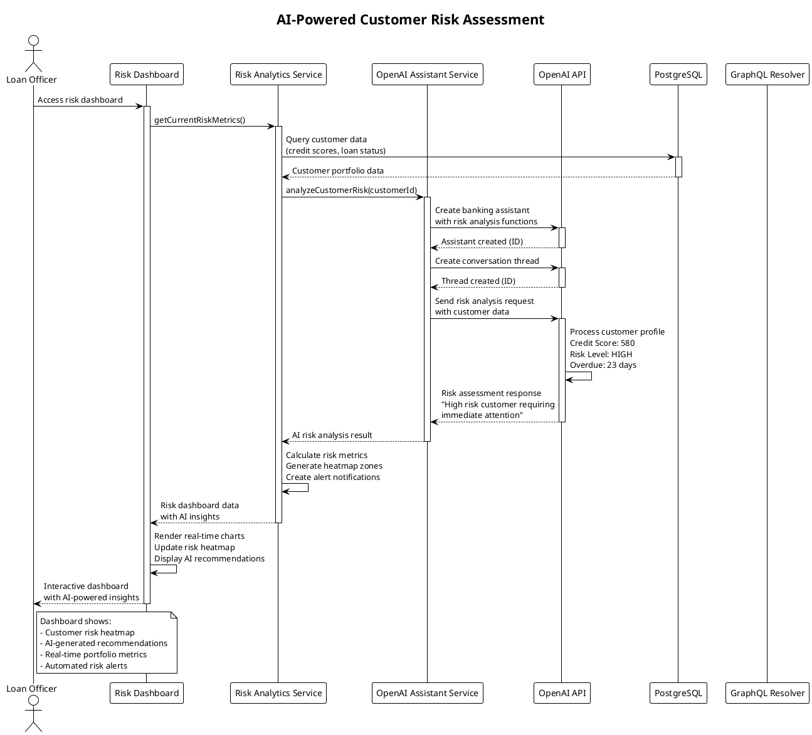
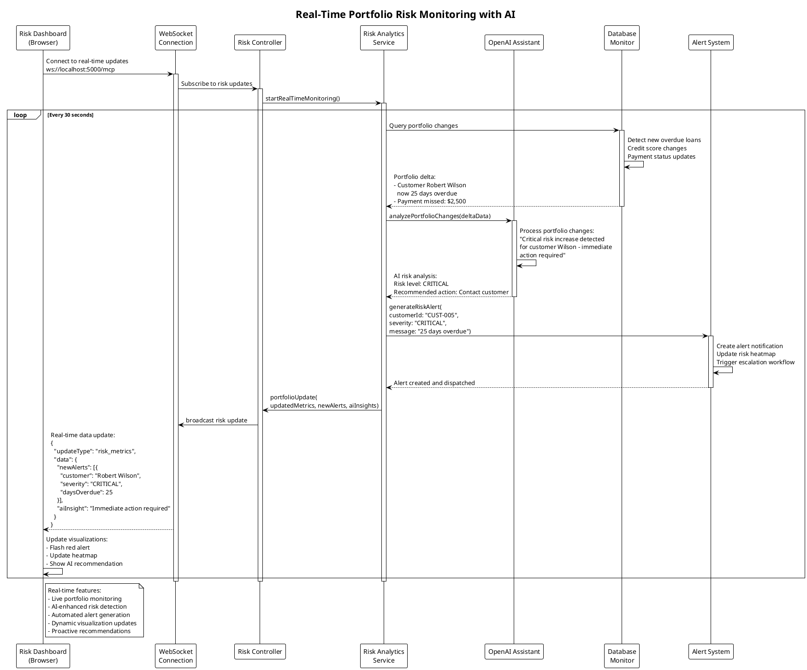
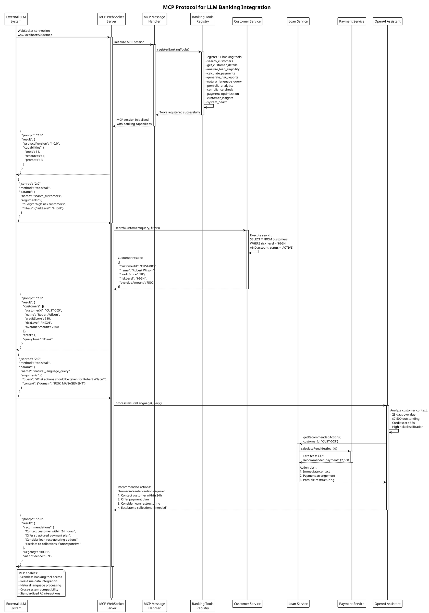
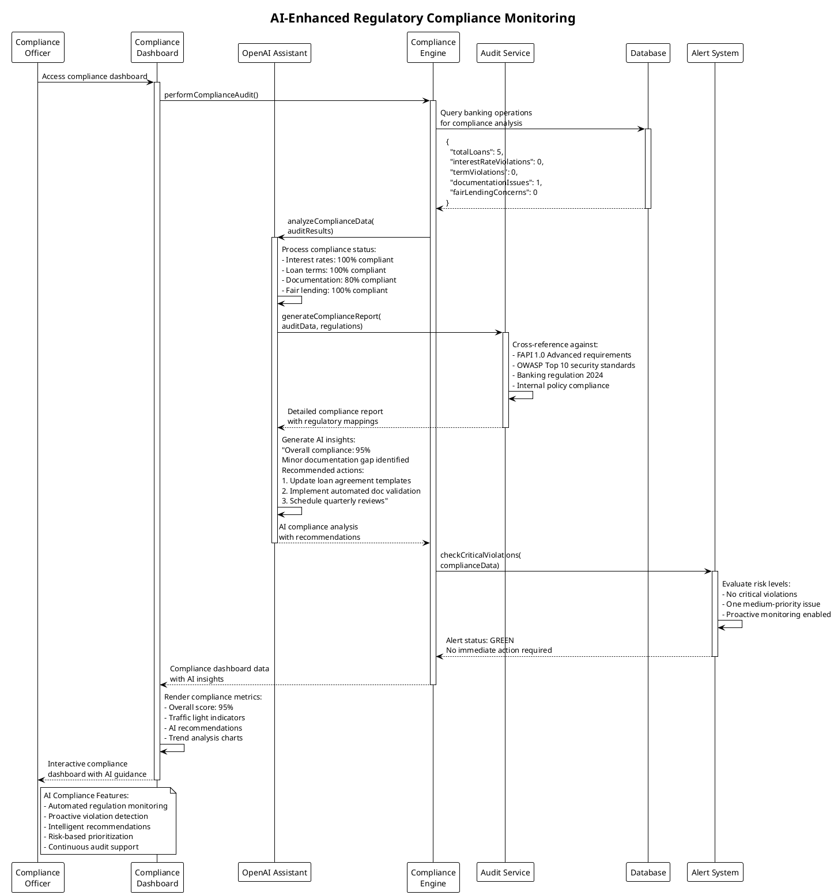

# AI Use Case Sequence Diagrams
## Enterprise Banking System - OpenAI Assistant Integration

### AI Risk Assessment Use Case

### Natural Language Loan Processing Use Case

```plantuml
@startuml NL_Loan_Processing_Sequence
!theme plain

title Natural Language Loan Application Processing

actor "Bank Manager" as BM
participant "GraphQL API" as GQL
participant "NL Processing Service" as NLP
participant "OpenAI Assistant" as OAI
participant "Loan Service" as LS
participant "Customer Service" as CS
participant "Risk Analytics" as RA
participant "Database" as DB

BM -> GQL: "Analyze loan eligibility for\ncustomer John Smith requesting\n$50,000 for 12 months"
activate GQL

GQL -> NLP: processNaturalLanguageQuery()
activate NLP

NLP -> NLP: Extract entities:\n- Customer: "John Smith"\n- Amount: $50,000\n- Term: 12 months

NLP -> OAI: Initialize banking assistant\nwith loan processing functions
activate OAI

OAI -> CS: getCustomerProfile("John Smith")
activate CS
CS -> DB: SELECT * FROM customers\nWHERE name = 'John Smith'
activate DB
DB --> CS: Customer data\n(Credit Score: 780, Risk: LOW)
deactivate DB
CS --> OAI: Customer profile data
deactivate CS

OAI -> LS: calculateLoanEligibility(\ncustomerId, $50,000, 12)
activate LS
LS -> RA: assessCreditRisk(customerId)
activate RA
RA -> DB: Query payment history\nand risk factors
activate DB
DB --> RA: Risk assessment data
deactivate DB
RA --> LS: Risk score: 3.2/10 (LOW)
deactivate RA

LS -> LS: Apply banking rules:\n- Credit score > 700: ✓\n- Debt-to-income < 40%: ✓\n- Loan term valid: ✓

LS --> OAI: Eligibility result:\nAPPROVED\nRecommended rate: 0.25%
deactivate LS

OAI -> OAI: Generate response:\n"Customer John Smith is eligible\nfor $50,000 loan at 0.25% rate\nbased on excellent credit profile"

OAI --> NLP: Formatted loan analysis
deactivate OAI

NLP --> GQL: Natural language response
deactivate NLP

GQL --> BM: "✓ APPROVED: John Smith\nqualifies for $50,000 loan\nat 0.25% monthly rate\nwith 12 installments"
deactivate GQL

note right of BM
  AI Assistant provides:
  - Instant eligibility analysis
  - Risk-based rate calculation
  - Regulatory compliance check
  - Natural language explanation
end note

@enduml
```

### Real-Time Risk Monitoring Use Case

### MCP Protocol Integration Use Case

### AI-Powered Payment Optimization Use Case

```plantuml
@startuml AI_Payment_Optimization_Sequence
!theme plain

title AI-Powered Payment Strategy Optimization

actor "Customer" as CUST
participant "Customer Portal" as CP
participant "Payment Service" as PS
participant "OpenAI Assistant" as OAI
participant "Calculation Engine" as CE
participant "Risk Analytics" as RA
participant "Notification Service" as NS

CUST -> CP: "I want to optimize my\nloan payments to save money"
activate CP

CP -> PS: requestPaymentOptimization(\ncustomerId: "CUST-001")
activate PS

PS -> OAI: analyzePaymentOptions(\ncustomerId, currentLoanData)
activate OAI

OAI -> CE: calculatePaymentScenarios(\nloanId: "LOAN-001",\nscenarios: [early, double, refinance])
activate CE

CE -> CE: Scenario 1 - Early Payment:\nCurrent outstanding: $18,500\nEarly payment: $10,000\nSavings: $850 in interest

CE -> CE: Scenario 2 - Double Payments:\nMonthly: $2,500 × 2 = $5,000\nPayoff time: 4 months early\nSavings: $425 in interest

CE -> CE: Scenario 3 - Refinancing:\nNew rate: 0.20% (from 0.25%)\nNew term: 18 months\nSavings: $275 total

CE --> OAI: Payment scenarios with\ncalculated savings and risks
deactivate CE

OAI -> RA: assessCustomerCapacity(\ncustomerId, paymentScenarios)
activate RA

RA -> RA: Analyze customer profile:\n- Income: $75,000/year\n- Credit score: 780\n- Available credit: $45,000\n- Risk level: LOW

RA --> OAI: Capacity assessment:\nCan handle increased payments\nLow risk of financial strain
deactivate RA

OAI -> OAI: Generate AI recommendation:\n"Based on your strong financial\nprofile, I recommend the early\npayment strategy with $10,000\nupfront to maximize savings"

OAI --> PS: Optimization recommendation:\n{\n  "recommendedStrategy": "early_payment",\n  "amount": 10000,\n  "savings": 850,\n  "reasoning": "Customer has sufficient\n  available credit and strong\n  payment history",\n  "riskLevel": "LOW",\n  "confidence": 0.92\n}
deactivate OAI

PS -> NS: createOptimizationNotification(\ncustomerId, recommendation)
activate NS

NS -> NS: Generate personalized message:\n"💡 Smart Payment Opportunity!\nPay $10,000 now and save $850\nin interest over your loan term"

NS --> PS: Notification prepared
deactivate NS

PS --> CP: Payment optimization plan\nwith AI recommendations
deactivate PS

CP -> CP: Display interactive options:\n✓ Early Payment: Save $850\n✓ Double Payments: Save $425\n✓ Refinancing: Save $275\n\nAI Recommends: Early Payment
CP --> CUST: "Here are your optimized\npayment options. Our AI\nrecommends early payment\nto save $850 in interest."
deactivate CP

note right of CUST
  AI provides:
  - Personalized payment strategies
  - Real-time savings calculations
  - Risk-aware recommendations
  - Financial capacity analysis
  - Actionable insights
end note

@enduml
```

### AI Compliance Monitoring Use Case

