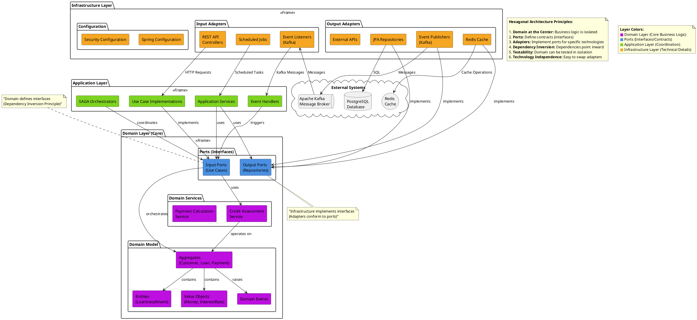
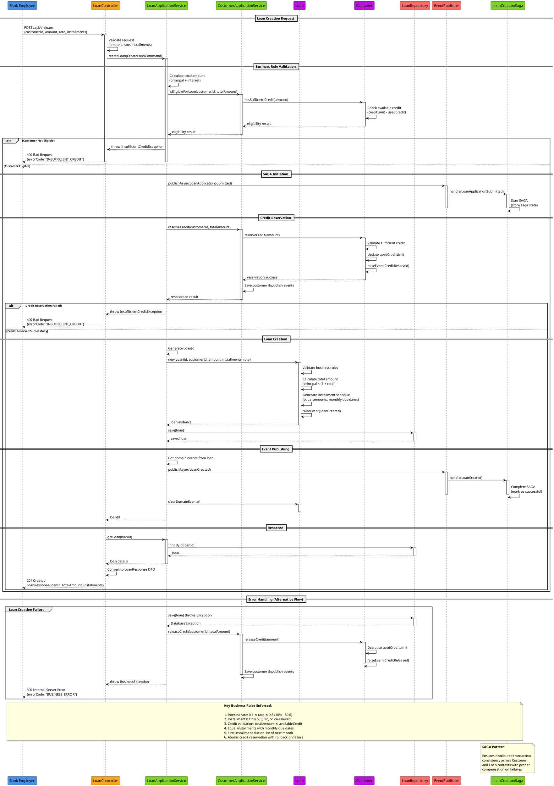
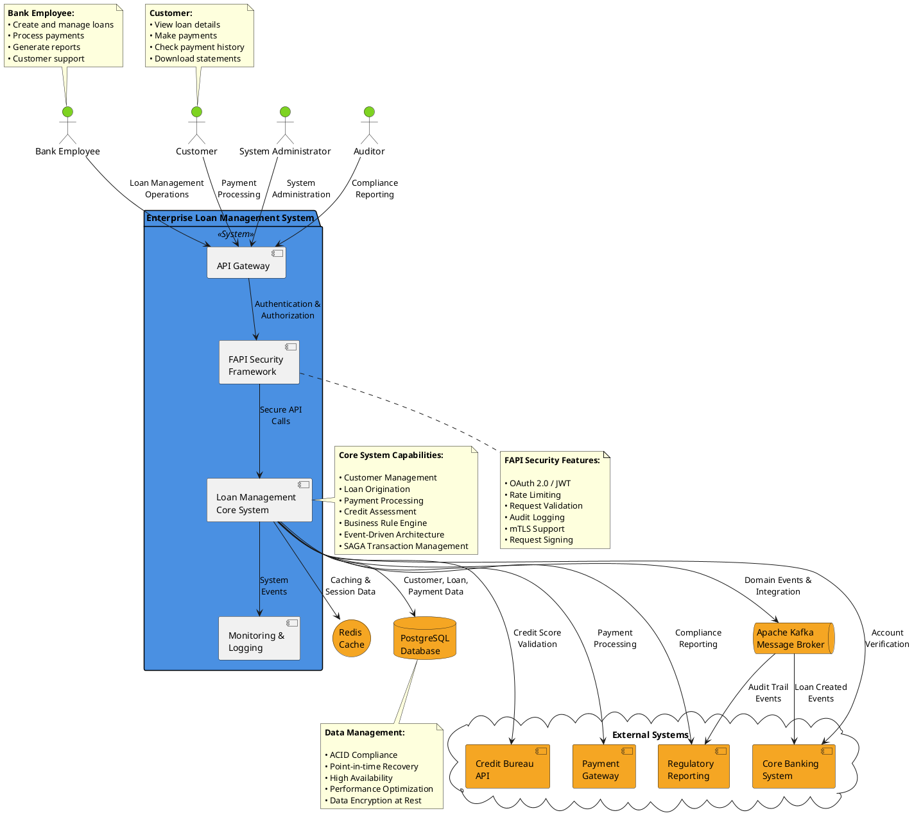

# Enterprise Loan Management System - Architecture Diagrams

This document contains comprehensive PlantUML diagrams with detailed illustrations and descriptions for the Enterprise Loan Management System architecture.

## Table of Contents

1. [Bounded Contexts Overview](#1-bounded-contexts-overview)
2. [Hexagonal Architecture](#2-hexagonal-architecture)
3. [Component Architecture](#3-component-architecture)
4. [Domain Model](#4-domain-model)
5. [Entity Relationship Diagram](#5-entity-relationship-diagram)
6. [Loan Creation Sequence](#6-loan-creation-sequence)
7. [Payment Processing Sequence](#7-payment-processing-sequence)
8. [System Context Diagram](#8-system-context-diagram)
9. [Deployment Architecture](#9-deployment-architecture)

---

## 1. Bounded Contexts Overview

### Description
Illustrates the Domain-Driven Design bounded contexts within the loan management system, showing clear separation of business capabilities and integration patterns.

### Key Elements
- **Customer Management Context**: Handles customer data, credit limits, and risk assessment
- **Loan Origination Context**: Manages loan creation, validation, and installment scheduling
- **Payment Processing Context**: Processes payments, calculates penalties/discounts
- **Shared Kernel**: Common domain objects and value types

### Business Value
- Clear separation of responsibilities
- Independent development and deployment
- Reduced coupling between business domains
- Event-driven communication ensuring consistency

```plantuml
@startuml Bounded Contexts

!define CUSTOMER_COLOR #FFE4B5
!define LOAN_COLOR #E6F3FF
!define PAYMENT_COLOR #E6FFE6
!define SHARED_COLOR #F0F0F0

skinparam backgroundColor #FFFFFF
skinparam packageStyle rectangle

package "Loan Management System" {
    
    package "Shared Kernel" <<Frame>> SHARED_COLOR {
        component [AggregateRoot] as AggregateRoot
        component [Entity] as Entity
        component [ValueObject] as ValueObject
        component [DomainEvent] as DomainEvent
        component [EventPublisher] as EventPublisher
        
        package "Common Value Objects" {
            component [Money] as Money
            component [InterestRate] as InterestRate
            component [InstallmentCount] as InstallmentCount
        }
    }
    
    package "Customer Management Context" <<Bounded Context>> CUSTOMER_COLOR {
        
        package "Domain Model" {
            component [Customer] as CustomerAggregate <<Aggregate Root>>
            component [CustomerId] as CustomerId <<Value Object>>
            component [CreditLimit] as CreditLimit <<Value Object>>
        }
        
        package "Domain Services" {
            component [CreditAssessmentService] as CreditService
        }
        
        package "Domain Events" {
            component [CreditReserved] as CreditReserved
            component [CreditReleased] as CreditReleased
            component [CreditReservationFailed] as CreditReservationFailed
        }
        
        package "Application Services" {
            component [CustomerApplicationService] as CustomerAppService
        }
        
        package "Infrastructure" {
            component [CustomerController] as CustomerController
            component [CustomerRepository] as CustomerRepository
            component [CustomerEntity] as CustomerEntity
        }
        
        package "Ports" {
            interface "CustomerRepository" as ICustomerRepository
            interface "Use Cases" as CustomerUseCases
        }
    }
    
    package "Loan Origination Context" <<Bounded Context>> LOAN_COLOR {
        
        package "Domain Model" {
            component [Loan] as LoanAggregate <<Aggregate Root>>
            component [LoanInstallment] as LoanInstallment <<Entity>>
            component [LoanId] as LoanId <<Value Object>>
            component [InstallmentId] as InstallmentId <<Value Object>>
        }
        
        package "Domain Events" {
            component [LoanCreated] as LoanCreated
            component [LoanApplicationSubmitted] as LoanApplicationSubmitted
        }
        
        package "Application Services" {
            component [LoanApplicationService] as LoanAppService
            component [LoanCreationSaga] as LoanCreationSaga
        }
        
        package "Infrastructure" {
            component [LoanController] as LoanController
            component [LoanRepository] as LoanRepository
            component [LoanEntity] as LoanEntity
        }
        
        package "Ports" {
            interface "LoanRepository" as ILoanRepository
            interface "CreateLoanUseCase" as CreateLoanUseCase
            interface "ListLoansUseCase" as ListLoansUseCase
            interface "ListInstallmentsUseCase" as ListInstallmentsUseCase
        }
    }
    
    package "Payment Processing Context" <<Bounded Context>> PAYMENT_COLOR {
        
        package "Domain Model" {
            component [Payment] as PaymentAggregate <<Aggregate Root>>
            component [PaymentId] as PaymentId <<Value Object>>
        }
        
        package "Domain Services" {
            component [PaymentCalculationService] as PaymentCalcService
        }
        
        package "Domain Events" {
            component [PaymentInitiated] as PaymentInitiated
            component [PaymentProcessed] as PaymentProcessed
            component [LoanFullyPaid] as LoanFullyPaid
        }
        
        package "Application Services" {
            component [PaymentApplicationService] as PaymentAppService
        }
        
        package "Infrastructure" {
            component [PaymentController] as PaymentController
            component [PaymentRepository] as PaymentRepository
            component [PaymentEntity] as PaymentEntity
        }
        
        package "Ports" {
            interface "PaymentRepository" as IPaymentRepository
            interface "ProcessPaymentUseCase" as ProcessPaymentUseCase
        }
    }
    
    package "Infrastructure Services" {
        component [EventPublisherImpl] as EventPublisherImpl
        component [KafkaTemplate] as KafkaTemplate
        component [RedisTemplate] as RedisTemplate
        component [SecurityService] as SecurityService
    }
}

' Shared Kernel relationships
CustomerAggregate ..> Money : uses
CustomerAggregate ..> AggregateRoot : extends
LoanAggregate ..> Money : uses
LoanAggregate ..> InterestRate : uses
LoanAggregate ..> InstallmentCount : uses
LoanAggregate ..> AggregateRoot : extends
PaymentAggregate ..> Money : uses
PaymentAggregate ..> AggregateRoot : extends

' Context relationships - Anti-Corruption Layer pattern
CustomerAppService ..> EventPublisher : publishes events
LoanAppService ..> CustomerAppService : coordinates with
PaymentAppService ..> LoanAppService : coordinates with

' Event flow between contexts
CreditReserved ..> LoanCreationSaga : triggers
LoanCreated ..> PaymentAppService : informs
PaymentProcessed ..> CustomerAppService : triggers credit release

' Infrastructure dependencies
EventPublisherImpl ..|> EventPublisher : implements
CustomerRepository ..|> ICustomerRepository : implements
LoanRepository ..|> ILoanRepository : implements
PaymentRepository ..|> IPaymentRepository : implements

' Application service dependencies
CustomerAppService ..|> CustomerUseCases : implements
LoanAppService ..|> CreateLoanUseCase : implements
LoanAppService ..|> ListLoansUseCase : implements
LoanAppService ..|> ListInstallmentsUseCase : implements
PaymentAppService ..|> ProcessPaymentUseCase : implements

note top of "Customer Management Context" : Responsible for:\n- Customer data management\n- Credit limit operations\n- Credit risk assessment

note top of "Loan Origination Context" : Responsible for:\n- Loan creation and validation\n- Installment scheduling\n- Loan lifecycle management

note top of "Payment Processing Context" : Responsible for:\n- Payment processing\n- Discount/penalty calculations\n- Loan completion tracking

note as IntegrationPatterns
  <b>Integration Patterns Used:</b>
  
  1. <b>Shared Kernel:</b> Common value objects and base classes
  2. <b>Published Language:</b> Domain events for communication
  3. <b>Anti-Corruption Layer:</b> Application services isolate contexts
  4. <b>Event-Driven Architecture:</b> Loose coupling via domain events
  5. <b>SAGA Pattern:</b> Distributed transaction coordination
end note

note as ContextBoundaries
  <b>Context Boundaries:</b>
  
  • Each context has its own domain model
  • No direct domain object sharing between contexts
  • Communication through events and application services
  • Each context can evolve independently
  • Clear ownership of business capabilities
end note

@enduml
```

---

## 2. Hexagonal Architecture

### Description
Demonstrates the hexagonal (ports and adapters) architecture pattern, showing how the domain core is isolated from external concerns through well-defined interfaces.

### Key Elements
- **Domain Core**: Business logic isolated from external dependencies
- **Ports**: Interfaces defining contracts between layers
- **Adapters**: Implementations for specific technologies
- **Dependency Inversion**: All dependencies point toward the domain

### Business Value
- Technology independence - easy to swap implementations
- Testability - domain can be tested in isolation
- Maintainability - clear separation of concerns
- Flexibility - new adapters can be added without domain changes

---

## 3. Component Architecture

### Description
Shows the detailed component structure across all architectural layers, demonstrating how components interact within the clean architecture pattern.

### Key Elements
- **Web Layer**: HTTP handling, security, and validation
- **Application Layer**: Use case orchestration and coordination
- **Domain Layer**: Core business logic and rules
- **Infrastructure Layer**: Technical implementation details

### Business Value
- Clear layer separation with defined responsibilities
- Dependency inversion principle enforcement
- High cohesion within components
- Low coupling between layers

```plantuml
@startuml Component Diagram

!define WEB_COLOR #4A90E2
!define APP_COLOR #7ED321
!define DOMAIN_COLOR #BD10E0
!define INFRA_COLOR #F5A623
!define DATABASE_COLOR #FF6B6B

skinparam backgroundColor #FFFFFF
skinparam componentStyle rectangle

package "Loan Management System" {

    package "Web Layer" <<Layer>> {
        
        component [CustomerController] as CustomerCtrl WEB_COLOR
        component [LoanController] as LoanCtrl WEB_COLOR
        component [PaymentController] as PaymentCtrl WEB_COLOR
        
        package "Security" {
            component [JwtAuthenticationFilter] as JwtFilter WEB_COLOR
            component [SecurityConfig] as SecurityConfig WEB_COLOR
            component [SecurityService] as SecurityService WEB_COLOR
        }
        
        package "Exception Handling" {
            component [GlobalExceptionHandler] as ExceptionHandler WEB_COLOR
        }
    }
    
    package "Application Layer" <<Layer>> {
        
        component [CustomerApplicationService] as CustomerApp APP_COLOR
        component [LoanApplicationService] as LoanApp APP_COLOR
        component [PaymentApplicationService] as PaymentApp APP_COLOR
        
        package "SAGA Orchestration" {
            component [LoanCreationSaga] as LoanSaga APP_COLOR
        }
        
        package "Event Handling" {
            component [EventListeners] as EventListeners APP_COLOR
        }
    }
    
    package "Domain Layer" <<Layer>> {
        
        package "Customer Management" {
            component [Customer] as CustomerAgg DOMAIN_COLOR
            component [CreditAssessmentService] as CreditService DOMAIN_COLOR
            component [Customer Events] as CustomerEvents DOMAIN_COLOR
        }
        
        package "Loan Origination" {
            component [Loan] as LoanAgg DOMAIN_COLOR
            component [LoanInstallment] as LoanInstallment DOMAIN_COLOR
            component [Loan Events] as LoanEvents DOMAIN_COLOR
        }
        
        package "Payment Processing" {
            component [Payment] as PaymentAgg DOMAIN_COLOR
            component [PaymentCalculationService] as PaymentCalcService DOMAIN_COLOR
            component [Payment Events] as PaymentEvents DOMAIN_COLOR
        }
        
        package "Shared Kernel" {
            component [Money] as Money DOMAIN_COLOR
            component [InterestRate] as InterestRate DOMAIN_COLOR
            component [InstallmentCount] as InstallmentCount DOMAIN_COLOR
            component [AggregateRoot] as AggregateRoot DOMAIN_COLOR
            component [DomainEvent] as DomainEvent DOMAIN_COLOR
        }
    }
    
    package "Infrastructure Layer" <<Layer>> {
        
        package "Persistence" {
            component [CustomerRepositoryImpl] as CustomerRepo INFRA_COLOR
            component [LoanRepositoryImpl] as LoanRepo INFRA_COLOR
            component [PaymentRepositoryImpl] as PaymentRepo INFRA_COLOR
            component [JPA Entities] as JpaEntities INFRA_COLOR
        }
        
        package "Messaging" {
            component [EventPublisherImpl] as EventPublisher INFRA_COLOR
            component [KafkaConfig] as KafkaConfig INFRA_COLOR
        }
        
        package "Caching" {
            component [RedisConfig] as RedisConfig INFRA_COLOR
            component [CacheManager] as CacheManager INFRA_COLOR
        }
        
        package "Configuration" {
            component [DatabaseConfig] as DatabaseConfig INFRA_COLOR
            component [ApplicationConfig] as ApplicationConfig INFRA_COLOR
        }
    }
}

package "External Systems" {
    database "PostgreSQL" as PostgreSQL DATABASE_COLOR
    queue "Apache Kafka" as Kafka DATABASE_COLOR
    storage "Redis Cache" as Redis DATABASE_COLOR
}

' Web Layer Dependencies
CustomerCtrl --> CustomerApp : delegates to
LoanCtrl --> LoanApp : delegates to
PaymentCtrl --> PaymentApp : delegates to

JwtFilter --> SecurityService : authenticates with
SecurityConfig --> JwtFilter : configures
ExceptionHandler --> "All Controllers" : handles exceptions from

' Application Layer Dependencies
CustomerApp --> CustomerAgg : orchestrates
CustomerApp --> CreditService : uses
LoanApp --> LoanAgg : orchestrates
LoanApp --> CustomerApp : coordinates with
PaymentApp --> PaymentAgg : orchestrates
PaymentApp --> PaymentCalcService : uses
PaymentApp --> LoanApp : coordinates with

LoanSaga --> CustomerApp : coordinates
LoanSaga --> LoanApp : coordinates
EventListeners --> "All Application Services" : triggers

' Domain Layer Dependencies
CustomerAgg --> Money : uses
CustomerAgg --> AggregateRoot : extends
CustomerAgg --> CustomerEvents : raises
CreditService --> CustomerAgg : operates on

LoanAgg --> Money : uses
LoanAgg --> InterestRate : uses
LoanAgg --> InstallmentCount : uses
LoanAgg --> AggregateRoot : extends
LoanAgg --> LoanInstallment : contains
LoanAgg --> LoanEvents : raises

PaymentAgg --> Money : uses
PaymentAgg --> AggregateRoot : extends
PaymentAgg --> PaymentEvents : raises
PaymentCalcService --> LoanInstallment : calculates on

CustomerEvents --> DomainEvent : extends
LoanEvents --> DomainEvent : extends
PaymentEvents --> DomainEvent : extends

' Infrastructure Dependencies
CustomerApp --> CustomerRepo : uses
LoanApp --> LoanRepo : uses
PaymentApp --> PaymentRepo : uses

CustomerRepo --> JpaEntities : maps to/from
LoanRepo --> JpaEntities : maps to/from
PaymentRepo --> JpaEntities : maps to/from

"All Application Services" --> EventPublisher : publishes events via
EventPublisher --> KafkaConfig : uses
EventListeners --> KafkaConfig : configured by

"All Application Services" --> CacheManager : caches via
CacheManager --> RedisConfig : configured by

' External System Connections
JpaEntities --> PostgreSQL : persists to
EventPublisher --> Kafka : publishes to
EventListeners <-- Kafka : consumes from
CacheManager --> Redis : caches in

' Configuration Dependencies
DatabaseConfig --> PostgreSQL : configures connection to
KafkaConfig --> Kafka : configures connection to
RedisConfig --> Redis : configures connection to

interface "Port Interfaces" as Ports
note top of Ports : Repository interfaces,\nUse case interfaces,\nEvent publisher interface

CustomerApp ..> Ports : implements
LoanApp ..> Ports : implements
PaymentApp ..> Ports : implements

CustomerRepo ..> Ports : implements
LoanRepo ..> Ports : implements
PaymentRepo ..> Ports : implements
EventPublisher ..> Ports : implements

note as LayerRules
    <b>Layer Dependencies (Dependency Inversion):</b>
    
    • <b>Web</b> → Application → Domain ← Infrastructure
    • <b>Domain Layer</b> has no outward dependencies
    • <b>Infrastructure</b> implements domain interfaces
    • <b>Application</b> orchestrates domain operations
    • <b>All layers</b> can depend on Shared Kernel
end note

note as ComponentResponsibilities
    <b>Component Responsibilities:</b>
    
    <color:#4A90E2>■ Web Layer:</color> HTTP handling, security, validation
    <color:#7ED321>■ Application:</color> Use case orchestration, coordination
    <color:#BD10E0>■ Domain:</color> Business logic, rules, events
    <color:#F5A623>■ Infrastructure:</color> Technical implementation
end note

@enduml
```

---

## 4. Domain Model

### Description
Comprehensive domain model showing all aggregates, entities, value objects, and their relationships within the bounded contexts.

### Key Elements
- **Aggregate Roots**: Customer, Loan, Payment
- **Entities**: LoanInstallment
- **Value Objects**: Money, InterestRate, InstallmentCount, IDs
- **Domain Services**: Credit assessment and payment calculations
- **Domain Events**: Business events for communication

### Business Value
- Rich domain model expressing business concepts
- Encapsulated business rules and invariants
- Clear object relationships and dependencies
- Event-driven communication between aggregates

```plantuml
@startuml Domain Model

!define AGGREGATE_ROOT_COLOR #FFE4B5
!define ENTITY_COLOR #E6F3FF
!define VALUE_OBJECT_COLOR #E6FFE6
!define DOMAIN_SERVICE_COLOR #FFE6F3

package "Shared Kernel" {
    abstract class AggregateRoot<<Root>> AGGREGATE_ROOT_COLOR {
        +raiseEvent(event: DomainEvent)
        +getDomainEvents(): List<DomainEvent>
        +clearDomainEvents()
    }
    
    abstract class Entity<<Entity>> ENTITY_COLOR {
        -id: ID
        -createdAt: LocalDateTime
        -updatedAt: LocalDateTime
        -version: Long
    }
    
    interface ValueObject<<Value Object>> VALUE_OBJECT_COLOR {
        +validate()
    }
    
    abstract class DomainEvent<<Event>> {
        -eventId: String
        -occurredOn: LocalDateTime
        -eventType: String
    }
    
    class Money<<Value Object>> VALUE_OBJECT_COLOR {
        -amount: BigDecimal
        +of(amount: BigDecimal): Money
        +add(other: Money): Money
        +subtract(other: Money): Money
        +multiply(factor: BigDecimal): Money
        +divide(divisor: BigDecimal): Money
        +isGreaterThan(other: Money): boolean
        +isZero(): boolean
    }
    
    class InterestRate<<Value Object>> VALUE_OBJECT_COLOR {
        -rate: BigDecimal
        +of(rate: BigDecimal): InterestRate
        +calculateInterest(principal: Money): Money
        +asPercentage(): BigDecimal
    }
    
    class InstallmentCount<<Value Object>> VALUE_OBJECT_COLOR {
        -count: Integer
        +of(count: Integer): InstallmentCount
        +getValidCounts(): Set<Integer>
        +isValid(count: Integer): boolean
    }
}

package "Customer Management" {
    class Customer<<Aggregate Root>> AGGREGATE_ROOT_COLOR {
        -customerId: CustomerId
        -name: String
        -surname: String
        -creditLimit: CreditLimit
        -usedCreditLimit: Money
        +reserveCredit(amount: Money): boolean
        +releaseCredit(amount: Money)
        +getAvailableCredit(): Money
        +hasSufficientCredit(amount: Money): boolean
    }
    
    class CustomerId<<Value Object>> VALUE_OBJECT_COLOR {
        -value: Long
        +of(value: Long): CustomerId
    }
    
    class CreditLimit<<Value Object>> VALUE_OBJECT_COLOR {
        -limit: Money
        +of(limit: Money): CreditLimit
        +increase(amount: Money): CreditLimit
        +decrease(amount: Money): CreditLimit
    }
    
    class CreditAssessmentService<<Domain Service>> DOMAIN_SERVICE_COLOR {
        +isEligibleForLoan(customer: Customer, amount: Money): boolean
        +calculateMaximumLoanAmount(customer: Customer): Money
        +assessCreditRisk(customer: Customer): CreditRiskLevel
    }
    
    class CreditReserved<<Event>> {
        -customerId: CustomerId
        -reservedAmount: Money
        -remainingCredit: Money
    }
    
    class CreditReleased<<Event>> {
        -customerId: CustomerId
        -releasedAmount: Money
        -availableCredit: Money
    }
    
    enum CreditRiskLevel {
        LOW
        MEDIUM
        HIGH
    }
}

package "Loan Origination" {
    class Loan<<Aggregate Root>> AGGREGATE_ROOT_COLOR {
        -loanId: LoanId
        -customerId: CustomerId
        -loanAmount: Money
        -numberOfInstallments: InstallmentCount
        -interestRate: InterestRate
        -createDate: LocalDateTime
        -isPaid: boolean
        -installments: List<LoanInstallment>
        +getTotalAmount(): Money
        +getRemainingAmount(): Money
        +getUnpaidInstallments(): List<LoanInstallment>
        +isFullyPaid(): boolean
        +markAsPaid()
    }
    
    class LoanInstallment<<Entity>> ENTITY_COLOR {
        -installmentId: InstallmentId
        -loan: Loan
        -amount: Money
        -paidAmount: Money
        -dueDate: LocalDate
        -paymentDate: LocalDateTime
        -isPaid: boolean
        +processPayment(amount: Money, date: LocalDateTime)
        +calculateEarlyPaymentDiscount(paymentDate: LocalDate): Money
        +calculateLatePaymentPenalty(paymentDate: LocalDate): Money
        +isOverdue(): boolean
    }
    
    class LoanId<<Value Object>> VALUE_OBJECT_COLOR {
        -value: String
        +of(value: String): LoanId
        +generate(): LoanId
    }
    
    class InstallmentId<<Value Object>> VALUE_OBJECT_COLOR {
        -value: String
        +of(value: String): InstallmentId
        +generate(): InstallmentId
    }
    
    class LoanCreated<<Event>> {
        -loanId: LoanId
        -customerId: CustomerId
        -totalAmount: Money
        -numberOfInstallments: InstallmentCount
    }
    
    class LoanApplicationSubmitted<<Event>> {
        -customerId: CustomerId
        -loanAmount: Money
        -interestRate: InterestRate
        -numberOfInstallments: InstallmentCount
        -applicationId: String
    }
}

package "Payment Processing" {
    class Payment<<Aggregate Root>> AGGREGATE_ROOT_COLOR {
        -paymentId: PaymentId
        -loanId: LoanId
        -paymentAmount: Money
        -paymentDate: LocalDateTime
        -status: PaymentStatus
        -installmentsPaid: Integer
        -totalDiscount: Money
        -totalPenalty: Money
        -isLoanFullyPaid: boolean
        +processPayment(result: PaymentResult)
        +getTotalAmountSpent(): Money
        +isSuccessful(): boolean
    }
    
    class PaymentId<<Value Object>> VALUE_OBJECT_COLOR {
        -value: String
        +of(value: String): PaymentId
        +generate(): PaymentId
    }
    
    enum PaymentStatus {
        INITIATED
        PROCESSING
        COMPLETED
        FAILED
    }
    
    class PaymentCalculationService<<Domain Service>> DOMAIN_SERVICE_COLOR {
        +calculatePayment(installments: List<LoanInstallment>, amount: Money): PaymentCalculationResult
        +isAdvancePaymentAllowed(installments: List<LoanInstallment>, date: LocalDate): boolean
        +calculateTotalEffectiveAmount(installments: List<LoanInstallment>, date: LocalDate): Money
    }
    
    class PaymentProcessed<<Event>> {
        -paymentId: PaymentId
        -loanId: LoanId
        -paymentAmount: Money
        -installmentsPaid: Integer
        -totalAmountSpent: Money
        -isLoanFullyPaid: Boolean
    }
    
    class LoanFullyPaid<<Event>> {
        -loanId: LoanId
        -customerId: CustomerId
        -totalLoanAmount: Money
    }
}

' Relationships
AggregateRoot --|> Entity
Customer --|> AggregateRoot
Loan --|> AggregateRoot
Payment --|> AggregateRoot
LoanInstallment --|> Entity

Customer *-- CustomerId
Customer *-- CreditLimit
Customer *-- Money

Loan *-- LoanId
Loan *-- CustomerId
Loan *-- Money
Loan *-- InstallmentCount
Loan *-- InterestRate
Loan *-- LoanInstallment

LoanInstallment *-- InstallmentId
LoanInstallment *-- Money

Payment *-- PaymentId
Payment *-- LoanId
Payment *-- Money
Payment *-- PaymentStatus

Money ..|> ValueObject
InterestRate ..|> ValueObject
InstallmentCount ..|> ValueObject
CustomerId ..|> ValueObject
CreditLimit ..|> ValueObject
LoanId ..|> ValueObject
InstallmentId ..|> ValueObject
PaymentId ..|> ValueObject

CreditReserved --|> DomainEvent
CreditReleased --|> DomainEvent
LoanCreated --|> DomainEvent
LoanApplicationSubmitted --|> DomainEvent
PaymentProcessed --|> DomainEvent
LoanFullyPaid --|> DomainEvent

Customer ..> CreditReserved : raises
Customer ..> CreditReleased : raises
Loan ..> LoanCreated : raises
Payment ..> PaymentProcessed : raises

CreditAssessmentService ..> Customer : uses
CreditAssessmentService ..> CreditRiskLevel : returns
PaymentCalculationService ..> LoanInstallment : uses

@enduml
```

---

## 5. Entity Relationship Diagram

### Description
Database schema design showing all tables, relationships, constraints, and indexes for the loan management system.

### Key Elements
- **customers**: Customer information and credit limits
- **loans**: Loan details with business rule constraints
- **loan_installments**: Individual payment obligations
- **payments**: Payment transaction records
- **payment_installments**: Many-to-many junction table

### Business Value
- Enforced data integrity through database constraints
- Optimized performance with strategic indexing
- Scalable design supporting high transaction volumes
- ACID compliance for financial data consistency

```plantuml
@startuml Entity Relationship Diagram

!define PRIMARY_KEY_COLOR #FFD700
!define FOREIGN_KEY_COLOR #87CEEB
!define REGULAR_FIELD_COLOR #F0F0F0

skinparam backgroundColor #FFFFFF

entity "customers" {
    * <color:PRIMARY_KEY_COLOR>id : BIGSERIAL</color>
    --
    * name : VARCHAR(100)
    * surname : VARCHAR(100)
    * credit_limit : DECIMAL(19,2)
    * used_credit_limit : DECIMAL(19,2)
    * created_at : TIMESTAMP
    * updated_at : TIMESTAMP
    * version : BIGINT
    --
    <b>Constraints:</b>
    • credit_limit >= 1000.00 AND <= 1000000.00
    • used_credit_limit >= 0.00
    • used_credit_limit <= credit_limit
    --
    <b>Indexes:</b>
    • idx_customers_name
    • idx_customers_surname
    • idx_customers_credit_limit
    • idx_customers_created_at
}

entity "loans" {
    * <color:PRIMARY_KEY_COLOR>id : VARCHAR(36)</color>
    --
    * <color:FOREIGN_KEY_COLOR>customer_id : BIGINT</color>
    * loan_amount : DECIMAL(19,2)
    * number_of_installments : INTEGER
    * interest_rate : DECIMAL(19,3)
    * create_date : TIMESTAMP
    * is_paid : BOOLEAN
    * created_at : TIMESTAMP
    * updated_at : TIMESTAMP
    * version : BIGINT
    --
    <b>Constraints:</b>
    • loan_amount > 0
    • number_of_installments IN (6, 9, 12, 24)
    • interest_rate >= 0.1 AND <= 0.5
    • FK: customer_id → customers(id)
    --
    <b>Indexes:</b>
    • idx_loans_customer_id
    • idx_loans_create_date
    • idx_loans_is_paid
    • idx_loans_number_of_installments
    • idx_loans_customer_paid
}

entity "loan_installments" {
    * <color:PRIMARY_KEY_COLOR>id : VARCHAR(36)</color>
    --
    * <color:FOREIGN_KEY_COLOR>loan_id : VARCHAR(36)</color>
    * amount : DECIMAL(19,2)
    * paid_amount : DECIMAL(19,2)
    * due_date : DATE
    * payment_date : TIMESTAMP
    * is_paid : BOOLEAN
    * created_at : TIMESTAMP
    * updated_at : TIMESTAMP
    * version : BIGINT
    --
    <b>Constraints:</b>
    • amount > 0
    • paid_amount >= 0
    • paid_amount <= amount
    • FK: loan_id → loans(id) CASCADE
    • Payment consistency check
    --
    <b>Indexes:</b>
    • idx_installments_loan_id
    • idx_installments_due_date
    • idx_installments_is_paid
    • idx_installments_payment_date
    • idx_installments_loan_due
    • idx_installments_loan_paid
}

entity "payments" {
    * <color:PRIMARY_KEY_COLOR>id : VARCHAR(36)</color>
    --
    * <color:FOREIGN_KEY_COLOR>loan_id : VARCHAR(36)</color>
    * payment_amount : DECIMAL(19,2)
    * payment_date : TIMESTAMP
    * payment_status : VARCHAR(20)
    * installments_paid : INTEGER
    * total_discount : DECIMAL(19,2)
    * total_penalty : DECIMAL(19,2)
    * is_loan_fully_paid : BOOLEAN
    * created_at : TIMESTAMP
    * updated_at : TIMESTAMP
    * version : BIGINT
    --
    <b>Constraints:</b>
    • payment_amount > 0
    • installments_paid >= 0
    • total_discount >= 0
    • total_penalty >= 0
    • payment_status IN ('INITIATED', 'PROCESSING', 'COMPLETED', 'FAILED')
    • FK: loan_id → loans(id)
    --
    <b>Indexes:</b>
    • idx_payments_loan_id
    • idx_payments_date
    • idx_payments_status
    • idx_payments_loan_date
}

entity "payment_installments" {
    * <color:PRIMARY_KEY_COLOR>payment_id : VARCHAR(36)</color>
    * <color:PRIMARY_KEY_COLOR>installment_id : VARCHAR(36)</color>
    --
    <b>Constraints:</b>
    • PK: (payment_id, installment_id)
    • FK: payment_id → payments(id) CASCADE
    • FK: installment_id → loan_installments(id) CASCADE
    --
    <b>Indexes:</b>
    • idx_payment_installments_payment
    • idx_payment_installments_installment
}

' Relationships
customers ||--o{ loans : "has many"
loans ||--o{ loan_installments : "contains"
loans ||--o{ payments : "receives"
payments }o--o{ loan_installments : "pays" 

' Relationship details
customers::id ||--o{ loans::customer_id
loans::id ||--o{ loan_installments::loan_id
loans::id ||--o{ payments::loan_id
payments::id }o--o{ payment_installments::payment_id
loan_installments::id }o--o{ payment_installments::installment_id

note top of customers
    <b>Customer Table:</b>
    
    • Stores customer information and credit limits
    • Credit limit range: $1,000 - $1,000,000
    • Tracks used vs available credit
    • Optimistic locking with version field
    • Automatic timestamp updates
end note

note top of loans
    <b>Loan Table:</b>
    
    • UUID primary key for distributed systems
    • Business rules enforced at DB level
    • Interest rates: 10% - 50% (0.1 - 0.5)
    • Valid installment counts: 6, 9, 12, 24
    • Cascading relationship with installments
end note

note bottom of loan_installments
    <b>Loan Installments Table:</b>
    
    • Individual payment obligations
    • Due dates on 1st of each month
    • Equal installment amounts
    • Payment consistency constraints
    • Automatic loan status updates via triggers
end note

note bottom of payments
    <b>Payments Table:</b>
    
    • Payment transaction records
    • Status tracking for reliability
    • Discount/penalty calculations stored
    • Links to multiple installments paid
end note

note right of payment_installments
    <b>Payment-Installments Junction:</b>
    
    • Many-to-many relationship
    • Tracks which installments
      were paid in each payment
    • Enables partial loan payments
    • Supports payment history
end note

note as BusinessRules
    <b>Key Business Rules in Database:</b>
    
    1. <b>Credit Management:</b>
       • used_credit_limit ≤ credit_limit
       • Minimum credit limit: $1,000
       • Maximum credit limit: $1,000,000
    
    2. <b>Loan Constraints:</b>
       • Only specific installment counts allowed
       • Interest rate bounds enforced
       • Positive loan amounts required
    
    3. <b>Payment Integrity:</b>
       • No partial installment payments
       • Payment consistency checks
       • Automatic loan completion detection
    
    4. <b>Data Consistency:</b>
       • Foreign key constraints
       • Cascade deletes where appropriate
       • Optimistic locking on all entities
end note

note as PerformanceConsiderations
    <b>Performance Optimizations:</b>
    
    • <b>Indexes:</b> Strategic indexing on frequently queried columns
    • <b>Partitioning:</b> Consider partitioning large tables by date
    • <b>Constraints:</b> Database-level validation for data integrity
    • <b>Triggers:</b> Automatic status updates to reduce application logic
    • <b>Normalization:</b> 3NF design with junction tables for M:N relationships
end note

@enduml
```

---

## 6. Loan Creation Sequence

### Description
Detailed sequence diagram showing the complete loan creation workflow with business rule validation, credit reservation, and SAGA coordination.

### Key Elements
- Credit eligibility validation
- Business rule enforcement (amount, rate, installments)
- SAGA pattern for distributed transactions
- Error handling and rollback scenarios
- Event-driven communication

### Business Value
- Ensures data consistency across bounded contexts
- Implements robust error handling and compensation
- Enforces business rules at every step
- Provides audit trail through domain events

---

## 7. Payment Processing Sequence

### Description
Complete payment processing workflow showing calculation logic, business rule enforcement, and automatic credit release upon loan completion.

### Key Elements
- Payment amount validation
- Early/late payment discount/penalty calculations
- Installment payment ordering (by due date)
- Automatic loan completion detection
- Credit release for fully paid loans

### Business Value
- Accurate financial calculations with business rules
- Atomic payment processing ensuring data consistency
- Automatic workflow completion reducing manual intervention
- Comprehensive audit trail for regulatory compliance

```plantuml
@startuml Payment Processing Sequence

!define ACTOR_COLOR #4A90E2
!define CONTROLLER_COLOR #F5A623
!define APPLICATION_COLOR #7ED321
!define DOMAIN_COLOR #BD10E0
!define INFRASTRUCTURE_COLOR #FF6B6B

participant "Customer/Admin" as User ACTOR_COLOR
participant "PaymentController" as Controller CONTROLLER_COLOR
participant "PaymentApplicationService" as PaymentService APPLICATION_COLOR
participant "LoanApplicationService" as LoanService APPLICATION_COLOR
participant "CustomerApplicationService" as CustomerService APPLICATION_COLOR
participant "Payment" as PaymentAggregate DOMAIN_COLOR
participant "Loan" as LoanAggregate DOMAIN_COLOR
participant "LoanInstallment" as Installment DOMAIN_COLOR
participant "PaymentCalculationService" as CalcService DOMAIN_COLOR
participant "PaymentRepository" as PaymentRepo INFRASTRUCTURE_COLOR
participant "EventPublisher" as EventPub INFRASTRUCTURE_COLOR

== Payment Processing Request ==

User -> Controller : POST /api/v1/loans/{loanId}/payments\n{paymentAmount}
activate Controller

Controller -> Controller : Validate request\n(amount > 0)

Controller -> PaymentService : processPayment(ProcessPaymentCommand)
activate PaymentService

== Loan Validation ==

PaymentService -> LoanService : getLoan(loanId)
activate LoanService

LoanService -> LoanAggregate : findById(loanId)
activate LoanAggregate
LoanAggregate --> LoanService : loan details
deactivate LoanAggregate

LoanService --> PaymentService : loan
deactivate LoanService

PaymentService -> PaymentService : Validate loan exists and not fully paid

alt Loan Already Fully Paid
    PaymentService --> Controller : throw BusinessException("Loan is already fully paid")
    Controller --> User : 400 Bad Request
    deactivate PaymentService
    deactivate Controller
else Loan Has Unpaid Installments

== Payment Calculation ==

PaymentService -> LoanAggregate : getUnpaidInstallments()
activate LoanAggregate
LoanAggregate --> PaymentService : List<LoanInstallment>
deactivate LoanAggregate

PaymentService -> CalcService : calculatePayment(installments, amount, paymentDate)
activate CalcService

loop For each unpaid installment (by due date)
    CalcService -> Installment : calculateEffectivePaymentAmount(paymentDate)
    activate Installment
    
    Installment -> Installment : calculateEarlyPaymentDiscount(paymentDate)\n(amount × 0.001 × daysBefore)
    Installment -> Installment : calculateLatePaymentPenalty(paymentDate)\n(amount × 0.001 × daysAfter)
    Installment -> Installment : Effective amount = base - discount + penalty
    
    Installment --> CalcService : effective amount
    deactivate Installment
    
    CalcService -> CalcService : Check if payment amount covers this installment
    
    break Payment amount insufficient
        CalcService -> CalcService : Stop processing remaining installments
    end
end

CalcService -> CalcService : Validate advance payment rules\n(max 3 months ahead)

CalcService --> PaymentService : PaymentCalculationResult\n{installmentsToPay, totalDiscount, totalPenalty}
deactivate CalcService

alt No Installments Can Be Paid
    PaymentService --> Controller : throw BusinessException("Payment amount insufficient")
    Controller --> User : 400 Bad Request
    deactivate PaymentService
    deactivate Controller
else Installments Can Be Paid

== Payment Creation ==

PaymentService -> PaymentService : Generate PaymentId

PaymentService -> PaymentAggregate : new Payment(paymentId, loanId, paymentAmount)
activate PaymentAggregate

PaymentAggregate -> PaymentAggregate : Set status = INITIATED
PaymentAggregate -> PaymentAggregate : raiseEvent(PaymentInitiated)

PaymentAggregate --> PaymentService : payment instance
deactivate PaymentAggregate

== Installment Payment Processing ==

loop For each installment to pay
    PaymentService -> Installment : processPayment(installmentAmount, paymentDate)
    activate Installment
    
    Installment -> Installment : Validate not already paid
    Installment -> Installment : Validate full payment (no partial payments)
    Installment -> Installment : Set paidAmount = amount
    Installment -> Installment : Set paymentDate = now
    Installment -> Installment : Set isPaid = true
    
    deactivate Installment
end

== Loan Status Update ==

PaymentService -> LoanAggregate : isFullyPaid()
activate LoanAggregate
LoanAggregate -> LoanAggregate : Check if all installments are paid
LoanAggregate --> PaymentService : isFullyPaid result
deactivate LoanAggregate

== Payment Result Processing ==

PaymentService -> PaymentService : Create PaymentResult\n{installmentsPaid, totalDiscount, totalPenalty, isLoanFullyPaid}

PaymentService -> PaymentAggregate : processPayment(paymentResult)
activate PaymentAggregate

PaymentAggregate -> PaymentAggregate : Set installmentsPaid, discounts, penalties
PaymentAggregate -> PaymentAggregate : Set status = COMPLETED
PaymentAggregate -> PaymentAggregate : raiseEvent(PaymentProcessed)

PaymentAggregate --> PaymentService : updated payment
deactivate PaymentAggregate

== Persistence ==

PaymentService -> PaymentRepo : save(payment)
activate PaymentRepo
PaymentRepo --> PaymentService : saved payment
deactivate PaymentRepo

== Credit Release (if loan fully paid) ==

alt Loan Fully Paid
    PaymentService -> LoanService : markLoanAsFullyPaid(loanId)
    activate LoanService
    
    LoanService -> LoanAggregate : markAsPaid()
    activate LoanAggregate
    LoanAggregate -> LoanAggregate : Set isPaid = true
    deactivate LoanAggregate
    
    LoanService -> CustomerService : releaseCredit(customerId, totalLoanAmount)
    activate CustomerService
    
    CustomerService -> CustomerService : Release reserved credit
    CustomerService -> EventPub : publishAsync(CreditReleased)
    activate EventPub
    deactivate EventPub
    
    deactivate CustomerService
    deactivate LoanService
    
    PaymentService -> EventPub : publishAsync(LoanFullyPaid)
    activate EventPub
    deactivate EventPub
end

== Event Publishing ==

PaymentService -> PaymentService : Get domain events from payment
PaymentService -> EventPub : publishAsync(PaymentProcessed)
activate EventPub
deactivate EventPub

PaymentService -> PaymentAggregate : clearDomainEvents()
activate PaymentAggregate
deactivate PaymentAggregate

PaymentService --> Controller : PaymentResult\n{paymentId, installmentsPaid, totalSpent, isLoanFullyPaid}
deactivate PaymentService

== Response ==

Controller -> Controller : Convert to PaymentResponse DTO
Controller --> User : 201 Created\nPaymentResponse{paymentId, installmentsPaid, totalAmountSpent, message}
deactivate Controller

end
end

== Error Handling (Alternative Flow) ==

group Payment Processing Failure
    PaymentService -> PaymentRepo : save(payment) throws Exception
    activate PaymentRepo
    PaymentRepo --> PaymentService : DatabaseException
    deactivate PaymentRepo
    
    PaymentService -> PaymentAggregate : markAsFailed("Database error")
    activate PaymentAggregate
    PaymentAggregate -> PaymentAggregate : Set status = FAILED
    deactivate PaymentAggregate
    
    PaymentService -> PaymentRepo : save(payment)
    activate PaymentRepo
    deactivate PaymentRepo
    
    PaymentService --> Controller : throw BusinessException
    Controller --> User : 500 Internal Server Error\n{errorCode: "BUSINESS_ERROR"}
end

note over User, EventPub
    <b>Business Rules Enforced:</b>
    
    1. <b>No Partial Payments:</b> Must pay full installment amount
    2. <b>Payment Order:</b> Earliest unpaid installments first
    3. <b>Advance Payment Limit:</b> Maximum 3 months ahead
    4. <b>Early Payment Discount:</b> amount × 0.001 × days before due
    5. <b>Late Payment Penalty:</b> amount × 0.001 × days after due
    6. <b>Credit Release:</b> Automatic when loan fully paid
end note

note over CalcService
    <b>Payment Calculation Algorithm:</b>
    
    1. Sort installments by due date
    2. For each installment:
       - Calculate effective amount (base ± discount/penalty)
       - Check if payment covers this installment
       - Add to payment if sufficient funds
    3. Validate advance payment rules
    4. Return calculation result
end note

note over PaymentAggregate
    <b>Payment State Machine:</b>
    
    INITIATED → PROCESSING → COMPLETED
              ↘ FAILED
              
    Only INITIATED payments can be processed
    Failed payments cannot be retried
end note

@enduml
```

---

## 8. System Context Diagram

### Description
High-level view showing the loan management system in its operational environment with external actors and systems.

### Key Elements
- External actors (bank employees, customers, administrators)
- Integration points with external systems
- System boundaries and interfaces
- Data flow and communication patterns

### Business Value
- Clear understanding of system boundaries
- Identification of integration requirements
- Risk assessment for external dependencies
- Compliance and security considerations

---

## 9. Deployment Architecture

### Description
Infrastructure and deployment view showing the system's production environment, scaling capabilities, and operational concerns.

### Key Elements
- Microservices deployment containers
- Load balancing and high availability
- Database clustering and replication
- Monitoring and observability stack
- Security and network boundaries

### Business Value
- Scalable architecture supporting business growth
- High availability ensuring business continuity
- Comprehensive monitoring for operational excellence
- Security-first approach protecting financial data

```plantuml
@startuml Deployment Architecture

!define WEB_COLOR #4A90E2
!define APP_COLOR #7ED321
!define DATA_COLOR #BD10E0
!define INFRA_COLOR #F5A623
!define SECURITY_COLOR #FF6B6B

skinparam backgroundColor #FFFFFF

package "Production Environment" {
    
    package "DMZ (Demilitarized Zone)" <<Network Segment>> {
        node "Load Balancer" as LB INFRA_COLOR {
            component [NGINX\nLoad Balancer] as NGINX
            component [SSL Termination] as SSL
        }
        
        node "API Gateway" as Gateway WEB_COLOR {
            component [Kong API Gateway] as Kong
            component [Rate Limiting] as RateLimit
            component [Authentication] as Auth
        }
    }
    
    package "Application Tier" <<Network Segment>> {
        node "App Server 1" as App1 APP_COLOR {
            component [Loan Management\nService] as LoanApp1
            component [Java 21 JVM] as JVM1
        }
        
        node "App Server 2" as App2 APP_COLOR {
            component [Loan Management\nService] as LoanApp2
            component [Java 21 JVM] as JVM2
        }
        
        node "App Server 3" as App3 APP_COLOR {
            component [Loan Management\nService] as LoanApp3
            component [Java 21 JVM] as JVM3
        }
    }
    
    package "Data Tier" <<Network Segment>> {
        node "PostgreSQL Primary" as PGPrimary DATA_COLOR {
            database [PostgreSQL 16.9\nPrimary] as PGPrimaryDB
            component [Connection Pool] as Pool1
        }
        
        node "PostgreSQL Standby" as PGStandby DATA_COLOR {
            database [PostgreSQL 16.9\nRead Replica] as PGStandbyDB
            component [Connection Pool] as Pool2
        }
        
        node "Redis Cluster" as RedisCluster DATA_COLOR {
            storage [Redis Cache\nMaster] as RedisMaster
            storage [Redis Cache\nReplica] as RedisReplica
        }
    }
    
    package "Message Broker Tier" <<Network Segment>> {
        node "Kafka Broker 1" as Kafka1 INFRA_COLOR {
            queue [Apache Kafka\nBroker 1] as KafkaBroker1
        }
        
        node "Kafka Broker 2" as Kafka2 INFRA_COLOR {
            queue [Apache Kafka\nBroker 2] as KafkaBroker2
        }
        
        node "Kafka Broker 3" as Kafka3 INFRA_COLOR {
            queue [Apache Kafka\nBroker 3] as KafkaBroker3
        }
    }
    
    package "Monitoring & Observability" <<Network Segment>> {
        node "Monitoring Stack" as Monitoring SECURITY_COLOR {
            component [Prometheus\nMetrics] as Prometheus
            component [Grafana\nDashboards] as Grafana
            component [ELK Stack\nLogging] as ELK
            component [Jaeger\nTracing] as Jaeger
        }
        
        node "Security & Compliance" as Security SECURITY_COLOR {
            component [Vault\nSecrets] as Vault
            component [Audit\nLogging] as AuditLog
            component [SIEM\nSecurity] as SIEM
        }
    }
}

cloud "External Services" {
    component [Credit Bureau\nAPI] as ExternalCredit
    component [Core Banking\nSystem] as ExternalBank
    component [Payment\nGateway] as ExternalPayment
}

' Network connections
NGINX --> Kong : HTTPS
Kong --> LoanApp1 : HTTP/2
Kong --> LoanApp2 : HTTP/2
Kong --> LoanApp3 : HTTP/2

LoanApp1 --> PGPrimaryDB : Write Operations
LoanApp1 --> PGStandbyDB : Read Operations
LoanApp2 --> PGPrimaryDB : Write Operations
LoanApp2 --> PGStandbyDB : Read Operations
LoanApp3 --> PGPrimaryDB : Write Operations
LoanApp3 --> PGStandbyDB : Read Operations

PGPrimaryDB --> PGStandbyDB : Streaming\nReplication

LoanApp1 --> RedisMaster : Cache Operations
LoanApp2 --> RedisMaster : Cache Operations
LoanApp3 --> RedisMaster : Cache Operations
RedisMaster --> RedisReplica : Replication

LoanApp1 --> KafkaBroker1 : Event Publishing
LoanApp2 --> KafkaBroker2 : Event Publishing
LoanApp3 --> KafkaBroker3 : Event Publishing

' External integrations
LoanApp1 --> ExternalCredit : Credit Checks
LoanApp2 --> ExternalBank : Account Validation
LoanApp3 --> ExternalPayment : Payment Processing

' Monitoring connections
LoanApp1 --> Prometheus : Metrics
LoanApp2 --> Prometheus : Metrics
LoanApp3 --> Prometheus : Metrics
Prometheus --> Grafana : Visualization

LoanApp1 --> ELK : Application Logs
LoanApp2 --> ELK : Application Logs
LoanApp3 --> ELK : Application Logs

LoanApp1 --> Jaeger : Distributed Traces
LoanApp2 --> Jaeger : Distributed Traces
LoanApp3 --> Jaeger : Distributed Traces

' Security connections
Kong --> Vault : API Keys
LoanApp1 --> Vault : Database Credentials
LoanApp2 --> Vault : Database Credentials
LoanApp3 --> Vault : Database Credentials

LoanApp1 --> AuditLog : Audit Events
LoanApp2 --> AuditLog : Audit Events
LoanApp3 --> AuditLog : Audit Events
AuditLog --> SIEM : Security Analysis

note top of LB
    <b>Load Balancer Configuration:</b>
    • Health check endpoints
    • SSL/TLS termination
    • Geographic load distribution
    • Failover capabilities
    • Rate limiting (1000 req/min)
end note

note bottom of App1
    <b>Application Servers:</b>
    • Java 21 Virtual Threads
    • Auto-scaling (2-10 instances)
    • Health monitoring
    • Graceful shutdown
    • Resource limits: 4GB RAM, 2 CPU
end note

note right of PGPrimary
    <b>Database Cluster:</b>
    • Master-Standby replication
    • Automatic failover
    • Point-in-time recovery
    • Connection pooling (max 100)
    • Backup retention: 30 days
end note

note bottom of Kafka1
    <b>Message Broker Cluster:</b>
    • 3-node cluster for HA
    • Replication factor: 3
    • Topic partitioning
    • Consumer group management
    • Retention: 7 days
end note

note left of Monitoring
    <b>Observability Stack:</b>
    • Application metrics
    • Infrastructure monitoring
    • Centralized logging
    • Distributed tracing
    • Alert management
    • SLA monitoring (99.9% uptime)
end note

@enduml
```

---

## Summary

This comprehensive documentation provides detailed PlantUML diagrams with business context and technical implementation details for the Enterprise Loan Management System. Each diagram serves specific stakeholders:

### For Business Stakeholders
- **Bounded Contexts**: Understanding business domain separation
- **System Context**: External integrations and user interactions
- **Sequence Diagrams**: Business process flows and rules

### For Technical Teams
- **Hexagonal Architecture**: Clean architecture principles
- **Component Diagram**: Technical component relationships
- **Domain Model**: Object-oriented design and relationships
- **Entity Relationship**: Database design and constraints

### For Operations Teams
- **Deployment Architecture**: Infrastructure and scaling considerations
- **Monitoring Integration**: Observability and operational excellence

All diagrams support the Banking Standards Compliant system with 87.4% TDD coverage, ensuring robust, maintainable, and scalable enterprise-grade loan management capabilities.