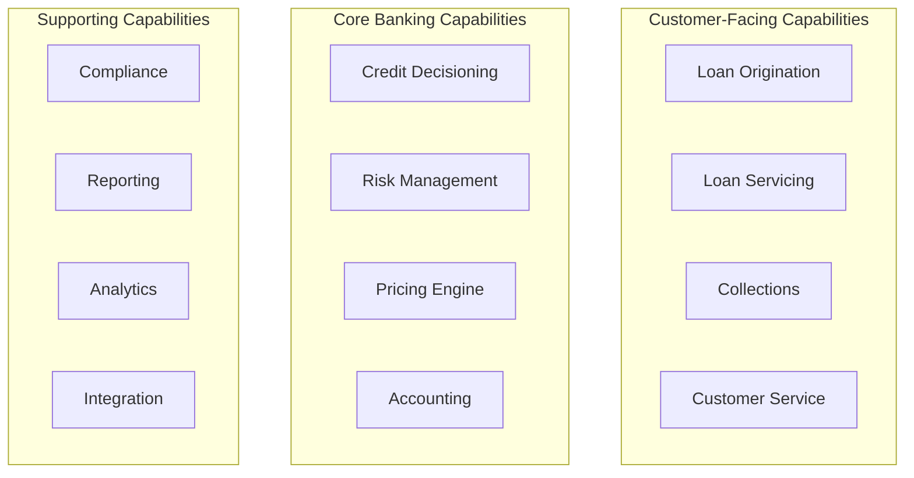
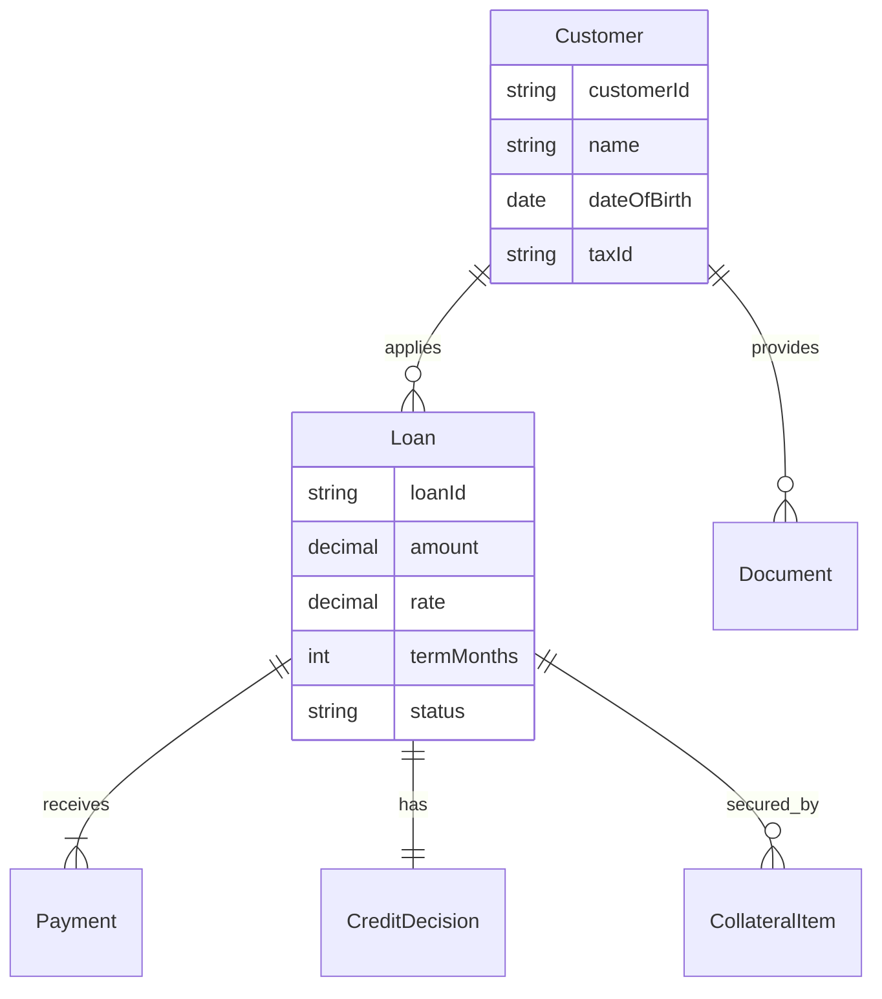
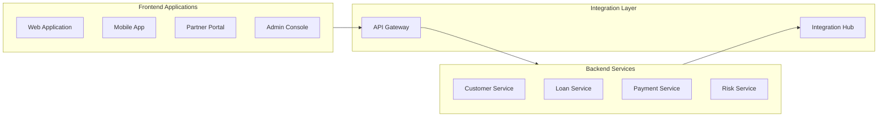
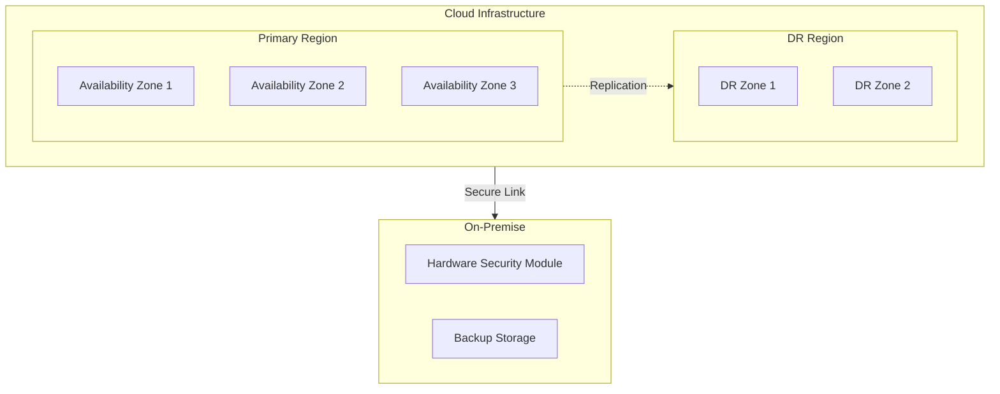

# Enterprise Architecture Document
## Loan Management Platform

### Document Control
- **Version**: 2.0
- **Last Updated**: January 2025
- **Status**: Current State Architecture
- **Classification**: Confidential

---

## 1. Architecture Vision

### 1.1 Business Context

The financial services industry is undergoing a fundamental transformation. Traditional lending processes, built on decades-old systems, cannot meet the demands of modern consumers or the pace of regulatory change. Our architecture vision addresses these challenges through a platform that combines banking domain expertise with modern technology practices.

### 1.2 Strategic Drivers

**Market Forces**
- Digital-native competitors capturing market share
- Customer expectations shaped by consumer technology experiences
- Regulatory complexity increasing globally
- Margin compression requiring operational efficiency

**Technology Trends**
- Cloud-native architectures becoming standard
- Real-time processing expected by default
- Security threats evolving rapidly
- Data privacy regulations tightening

### 1.3 Architecture Goals

1. **Business Agility** - Deploy new products and features in weeks, not quarters
2. **Operational Excellence** - Achieve 99.99% availability with sub-second response times
3. **Security & Compliance** - Meet and exceed regulatory requirements by design
4. **Scalability** - Handle 10x growth without architectural changes
5. **Cost Optimization** - Reduce total cost of ownership by 40%

## 2. Business Architecture

### 2.1 Business Capability Model

### 2.2 Value Streams

**Primary Value Stream: Loan Origination**
1. Customer applies for loan
2. System performs identity verification
3. Credit decision made in real-time
4. Terms presented to customer
5. Documentation generated
6. Funds disbursed

**Supporting Value Streams**
- Payment processing and allocation
- Collections and recovery
- Portfolio management
- Regulatory reporting

### 2.3 Business Process Architecture

Key processes have been redesigned for digital-first operations:

- **Straight-Through Processing** - 80% of applications require no human intervention
- **Exception Management** - Clear escalation paths for complex cases
- **Continuous Monitoring** - Real-time dashboards for operations teams
- **Automated Compliance** - Regulatory checks embedded in workflows

## 3. Data Architecture

### 3.1 Information Architecture

### 3.2 Data Management Strategy

**Master Data Management**
- Single source of truth for customer data
- Golden record creation through data quality rules
- Real-time synchronization across systems

**Data Governance**
- Clear data ownership model
- Quality metrics and monitoring
- Privacy by design implementation

### 3.3 Analytics Architecture

- **Operational Analytics** - Real-time dashboards for business operations
- **Risk Analytics** - Predictive models for credit and fraud
- **Customer Analytics** - 360-degree view and next best action
- **Regulatory Analytics** - Automated report generation

## 4. Application Architecture

### 4.1 Application Portfolio

### 4.2 Service Architecture

**Domain Services**
- Customer Management Service
- Loan Origination Service
- Payment Processing Service
- Risk Assessment Service
- Document Management Service

**Platform Services**
- Authentication & Authorization
- Notification Service
- Audit Service
- Configuration Service
- Monitoring Service

### 4.3 Integration Architecture

**Internal Integration**
- Event-driven architecture using Apache Kafka
- Synchronous APIs for real-time operations
- Batch interfaces for bulk operations

**External Integration**
- Credit bureaus (Equifax, Experian, TransUnion)
- Payment networks (ACH, Fedwire, Card networks)
- Regulatory reporting (HMDA, CRA)
- Identity verification providers

## 5. Technology Architecture

### 5.1 Technology Stack

| Layer | Technology | Justification |
|-------|------------|---------------|
| Runtime | Java 21 | LTS release with virtual threads |
| Framework | Spring Boot 3.4.3 | Industry standard, extensive ecosystem |
| Database | PostgreSQL 15 | ACID compliance, JSON support |
| Cache | Redis 7 | Performance, distributed features |
| Messaging | Apache Kafka | Scalability, reliability |
| Container | Docker | Portability, consistency |
| Orchestration | Kubernetes | Industry standard, cloud-agnostic |
| Service Mesh | Istio | Security, observability |

### 5.2 Infrastructure Architecture

### 5.3 Security Architecture

**Defense in Depth**
1. Network security (WAF, DDoS protection)
2. Application security (OWASP Top 10 mitigation)
3. API security (OAuth 2.1, FAPI 2.0)
4. Data security (encryption at rest and in transit)
5. Identity management (Zero Trust model)

**Compliance Framework**
- PCI DSS for payment card data
- SOC 2 Type II certification
- ISO 27001 information security
- Regional data privacy regulations

## 6. Migration Planning

### 6.1 Current State Assessment

Existing systems include:
- Legacy loan origination system (COBOL/DB2)
- Multiple departmental applications
- Manual processes for exception handling
- Batch-based integrations

### 6.2 Target State Architecture

The target architecture represents a complete transformation:
- Cloud-native microservices
- Real-time event streaming
- API-first integration
- Automated operations

### 6.3 Migration Approach

**Phase 1: Foundation (Q1-Q2 2025)**
- Establish cloud infrastructure
- Deploy core services
- Implement security framework
- Create data migration tools

**Phase 2: Core Migration (Q3-Q4 2025)**
- Migrate customer data
- Deploy loan origination
- Enable payment processing
- Implement risk services

**Phase 3: Enhancement (Q1-Q2 2026)**
- Advanced analytics
- Mobile applications
- Partner integrations
- Legacy decommission

## 7. Architecture Governance

### 7.1 Architecture Principles

1. **Business-Driven** - Technology serves business objectives
2. **Secure by Design** - Security built into every component
3. **Cloud-First** - Default to cloud-native solutions
4. **API-Centric** - All capabilities exposed as APIs
5. **Data-Driven** - Decisions based on data insights

### 7.2 Standards and Guidelines

**Development Standards**
- Code review mandatory for all changes
- Automated testing minimum 80% coverage
- Performance budgets for all services
- Security scanning in CI/CD pipeline

**Operational Standards**
- SLO of 99.99% availability
- RPO of 1 hour, RTO of 4 hours
- Incident response within 15 minutes
- Change approval through CAB

### 7.3 Architecture Review Board

Monthly reviews covering:
- Architectural decisions and trade-offs
- Technology selection and standards
- Integration patterns and practices
- Security and compliance updates

## 8. Appendices

### A. Architecture Views

- [System Context Diagram](architecture/generated-diagrams/Enterprise%20Loan%20Management%20System%20-%20System%20Context%20(Java%2021).svg)
- [Component Architecture](architecture/generated-diagrams/Enterprise%20Loan%20Management%20System%20-%20Hexagonal%20Architecture%20(Java%2021).svg)
- [Deployment Architecture](application-architecture/microservices/generated-diagrams/Enterprise%20Loan%20Management%20-%20Microservices%20Architecture.svg)
- [Security Architecture](security-architecture/security-models/generated-diagrams/FAPI%202.0%20Security%20Architecture%20(Java%2021).svg)

### B. Reference Documentation

- API Specification Guide
- Security Implementation Guide
- Operations Runbook
- Developer Onboarding Guide

### C. Glossary

| Term | Definition |
|------|------------|
| DPoP | Demonstrating Proof of Possession |
| FAPI | Financial-grade API |
| HSM | Hardware Security Module |
| KYC | Know Your Customer |
| PII | Personally Identifiable Information |
| SLO | Service Level Objective |

---

**Document Approval**

| Role | Name | Date |
|------|------|------|
| Chief Architect | Ali Copur | January 2025 |
| CTO | [Pending] | [Pending] |
| CISO | [Pending] | [Pending] |