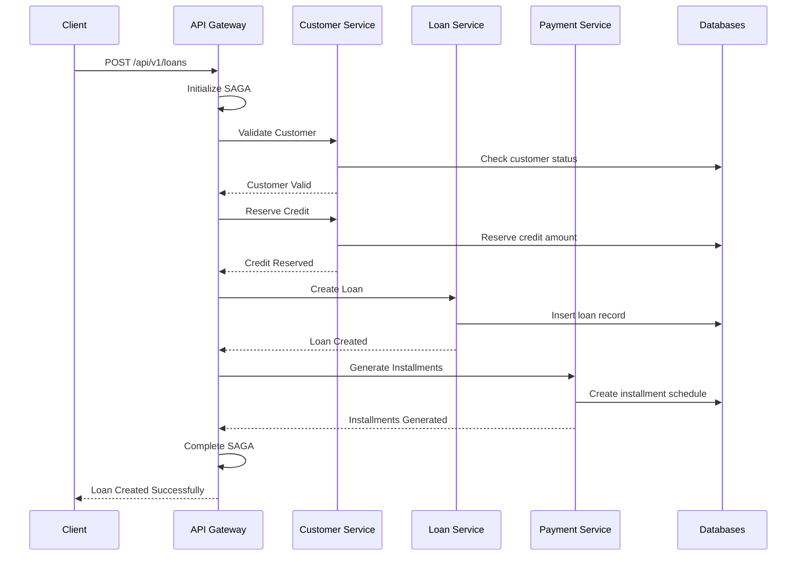
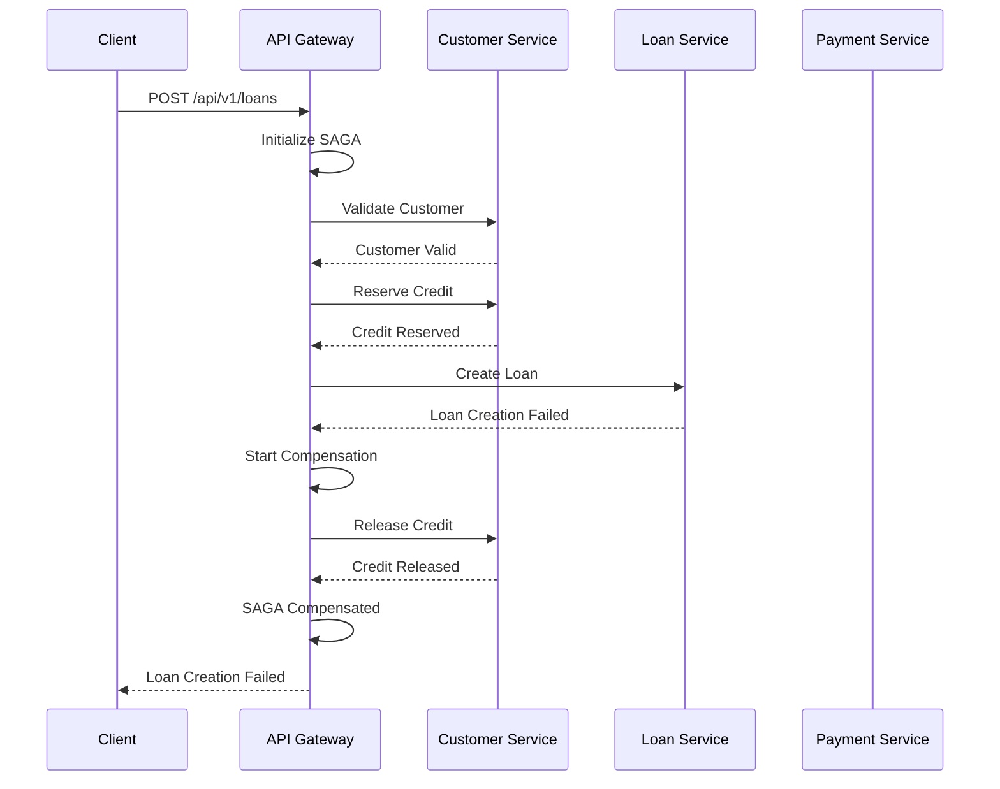

# SAGA Pattern Implementation Guide
## Distributed Transaction Management in Microservices Architecture

### Overview

The Enterprise Loan Management System implements the SAGA orchestration pattern to manage distributed transactions across microservices while maintaining data consistency and system reliability.

---

## SAGA Pattern Architecture

### Core Components

#### 1. SAGA Orchestrator
**Location**: API Gateway Service (Port 8080)  
**Class**: `LoanCreationSagaOrchestrator`  
**Responsibility**: Coordinates distributed transactions across services

```java
@Component
public class LoanCreationSagaOrchestrator {
    
    private final CustomerServiceClient customerClient;
    private final LoanServiceClient loanClient;
    private final PaymentServiceClient paymentClient;
    private final SagaStateRepository sagaStateRepository;
    
    public SagaResult executeLoanCreationSaga(LoanApplicationRequest request) {
        String sagaId = UUID.randomUUID().toString();
        SagaState sagaState = initializeSagaState(sagaId, request);
        
        try {
            // Step 1: Validate Customer
            validateCustomer(sagaState);
            
            // Step 2: Reserve Credit
            reserveCredit(sagaState);
            
            // Step 3: Create Loan
            createLoan(sagaState);
            
            // Step 4: Generate Installments
            generateInstallments(sagaState);
            
            // Step 5: Complete Transaction
            completeSaga(sagaState);
            
            return SagaResult.success(sagaState);
            
        } catch (SagaException e) {
            return compensate(sagaState, e);
        }
    }
}
```

#### 2. SAGA State Management
**Database**: `banking_gateway.saga_states`  
**Purpose**: Track transaction progress and compensation requirements

```sql
CREATE TABLE saga_states (
    saga_id VARCHAR(255) PRIMARY KEY,
    saga_type VARCHAR(100) NOT NULL,
    current_step VARCHAR(100) NOT NULL,
    saga_data JSONB NOT NULL,
    completed_steps JSONB NOT NULL,
    compensation_data JSONB,
    status VARCHAR(50) NOT NULL,
    created_at TIMESTAMP DEFAULT CURRENT_TIMESTAMP,
    updated_at TIMESTAMP DEFAULT CURRENT_TIMESTAMP,
    timeout_at TIMESTAMP NOT NULL
);
```

---

## SAGA Workflow Scenarios

### Scenario 1: Successful Loan Creation



### Scenario 2: Failed Loan Creation with Compensation



---

## SAGA Implementation Details

### Step-by-Step Breakdown

#### Step 1: Customer Validation
```java
private void validateCustomer(SagaState sagaState) throws SagaException {
    LoanApplicationRequest request = sagaState.getRequest();
    
    CustomerResponse customer = customerClient.getCustomer(request.getCustomerId());
    
    if (customer == null || !customer.isActive()) {
        throw new SagaException("Customer validation failed", 
                               SagaStep.VALIDATE_CUSTOMER);
    }
    
    sagaState.addCompletedStep(SagaStep.VALIDATE_CUSTOMER, customer);
    updateSagaState(sagaState);
}
```

#### Step 2: Credit Reservation
```java
private void reserveCredit(SagaState sagaState) throws SagaException {
    LoanApplicationRequest request = sagaState.getRequest();
    
    CreditReservationRequest creditRequest = CreditReservationRequest.builder()
            .customerId(request.getCustomerId())
            .amount(request.getLoanAmount())
            .reservationId(sagaState.getSagaId())
            .build();
    
    CreditReservationResponse reservation = 
            customerClient.reserveCredit(creditRequest);
    
    if (!reservation.isSuccessful()) {
        throw new SagaException("Credit reservation failed", 
                               SagaStep.RESERVE_CREDIT);
    }
    
    sagaState.addCompletedStep(SagaStep.RESERVE_CREDIT, reservation);
    sagaState.addCompensationData(SagaStep.RESERVE_CREDIT, 
                                  Map.of("reservationId", reservation.getReservationId()));
    updateSagaState(sagaState);
}
```

#### Step 3: Loan Creation
```java
private void createLoan(SagaState sagaState) throws SagaException {
    LoanApplicationRequest request = sagaState.getRequest();
    
    LoanCreationRequest loanRequest = LoanCreationRequest.builder()
            .customerId(request.getCustomerId())
            .loanAmount(request.getLoanAmount())
            .interestRate(request.getInterestRate())
            .installmentCount(request.getInstallmentCount())
            .sagaId(sagaState.getSagaId())
            .build();
    
    LoanCreationResponse loanResponse = loanClient.createLoan(loanRequest);
    
    if (!loanResponse.isSuccessful()) {
        throw new SagaException("Loan creation failed", 
                               SagaStep.CREATE_LOAN);
    }
    
    sagaState.addCompletedStep(SagaStep.CREATE_LOAN, loanResponse);
    sagaState.addCompensationData(SagaStep.CREATE_LOAN, 
                                  Map.of("loanId", loanResponse.getLoanId()));
    updateSagaState(sagaState);
}
```

#### Step 4: Installment Generation
```java
private void generateInstallments(SagaState sagaState) throws SagaException {
    LoanCreationResponse loanResponse = sagaState.getStepData(SagaStep.CREATE_LOAN);
    
    InstallmentGenerationRequest installmentRequest = 
            InstallmentGenerationRequest.builder()
                    .loanId(loanResponse.getLoanId())
                    .loanAmount(loanResponse.getLoanAmount())
                    .interestRate(loanResponse.getInterestRate())
                    .installmentCount(loanResponse.getInstallmentCount())
                    .build();
    
    InstallmentGenerationResponse installmentResponse = 
            paymentClient.generateInstallments(installmentRequest);
    
    if (!installmentResponse.isSuccessful()) {
        throw new SagaException("Installment generation failed", 
                               SagaStep.GENERATE_INSTALLMENTS);
    }
    
    sagaState.addCompletedStep(SagaStep.GENERATE_INSTALLMENTS, installmentResponse);
    updateSagaState(sagaState);
}
```

---

## Compensation Workflows

### Credit Release Compensation
```java
private void compensateCreditReservation(SagaState sagaState) {
    Map<String, Object> compensationData = 
            sagaState.getCompensationData(SagaStep.RESERVE_CREDIT);
    
    if (compensationData != null) {
        String reservationId = (String) compensationData.get("reservationId");
        
        CreditReleaseRequest releaseRequest = CreditReleaseRequest.builder()
                .reservationId(reservationId)
                .reason("SAGA Compensation")
                .build();
        
        try {
            CustomerService.releaseCredit(releaseRequest);
            sagaState.markStepCompensated(SagaStep.RESERVE_CREDIT);
        } catch (Exception e) {
            log.error("Failed to compensate credit reservation: {}", e.getMessage());
            sagaState.markCompensationFailed(SagaStep.RESERVE_CREDIT);
        }
    }
}
```

### Loan Deletion Compensation
```java
private void compensateLoanCreation(SagaState sagaState) {
    Map<String, Object> compensationData = 
            sagaState.getCompensationData(SagaStep.CREATE_LOAN);
    
    if (compensationData != null) {
        String loanId = (String) compensationData.get("loanId");
        
        LoanDeletionRequest deletionRequest = LoanDeletionRequest.builder()
                .loanId(loanId)
                .reason("SAGA Compensation")
                .build();
        
        try {
            loanClient.deleteLoan(deletionRequest);
            sagaState.markStepCompensated(SagaStep.CREATE_LOAN);
        } catch (Exception e) {
            log.error("Failed to compensate loan creation: {}", e.getMessage());
            sagaState.markCompensationFailed(SagaStep.CREATE_LOAN);
        }
    }
}
```

---

## Timeout and Recovery

### Automatic Timeout Detection
```java
@Scheduled(fixedDelay = 30000) // Check every 30 seconds
public void detectTimeoutSagas() {
    List<SagaState> timeoutSagas = sagaStateRepository.findTimeoutSagas();
    
    for (SagaState sagaState : timeoutSagas) {
        log.warn("SAGA timeout detected: {}", sagaState.getSagaId());
        
        sagaState.setStatus(SagaStatus.TIMEOUT);
        sagaState.setTimeoutAt(Instant.now());
        
        // Start compensation workflow
        compensate(sagaState, new SagaTimeoutException("SAGA timeout after 5 minutes"));
    }
}
```

### Recovery Mechanisms
```java
@EventListener
public void handleSagaRecovery(SagaRecoveryEvent event) {
    SagaState sagaState = sagaStateRepository.findById(event.getSagaId());
    
    if (sagaState != null && sagaState.getStatus() == SagaStatus.FAILED) {
        // Attempt recovery based on failure point
        switch (sagaState.getCurrentStep()) {
            case VALIDATE_CUSTOMER:
                // Retry customer validation
                retryCustomerValidation(sagaState);
                break;
            case RESERVE_CREDIT:
                // Check if credit is still available
                retryCreditorReservation(sagaState);
                break;
            case CREATE_LOAN:
                // Verify loan creation state
                retryLoanCreation(sagaState);
                break;
            case GENERATE_INSTALLMENTS:
                // Regenerate installments if needed
                retryInstallmentGeneration(sagaState);
                break;
        }
    }
}
```

---

## Event-Driven SAGA Communication

### Kafka Topic Configuration
```yaml
saga:
  topics:
    commands: "saga-commands"
    events: "saga-events"
    compensation: "saga-compensation"
  consumer:
    group-id: "saga-orchestrator"
    auto-offset-reset: "earliest"
  producer:
    retries: 3
    batch-size: 16384
```

### Event Publishing
```java
@Component
public class SagaEventPublisher {
    
    private final KafkaTemplate<String, SagaEvent> kafkaTemplate;
    
    public void publishSagaStarted(SagaState sagaState) {
        SagaEvent event = SagaEvent.builder()
                .sagaId(sagaState.getSagaId())
                .eventType(SagaEventType.SAGA_STARTED)
                .timestamp(Instant.now())
                .data(sagaState.toEventData())
                .build();
        
        kafkaTemplate.send("saga-events", event.getSagaId(), event);
    }
    
    public void publishStepCompleted(SagaState sagaState, SagaStep step) {
        SagaEvent event = SagaEvent.builder()
                .sagaId(sagaState.getSagaId())
                .eventType(SagaEventType.STEP_COMPLETED)
                .step(step)
                .timestamp(Instant.now())
                .data(sagaState.getStepData(step))
                .build();
        
        kafkaTemplate.send("saga-events", event.getSagaId(), event);
    }
}
```

---

## Monitoring and Observability

### SAGA Metrics
```java
@Component
public class SagaMetrics {
    
    private final MeterRegistry meterRegistry;
    private final Counter sagaStartedCounter;
    private final Counter sagaCompletedCounter;
    private final Counter sagaFailedCounter;
    private final Timer sagaExecutionTimer;
    
    public void recordSagaStarted(String sagaType) {
        sagaStartedCounter.increment(Tags.of("saga_type", sagaType));
    }
    
    public void recordSagaCompleted(String sagaType, Duration duration) {
        sagaCompletedCounter.increment(Tags.of("saga_type", sagaType));
        sagaExecutionTimer.record(duration);
    }
    
    public void recordSagaFailed(String sagaType, String failureReason) {
        sagaFailedCounter.increment(Tags.of(
            "saga_type", sagaType,
            "failure_reason", failureReason
        ));
    }
}
```

### Health Checks
```java
@Component
public class SagaHealthIndicator implements HealthIndicator {
    
    private final SagaStateRepository sagaStateRepository;
    
    @Override
    public Health health() {
        try {
            long activeSagas = sagaStateRepository.countActiveSagas();
            long timeoutSagas = sagaStateRepository.countTimeoutSagas();
            long failedSagas = sagaStateRepository.countFailedSagas();
            
            if (timeoutSagas > 10 || failedSagas > 5) {
                return Health.down()
                        .withDetail("active_sagas", activeSagas)
                        .withDetail("timeout_sagas", timeoutSagas)
                        .withDetail("failed_sagas", failedSagas)
                        .build();
            }
            
            return Health.up()
                    .withDetail("active_sagas", activeSagas)
                    .withDetail("timeout_sagas", timeoutSagas)
                    .withDetail("failed_sagas", failedSagas)
                    .build();
            
        } catch (Exception e) {
            return Health.down(e).build();
        }
    }
}
```

---

## Configuration and Tuning

### SAGA Configuration Properties
```yaml
banking:
  saga:
    timeout:
      default: 300000  # 5 minutes
      loan-creation: 300000
      payment-processing: 180000
    retry:
      max-attempts: 3
      backoff-delay: 1000
      backoff-multiplier: 2.0
    compensation:
      timeout: 60000  # 1 minute
      max-attempts: 5
    monitoring:
      health-check-interval: 30000
      metrics-export-interval: 10000
```

### Performance Optimization
- **Parallel Compensation**: Non-dependent compensation steps execute in parallel
- **Batch Processing**: Multiple SAGA operations batched for efficiency
- **State Caching**: Redis caching for frequently accessed SAGA states
- **Event Deduplication**: Kafka exactly-once semantics for event processing

---

## Testing SAGA Patterns

### Integration Test Example
```java
@SpringBootTest
@TestMethodOrder(OrderAnnotation.class)
class SagaIntegrationTest {
    
    @Test
    @Order(1)
    void testSuccessfulLoanCreationSaga() {
        // Given
        LoanApplicationRequest request = createValidLoanRequest();
        
        // When
        SagaResult result = sagaOrchestrator.executeLoanCreationSaga(request);
        
        // Then
        assertThat(result.isSuccessful()).isTrue();
        
        // Verify all steps completed
        SagaState sagaState = sagaStateRepository.findById(result.getSagaId());
        assertThat(sagaState.getCompletedSteps()).hasSize(4);
        assertThat(sagaState.getStatus()).isEqualTo(SagaStatus.COMPLETED);
    }
    
    @Test
    @Order(2)
    void testFailedLoanCreationWithCompensation() {
        // Given
        LoanApplicationRequest request = createInvalidLoanRequest();
        
        // When
        SagaResult result = sagaOrchestrator.executeLoanCreationSaga(request);
        
        // Then
        assertThat(result.isSuccessful()).isFalse();
        
        // Verify compensation executed
        SagaState sagaState = sagaStateRepository.findById(result.getSagaId());
        assertThat(sagaState.getStatus()).isEqualTo(SagaStatus.COMPENSATED);
    }
}
```

This SAGA pattern implementation ensures distributed transaction integrity across the microservices architecture while maintaining high availability and fault tolerance through comprehensive compensation workflows and monitoring capabilities.