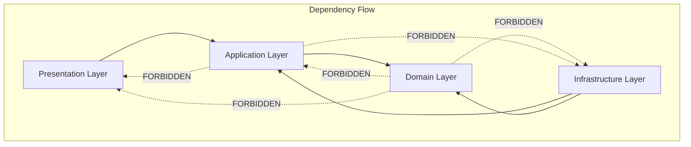

# 🛡️ Enhanced Enterprise Banking System - Architecture Guardrails

## 📖 Executive Summary

The Architecture Guardrails establish mandatory design principles, patterns, and constraints that ensure the Enhanced Enterprise Banking System maintains architectural integrity, security compliance, and operational excellence. These guardrails provide clear guidance for development teams while preventing architectural drift and ensuring consistency across all banking services.

### Guardrail Philosophy

**"Architecture guardrails are not barriers to innovation, but guidelines that enable secure, scalable, and compliant innovation within defined boundaries."**

---

## 🏗️ Core Architecture Guardrails

### 1. Domain-Driven Design (DDD) Guardrails

#### **G001: Pure Domain Models**
```java
// ✅ CORRECT: Pure domain model with no infrastructure dependencies
public class Loan extends AggregateRoot<LoanId> {
    private final LoanId id;
    private final CustomerId customerId;
    private Money principalAmount;
    private LoanStatus status;
    
    // Pure business logic only
    public void approve(ApprovalCriteria criteria) {
        if (!meetsCriteria(criteria)) {
            throw new LoanApprovalException("Loan does not meet approval criteria");
        }
        this.status = LoanStatus.APPROVED;
        addDomainEvent(new LoanApprovedEvent(this));
    }
}

// ❌ INCORRECT: Domain model with infrastructure dependencies
public class BadLoan {
    @Entity
    @Table(name = "loans")  // Infrastructure concern in domain
    private Long id;
    
    @Autowired
    private EmailService emailService;  // Infrastructure dependency
}
```

**Enforcement:**
- No `@Entity`, `@Table`, or JPA annotations in domain models
- No framework-specific annotations in core domain
- Domain events for all state changes
- Factory methods for aggregate creation

#### **G002: Bounded Context Isolation**
```yaml
# Enforced Boundaries
banking_contexts:
  customer_management:
    domain_services: [CustomerService, KYCService]
    value_objects: [CustomerId, PersonalInfo, ContactInfo]
    aggregates: [Customer]
    
  loan_processing:
    domain_services: [LoanService, UnderwritingService]
    value_objects: [LoanId, Money, LoanTerm]
    aggregates: [Loan, LoanApplication]
    
  # ❌ VIOLATION: Cross-context direct dependencies
  forbidden_dependencies:
    - customer_management -> loan_processing.Loan
    - loan_processing -> payment_processing.Payment
```

**Enforcement:**
- Context mapping through events only
- No direct aggregate references across contexts
- Shared kernel for common value objects only
- API contracts for cross-context communication

### 2. Hexagonal Architecture Guardrails

#### **G003: Port-Adapter Pattern**
```java
// ✅ CORRECT: Application service with ports
@ApplicationService
public class LoanApplicationService {
    private final LoanRepository loanRepository;        // Port
    private final PaymentGateway paymentGateway;       // Port
    private final DomainEventPublisher eventPublisher; // Port
    
    public LoanApplicationService(
        LoanRepository loanRepository,
        PaymentGateway paymentGateway,
        DomainEventPublisher eventPublisher) {
        this.loanRepository = loanRepository;
        this.paymentGateway = paymentGateway;
        this.eventPublisher = eventPublisher;
    }
}

// ❌ INCORRECT: Direct infrastructure dependencies
@Service
public class BadLoanService {
    @Autowired
    private JpaLoanRepository jpaRepository;  // Direct adapter dependency
    
    @Autowired
    private KafkaTemplate kafkaTemplate;     // Infrastructure leak
}
```

**Enforcement:**
- All external dependencies through interfaces (ports)
- Infrastructure adapters implement ports
- No framework annotations in application layer
- Constructor injection only

#### **G004: Layer Dependency Rules**


**Enforcement:**
- Domain layer has zero dependencies
- Application layer depends only on domain
- Infrastructure implements application ports
- Presentation layer orchestrates application services

### 3. Security Architecture Guardrails

#### **G005: Zero-Trust Communication**
```yaml
# ✅ REQUIRED: All service communication through mTLS
service_communication:
  authentication: MUTUAL_TLS
  encryption: TLS_1_3
  authorization: JWT_VALIDATION
  
# ❌ FORBIDDEN: Unencrypted communication
forbidden_protocols:
  - HTTP
  - PLAIN_TCP
  - UNENCRYPTED_GRPC
```

**Enforcement:**
- Istio PeerAuthentication with STRICT mode
- No HTTP endpoints (HTTPS only)
- JWT token validation at sidecar level
- Service-to-service certificates mandatory

#### **G006: OAuth 2.1 Compliance**
```java
// ✅ CORRECT: Secure endpoint with proper authorization
@RestController
@RequestMapping("/api/v1/loans")
@PreAuthorize("hasRole('BANKING_OFFICER')")
public class LoanController {
    
    @PostMapping
    @PreAuthorize("hasAuthority('loan:create')")
    public ResponseEntity<LoanResponse> createLoan(
        @Valid @RequestBody CreateLoanRequest request,
        Authentication authentication) {
        
        // Extract user context from JWT
        UserPrincipal user = (UserPrincipal) authentication.getPrincipal();
        
        // Business logic with security context
        CreateLoanCommand command = CreateLoanCommand.builder()
            .customerId(request.getCustomerId())
            .amount(request.getAmount())
            .createdBy(user.getUserId())
            .build();
            
        return ResponseEntity.ok(loanService.createLoan(command));
    }
}

// ❌ INCORRECT: Unsecured endpoint
@RestController
public class UnsecureLoanController {
    @PostMapping("/loans")
    public ResponseEntity<?> createLoan(@RequestBody Object request) {
        // No authentication/authorization checks
        return ResponseEntity.ok("Created");
    }
}
```

**Enforcement:**
- All endpoints require authentication
- Role-based authorization mandatory
- FAPI-compliant headers required
- Input validation on all requests

### 4. Data Architecture Guardrails

#### **G007: Data Encryption Standards**
```yaml
# Encryption Requirements
data_protection:
  at_rest:
    algorithm: AES_256_GCM
    key_management: HSM
    database_tde: MANDATORY
    
  in_transit:
    minimum_tls: "1.3"
    cipher_suites: 
      - TLS_AES_256_GCM_SHA384
      - TLS_CHACHA20_POLY1305_SHA256
    
  application_level:
    pii_fields: ENCRYPTED
    financial_data: TOKENIZED
    audit_logs: IMMUTABLE
```

**Enforcement:**
- Database Transparent Data Encryption (TDE)
- Field-level encryption for PII
- Tokenization for sensitive financial data
- Immutable audit trails

#### **G008: Database Access Patterns**
```java
// ✅ CORRECT: Repository pattern with proper error handling
@Repository
public class JpaLoanRepository implements LoanRepository {
    
    @Override
    public Optional<Loan> findById(LoanId loanId) {
        try {
            LoanEntity entity = entityManager.find(LoanEntity.class, loanId.getValue());
            return Optional.ofNullable(entity).map(this::toDomain);
        } catch (Exception e) {
            log.error("Database error finding loan: {}", loanId, e);
            throw new RepositoryException("Failed to retrieve loan", e);
        }
    }
    
    @Override
    @Transactional
    public void save(Loan loan) {
        try {
            LoanEntity entity = toEntity(loan);
            entityManager.merge(entity);
        } catch (Exception e) {
            log.error("Database error saving loan: {}", loan.getId(), e);
            throw new RepositoryException("Failed to save loan", e);
        }
    }
}

// ❌ INCORRECT: Direct entity exposure and poor error handling
@Repository
public class BadRepository {
    
    // Exposes JPA entities directly
    public LoanEntity findLoan(Long id) {
        return entityManager.find(LoanEntity.class, id);
    }
    
    // No error handling
    public void saveLoan(LoanEntity entity) {
        entityManager.persist(entity);
    }
}
```

**Enforcement:**
- Repository pattern for all data access
- Domain models separate from persistence models
- Comprehensive error handling
- Transaction boundaries at service level

### 5. Event-Driven Architecture Guardrails

#### **G009: Domain Event Standards**
```java
// ✅ CORRECT: Well-structured domain event
public class LoanApprovedEvent implements DomainEvent {
    private final LoanId loanId;
    private final CustomerId customerId;
    private final Money approvedAmount;
    private final String approvedBy;
    private final Instant occurredOn;
    private final String eventId;
    
    public LoanApprovedEvent(Loan loan, String approvedBy) {
        this.loanId = loan.getId();
        this.customerId = loan.getCustomerId();
        this.approvedAmount = loan.getPrincipalAmount();
        this.approvedBy = approvedBy;
        this.occurredOn = Instant.now();
        this.eventId = UUID.randomUUID().toString();
    }
    
    // Immutable getters only
}

// ❌ INCORRECT: Mutable event with missing metadata
public class BadEvent {
    public String loanId;  // Mutable and primitive type
    public Date when;      // Missing event metadata
    
    // No validation or immutability
}
```

**Enforcement:**
- Immutable event objects
- Rich event metadata (eventId, occurredOn, version)
- Semantic event names
- Event versioning strategy

#### **G010: Saga Pattern Implementation**
```java
// ✅ CORRECT: Saga with compensation logic
@Saga
public class LoanProcessingSaga {
    
    @SagaStart
    public void handle(LoanApplicationSubmittedEvent event) {
        try {
            // Step 1: Credit check
            sagaManager.send(new PerformCreditCheckCommand(event.getLoanId()));
        } catch (Exception e) {
            sagaManager.compensate(new RejectLoanApplicationCommand(event.getLoanId()));
            throw new SagaExecutionException("Failed to start credit check", e);
        }
    }
    
    @SagaStep(compensationMethod = "compensateCreditCheck")
    public void handle(CreditCheckCompletedEvent event) {
        if (event.getCreditScore().getValue() < 650) {
            sagaManager.compensate(new RejectLoanApplicationCommand(event.getLoanId()));
            return;
        }
        
        try {
            // Step 2: Funds reservation
            sagaManager.send(new ReserveFundsCommand(event.getLoanId()));
        } catch (Exception e) {
            sagaManager.compensate(new RejectLoanApplicationCommand(event.getLoanId()));
            throw new SagaExecutionException("Failed to reserve funds", e);
        }
    }
    
    // Compensation methods for each step
    public void compensateCreditCheck(CreditCheckCompletedEvent event) {
        sagaManager.send(new CancelCreditCheckCommand(event.getLoanId()));
    }
}
```

**Enforcement:**
- Compensation logic for each saga step
- Timeout handling for all saga operations
- Idempotent saga operations
- Comprehensive error handling and logging

---

## 🔧 Implementation Guardrails

### 6. Code Quality Guardrails

#### **G011: Exception Handling Standards**
```java
// ✅ CORRECT: Structured exception hierarchy
public class LoanDomainException extends DomainException {
    private final LoanId loanId;
    private final ErrorCode errorCode;
    
    public LoanDomainException(String message, LoanId loanId, ErrorCode errorCode) {
        super(message);
        this.loanId = loanId;
        this.errorCode = errorCode;
    }
    
    public LoanDomainException(String message, Throwable cause, LoanId loanId, ErrorCode errorCode) {
        super(message, cause);
        this.loanId = loanId;
        this.errorCode = errorCode;
    }
}

// Specific business exceptions
public class InsufficientCreditScoreException extends LoanDomainException {
    public InsufficientCreditScoreException(LoanId loanId, CreditScore score) {
        super(
            String.format("Insufficient credit score %d for loan %s", score.getValue(), loanId),
            loanId,
            ErrorCode.INSUFFICIENT_CREDIT_SCORE
        );
    }
}

// ❌ INCORRECT: Generic exceptions without context
public class BadService {
    public void processLoan(String loanId) throws Exception {  // Too generic
        if (loanId == null) {
            throw new RuntimeException("Bad loan ID");  // No context
        }
    }
}
```

**Enforcement:**
- Domain-specific exception hierarchy
- Rich error context and metadata
- No generic Exception throws
- Proper exception logging and monitoring

#### **G012: Logging and Observability**
```java
// ✅ CORRECT: Structured logging with context
@Slf4j
@Component
public class LoanApplicationService {
    
    public LoanApplicationResult createLoan(CreateLoanCommand command) {
        MDC.put("loanId", command.getLoanId().toString());
        MDC.put("customerId", command.getCustomerId().toString());
        MDC.put("operation", "createLoan");
        
        try {
            log.info("Starting loan application process for customer: {}", 
                command.getCustomerId());
            
            // Business logic
            Loan loan = loanFactory.createLoan(command);
            loanRepository.save(loan);
            
            log.info("Loan application created successfully: {}", loan.getId());
            
            // Metrics
            meterRegistry.counter("loan.applications.created",
                "loanType", loan.getType().toString(),
                "amount", loan.getPrincipalAmount().getCurrency().toString()
            ).increment();
            
            return LoanApplicationResult.success(loan.getId());
            
        } catch (LoanDomainException e) {
            log.error("Domain error creating loan application: {}", e.getMessage(), e);
            meterRegistry.counter("loan.applications.failed",
                "reason", "domain_error",
                "errorCode", e.getErrorCode().toString()
            ).increment();
            throw e;
        } catch (Exception e) {
            log.error("Unexpected error creating loan application", e);
            meterRegistry.counter("loan.applications.failed",
                "reason", "system_error"
            ).increment();
            throw new LoanSystemException("System error processing loan application", e);
        } finally {
            MDC.clear();
        }
    }
}
```

**Enforcement:**
- Structured logging with correlation IDs
- Business metrics for all operations
- Distributed tracing headers
- Security audit logs for sensitive operations

### 7. Performance Guardrails

#### **G013: Caching Strategies**
```java
// ✅ CORRECT: Multi-level caching with proper invalidation
@Service
public class CustomerQueryService {
    
    @Cacheable(value = "customers", key = "#customerId.value", 
               unless = "#result == null")
    public Optional<CustomerView> findCustomer(CustomerId customerId) {
        try {
            return customerRepository.findById(customerId)
                .map(customerViewMapper::toView);
        } catch (Exception e) {
            log.error("Error retrieving customer: {}", customerId, e);
            // Cache miss on error - don't cache null results
            return Optional.empty();
        }
    }
    
    @CacheEvict(value = "customers", key = "#customerId.value")
    public void invalidateCustomerCache(CustomerId customerId) {
        log.debug("Invalidating cache for customer: {}", customerId);
    }
    
    // Bulk operations with cache warming
    @Cacheable(value = "customerSummaries", key = "#page + '-' + #size")
    public Page<CustomerSummary> findCustomerSummaries(int page, int size) {
        return customerRepository.findAllSummaries(PageRequest.of(page, size));
    }
}
```

**Enforcement:**
- Cache expiration policies mandatory
- Cache invalidation strategies defined
- No caching of sensitive data without encryption
- Circuit breakers for cache dependencies

#### **G014: Database Performance**
```sql
-- ✅ REQUIRED: All queries must be optimized with proper indexing
CREATE INDEX CONCURRENTLY idx_loans_customer_status 
ON loans(customer_id, status) 
WHERE status IN ('PENDING', 'APPROVED');

CREATE INDEX CONCURRENTLY idx_payments_loan_date 
ON payments(loan_id, payment_date DESC);

-- ✅ REQUIRED: Query performance validation
EXPLAIN (ANALYZE, BUFFERS) 
SELECT l.id, l.principal_amount, l.status
FROM loans l
JOIN customers c ON l.customer_id = c.id
WHERE c.credit_score >= 700
  AND l.status = 'PENDING'
  AND l.created_at >= CURRENT_DATE - INTERVAL '30 days';

-- ❌ FORBIDDEN: Unoptimized queries
SELECT * FROM loans WHERE principal_amount::text LIKE '%1000%';  -- Function on column
SELECT * FROM customers WHERE UPPER(last_name) = 'SMITH';        -- No index on function
```

**Enforcement:**
- All queries must have execution plans reviewed
- Query performance tests in CI/CD
- Database connection pooling mandatory
- Read replicas for reporting queries

---

## 📋 Compliance Guardrails

### 8. Security Compliance

#### **G015: PCI DSS Compliance**
```java
// ✅ CORRECT: PCI-compliant payment processing
@Service
@Validated
public class PaymentProcessingService {
    
    @Audit(event = "PAYMENT_PROCESSED")
    public PaymentResult processPayment(
        @Valid @Encrypted PaymentRequest request) {
        
        // PCI DSS: Never log sensitive payment data
        MDC.put("paymentId", request.getPaymentId().toString());
        MDC.put("amount", request.getAmount().toString());
        // DON'T log card numbers or CVV
        
        try {
            // Tokenize sensitive data immediately
            PaymentToken token = paymentTokenizer.tokenize(request.getCardData());
            
            // Process with token only
            PaymentResult result = paymentGateway.processPayment(
                token, request.getAmount());
                
            // Audit successful payment
            auditService.logPaymentEvent(PaymentAuditEvent.builder()
                .paymentId(request.getPaymentId())
                .amount(request.getAmount())
                .status(result.getStatus())
                .timestamp(Instant.now())
                .build());
                
            return result;
            
        } catch (PaymentProcessingException e) {
            // Audit failed payment (without sensitive data)
            auditService.logPaymentEvent(PaymentAuditEvent.builder()
                .paymentId(request.getPaymentId())
                .amount(request.getAmount())
                .status(PaymentStatus.FAILED)
                .errorCode(e.getErrorCode())
                .timestamp(Instant.now())
                .build());
            throw e;
        }
    }
}
```

**Enforcement:**
- No sensitive data in logs
- Tokenization of payment card data
- Audit trails for all financial transactions
- Access controls based on job function

#### **G016: GDPR Compliance**
```java
// ✅ CORRECT: GDPR-compliant data handling
@Entity
public class CustomerEntity {
    
    @Encrypted
    @PersonalData(category = "IDENTITY")
    private String firstName;
    
    @Encrypted  
    @PersonalData(category = "IDENTITY")
    private String lastName;
    
    @Encrypted
    @PersonalData(category = "CONTACT")
    private String email;
    
    @PersonalData(category = "FINANCIAL", retention = "7_YEARS")
    private String accountNumber;
    
    @GDPRRetention(period = "3_YEARS", autoDelete = true)
    private LocalDateTime consentGivenAt;
    
    @GDPRRetention(period = "INDEFINITE", reason = "LEGAL_OBLIGATION")
    private LocalDateTime accountOpenedAt;
}

// Data subject rights implementation
@Service
public class GDPRComplianceService {
    
    @Audit(event = "DATA_EXPORT_REQUESTED")
    public CustomerDataExport exportCustomerData(CustomerId customerId) {
        // Right to data portability
        return customerDataExportService.exportAllData(customerId);
    }
    
    @Audit(event = "DATA_DELETION_REQUESTED")
    public void deleteCustomerData(CustomerId customerId, DeletionReason reason) {
        // Right to erasure (with legal obligations check)
        gdprDeletionService.deleteCustomerData(customerId, reason);
    }
}
```

**Enforcement:**
- Data classification and retention policies
- Consent management mechanisms
- Data subject rights implementation
- Privacy by design principles

---

## 🎯 Enforcement Mechanisms

### Automated Guardrail Validation

#### Architecture Testing
```java
// ArchUnit tests for guardrail enforcement
@AnalyzeClasses(packages = "com.bank.loanmanagement")
public class ArchitectureGuardrailsTest {
    
    @ArchTest
    static final ArchRule domain_should_not_depend_on_infrastructure =
        classes().that().resideInAPackage("..domain..")
            .should().onlyDependOnClassesThat()
            .resideInAnyPackage("..domain..", "java..", "javax..");
    
    @ArchTest
    static final ArchRule controllers_should_be_secured =
        classes().that().areAnnotatedWith(RestController.class)
            .should().beAnnotatedWith(PreAuthorize.class)
            .orShould().beAnnotatedWith(Secured.class);
    
    @ArchTest
    static final ArchRule repositories_should_handle_exceptions =
        methods().that().areDeclaredInClassesThat()
            .implement(Repository.class)
            .should().onlyThrowExceptionsThat()
            .areAssignableTo(RepositoryException.class);
}
```

#### Security Scanning
```yaml
# Security guardrail validation in CI/CD
security_scans:
  static_analysis:
    - sonarqube_security_rules
    - checkmarx_scan
    - veracode_scan
    
  dependency_checks:
    - owasp_dependency_check
    - snyk_vulnerability_scan
    - trivy_container_scan
    
  compliance_validation:
    - pci_dss_compliance_check
    - gdpr_data_flow_analysis
    - fapi_security_validation
```

### Performance Guardrails
```yaml
# Performance thresholds
performance_guardrails:
  api_response_time:
    p95_threshold: "200ms"
    p99_threshold: "500ms"
    timeout: "30s"
    
  database_queries:
    max_execution_time: "100ms"
    connection_pool_size: "20"
    query_complexity_limit: "10_joins"
    
  memory_usage:
    heap_max: "2GB"
    gc_pause_target: "100ms"
    memory_leak_detection: "enabled"
```

---

## 📊 Guardrail Metrics and Monitoring

### Compliance Dashboard
```yaml
compliance_metrics:
  architecture_violations:
    - domain_dependency_violations
    - layer_boundary_violations
    - security_annotation_missing
    
  security_compliance:
    - encryption_coverage_percentage
    - authentication_bypass_attempts
    - authorization_failures
    
  performance_compliance:
    - sla_violation_rate
    - circuit_breaker_activations
    - cache_hit_ratio
```

### Violation Reporting
```java
// Automated guardrail violation reporting
@Component
public class GuardrailViolationReporter {
    
    @EventListener
    public void handleArchitectureViolation(ArchitectureViolationEvent event) {
        GuardrailViolation violation = GuardrailViolation.builder()
            .guardrailId(event.getGuardrailId())
            .severity(event.getSeverity())
            .violatingComponent(event.getComponent())
            .description(event.getDescription())
            .detectedAt(Instant.now())
            .build();
            
        // Send to monitoring system
        violationMetrics.record(violation);
        
        // Alert if critical
        if (violation.getSeverity() == Severity.CRITICAL) {
            alertService.sendCriticalViolationAlert(violation);
        }
    }
}
```

---

## 📚 Guardrail Documentation

### Training Materials
- **Architecture Guardrails Workshop**: Interactive training sessions
- **Code Review Checklist**: Guardrail validation checklist
- **Best Practices Guide**: Implementation examples and patterns
- **Anti-Patterns Guide**: Common violations and how to avoid them

### Reference Documentation
- **Guardrail Catalog**: Complete list of all guardrails
- **Implementation Guide**: Step-by-step implementation instructions
- **Violation Resolution Guide**: How to fix common violations
- **Architecture Decision Records**: Rationale behind each guardrail

---

**Enhanced Enterprise Banking System Architecture Guardrails**  
*Version 1.0.0 - Last Updated: December 27, 2024*  
*Maintained by: Enterprise Architecture Team*

---

*These guardrails ensure architectural consistency, security compliance, and operational excellence across the Enhanced Enterprise Banking System. All development teams must adhere to these standards to maintain system integrity and regulatory compliance.*