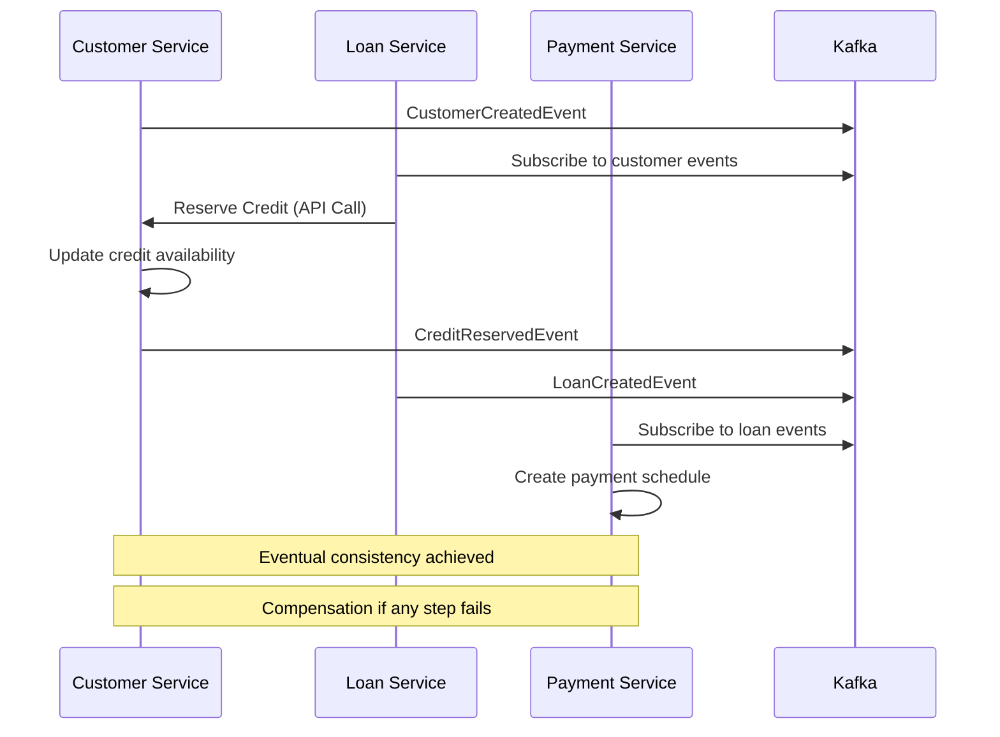
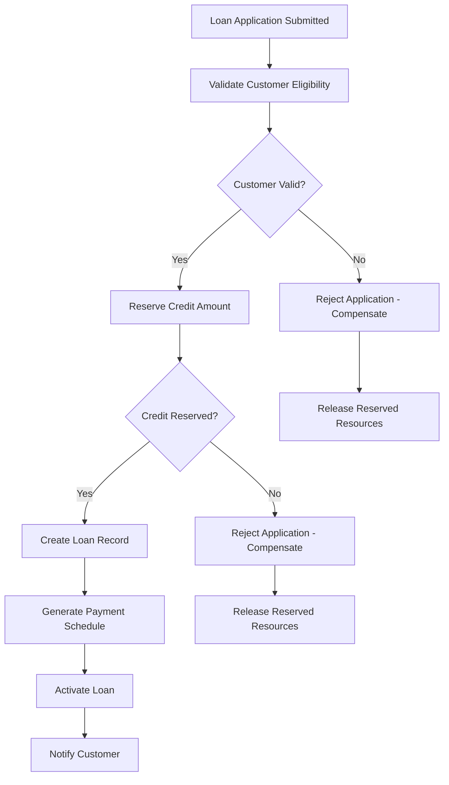
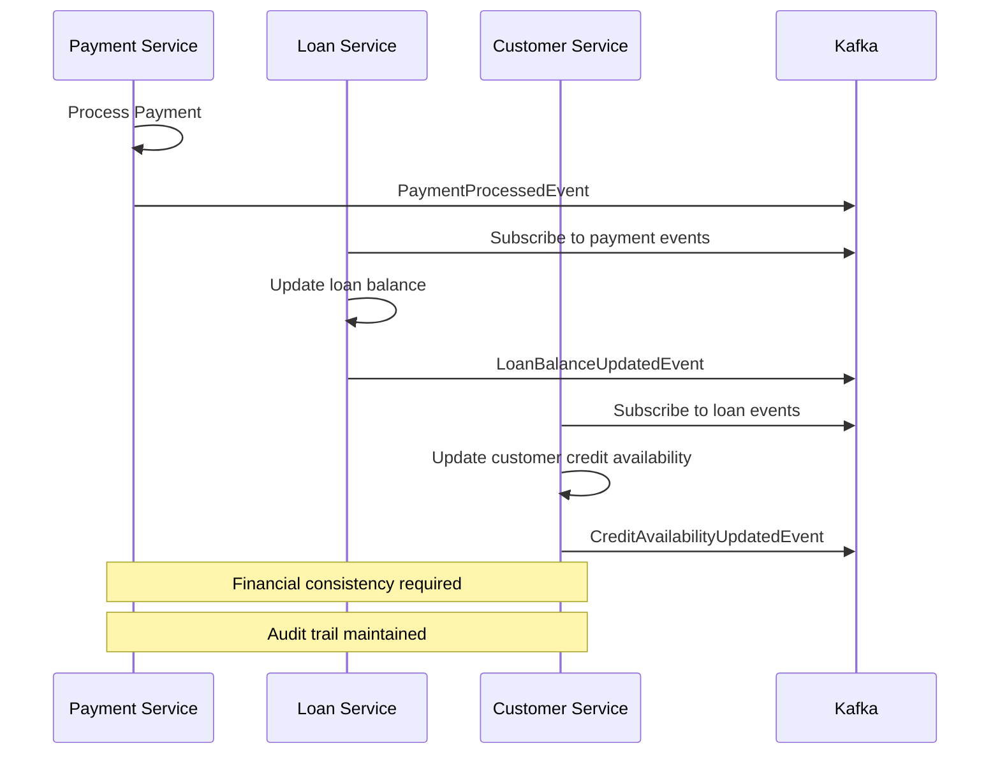

# Enterprise Loan Management System - Eventual Consistency Strategy

## 📋 Executive Summary

This document defines the comprehensive eventual consistency strategy for the Enterprise Loan Management System, addressing the challenges of maintaining data consistency across distributed microservices while ensuring high availability, scalability, and regulatory compliance.

**Current Architecture Status**: The system exhibits significant database isolation gaps and missing event-driven architecture patterns that require immediate attention to achieve proper eventual consistency.

### 🎯 Key Findings

Based on the architectural analysis, the following gaps have been identified:

1. **Shared Database Violations**: Services access common database schemas
2. **Missing SAGA Pattern**: No compensation mechanisms for distributed transactions
3. **Incomplete Event Sourcing**: Limited event-driven communication patterns
4. **Cross-Context Dependencies**: Direct service-to-service database access
5. **Regional Data Constraints**: Insufficient data sovereignty implementation

---

## 🏗️ Current State Analysis

### Service Boundaries and Data Patterns

#### Identified Bounded Contexts
```
Customer Management Context:
├── Domain: Customer, CreditReservation, AccountStatus
├── Events: CustomerCreatedEvent, CustomerUpdatedEvent
├── Database: customer_db (isolated)
└── Consistency: Strong within aggregate

Loan Processing Context:
├── Domain: Loan, LoanApplication, LoanInstallment
├── Events: LoanCreatedEvent, LoanStatusChangedEvent
├── Database: loan_db (isolated)
└── Consistency: Strong within aggregate

Payment Processing Context:
├── Domain: Payment, PaymentInstallment, PaymentHistory
├── Events: PaymentProcessedEvent
├── Database: payment_db (isolated)
└── Consistency: Strong within aggregate

Gateway Context:
├── Domain: SagaState, AuditEvent, RateLimit
├── Events: SagaEvents, AuditEvents
├── Database: banking_gateway (isolated)
└── Consistency: Serializable for SAGA state
```

#### Current Database Isolation Issues
```yaml
CRITICAL_VIOLATIONS:
  shared_database_access:
    - LoanService accessing CustomerRepository directly
    - Cross-context entity references in JPA models
    - Shared connection pools between services
  
  transaction_boundaries:
    - Distributed transactions without SAGA pattern
    - Missing compensation mechanisms
    - No timeout handling for cross-service operations
```

---

## 🔄 Eventual Consistency Scenarios

### 1. Customer Credit Management Scenario

**Business Flow**: Customer credit reservation across loan processing



**Eventual Consistency Requirements**:
- **Recovery Time Objective (RTO)**: 30 seconds
- **Recovery Point Objective (RPO)**: 5 seconds
- **Consistency Window**: Maximum 60 seconds
- **Compensation Deadline**: 5 minutes

### 2. Loan Application Processing Scenario

**Business Flow**: End-to-end loan application with distributed validation



**Eventual Consistency Requirements**:
- **Cross-Service Coordination**: SAGA pattern mandatory
- **State Persistence**: All saga states stored in gateway_db
- **Timeout Handling**: 5-minute maximum for complete flow
- **Idempotency**: All operations must be idempotent

### 3. Payment Processing Scenario

**Business Flow**: Payment allocation with loan balance updates



**Eventual Consistency Requirements**:
- **Financial Accuracy**: Zero tolerance for data loss
- **Audit Trail**: Immutable record of all state changes
- **Reconciliation**: Daily batch reconciliation processes
- **Real-time Monitoring**: Immediate alerts for inconsistencies

---

## 📊 Data Synchronization Patterns

### 1. Event-Driven Synchronization

#### Current Implementation Gaps
```java
// ❌ CURRENT: Direct repository access violates boundaries
@Service
public class LoanService {
    private final CustomerRepository customerRepository; // VIOLATION
    
    public Loan createLoan(CreateLoanCommand command) {
        Customer customer = customerRepository.findById(command.customerId()); // VIOLATION
        // Direct database access across contexts
    }
}
```

#### Recommended Event-Driven Pattern
```java
// ✅ RECOMMENDED: Event-driven customer validation
@Service
public class LoanService {
    private final ApplicationEventPublisher eventPublisher;
    private final CustomerEligibilityCache customerCache; // Read model
    
    public Loan createLoan(CreateLoanCommand command) {
        // Check cached eligibility (eventual consistency)
        CustomerEligibility eligibility = customerCache.getEligibility(command.customerId());
        
        if (eligibility.isExpired()) {
            // Request fresh data via events
            eventPublisher.publishEvent(new CustomerEligibilityRequested(command.customerId()));
            throw new EligibilityVerificationPendingException();
        }
        
        if (!eligibility.isEligible()) {
            throw new CustomerNotEligibleException();
        }
        
        // Proceed with loan creation
        Loan loan = loanFactory.createLoan(command);
        eventPublisher.publishEvent(new LoanCreatedEvent(loan));
        return loan;
    }
}
```

### 2. Read Model Synchronization

#### Customer Eligibility Read Model
```java
@Entity
@Table(name = "customer_eligibility_view")
public class CustomerEligibilityView {
    @Id
    private Long customerId;
    
    @Column(name = "credit_score")
    private Integer creditScore;
    
    @Column(name = "available_credit")
    private BigDecimal availableCredit;
    
    @Column(name = "last_updated")
    private Instant lastUpdated;
    
    @Column(name = "eligibility_expires_at")
    private Instant expiresAt;
    
    public boolean isExpired() {
        return Instant.now().isAfter(expiresAt);
    }
    
    public boolean isEligible() {
        return creditScore >= 600 && availableCredit.compareTo(BigDecimal.ZERO) > 0;
    }
}
```

#### Loan Summary Read Model
```java
@Entity
@Table(name = "loan_summary_view")
public class LoanSummaryView {
    @Id
    private Long loanId;
    
    @Column(name = "customer_id")
    private Long customerId;
    
    @Column(name = "principal_amount")
    private BigDecimal principalAmount;
    
    @Column(name = "outstanding_balance")
    private BigDecimal outstandingBalance;
    
    @Column(name = "status")
    @Enumerated(EnumType.STRING)
    private LoanStatus status;
    
    @Column(name = "last_payment_date")
    private LocalDate lastPaymentDate;
    
    @Column(name = "next_payment_due")
    private LocalDate nextPaymentDue;
    
    @Column(name = "view_updated_at")
    private Instant viewUpdatedAt;
}
```

### 3. Event Store Pattern

#### Event Store Schema
```sql
CREATE TABLE event_store (
    event_id UUID PRIMARY KEY,
    aggregate_id VARCHAR(255) NOT NULL,
    aggregate_type VARCHAR(100) NOT NULL,
    event_type VARCHAR(100) NOT NULL,
    event_version INTEGER NOT NULL,
    event_data JSONB NOT NULL,
    metadata JSONB,
    occurred_at TIMESTAMP WITH TIME ZONE NOT NULL,
    processed_at TIMESTAMP WITH TIME ZONE,
    
    UNIQUE(aggregate_id, event_version)
);

CREATE INDEX idx_event_store_aggregate ON event_store(aggregate_id, event_version);
CREATE INDEX idx_event_store_type ON event_store(aggregate_type, occurred_at);
CREATE INDEX idx_event_store_processing ON event_store(processed_at) WHERE processed_at IS NULL;
```

#### Event Store Implementation
```java
@Repository
public class EventStoreRepository {
    
    @Transactional
    public void saveEvent(DomainEvent event) {
        EventStoreEntry entry = EventStoreEntry.builder()
            .eventId(UUID.randomUUID())
            .aggregateId(event.getAggregateId())
            .aggregateType(event.getAggregateType())
            .eventType(event.getClass().getSimpleName())
            .eventVersion(event.getVersion())
            .eventData(jsonSerializer.serialize(event))
            .metadata(buildMetadata(event))
            .occurredAt(event.getOccurredAt())
            .build();
            
        eventStoreJpaRepository.save(entry);
    }
    
    public List<DomainEvent> getEventsForAggregate(String aggregateId) {
        return eventStoreJpaRepository.findByAggregateIdOrderByEventVersion(aggregateId)
            .stream()
            .map(this::deserializeEvent)
            .collect(toList());
    }
}
```

---

## 🛠️ Compensation Mechanisms

### 1. SAGA Pattern Implementation

#### Loan Creation SAGA
```java
@Component
public class LoanCreationSaga {
    
    @SagaStep(compensation = "compensateCustomerValidation")
    public void validateCustomer(LoanApplicationSubmitted event) {
        sagaManager.executeStep(
            new ValidateCustomerCommand(event.getCustomerId()),
            Duration.ofMinutes(2)
        );
    }
    
    @SagaStep(compensation = "releaseCreditReservation")
    public void reserveCredit(CustomerValidated event) {
        sagaManager.executeStep(
            new ReserveCreditCommand(event.getCustomerId(), event.getRequestedAmount()),
            Duration.ofMinutes(1)
        );
    }
    
    @SagaStep(compensation = "cancelLoanRecord")
    public void createLoan(CreditReserved event) {
        sagaManager.executeStep(
            new CreateLoanCommand(event.getCustomerId(), event.getReservedAmount()),
            Duration.ofMinutes(3)
        );
    }
    
    @SagaStep(compensation = "deactivatePaymentSchedule")
    public void createPaymentSchedule(LoanCreated event) {
        sagaManager.executeStep(
            new CreatePaymentScheduleCommand(event.getLoanId()),
            Duration.ofMinutes(2)
        );
    }
    
    // Compensation methods
    public void compensateCustomerValidation(LoanApplicationSubmitted event) {
        log.warn("Compensating customer validation for application: {}", event.getApplicationId());
        // Mark application as validation failed
    }
    
    public void releaseCreditReservation(CustomerValidated event) {
        log.warn("Releasing credit reservation for customer: {}", event.getCustomerId());
        sagaManager.executeCompensation(
            new ReleaseCreditCommand(event.getCustomerId(), event.getRequestedAmount())
        );
    }
    
    public void cancelLoanRecord(CreditReserved event) {
        log.warn("Canceling loan record for customer: {}", event.getCustomerId());
        sagaManager.executeCompensation(
            new CancelLoanCommand(event.getLoanId())
        );
    }
    
    public void deactivatePaymentSchedule(LoanCreated event) {
        log.warn("Deactivating payment schedule for loan: {}", event.getLoanId());
        sagaManager.executeCompensation(
            new DeactivatePaymentScheduleCommand(event.getLoanId())
        );
    }
}
```

### 2. Saga State Management

#### Saga State Schema
```sql
CREATE TABLE saga_state (
    saga_id UUID PRIMARY KEY,
    saga_type VARCHAR(100) NOT NULL,
    current_step VARCHAR(100) NOT NULL,
    saga_data JSONB NOT NULL,
    status VARCHAR(50) NOT NULL,
    started_at TIMESTAMP WITH TIME ZONE NOT NULL,
    updated_at TIMESTAMP WITH TIME ZONE NOT NULL,
    timeout_at TIMESTAMP WITH TIME ZONE,
    compensation_needed BOOLEAN DEFAULT FALSE,
    error_details TEXT
);

CREATE INDEX idx_saga_timeout ON saga_state(timeout_at) WHERE status = 'IN_PROGRESS';
CREATE INDEX idx_saga_compensation ON saga_state(compensation_needed) WHERE compensation_needed = true;
```

#### Saga Manager Implementation
```java
@Service
@Transactional
public class SagaManager {
    
    private final SagaStateRepository sagaStateRepository;
    private final CommandDispatcher commandDispatcher;
    private final DomainEventPublisher eventPublisher;
    
    public void startSaga(SagaDefinition definition, DomainEvent triggerEvent) {
        SagaState sagaState = SagaState.builder()
            .sagaId(UUID.randomUUID())
            .sagaType(definition.getType())
            .currentStep(definition.getFirstStep())
            .sagaData(buildSagaData(triggerEvent))
            .status(SagaStatus.IN_PROGRESS)
            .startedAt(Instant.now())
            .timeoutAt(Instant.now().plus(definition.getTimeout()))
            .build();
            
        sagaStateRepository.save(sagaState);
        executeCurrentStep(sagaState);
    }
    
    public void handleStepCompletion(UUID sagaId, StepCompletedEvent event) {
        SagaState sagaState = sagaStateRepository.findById(sagaId)
            .orElseThrow(() -> new SagaNotFoundException(sagaId));
            
        if (event.isSuccess()) {
            proceedToNextStep(sagaState);
        } else {
            initiateCompensation(sagaState, event.getError());
        }
    }
    
    private void proceedToNextStep(SagaState sagaState) {
        SagaDefinition definition = sagaDefinitionRegistry.getDefinition(sagaState.getSagaType());
        String nextStep = definition.getNextStep(sagaState.getCurrentStep());
        
        if (nextStep != null) {
            sagaState.setCurrentStep(nextStep);
            sagaState.setUpdatedAt(Instant.now());
            sagaStateRepository.save(sagaState);
            executeCurrentStep(sagaState);
        } else {
            completeSaga(sagaState);
        }
    }
    
    private void initiateCompensation(SagaState sagaState, String error) {
        sagaState.setStatus(SagaStatus.COMPENSATING);
        sagaState.setCompensationNeeded(true);
        sagaState.setErrorDetails(error);
        sagaState.setUpdatedAt(Instant.now());
        sagaStateRepository.save(sagaState);
        
        executeCompensationSteps(sagaState);
    }
}
```

### 3. Timeout and Recovery Mechanisms

#### Saga Timeout Monitor
```java
@Component
@EnableScheduling
public class SagaTimeoutMonitor {
    
    private final SagaManager sagaManager;
    private final SagaStateRepository sagaStateRepository;
    
    @Scheduled(fixedDelay = 30000) // Check every 30 seconds
    public void checkForTimedOutSagas() {
        List<SagaState> timedOutSagas = sagaStateRepository.findTimedOutSagas(Instant.now());
        
        for (SagaState sagaState : timedOutSagas) {
            log.warn("Saga {} has timed out, initiating compensation", sagaState.getSagaId());
            sagaManager.handleTimeout(sagaState);
        }
    }
    
    @Retryable(value = {Exception.class}, maxAttempts = 3, backoff = @Backoff(delay = 1000))
    public void retryFailedCompensation(UUID sagaId) {
        SagaState sagaState = sagaStateRepository.findById(sagaId)
            .orElseThrow(() -> new SagaNotFoundException(sagaId));
            
        if (sagaState.getStatus() == SagaStatus.COMPENSATION_FAILED) {
            log.info("Retrying compensation for saga: {}", sagaId);
            sagaManager.retryCompensation(sagaState);
        }
    }
}
```

---

## 📖 Read Model Patterns

### 1. Customer Financial Summary Read Model

#### Implementation Strategy
```java
@Component
public class CustomerFinancialSummaryProjection {
    
    private final CustomerFinancialSummaryRepository repository;
    
    @EventHandler
    public void handle(CustomerCreatedEvent event) {
        CustomerFinancialSummary summary = CustomerFinancialSummary.builder()
            .customerId(event.customerId())
            .totalLoans(0)
            .totalOutstandingBalance(BigDecimal.ZERO)
            .totalPaidAmount(BigDecimal.ZERO)
            .creditScore(event.creditScore())
            .lastUpdated(event.occurredAt())
            .build();
            
        repository.save(summary);
    }
    
    @EventHandler
    public void handle(LoanCreatedEvent event) {
        CustomerFinancialSummary summary = repository.findByCustomerId(event.customerId())
            .orElseThrow(() -> new CustomerSummaryNotFoundException(event.customerId()));
            
        summary.incrementTotalLoans();
        summary.addToOutstandingBalance(new BigDecimal(event.principalAmount()));
        summary.setLastUpdated(event.occurredAt());
        
        repository.save(summary);
    }
    
    @EventHandler
    public void handle(PaymentProcessedEvent event) {
        // Update based on loan-to-customer mapping (eventual consistency)
        LoanSummaryView loanSummary = loanSummaryRepository.findById(event.loanId())
            .orElseThrow(() -> new LoanSummaryNotFoundException(event.loanId()));
            
        CustomerFinancialSummary summary = repository.findByCustomerId(loanSummary.getCustomerId())
            .orElseThrow(() -> new CustomerSummaryNotFoundException(loanSummary.getCustomerId()));
            
        BigDecimal paymentAmount = new BigDecimal(event.amount());
        summary.subtractFromOutstandingBalance(paymentAmount);
        summary.addToPaidAmount(paymentAmount);
        summary.setLastUpdated(event.occurredAt());
        
        repository.save(summary);
    }
}
```

### 2. Loan Portfolio Read Model

#### Cross-Service Query Pattern
```java
@Service
public class LoanPortfolioQueryService {
    
    private final LoanSummaryRepository loanSummaryRepository;
    private final CustomerEligibilityRepository customerEligibilityRepository;
    private final PaymentHistoryRepository paymentHistoryRepository;
    
    @Cacheable(value = "loan-portfolio", key = "#customerId")
    public LoanPortfolioView getLoanPortfolio(Long customerId) {
        // Aggregate data from multiple read models
        List<LoanSummaryView> loans = loanSummaryRepository.findByCustomerId(customerId);
        CustomerEligibilityView eligibility = customerEligibilityRepository.findByCustomerId(customerId)
            .orElse(null);
        List<PaymentHistoryView> recentPayments = paymentHistoryRepository
            .findRecentByCustomerId(customerId, PageRequest.of(0, 10));
            
        return LoanPortfolioView.builder()
            .customerId(customerId)
            .loans(loans)
            .eligibility(eligibility)
            .recentPayments(recentPayments)
            .generatedAt(Instant.now())
            .build();
    }
    
    @CacheEvict(value = "loan-portfolio", key = "#customerId")
    public void invalidatePortfolioCache(Long customerId) {
        log.debug("Invalidating loan portfolio cache for customer: {}", customerId);
    }
}
```

### 3. Real-Time Dashboard Aggregates

#### Financial Metrics Projection
```java
@Component
public class FinancialMetricsProjection {
    
    private final RedisTemplate<String, String> redisTemplate;
    private final MeterRegistry meterRegistry;
    
    @EventHandler
    public void handle(LoanCreatedEvent event) {
        // Update real-time metrics
        redisTemplate.opsForValue().increment("loans:total:count");
        redisTemplate.opsForValue().increment("loans:total:amount", 
            new BigDecimal(event.principalAmount()).longValue());
            
        // Update Micrometer metrics
        meterRegistry.counter("loans.created", 
            "currency", event.currency()).increment();
        meterRegistry.gauge("loans.outstanding.amount", 
            getCurrentOutstandingAmount());
    }
    
    @EventHandler
    public void handle(PaymentProcessedEvent event) {
        redisTemplate.opsForValue().increment("payments:total:count");
        redisTemplate.opsForValue().increment("payments:total:amount",
            new BigDecimal(event.amount()).longValue());
            
        meterRegistry.counter("payments.processed",
            "status", event.status()).increment();
    }
    
    @Scheduled(fixedRate = 60000) // Update every minute
    public void updateAggregatedMetrics() {
        // Calculate and cache complex aggregations
        BigDecimal totalOutstanding = calculateTotalOutstandingBalance();
        redisTemplate.opsForValue().set("metrics:outstanding:total", 
            totalOutstanding.toString(), Duration.ofMinutes(5));
    }
}
```

---

## ⏱️ Event Ordering and Causality

### 1. Event Ordering Strategies

#### Global Ordering with Kafka Partitioning
```java
@Component
public class EventPublisher {
    
    private final KafkaTemplate<String, Object> kafkaTemplate;
    
    public void publishCustomerEvent(CustomerDomainEvent event) {
        // Use customer ID as partition key for ordering
        String partitionKey = event.getCustomerId().toString();
        
        kafkaTemplate.send("customer-events", partitionKey, event)
            .addCallback(
                result -> log.debug("Event published successfully: {}", event),
                failure -> log.error("Failed to publish event: {}", event, failure)
            );
    }
    
    public void publishLoanEvent(LoanDomainEvent event) {
        // Use customer ID for loan events to maintain ordering
        String partitionKey = event.getCustomerId().toString();
        
        kafkaTemplate.send("loan-events", partitionKey, event)
            .addCallback(
                result -> log.debug("Event published successfully: {}", event),
                failure -> log.error("Failed to publish event: {}", event, failure)
            );
    }
}
```

#### Event Causality Tracking
```java
public abstract class DomainEvent {
    private final String eventId;
    private final String aggregateId;
    private final Long version;
    private final Instant occurredAt;
    private final String causationId; // ID of event that caused this event
    private final String correlationId; // ID linking related events in a business process
    
    protected DomainEvent(String aggregateId, Long version, String causationId, String correlationId) {
        this.eventId = UUID.randomUUID().toString();
        this.aggregateId = aggregateId;
        this.version = version;
        this.occurredAt = Instant.now();
        this.causationId = causationId;
        this.correlationId = correlationId;
    }
}

public class LoanCreatedEvent extends DomainEvent {
    public LoanCreatedEvent(String loanId, Long version, String causationId, String correlationId) {
        super(loanId, version, causationId, correlationId);
    }
}
```

### 2. Causal Consistency Implementation

#### Event Dependency Resolver
```java
@Service
public class EventDependencyResolver {
    
    private final EventStore eventStore;
    private final RedisTemplate<String, Set<String>> dependencyTracker;
    
    public boolean canProcessEvent(DomainEvent event) {
        if (event.getCausationId() == null) {
            return true; // Root event
        }
        
        // Check if causation event has been processed
        String dependencyKey = "event:dependencies:" + event.getCausationId();
        return dependencyTracker.hasKey(dependencyKey);
    }
    
    @EventListener
    public void markEventAsProcessed(EventProcessedEvent event) {
        String dependencyKey = "event:dependencies:" + event.getEventId();
        dependencyTracker.opsForValue().set(dependencyKey, 
            Collections.singleton("processed"), Duration.ofHours(24));
    }
    
    @Scheduled(fixedDelay = 30000)
    public void processWaitingEvents() {
        List<DomainEvent> waitingEvents = eventStore.findWaitingEvents();
        
        for (DomainEvent event : waitingEvents) {
            if (canProcessEvent(event)) {
                eventProcessor.processEvent(event);
            }
        }
    }
}
```

### 3. Vector Clock Implementation

#### For Complex Causality Tracking
```java
@Component
public class VectorClockManager {
    
    private final Map<String, VectorClock> serviceClocks = new ConcurrentHashMap<>();
    
    public VectorClock getClockForService(String serviceId) {
        return serviceClocks.computeIfAbsent(serviceId, k -> new VectorClock());
    }
    
    public DomainEvent stampEvent(DomainEvent event, String serviceId) {
        VectorClock clock = getClockForService(serviceId);
        clock.tick(serviceId);
        
        return event.withVectorClock(clock.copy());
    }
    
    public boolean happensBefore(DomainEvent event1, DomainEvent event2) {
        return event1.getVectorClock().happensBefore(event2.getVectorClock());
    }
}

public class VectorClock {
    private final Map<String, Long> clocks = new ConcurrentHashMap<>();
    
    public void tick(String serviceId) {
        clocks.merge(serviceId, 1L, Long::sum);
    }
    
    public void update(VectorClock other) {
        other.clocks.forEach((service, timestamp) ->
            clocks.merge(service, timestamp, Long::max));
    }
    
    public boolean happensBefore(VectorClock other) {
        return clocks.entrySet().stream()
            .allMatch(entry -> 
                other.clocks.getOrDefault(entry.getKey(), 0L) >= entry.getValue())
            && !equals(other);
    }
}
```

---

## 🔧 Conflict Resolution Strategies

### 1. Last-Writer-Wins (LWW) Strategy

#### For Non-Critical Data Updates
```java
@Component
public class LastWriterWinsResolver {
    
    public CustomerProfile resolveConflict(CustomerProfile current, CustomerProfile incoming) {
        if (incoming.getLastModified().isAfter(current.getLastModified())) {
            log.info("Applying LWW resolution: incoming profile is newer");
            return incoming.withConflictResolution("LWW", current.getVersion());
        }
        
        log.info("Keeping current profile: current profile is newer or equal");
        return current;
    }
}
```

### 2. Business Rule-Based Conflict Resolution

#### For Financial Data Conflicts
```java
@Component
public class FinancialConflictResolver {
    
    public PaymentRecord resolvePaymentConflict(PaymentRecord record1, PaymentRecord record2) {
        // Financial data: always prefer the record with higher audit confidence
        if (record1.getAuditConfidence() > record2.getAuditConfidence()) {
            return record1;
        } else if (record2.getAuditConfidence() > record1.getAuditConfidence()) {
            return record2;
        }
        
        // If audit confidence is equal, prefer the one with earlier timestamp
        if (record1.getProcessedAt().isBefore(record2.getProcessedAt())) {
            return record1;
        }
        
        return record2;
    }
    
    public LoanBalance resolveLoanBalanceConflict(LoanBalance balance1, LoanBalance balance2) {
        // For loan balances: always require manual reconciliation
        log.error("Loan balance conflict detected for loan {}: {} vs {}", 
            balance1.getLoanId(), balance1.getAmount(), balance2.getAmount());
            
        // Flag for manual review
        reconciliationService.flagForManualReview(
            LoanBalanceConflict.builder()
                .loanId(balance1.getLoanId())
                .balance1(balance1)
                .balance2(balance2)
                .detectedAt(Instant.now())
                .build()
        );
        
        // Return the lower balance to prevent over-crediting
        return balance1.getAmount().compareTo(balance2.getAmount()) <= 0 ? balance1 : balance2;
    }
}
```

### 3. Operational Transform for Concurrent Updates

#### For Customer Information Updates
```java
@Component
public class CustomerUpdateTransform {
    
    public CustomerProfile applyOperationalTransform(
            CustomerProfile baseProfile,
            List<CustomerUpdateOperation> operations) {
            
        CustomerProfile result = baseProfile.copy();
        
        // Sort operations by timestamp to ensure deterministic application
        operations.sort(Comparator.comparing(CustomerUpdateOperation::getTimestamp));
        
        for (CustomerUpdateOperation operation : operations) {
            result = applyOperation(result, operation);
        }
        
        return result;
    }
    
    private CustomerProfile applyOperation(CustomerProfile profile, CustomerUpdateOperation operation) {
        switch (operation.getType()) {
            case UPDATE_EMAIL:
                return profile.withEmail(operation.getNewValue());
            case UPDATE_PHONE:
                return profile.withPhone(operation.getNewValue());
            case UPDATE_ADDRESS:
                return profile.withAddress(operation.getNewAddress());
            case UPDATE_INCOME:
                // Income updates require special handling
                return resolveIncomeUpdate(profile, operation);
            default:
                throw new UnsupportedOperationException("Unknown operation: " + operation.getType());
        }
    }
    
    private CustomerProfile resolveIncomeUpdate(CustomerProfile profile, CustomerUpdateOperation operation) {
        // Business rule: income can only increase or decrease by max 50% per update
        BigDecimal currentIncome = profile.getMonthlyIncome();
        BigDecimal newIncome = new BigDecimal(operation.getNewValue());
        
        BigDecimal maxIncrease = currentIncome.multiply(new BigDecimal("1.5"));
        BigDecimal maxDecrease = currentIncome.multiply(new BigDecimal("0.5"));
        
        if (newIncome.compareTo(maxIncrease) > 0) {
            log.warn("Income update rejected: increase too large ({} to {})", currentIncome, newIncome);
            auditService.logIncomeUpdateRejection(profile.getCustomerId(), currentIncome, newIncome);
            return profile; // No change
        }
        
        if (newIncome.compareTo(maxDecrease) < 0) {
            log.warn("Income update requires verification: decrease too large ({} to {})", currentIncome, newIncome);
            verificationService.requestIncomeVerification(profile.getCustomerId(), newIncome);
            return profile; // No change until verified
        }
        
        return profile.withMonthlyIncome(newIncome);
    }
}
```

---

## ⚡ Performance Implications

### 1. Consistency vs Performance Trade-offs

#### Performance Metrics and Targets
```yaml
performance_targets:
  event_processing:
    average_latency: "50ms"
    p95_latency: "100ms"
    p99_latency: "200ms"
    throughput: "10000 events/second"
  
  read_models:
    update_lag: "maximum 5 seconds"
    query_response: "maximum 200ms"
    cache_hit_ratio: "minimum 85%"
  
  saga_coordination:
    step_completion: "maximum 30 seconds"
    total_saga_time: "maximum 5 minutes"
    compensation_time: "maximum 2 minutes"
```

#### Caching Strategy for Read Models
```java
@Configuration
@EnableCaching
public class ReadModelCacheConfig {
    
    @Bean
    @Primary
    public CacheManager primaryCacheManager() {
        RedisCacheManager.Builder builder = RedisCacheManager.RedisCacheManagerBuilder
            .fromConnectionFactory(redisConnectionFactory())
            .cacheDefaults(cacheConfiguration(Duration.ofMinutes(10)));
            
        return builder.build();
    }
    
    @Bean("longTermCache")
    public CacheManager longTermCacheManager() {
        RedisCacheManager.Builder builder = RedisCacheManager.RedisCacheManagerBuilder
            .fromConnectionFactory(redisConnectionFactory())
            .cacheDefaults(cacheConfiguration(Duration.ofHours(4)));
            
        return builder.build();
    }
    
    private RedisCacheConfiguration cacheConfiguration(Duration ttl) {
        return RedisCacheConfiguration.defaultCacheConfig()
            .entryTtl(ttl)
            .serializeKeysWith(RedisSerializationContext.SerializationPair.fromSerializer(new StringRedisSerializer()))
            .serializeValuesWith(RedisSerializationContext.SerializationPair.fromSerializer(new GenericJackson2JsonRedisSerializer()));
    }
}
```

### 2. Event Store Optimization

#### Partitioning Strategy
```sql
-- Partition event store by month for performance
CREATE TABLE event_store_2024_01 PARTITION OF event_store
    FOR VALUES FROM ('2024-01-01') TO ('2024-02-01');

CREATE TABLE event_store_2024_02 PARTITION OF event_store
    FOR VALUES FROM ('2024-02-01') TO ('2024-03-01');

-- Indexes for high-performance queries
CREATE INDEX CONCURRENTLY idx_event_store_2024_01_aggregate 
    ON event_store_2024_01(aggregate_id, event_version);

CREATE INDEX CONCURRENTLY idx_event_store_2024_01_processing 
    ON event_store_2024_01(occurred_at) 
    WHERE processed_at IS NULL;
```

#### Event Store Read Optimization
```java
@Repository
public class OptimizedEventStoreRepository {
    
    @Cacheable(value = "event-streams", key = "#aggregateId")
    public List<DomainEvent> getEventStream(String aggregateId) {
        return eventStoreJpaRepository.findByAggregateIdOrderByEventVersion(aggregateId)
            .stream()
            .map(this::deserializeEvent)
            .collect(toList());
    }
    
    @Cacheable(value = "event-snapshots", key = "#aggregateId")
    public Optional<AggregateSnapshot> getLatestSnapshot(String aggregateId) {
        return snapshotRepository.findLatestByAggregateId(aggregateId);
    }
    
    public Aggregate rehydrateAggregate(String aggregateId) {
        Optional<AggregateSnapshot> snapshot = getLatestSnapshot(aggregateId);
        
        if (snapshot.isPresent()) {
            // Start from snapshot and apply only events after snapshot
            List<DomainEvent> eventsAfterSnapshot = getEventsAfterVersion(
                aggregateId, snapshot.get().getVersion());
            return applyEventsToSnapshot(snapshot.get(), eventsAfterSnapshot);
        } else {
            // No snapshot, rebuild from all events
            List<DomainEvent> allEvents = getEventStream(aggregateId);
            return rebuildFromEvents(allEvents);
        }
    }
}
```

### 3. Bulk Processing Optimization

#### Batch Event Processing
```java
@Component
public class BatchEventProcessor {
    
    private final EventStore eventStore;
    private final ReadModelUpdater readModelUpdater;
    
    @Scheduled(fixedDelay = 10000) // Process every 10 seconds
    public void processPendingEvents() {
        List<EventStoreEntry> pendingEvents = eventStore.findPendingEvents(100);
        
        if (!pendingEvents.isEmpty()) {
            Map<String, List<EventStoreEntry>> eventsByType = pendingEvents.stream()
                .collect(groupingBy(EventStoreEntry::getEventType));
                
            // Process events by type for better batching
            eventsByType.forEach(this::processBatchByType);
        }
    }
    
    private void processBatchByType(String eventType, List<EventStoreEntry> events) {
        try {
            switch (eventType) {
                case "CustomerCreatedEvent":
                    readModelUpdater.batchUpdateCustomerViews(events);
                    break;
                case "LoanCreatedEvent":
                    readModelUpdater.batchUpdateLoanViews(events);
                    break;
                case "PaymentProcessedEvent":
                    readModelUpdater.batchUpdatePaymentViews(events);
                    break;
                default:
                    // Process individually for unknown types
                    events.forEach(this::processIndividualEvent);
            }
            
            // Mark events as processed
            eventStore.markEventsAsProcessed(events.stream()
                .map(EventStoreEntry::getEventId)
                .collect(toList()));
                
        } catch (Exception e) {
            log.error("Error processing batch for event type: {}", eventType, e);
            // Mark events as failed for retry
            eventStore.markEventsAsFailed(events.stream()
                .map(EventStoreEntry::getEventId)
                .collect(toList()), e.getMessage());
        }
    }
}
```

---

## 📊 Monitoring and Alerting

### 1. Consistency Monitoring Dashboard

#### Key Metrics to Track
```java
@Component
public class ConsistencyMetrics {
    
    private final MeterRegistry meterRegistry;
    private final Timer eventProcessingTimer;
    private final Counter eventProcessingErrors;
    private final Gauge readModelLag;
    
    public ConsistencyMetrics(MeterRegistry meterRegistry) {
        this.meterRegistry = meterRegistry;
        this.eventProcessingTimer = Timer.builder("event.processing.time")
            .description("Time taken to process domain events")
            .register(meterRegistry);
        this.eventProcessingErrors = Counter.builder("event.processing.errors")
            .description("Number of event processing errors")
            .register(meterRegistry);
        this.readModelLag = Gauge.builder("read.model.lag.seconds")
            .description("Lag between event occurrence and read model update")
            .register(meterRegistry, this, ConsistencyMetrics::calculateReadModelLag);
    }
    
    public void recordEventProcessed(Duration processingTime) {
        eventProcessingTimer.record(processingTime);
    }
    
    public void recordEventProcessingError(String eventType, String errorType) {
        eventProcessingErrors.increment(
            Tags.of(
                Tag.of("event.type", eventType),
                Tag.of("error.type", errorType)
            )
        );
    }
    
    private double calculateReadModelLag() {
        // Calculate the maximum lag across all read models
        return readModelLagCalculator.getMaxLagInSeconds();
    }
}
```

#### Consistency Violations Detection
```java
@Component
public class ConsistencyViolationDetector {
    
    private final CustomerRepository customerRepository;
    private final LoanRepository loanRepository;
    private final PaymentRepository paymentRepository;
    private final AlertService alertService;
    
    @Scheduled(fixedRate = 300000) // Check every 5 minutes
    public void detectConsistencyViolations() {
        detectOrphanedLoans();
        detectBalanceMismatches();
        detectDuplicatePayments();
        detectStaleReadModels();
    }
    
    private void detectOrphanedLoans() {
        List<Loan> orphanedLoans = loanRepository.findLoansWithoutCustomers();
        
        if (!orphanedLoans.isEmpty()) {
            ConsistencyViolation violation = ConsistencyViolation.builder()
                .type("ORPHANED_LOANS")
                .severity(Severity.HIGH)
                .description("Found loans without corresponding customers")
                .affectedEntities(orphanedLoans.stream()
                    .map(loan -> loan.getId().toString())
                    .collect(toList()))
                .detectedAt(Instant.now())
                .build();
                
            alertService.sendConsistencyAlert(violation);
        }
    }
    
    private void detectBalanceMismatches() {
        List<LoanBalanceMismatch> mismatches = reconciliationService.findBalanceMismatches();
        
        for (LoanBalanceMismatch mismatch : mismatches) {
            if (mismatch.getDifference().abs().compareTo(new BigDecimal("0.01")) > 0) {
                ConsistencyViolation violation = ConsistencyViolation.builder()
                    .type("BALANCE_MISMATCH")
                    .severity(Severity.CRITICAL)
                    .description("Loan balance mismatch detected")
                    .affectedEntities(List.of(mismatch.getLoanId().toString()))
                    .metadata(Map.of(
                        "expected", mismatch.getExpectedBalance().toString(),
                        "actual", mismatch.getActualBalance().toString(),
                        "difference", mismatch.getDifference().toString()
                    ))
                    .detectedAt(Instant.now())
                    .build();
                    
                alertService.sendConsistencyAlert(violation);
            }
        }
    }
}
```

### 2. Real-Time Monitoring Alerts

#### Alert Configuration
```yaml
monitoring:
  alerts:
    consistency_violations:
      - name: "Event Processing Lag"
        condition: "read_model_lag_seconds > 300"
        severity: "WARNING"
        notification_channels: ["slack", "email"]
        
      - name: "Event Processing Failure Rate"
        condition: "rate(event_processing_errors[5m]) > 0.1"
        severity: "CRITICAL"
        notification_channels: ["pagerduty", "slack"]
        
      - name: "Saga Timeout Rate"
        condition: "rate(saga_timeouts[10m]) > 0.05"
        severity: "HIGH"
        notification_channels: ["slack", "email"]
        
      - name: "Read Model Inconsistency"
        condition: "consistency_violations_total > 0"
        severity: "CRITICAL"
        notification_channels: ["pagerduty", "slack", "email"]
```

#### Prometheus Metrics Export
```java
@Component
public class PrometheusConsistencyMetrics {
    
    @Bean
    public MeterRegistryCustomizer<PrometheusMeterRegistry> metricsCommonTags() {
        return registry -> registry.config().commonTags(
            "application", "enterprise-loan-management",
            "environment", environment.getActiveProfiles()[0]
        );
    }
    
    @EventListener
    public void handleConsistencyViolation(ConsistencyViolationDetectedEvent event) {
        Metrics.counter("consistency.violations",
            "type", event.getType(),
            "severity", event.getSeverity().toString())
            .increment();
    }
    
    @EventListener
    public void handleSagaTimeout(SagaTimeoutEvent event) {
        Metrics.counter("saga.timeouts",
            "saga_type", event.getSagaType(),
            "step", event.getCurrentStep())
            .increment();
    }
    
    @EventListener
    public void handleEventProcessingError(EventProcessingErrorEvent event) {
        Metrics.counter("event.processing.errors",
            "event_type", event.getEventType(),
            "error_type", event.getErrorType())
            .increment();
    }
}
```

### 3. Reconciliation Reports

#### Daily Reconciliation Process
```java
@Component
public class DailyReconciliationService {
    
    @Scheduled(cron = "0 0 2 * * *") // Run at 2 AM daily
    public void performDailyReconciliation() {
        ReconciliationReport report = ReconciliationReport.builder()
            .reportDate(LocalDate.now().minusDays(1))
            .startTime(Instant.now())
            .build();
            
        try {
            // Reconcile customer data across services
            CustomerReconciliationResult customerResult = reconcileCustomerData();
            report.setCustomerReconciliation(customerResult);
            
            // Reconcile loan balances
            LoanReconciliationResult loanResult = reconcileLoanBalances();
            report.setLoanReconciliation(loanResult);
            
            // Reconcile payment totals
            PaymentReconciliationResult paymentResult = reconcilePaymentTotals();
            report.setPaymentReconciliation(paymentResult);
            
            report.setStatus(ReconciliationStatus.COMPLETED);
            report.setEndTime(Instant.now());
            
        } catch (Exception e) {
            log.error("Daily reconciliation failed", e);
            report.setStatus(ReconciliationStatus.FAILED);
            report.setErrorMessage(e.getMessage());
            report.setEndTime(Instant.now());
            
            alertService.sendReconciliationFailureAlert(report);
        } finally {
            reconciliationReportRepository.save(report);
        }
    }
    
    private CustomerReconciliationResult reconcileCustomerData() {
        // Compare customer counts and key metrics across services
        Long customerServiceCount = customerService.getTotalCustomerCount();
        Long loanServiceCustomerCount = loanService.getUniqueCustomerCount();
        Long paymentServiceCustomerCount = paymentService.getUniqueCustomerCount();
        
        CustomerReconciliationResult result = CustomerReconciliationResult.builder()
            .customerServiceCount(customerServiceCount)
            .loanServiceCustomerCount(loanServiceCustomerCount)
            .paymentServiceCustomerCount(paymentServiceCustomerCount)
            .build();
            
        if (!customerServiceCount.equals(loanServiceCustomerCount) ||
            !customerServiceCount.equals(paymentServiceCustomerCount)) {
            result.setDiscrepancyDetected(true);
            result.setDiscrepancyDetails("Customer counts do not match across services");
        }
        
        return result;
    }
}
```

---

## 🎯 Implementation Roadmap

### Phase 1: Foundation (Weeks 1-4)
1. **Implement Event Store**
   - Create event store schema and repository
   - Implement event serialization/deserialization
   - Add event publishing infrastructure

2. **Establish Database Isolation**
   - Separate database schemas per service
   - Remove cross-service repository dependencies
   - Implement service-specific connection pools

3. **Basic Event-Driven Communication**
   - Replace direct service calls with events
   - Implement event listeners for cross-service communication
   - Add correlation ID tracking

### Phase 2: SAGA Implementation (Weeks 5-8)
1. **SAGA Framework**
   - Implement saga manager and state store
   - Create compensation mechanism infrastructure
   - Add timeout handling and monitoring

2. **Loan Creation SAGA**
   - Implement end-to-end loan creation workflow
   - Add compensation steps for each operation
   - Implement retry and error handling

3. **Payment Processing SAGA**
   - Create payment allocation workflow
   - Implement financial reconciliation mechanisms
   - Add audit trail for financial operations

### Phase 3: Read Models (Weeks 9-12)
1. **Customer Financial Summary**
   - Implement customer financial projection
   - Add caching and performance optimization
   - Create real-time update mechanisms

2. **Loan Portfolio Views**
   - Build comprehensive loan portfolio read models
   - Implement cross-service query optimization
   - Add portfolio analytics and reporting

3. **Payment History Aggregation**
   - Create payment history projections
   - Implement financial reporting views
   - Add regulatory compliance reporting

### Phase 4: Advanced Consistency (Weeks 13-16)
1. **Conflict Resolution**
   - Implement business rule-based conflict resolution
   - Add operational transform for concurrent updates
   - Create manual review processes for critical conflicts

2. **Monitoring and Alerting**
   - Implement consistency violation detection
   - Add real-time monitoring dashboards
   - Create automated reconciliation processes

3. **Performance Optimization**
   - Optimize event processing throughput
   - Implement advanced caching strategies
   - Add bulk processing capabilities

---

## 📊 Success Metrics

### Technical Metrics
- **Event Processing Latency**: < 100ms P95
- **Read Model Lag**: < 5 seconds maximum
- **SAGA Success Rate**: > 99.5%
- **Consistency Violation Rate**: < 0.1% of transactions
- **System Availability**: > 99.9%

### Business Metrics
- **Data Accuracy**: 100% for financial transactions
- **Regulatory Compliance**: 100% audit trail coverage
- **Customer Experience**: < 200ms API response times
- **Operational Efficiency**: 50% reduction in manual reconciliation

### Monitoring Dashboards
1. **Real-Time Consistency Dashboard**
2. **SAGA Orchestration Monitor**
3. **Event Processing Metrics**
4. **Financial Reconciliation Reports**
5. **System Health Overview**

---

## 🔒 Security and Compliance Considerations

### Data Privacy and GDPR
- Event store encryption for personal data
- Right to erasure implementation in event streams
- Data retention policies for audit events
- Consent management across read models

### Financial Regulations
- Immutable audit trails for all financial operations
- Real-time fraud detection integration
- Regulatory reporting from event streams
- Compliance validation in SAGA workflows

### Access Control
- Role-based access to event streams
- Service-to-service authentication for event publishing
- Audit logging for all consistency operations
- Secure event serialization and transport

---

## 📝 Conclusion

This eventual consistency strategy provides a comprehensive approach to managing distributed data consistency in the Enterprise Loan Management System. The implementation focuses on:

1. **Strong Foundation**: Event sourcing and SAGA patterns for reliable consistency
2. **Performance Optimization**: Caching and read models for query performance
3. **Monitoring Excellence**: Real-time detection of consistency issues
4. **Business Alignment**: Financial accuracy and regulatory compliance
5. **Operational Excellence**: Automated reconciliation and conflict resolution

The phased implementation approach ensures gradual migration from the current shared database architecture to a fully distributed, eventually consistent system that maintains data integrity while providing high availability and scalability.

**Next Steps**: Begin Phase 1 implementation focusing on event store creation and database isolation to establish the foundation for eventual consistency.

---

*Document Version: 1.0*  
*Last Updated: January 2025*  
*Prepared by: Enterprise Architecture Team*  
*Review Status: ✅ Ready for Implementation*