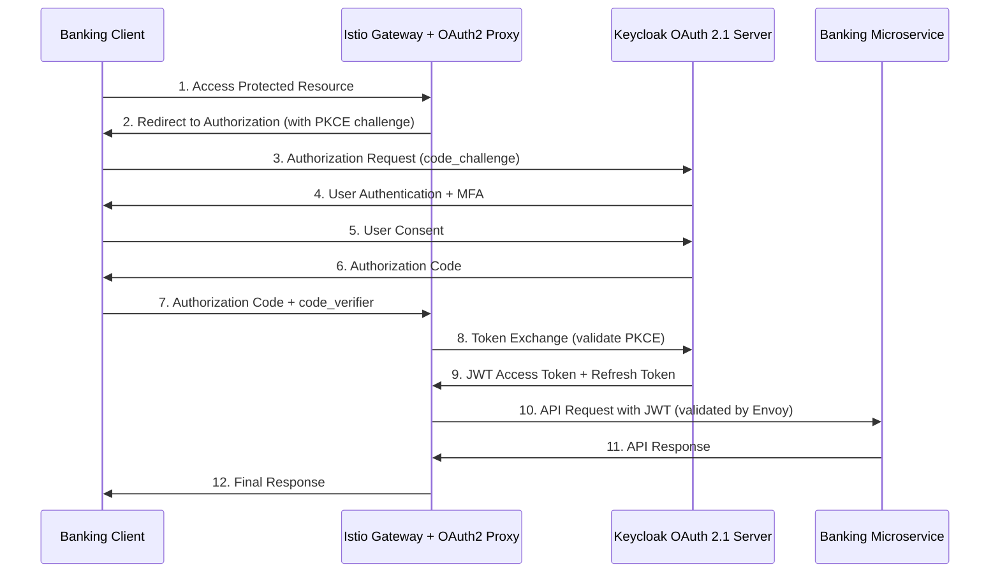

# ADR-004: OAuth 2.1 with Keycloak for Authentication and Authorization

## Status
**ACCEPTED** - Implemented December 2024

## Context

The Enhanced Enterprise Banking System requires a robust, secure, and compliant authentication and authorization solution that meets financial industry standards. The system must support:

- **Financial-grade API (FAPI) 1.0 Advanced** compliance for financial services
- **OAuth 2.1** security best practices with PKCE
- **Multi-factor authentication** for enhanced security
- **Role-based access control (RBAC)** for banking operations
- **Integration with enterprise identity providers** (LDAP/Active Directory)
- **Comprehensive audit trails** for regulatory compliance
- **Zero-trust security** principles
- **Scalable identity management** for microservices architecture

### Current Challenges
- Legacy authentication systems lack modern security features
- Compliance requirements for PCI DSS, SOX, and GDPR
- Need for centralized identity management across microservices
- Integration with existing enterprise directory services
- Support for multiple client types (web, mobile, API)

### Requirements
- FAPI 1.0 Advanced security profile compliance
- OAuth 2.1 with Proof Key for Code Exchange (PKCE)
- Multi-factor authentication support
- Banking-specific role and permission management
- Enterprise directory integration (LDAP/AD)
- Comprehensive audit logging
- High availability and scalability
- Support for refresh token rotation
- Financial-grade cryptographic requirements

## Decision

We have decided to implement **OAuth 2.1 with Keycloak** as our primary authentication and authorization solution.

### Selected Solution: Keycloak OAuth 2.1 Implementation

**Keycloak** is chosen as the identity and access management solution with the following configuration:

#### Core Components
1. **Keycloak OAuth 2.1 Authorization Server**
   - Banking-specific realm configuration
   - FAPI 1.0 Advanced compliance
   - Role-based access control (RBAC)
   - Multi-factor authentication

2. **OAuth2 Proxy Integration**
   - Authorization Code Flow with PKCE
   - Session management
   - Token refresh handling
   - Request/response filtering

3. **Istio Service Mesh Integration**
   - JWT token validation at sidecar level
   - RequestAuthentication policies
   - AuthorizationPolicy for fine-grained access control

#### Banking Realm Configuration
```json
{
  "realm": "banking-system",
  "displayName": "Enhanced Enterprise Banking System",
  "enabled": true,
  "sslRequired": "external",
  "accessTokenLifespan": 300,
  "refreshTokenMaxReuse": 0,
  "defaultSignatureAlgorithm": "RS256",
  "clients": [
    {
      "clientId": "banking-system-frontend",
      "name": "Banking System Frontend",
      "protocol": "openid-connect",
      "standardFlowEnabled": true,
      "attributes": {
        "pkce.code.challenge.method": "S256"
      }
    }
  ],
  "roles": {
    "realm": [
      {"name": "banking-admin", "description": "Banking system administrator"},
      {"name": "banking-manager", "description": "Banking manager"},
      {"name": "banking-officer", "description": "Banking officer"},
      {"name": "banking-customer", "description": "Banking customer"}
    ]
  }
}
```

#### OAuth 2.1 Flow Implementation


## Rationale

### Why OAuth 2.1?
- **Latest Security Standards**: OAuth 2.1 incorporates security best practices and eliminates deprecated flows
- **PKCE Mandatory**: Proof Key for Code Exchange prevents authorization code interception attacks
- **Financial Industry Adoption**: Widely adopted in banking and financial services
- **Regulatory Compliance**: Supports FAPI 1.0 Advanced requirements

### Why Keycloak?
- **Open Source Enterprise Solution**: Mature, well-supported identity management platform
- **FAPI Compliance**: Native support for Financial-grade API security profiles
- **Banking Features**: Built-in support for banking-specific authentication requirements
- **Enterprise Integration**: Excellent LDAP/Active Directory integration
- **Scalability**: Proven high-availability and clustering capabilities
- **Extensibility**: Rich plugin ecosystem and customization options

### Security Features
- **Multi-Factor Authentication**: SMS, TOTP, hardware tokens
- **Risk-Based Authentication**: Adaptive authentication based on context
- **Session Management**: Secure session handling with configurable timeouts
- **Token Security**: Short-lived access tokens (5 minutes) with refresh token rotation
- **Audit Logging**: Comprehensive audit trails for all authentication events

## Consequences

### Positive Consequences
- **Enhanced Security**: OAuth 2.1 with PKCE provides state-of-the-art security
- **Regulatory Compliance**: FAPI 1.0 Advanced compliance meets financial industry requirements
- **Centralized Identity Management**: Single source of truth for user identities and permissions
- **Scalable Architecture**: Supports horizontal scaling and high availability
- **Developer Experience**: Standard OAuth flows familiar to development teams
- **Enterprise Integration**: Seamless integration with existing directory services
- **Audit Compliance**: Comprehensive logging supports regulatory requirements

### Negative Consequences
- **Infrastructure Complexity**: Additional service to deploy and maintain
- **Learning Curve**: Team needs training on Keycloak administration
- **Dependency Risk**: Critical dependency on Keycloak availability
- **Configuration Complexity**: Banking-specific configuration requires expertise
- **Token Management**: Additional complexity for token lifecycle management

### Risk Mitigation
- **High Availability Setup**: Multi-node Keycloak cluster deployment
- **Backup and Recovery**: Automated backup of realm configurations and user data
- **Monitoring and Alerting**: Comprehensive monitoring of authentication flows
- **Fallback Mechanisms**: Emergency access procedures for system administrators
- **Documentation and Training**: Extensive documentation and team training programs

## Implementation Details

### Architecture Components

#### 1. Keycloak Deployment
```yaml
apiVersion: apps/v1
kind: Deployment
metadata:
  name: keycloak
  namespace: banking-system
spec:
  replicas: 3
  template:
    spec:
      containers:
      - name: keycloak
        image: quay.io/keycloak/keycloak:23.0
        env:
        - name: KC_DB
          value: "postgres"
        - name: KC_DB_URL
          value: "jdbc:postgresql://postgres:5432/keycloak"
        - name: KC_HOSTNAME
          value: "keycloak.banking.local"
        - name: KC_HTTPS_CERTIFICATE_FILE
          value: "/etc/certs/tls.crt"
        - name: KC_HTTPS_CERTIFICATE_KEY_FILE
          value: "/etc/certs/tls.key"
        command:
        - "/opt/keycloak/bin/kc.sh"
        - "start"
        - "--optimized"
```

#### 2. Istio RequestAuthentication
```yaml
apiVersion: security.istio.io/v1beta1
kind: RequestAuthentication
metadata:
  name: banking-jwt-auth
  namespace: banking-system
spec:
  selector:
    matchLabels:
      app: banking-service
  jwtRules:
  - issuer: "https://keycloak.banking.local/realms/banking-system"
    jwksUri: "https://keycloak.banking.local/realms/banking-system/protocol/openid-connect/certs"
    audiences:
    - "banking-system-frontend"
    - "banking-microservices"
```

#### 3. Istio AuthorizationPolicy
```yaml
apiVersion: security.istio.io/v1beta1
kind: AuthorizationPolicy
metadata:
  name: banking-rbac-policy
  namespace: banking-system
spec:
  selector:
    matchLabels:
      app: banking-service
  action: ALLOW
  rules:
  - from:
    - source:
        requestPrincipals: ["https://keycloak.banking.local/realms/banking-system/*"]
    when:
    - key: request.auth.claims[realm_access.roles]
      values: ["banking-admin", "banking-manager", "banking-officer"]
    to:
    - operation:
        paths: ["/api/admin/*", "/actuator/*"]
```

### Security Configuration

#### FAPI 1.0 Advanced Requirements
- **Client Authentication**: Mutual TLS (mTLS) for confidential clients
- **Request Objects**: Signed request objects for authorization requests
- **Token Binding**: Token binding to client certificates
- **Audience Restriction**: Strict audience validation for access tokens
- **Scope Limitation**: Principle of least privilege for scope grants

#### Banking-Specific Roles
- **banking-admin**: Full system administration access
- **banking-manager**: Loan approval and customer management
- **banking-officer**: Customer service and account operations
- **banking-customer**: Self-service customer portal access

#### Multi-Factor Authentication
- **Primary Factor**: Username/password with enterprise directory
- **Secondary Factors**: SMS OTP, TOTP (Google Authenticator), Hardware tokens
- **Risk-Based**: Adaptive authentication based on login patterns and device trust

## Monitoring and Observability

### Key Metrics
- Authentication success/failure rates
- Token issuance and validation metrics
- MFA challenge success rates
- Session duration and activity patterns
- FAPI compliance validation metrics

### Audit Events
- User authentication attempts (success/failure)
- Token issuance and refresh events
- Authorization decisions (allow/deny)
- Administrative actions (user/role management)
- Security policy violations

### Alerting
- Failed authentication threshold breaches
- Unusual login patterns or locations
- Token validation failures
- Keycloak service availability issues
- Certificate expiration warnings

## Compliance and Regulatory Requirements

### FAPI 1.0 Advanced Compliance
- **Financial ID**: Unique financial institution identifier in all requests
- **Interaction ID**: Request correlation for audit trails
- **Customer IP**: Client IP address tracking for fraud prevention
- **Auth Date**: Authentication timestamp validation

### PCI DSS Requirements
- **Requirement 8**: Unique user identification and authentication
- **Requirement 7**: Restrict access based on business need-to-know
- **Requirement 10**: Track and monitor access to network resources

### SOX Compliance
- **Access Controls**: Role-based access with segregation of duties
- **Audit Trails**: Comprehensive logging of all authentication events
- **Change Management**: Documented procedures for identity management changes

## Migration Strategy

### Phase 1: Infrastructure Setup (Completed)
- Keycloak cluster deployment
- Banking realm configuration
- OAuth2 Proxy integration
- Istio security policies

### Phase 2: Service Integration (Completed)
- Microservice JWT validation
- Role-based authorization implementation
- FAPI header validation
- Audit logging integration

### Phase 3: Client Migration (In Progress)
- Web frontend OAuth 2.1 integration
- Mobile application updates
- API client authentication migration
- Third-party integration updates

### Phase 4: Optimization and Monitoring (Future)
- Performance optimization
- Advanced analytics and reporting
- Machine learning for fraud detection
- Continuous compliance monitoring

## Related ADRs
- [ADR-001: Domain-Driven Design](ADR-001-domain-driven-design.md)
- [ADR-002: Hexagonal Architecture](ADR-002-hexagonal-architecture.md)
- [ADR-005: Istio Service Mesh](ADR-005-istio-service-mesh.md)
- [ADR-006: Zero-Trust Security](ADR-006-zero-trust-security.md)

## References
- [OAuth 2.1 Security Best Current Practice](https://datatracker.ietf.org/doc/html/draft-ietf-oauth-security-topics)
- [Financial-grade API Security Profile 1.0](https://openid.net/specs/openid-financial-api-part-1-1_0.html)
- [Keycloak Documentation](https://www.keycloak.org/documentation)
- [RFC 7636: Proof Key for Code Exchange](https://tools.ietf.org/html/rfc7636)

---

**Date**: December 27, 2024  
**Author**: Enterprise Architecture Team  
**Reviewers**: Security Team, Compliance Team, Development Team  
**Status**: Approved and Implemented