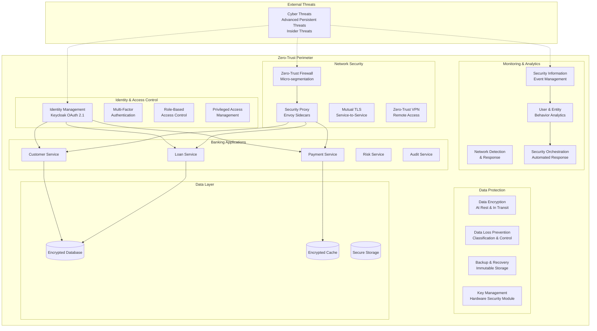

# ADR-006: Zero-Trust Security Architecture

## Status
**ACCEPTED** - Implemented December 2024

## Context

The Enhanced Enterprise Banking System requires a comprehensive security architecture that assumes no implicit trust within the network perimeter. Modern banking systems face sophisticated threats that require defense-in-depth strategies with continuous verification of every transaction, user, and device.

### Current Security Challenges
- **Legacy Perimeter Security**: Traditional castle-and-moat security models are insufficient
- **Insider Threats**: Need protection against malicious or compromised internal actors
- **Lateral Movement**: Prevention of threat propagation within the network
- **Compliance Requirements**: Strict regulatory requirements for financial services
- **Cloud-Native Challenges**: Dynamic, distributed environments require new security approaches
- **API Security**: Extensive API surface area requires comprehensive protection

### Regulatory and Compliance Requirements
- **PCI DSS**: Payment Card Industry Data Security Standard
- **SOX**: Sarbanes-Oxley Act compliance for financial reporting
- **GDPR**: General Data Protection Regulation for data privacy
- **FAPI**: Financial-grade API security requirements
- **NIST Cybersecurity Framework**: Risk management guidelines
- **FFIEC Guidelines**: Federal Financial Institutions Examination Council guidance

### Business Requirements
- Protect customer financial data and personal information
- Ensure business continuity and system availability
- Maintain regulatory compliance and pass audits
- Support digital transformation initiatives securely
- Enable secure remote work and third-party integrations
- Provide comprehensive audit trails for investigations

## Decision

We have decided to implement a **Zero-Trust Security Architecture** across the Enhanced Enterprise Banking System, incorporating multiple layers of security controls and continuous verification principles.

### Core Zero-Trust Principles

#### 1. Never Trust, Always Verify
- Every user, device, and network flow must be authenticated and authorized
- Continuous verification throughout the session lifecycle
- No implicit trust based on network location or previous authentication

#### 2. Least Privilege Access
- Minimum necessary permissions for users and services
- Just-in-time access provisioning
- Regular access reviews and recertification

#### 3. Assume Breach
- Design systems assuming attackers have already gained access
- Implement detection and response capabilities
- Limit blast radius through segmentation

#### 4. Verify Explicitly
- Use multiple sources of data for access decisions
- Combine identity, device, location, and behavioral signals
- Real-time risk assessment for access decisions

## Architecture Overview

### Zero-Trust Security Model



## Implementation Components

### 1. Identity-Centric Security

#### Multi-Factor Authentication (MFA)
```yaml
# Keycloak MFA Configuration
authentication_flows:
  banking_flow:
    - username_password_form
    - conditional_otp:
        condition: "user_in_group('banking_officers')"
        authenticators:
          - totp
          - sms_otp
          - hardware_token
    - risk_based_authentication:
        risk_factors:
          - location_anomaly
          - device_fingerprint
          - behavioral_patterns
```

#### Privileged Access Management (PAM)
```yaml
# Administrative Access Controls
privileged_access:
  just_in_time_access:
    enabled: true
    max_session_duration: "4h"
    approval_required: true
    approvers:
      - banking_security_team
      - banking_admin_manager
  
  session_recording:
    enabled: true
    storage: "encrypted_vault"
    retention_period: "7_years"
  
  break_glass_access:
    enabled: true
    emergency_approvers:
      - ciso
      - cto
    audit_requirements:
      - incident_ticket_required
      - post_access_review
```

#### Conditional Access Policies
```yaml
# Risk-Based Access Control
conditional_access:
  policies:
    - name: "high_risk_transaction"
      conditions:
        - transaction_amount: "> $10000"
        - user_location: "not_in_approved_countries"
        - device_trust_level: "< high"
      actions:
        - require_additional_mfa
        - require_manager_approval
        - enable_enhanced_monitoring
    
    - name: "after_hours_access"
      conditions:
        - time: "outside_business_hours"
        - user_role: "banking_officer"
      actions:
        - require_justification
        - notify_security_team
        - limit_access_scope
```

### 2. Network Micro-Segmentation

#### Istio Security Policies
```yaml
# Micro-segmentation with Istio
apiVersion: security.istio.io/v1beta1
kind: AuthorizationPolicy
metadata:
  name: banking-microsegmentation
  namespace: banking-system
spec:
  rules:
  # Customer Service Access
  - from:
    - source:
        principals: ["cluster.local/ns/banking-system/sa/customer-service"]
    to:
    - operation:
        methods: ["GET", "POST"]
    when:
    - key: source.labels[app]
      values: ["customer-service"]
    - key: request.headers[x-banking-operation]
      values: ["customer_lookup", "account_balance"]
  
  # Payment Service Restrictions
  - from:
    - source:
        principals: ["cluster.local/ns/banking-system/sa/payment-service"]
    to:
    - operation:
        paths: ["/api/payments/*"]
        methods: ["POST"]
    when:
    - key: request.auth.claims[realm_access.roles]
      values: ["banking-officer", "banking-manager"]
    - key: request.headers[x-transaction-limit]
      values: ["validated"]
```

#### Network Policies
```yaml
# Kubernetes Network Policies
apiVersion: networking.k8s.io/v1
kind: NetworkPolicy
metadata:
  name: banking-network-isolation
  namespace: banking-system
spec:
  podSelector:
    matchLabels:
      app: banking-service
  policyTypes:
  - Ingress
  - Egress
  ingress:
  - from:
    - namespaceSelector:
        matchLabels:
          name: istio-system
    - podSelector:
        matchLabels:
          app: banking-service
    ports:
    - protocol: TCP
      port: 8080
    - protocol: TCP
      port: 8443
  egress:
  - to:
    - namespaceSelector:
        matchLabels:
          name: banking-data
    ports:
    - protocol: TCP
      port: 5432
    - protocol: TCP
      port: 6379
```

### 3. Data Protection

#### Encryption Configuration
```yaml
# Data Encryption Standards
encryption:
  data_at_rest:
    algorithm: "AES-256-GCM"
    key_management: "HSM"
    database_tde: true
    volume_encryption: true
  
  data_in_transit:
    minimum_tls_version: "1.3"
    cipher_suites:
      - "TLS_AES_256_GCM_SHA384"
      - "TLS_CHACHA20_POLY1305_SHA256"
    certificate_pinning: true
  
  application_level:
    pii_encryption: true
    field_level_encryption:
      - customer_ssn
      - account_numbers
      - payment_cards
    tokenization:
      - credit_card_numbers
      - bank_account_numbers
```

#### Data Loss Prevention (DLP)
```yaml
# DLP Configuration
data_loss_prevention:
  classification:
    levels:
      - "public"
      - "internal"
      - "confidential"
      - "restricted"
  
  policies:
    - name: "pii_protection"
      data_types:
        - ssn
        - credit_card
        - bank_account
      actions:
        - block_external_email
        - encrypt_storage
        - audit_access
    
    - name: "financial_data_protection"
      data_types:
        - transaction_records
        - customer_financials
        - loan_applications
      actions:
        - require_approval_for_export
        - watermark_documents
        - track_access
```

### 4. Continuous Monitoring

#### Security Information and Event Management (SIEM)
```yaml
# SIEM Configuration
siem_integration:
  log_sources:
    - kubernetes_audit_logs
    - istio_access_logs
    - application_security_logs
    - keycloak_authentication_logs
    - database_audit_logs
  
  detection_rules:
    - name: "suspicious_login_pattern"
      conditions:
        - failed_logins: "> 5 in 10 minutes"
        - multiple_source_ips: true
      severity: "high"
      response: "block_user_account"
    
    - name: "privilege_escalation_attempt"
      conditions:
        - role_change: "detected"
        - admin_access: "without_approval"
      severity: "critical"
      response: "immediate_alert_security_team"
    
    - name: "data_exfiltration_indicator"
      conditions:
        - large_data_transfer: "> 1GB"
        - external_destination: true
        - after_hours: true
      severity: "high"
      response: "block_and_investigate"
```

#### User and Entity Behavior Analytics (UEBA)
```yaml
# UEBA Configuration
behavior_analytics:
  baseline_period: "30_days"
  
  monitored_entities:
    - users
    - service_accounts
    - devices
    - network_endpoints
  
  behavioral_indicators:
    - login_patterns:
        - time_of_day_anomaly
        - location_anomaly
        - device_anomaly
    
    - data_access_patterns:
        - volume_anomaly
        - scope_anomaly
        - frequency_anomaly
    
    - transaction_patterns:
        - amount_anomaly
        - frequency_anomaly
        - destination_anomaly
  
  risk_scoring:
    algorithm: "machine_learning"
    factors:
      - historical_behavior
      - peer_group_comparison
      - threat_intelligence
    thresholds:
      - low_risk: "0-30"
      - medium_risk: "31-70"
      - high_risk: "71-100"
```

### 5. Incident Response

#### Security Orchestration, Automation, and Response (SOAR)
```yaml
# SOAR Playbooks
incident_response:
  playbooks:
    - name: "credential_compromise"
      triggers:
        - "multiple_failed_logins"
        - "login_from_suspicious_location"
      actions:
        - disable_user_account
        - force_password_reset
        - notify_security_team
        - initiate_investigation
    
    - name: "data_breach_suspected"
      triggers:
        - "large_data_export"
        - "access_to_sensitive_data_outside_hours"
      actions:
        - isolate_affected_systems
        - preserve_forensic_evidence
        - notify_compliance_team
        - execute_breach_response_plan
    
    - name: "malware_detection"
      triggers:
        - "antivirus_alert"
        - "suspicious_network_traffic"
      actions:
        - quarantine_affected_host
        - scan_network_segment
        - update_threat_signatures
        - assess_damage_scope
```

## Compliance Integration

### PCI DSS Requirements Mapping

| PCI DSS Requirement | Zero-Trust Implementation |
|---------------------|---------------------------|
| **1. Firewall Configuration** | Istio micro-segmentation and network policies |
| **2. Default Passwords** | Keycloak strong password policies and MFA |
| **3. Protect Stored Data** | AES-256 encryption and tokenization |
| **4. Encrypt Data in Transit** | mTLS and TLS 1.3 everywhere |
| **5. Antivirus Software** | Container scanning and runtime protection |
| **6. Secure Systems** | OWASP Top 10 protection and security testing |
| **7. Restrict Access** | RBAC and least privilege access |
| **8. Unique User Authentication** | OAuth 2.1 with unique identities |
| **9. Physical Access** | Cloud security and hardware controls |
| **10. Monitor Access** | Comprehensive logging and SIEM |
| **11. Security Testing** | Continuous security validation |
| **12. Security Policy** | Documented security procedures |

### FAPI Compliance Integration
```yaml
# FAPI Security Headers
fapi_compliance:
  required_headers:
    - x-fapi-financial-id: "bank-identifier"
    - x-fapi-customer-ip-address: "client-ip"
    - x-fapi-interaction-id: "unique-request-id"
    - x-fapi-auth-date: "authentication-timestamp"
  
  security_requirements:
    - mtls_client_authentication: true
    - pkce_required: true
    - request_object_signing: true
    - jarm_response_mode: true
```

## Security Metrics and KPIs

### Key Security Metrics
```yaml
security_metrics:
  authentication:
    - mfa_adoption_rate: "> 95%"
    - authentication_success_rate: "> 99.5%"
    - password_policy_compliance: "100%"
  
  access_control:
    - privileged_access_reviews: "monthly"
    - access_certification_rate: "> 98%"
    - least_privilege_violations: "< 1%"
  
  network_security:
    - mtls_coverage: "100%"
    - unauthorized_network_access: "0"
    - network_segmentation_effectiveness: "> 99%"
  
  incident_response:
    - mean_time_to_detection: "< 15 minutes"
    - mean_time_to_response: "< 30 minutes"
    - false_positive_rate: "< 5%"
```

### Compliance Reporting
```yaml
compliance_reporting:
  automated_reports:
    - pci_dss_quarterly_scan
    - sox_access_controls_monthly
    - gdpr_data_protection_assessment
    - risk_assessment_quarterly
  
  audit_trails:
    - user_access_logs: "7_years"
    - transaction_logs: "7_years"
    - security_events: "3_years"
    - compliance_evidence: "7_years"
```

## Implementation Roadmap

### Phase 1: Foundation (Completed)
- Identity and access management deployment
- Basic network segmentation
- Encryption implementation
- Monitoring infrastructure

### Phase 2: Advanced Controls (In Progress)
- Behavioral analytics deployment
- Advanced threat detection
- Automated response capabilities
- Compliance automation

### Phase 3: Optimization (Future)
- Machine learning integration
- Advanced analytics
- Threat intelligence integration
- Continuous improvement

## Risk Assessment

### Residual Risks
- **Insider Threats**: Malicious privileged users
- **Zero-Day Exploits**: Unknown vulnerabilities
- **Supply Chain Attacks**: Third-party compromises
- **Social Engineering**: Human factor vulnerabilities

### Risk Mitigation Strategies
- **Continuous Monitoring**: Real-time threat detection
- **Behavioral Analytics**: Anomaly detection
- **Vendor Risk Management**: Third-party security assessment
- **Security Awareness Training**: Regular user education

## Consequences

### Positive Consequences
- **Enhanced Security Posture**: Comprehensive protection against threats
- **Regulatory Compliance**: Meets financial industry requirements
- **Reduced Attack Surface**: Minimized exposure through segmentation
- **Improved Visibility**: Complete visibility into security events
- **Automated Response**: Rapid incident response capabilities

### Negative Consequences
- **Operational Complexity**: Increased complexity in security operations
- **Performance Impact**: Potential latency from security controls
- **Cost Increase**: Higher infrastructure and operational costs
- **User Experience**: Additional authentication steps for users

### Success Criteria
- Zero successful breaches of customer data
- 100% compliance with regulatory requirements
- Sub-second authentication response times
- 99.9% system availability maintained
- Successful security audit results

## Related ADRs
- [ADR-004: OAuth 2.1 Authentication](ADR-004-oauth21-authentication.md)
- [ADR-005: Istio Service Mesh](ADR-005-istio-service-mesh.md)
- [ADR-002: Hexagonal Architecture](ADR-002-hexagonal-architecture.md)

## References
- [NIST Zero Trust Architecture SP 800-207](https://csrc.nist.gov/publications/detail/sp/800-207/final)
- [CISA Zero Trust Maturity Model](https://www.cisa.gov/zero-trust-maturity-model)
- [PCI DSS Requirements](https://www.pcisecuritystandards.org/pci_security/)
- [FAPI Security Profile](https://openid.net/specs/openid-financial-api-part-1-1_0.html)

---

**Date**: December 27, 2024  
**Author**: Enterprise Architecture Team  
**Reviewers**: CISO, Security Team, Compliance Team, Risk Management  
**Status**: Approved and Implemented