# Enterprise Banking Platform - API Flow Diagrams

## Overview

This document provides comprehensive architecture diagrams showing synchronous and asynchronous API flows for the Enterprise Banking Platform.

## 1. Synchronous API Flows

### 1.1 Customer Onboarding Flow

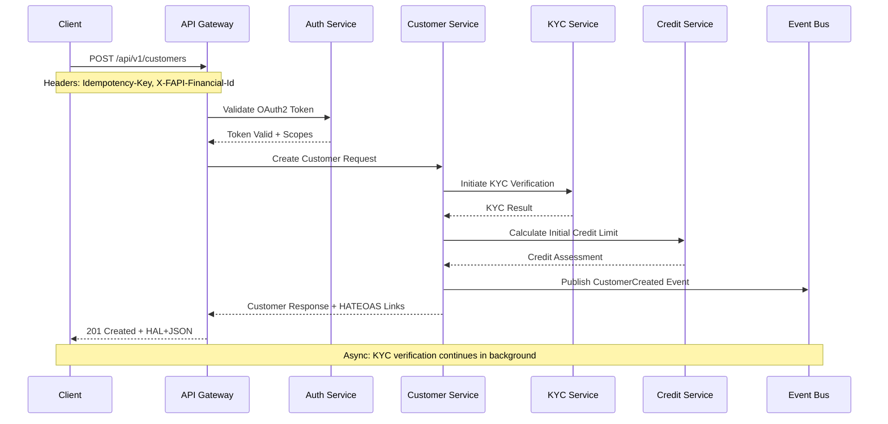

### 1.2 Loan Application Flow

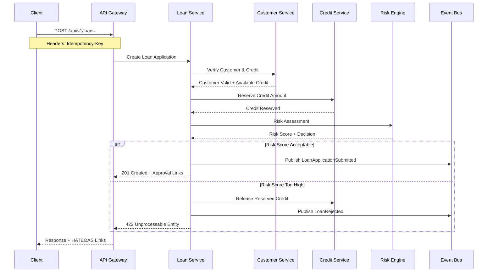

### 1.3 Payment Processing Flow

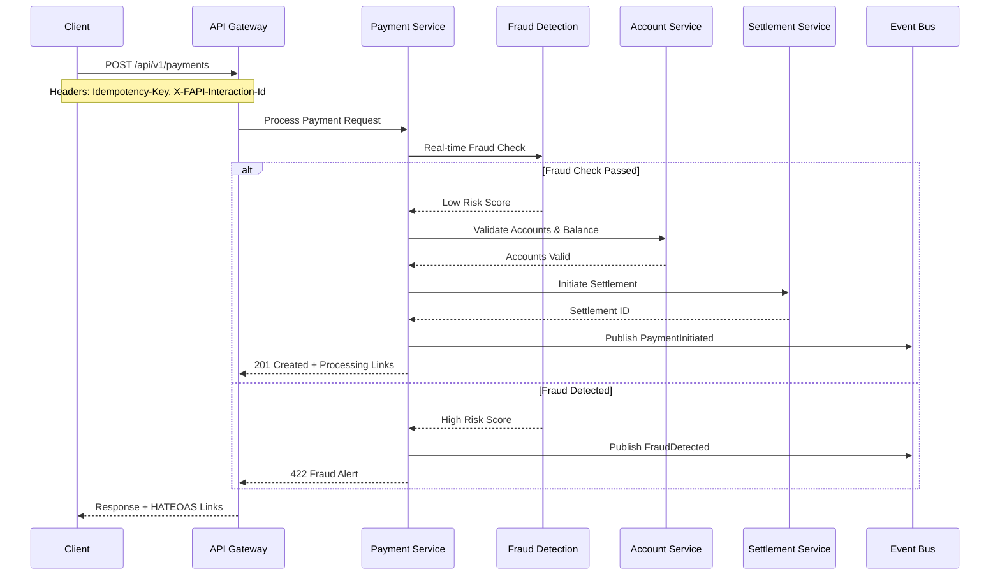

## 2. Asynchronous API Flows

### 2.1 Event-Driven Loan Processing

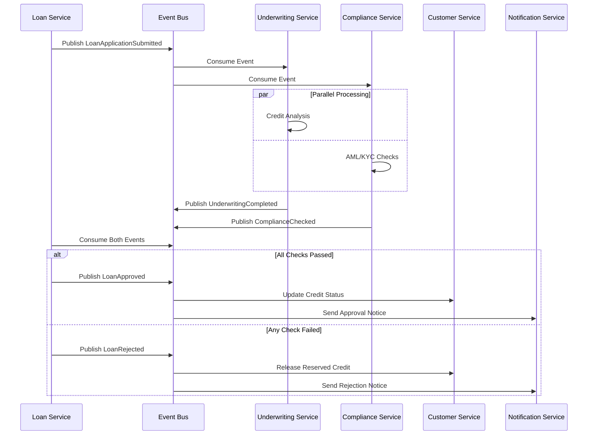

### 2.2 Payment Settlement Saga

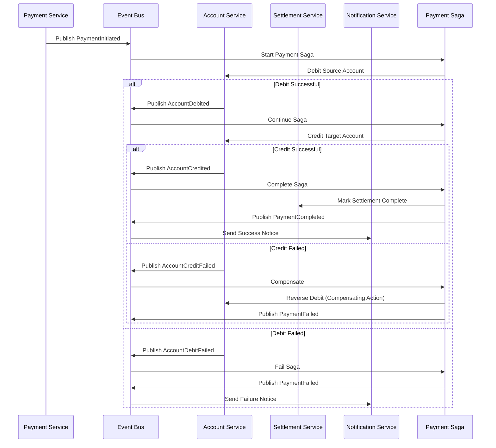

### 2.3 Real-time Event Streaming

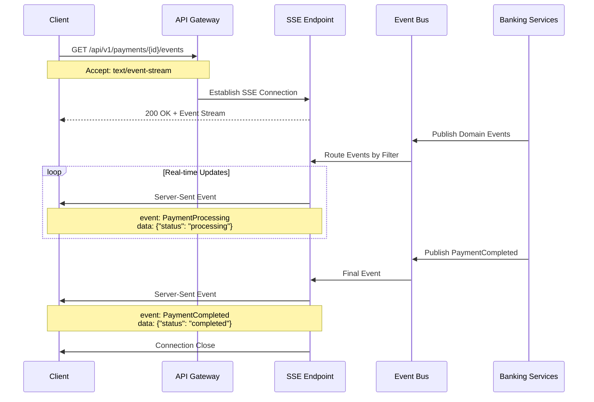

## 3. API Gateway Architecture

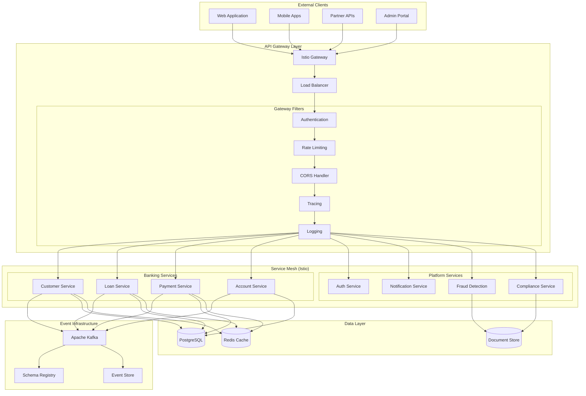

## 4. HATEOAS Navigation Flow

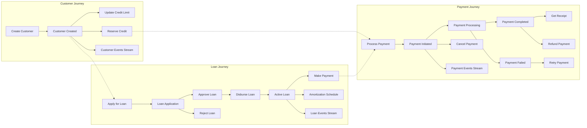

## 5. Security Flow (FAPI 2.0)

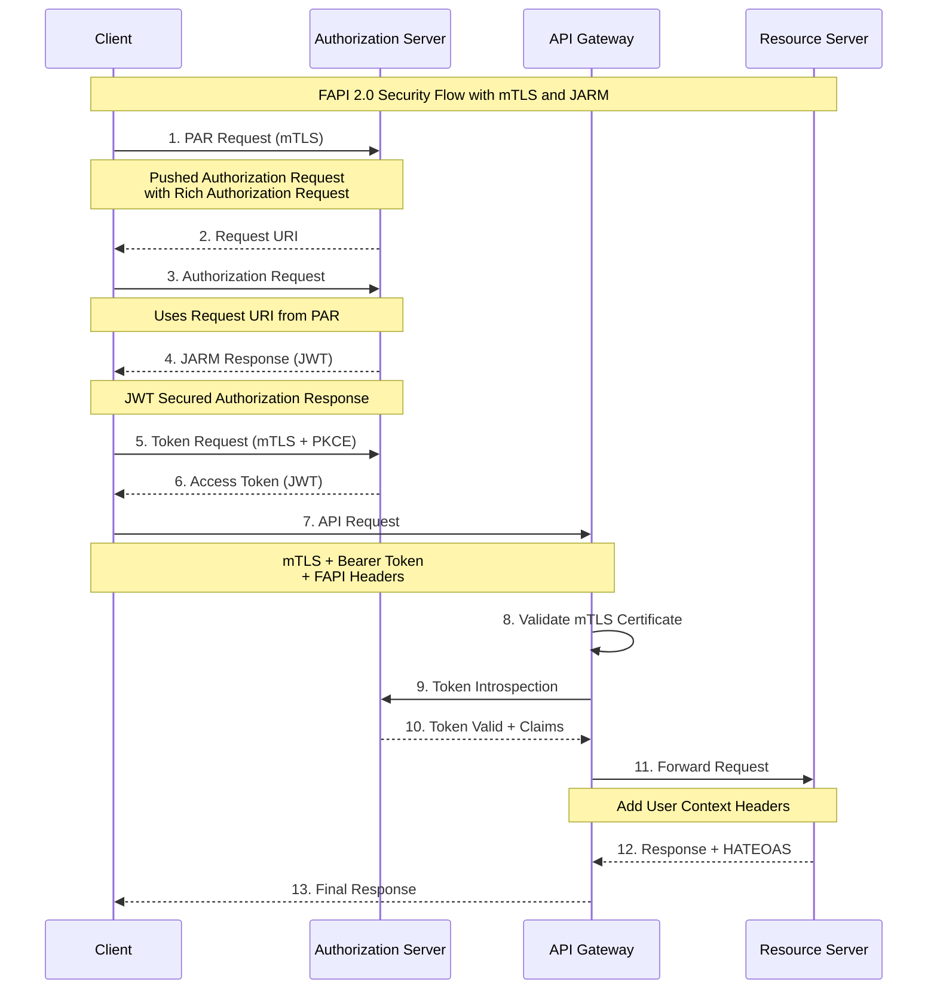

## 6. Idempotency Pattern

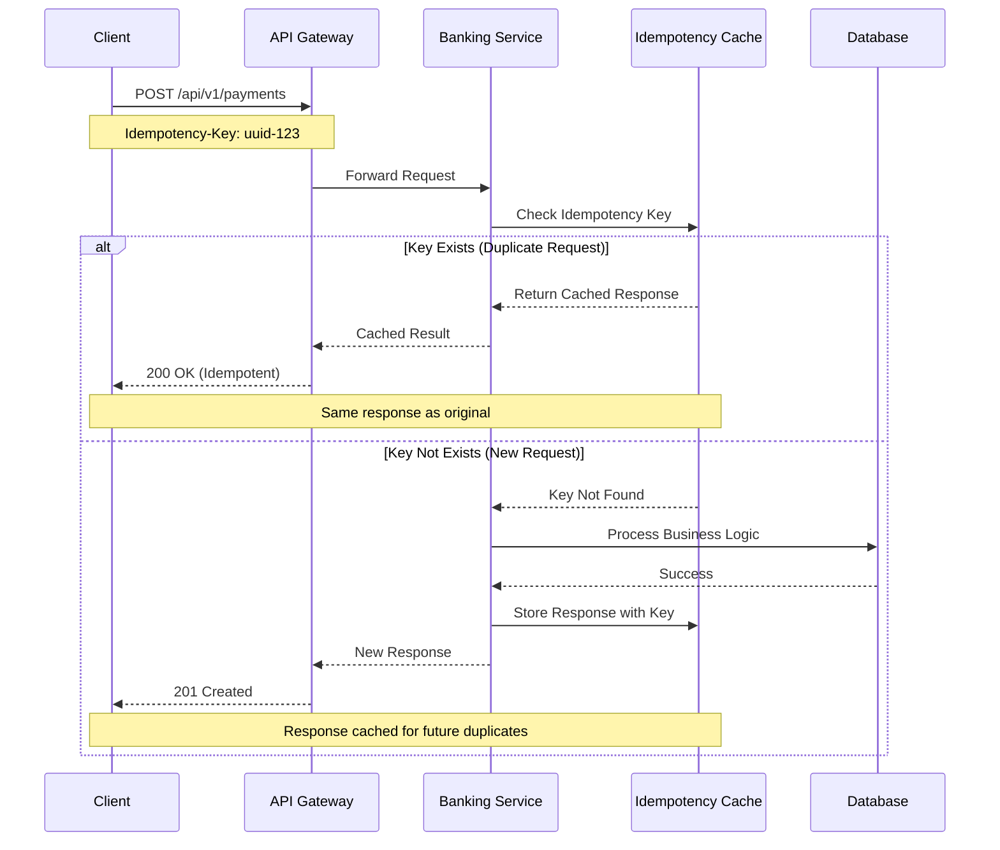

## 7. Event Sourcing Pattern

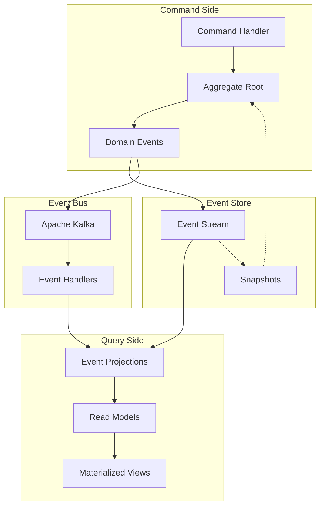

## 8. Rate Limiting Architecture

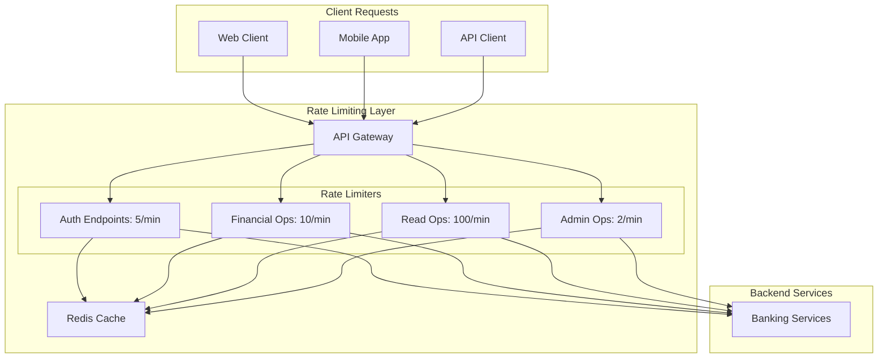

## API Design Principles

### 1. RESTful Design
- Resource-based URLs
- HTTP verbs for actions
- Stateless interactions
- Cacheable responses

### 2. HATEOAS Implementation
- Hypermedia controls in responses
- Discoverable API actions
- State transition guidance
- Reduced client coupling

### 3. Event-Driven Architecture
- Asynchronous processing
- Loose coupling between services
- Eventual consistency
- Scalable event handling

### 4. Security-First Approach
- FAPI 2.0 compliance
- mTLS for transport security
- OAuth 2.1 for authorization
- Comprehensive audit trails

### 5. Observability
- Distributed tracing
- Structured logging
- Custom metrics
- Health monitoring