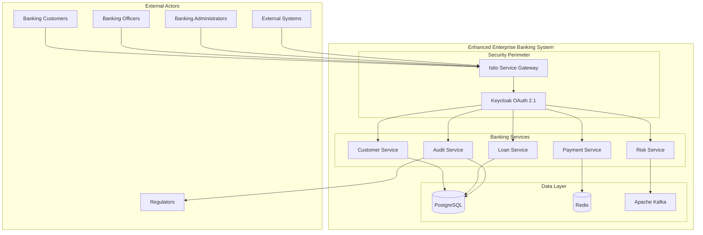
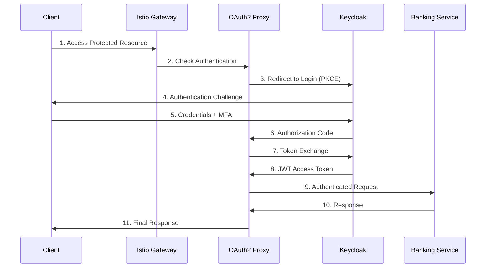
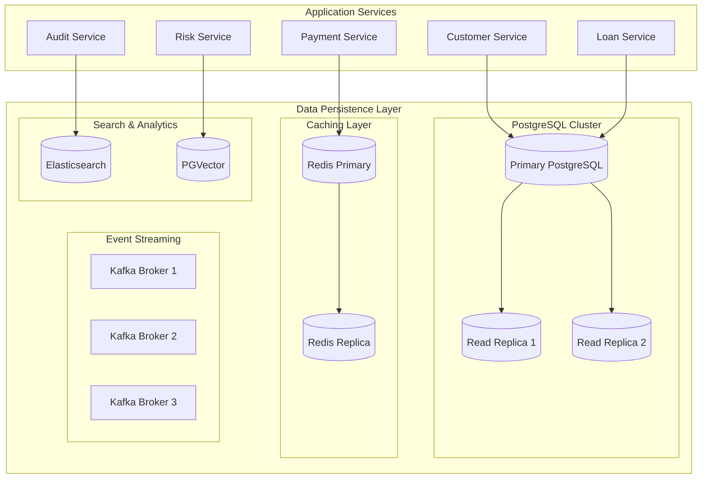
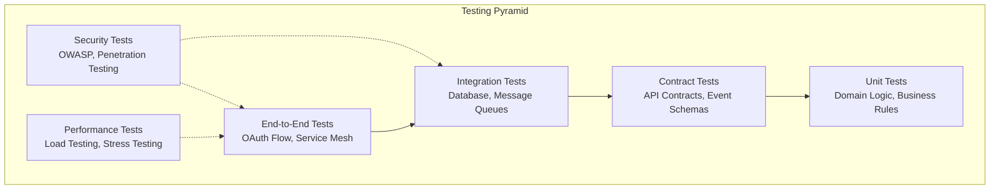
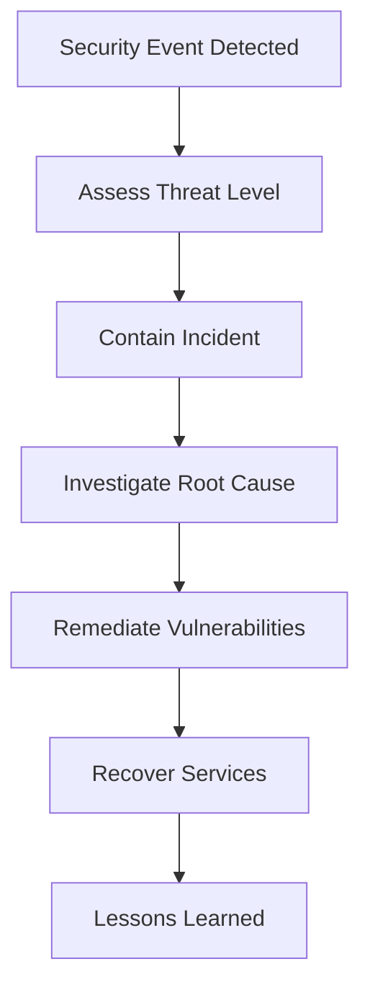
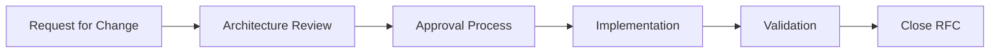

# 🏛️ Enhanced Enterprise Banking System - Architecture Catalogue

## 📖 Executive Summary

The **Enhanced Enterprise Banking System Architecture Catalogue** provides a comprehensive overview of our secure microservices platform built with zero-trust security principles. This document serves as the definitive guide for architects, developers, and stakeholders to understand the system's design, implementation patterns, and operational characteristics.

### Architecture Vision

**"A secure-by-design, cloud-native banking platform that enforces zero-trust security at every layer while maintaining compliance with financial industry standards."**

---

## 🏗️ Architecture Overview

### System Context



### Architecture Principles

| Principle | Description | Implementation |
|-----------|-------------|----------------|
| **Zero Trust** | Never trust, always verify | mTLS, JWT validation, RBAC |
| **Security by Design** | Security built into every component | OAuth 2.1, Envoy sidecars, encryption |
| **Domain-Driven Design** | Business-focused architecture | Bounded contexts, aggregates |
| **Hexagonal Architecture** | Clean separation of concerns | Ports, adapters, pure domain logic |
| **Compliance First** | Regulatory requirements embedded | FAPI, PCI DSS, SOX, GDPR |
| **Cloud Native** | Built for cloud operations | Kubernetes, containers, service mesh |

---

## 🔐 Security Architecture

### Zero-Trust Security Model


#### Security Layers

1. **Perimeter Security**
   - Istio Ingress Gateway with TLS 1.3 termination
   - OAuth2 Proxy for authentication
   - DDoS protection and rate limiting

2. **Identity & Access Management**
   - Keycloak OAuth 2.1 Authorization Server
   - Role-Based Access Control (RBAC)
   - Multi-Factor Authentication (MFA)
   - LDAP/Active Directory integration

3. **Service Mesh Security**
   - Envoy sidecars for every microservice
   - Mutual TLS (mTLS) for service communication
   - JWT token validation at mesh level
   - Fine-grained authorization policies

4. **Application Security**
   - OWASP Top 10 protection
   - Input validation and sanitization
   - SQL injection prevention
   - XSS attack mitigation

#### Authentication Flow



---

## 🏦 Domain Architecture

### Domain-Driven Design Implementation


#### Bounded Contexts

| Context | Description | Key Aggregates | Domain Events |
|---------|-------------|----------------|---------------|
| **Customer Management** | Customer lifecycle and KYC | Customer, Account, Profile | CustomerCreated, KYCCompleted |
| **Loan Processing** | Loan lifecycle management | Loan, Application, Assessment | LoanApplied, LoanApproved, LoanDisbursed |
| **Payment Processing** | Payment transactions | Payment, Transaction, Transfer | PaymentInitiated, PaymentCompleted |
| **Risk Management** | Credit and operational risk | RiskProfile, CreditScore, Assessment | RiskAssessed, ScoreUpdated |
| **Compliance & Audit** | Regulatory compliance | AuditLog, ComplianceReport | AuditCreated, ComplianceChecked |
| **Financial Products** | Banking products catalog | Product, Rate, Term | ProductCreated, RateChanged |
| **AI & Intelligence** | Machine learning operations | Model, Prediction, Feature | ModelDeployed, PredictionMade, ModelRetrained |

#### Hexagonal Architecture Layers

```java
// Domain Layer - Pure Business Logic
public class Loan extends AggregateRoot<LoanId> {
    private LoanId id;
    private CustomerId customerId;
    private Money principalAmount;
    private LoanStatus status;
    private List<DomainEvent> domainEvents;
    
    // Factory method for controlled creation
    public static Loan create(LoanCreationCommand command) {
        validateBusinessRules(command);
        Loan loan = new Loan(command);
        loan.addDomainEvent(new LoanApplicationSubmittedEvent(loan));
        return loan;
    }
    
    // Pure business logic
    public void approve(String approvedBy) {
        if (this.status != LoanStatus.PENDING) {
            throw new LoanBusinessException("Only pending loans can be approved");
        }
        this.status = LoanStatus.APPROVED;
        addDomainEvent(new LoanApprovedEvent(this));
    }
}

// Application Layer - Use Case Orchestration
@ApplicationService
@Transactional
public class LoanApplicationService {
    
    @Autowired
    private LoanRepository loanRepository; // Port
    
    @Autowired
    private DomainEventPublisher eventPublisher; // Port
    
    public LoanApplicationResult createLoan(CreateLoanCommand command) {
        // Domain validation and creation
        Loan loan = Loan.create(command);
        
        // Persistence through port
        loanRepository.save(loan);
        
        // Event publishing
        eventPublisher.publishEvents(loan.getDomainEvents());
        
        return LoanApplicationResult.success(loan.getId());
    }
}

// Infrastructure Layer - Adapters
@Repository
public class JpaLoanRepository implements LoanRepository {
    // JPA implementation details
}
```

---

## 🌐 Microservices Architecture

### Service Mesh Architecture


#### Core Banking Services

| Service | Purpose | Technology Stack | Scaling Strategy |
|---------|---------|------------------|------------------|
| **Customer Service** | Customer management and KYC | Spring Boot 3.3.6, PostgreSQL | Horizontal Pod Autoscaling |
| **Loan Service** | Loan processing and lifecycle | Spring Boot 3.3.6, PostgreSQL | Vertical scaling with memory optimization |
| **Payment Service** | Payment processing and clearing | Spring Boot 3.3.6, Redis, Kafka | High availability with circuit breakers |
| **Risk Service** | Credit scoring and risk assessment | Spring Boot 3.3.6, PGVector, ML models | GPU-accelerated pods for ML workloads |
| **Audit Service** | Compliance logging and reporting | Spring Boot 3.3.6, PostgreSQL, Elasticsearch | Write-heavy optimization |
| **Notification Service** | Customer and internal notifications | Spring Boot 3.3.6, Kafka, SMTP/SMS | Event-driven processing |
| **AI/ML Services** | Intelligent banking operations | Python 3.11, TensorFlow/PyTorch, NVIDIA Triton | GPU-accelerated inference |

#### Service Communication Patterns

```yaml
# Service-to-Service mTLS Configuration
apiVersion: security.istio.io/v1beta1
kind: PeerAuthentication
metadata:
  name: banking-mtls
  namespace: banking-system
spec:
  mtls:
    mode: STRICT

---
# JWT Authentication Configuration
apiVersion: security.istio.io/v1beta1
kind: RequestAuthentication
metadata:
  name: banking-jwt-auth
  namespace: banking-system
spec:
  jwtRules:
  - issuer: "https://keycloak.banking.local/realms/banking-system"
    jwksUri: "https://keycloak.banking.local/realms/banking-system/protocol/openid-connect/certs"
    audiences:
    - "banking-system-frontend"
    - "banking-microservices"

---
# Role-Based Authorization
apiVersion: security.istio.io/v1beta1
kind: AuthorizationPolicy
metadata:
  name: banking-rbac-policy
  namespace: banking-system
spec:
  action: ALLOW
  rules:
  - from:
    - source:
        requestPrincipals: ["https://keycloak.banking.local/realms/banking-system/*"]
    when:
    - key: request.auth.claims[realm_access.roles]
      values: ["banking-admin", "banking-manager", "banking-officer"]
```

---

## 📊 Data Architecture

### Data Management Strategy

#### Database Architecture



#### Data Classification

| Data Type | Classification | Encryption | Retention | Compliance |
|-----------|---------------|------------|-----------|------------|
| **Customer PII** | Highly Sensitive | AES-256 | 7 years | GDPR, PCI DSS |
| **Financial Transactions** | Sensitive | AES-256 | 7 years | SOX, PCI DSS |
| **Authentication Data** | Critical | bcrypt + salt | 1 year | FAPI |
| **Audit Logs** | Sensitive | AES-256 | 7 years | SOX, GDPR |
| **Application Logs** | Internal | TLS in transit | 90 days | Internal |
| **Metrics Data** | Internal | None | 30 days | Internal |

---

## 🛡️ Compliance Architecture

### Regulatory Compliance Framework

#### FAPI (Financial-grade API) Implementation

```yaml
# FAPI Security Requirements
fapi_requirements:
  authorization:
    - PKCE (Proof Key for Code Exchange)
    - Client authentication with mutual TLS
    - Request object signing with RSA-256
    
  security_headers:
    - x-fapi-financial-id: Required for all requests
    - x-fapi-customer-ip-address: Customer IP tracking
    - x-fapi-interaction-id: Request correlation
    - x-fapi-auth-date: Authentication timestamp
    
  encryption:
    - TLS 1.2+ for all communications
    - JWE encryption for sensitive data
    - Certificate pinning for mobile apps
    
  audit:
    - All API calls logged with correlation IDs
    - Risk scoring for transactions
    - Real-time fraud detection
```

#### PCI DSS Compliance Implementation

```yaml
# PCI DSS Requirements Mapping
pci_dss_controls:
  requirement_1: # Firewall Configuration
    implementation: "Istio network policies and Kubernetes NetworkPolicies"
    
  requirement_2: # Change Default Passwords
    implementation: "Keycloak strong password policies and MFA"
    
  requirement_3: # Protect Stored Data
    implementation: "PostgreSQL TDE and application-level encryption"
    
  requirement_4: # Encrypt Data in Transit
    implementation: "TLS 1.3 and mTLS for all communications"
    
  requirement_6: # Secure Development
    implementation: "OWASP Top 10 protection and security testing"
    
  requirement_8: # Unique User Authentication
    implementation: "OAuth 2.1 with RBAC and audit trails"
    
  requirement_10: # Log and Monitor Access
    implementation: "Comprehensive audit logging and SIEM integration"
    
  requirement_11: # Security Testing
    implementation: "Automated security scanning and penetration testing"
```

---

## 🚀 Deployment Architecture

### Kubernetes Deployment Strategy

#### Production Environment

```yaml
# Production Namespace Configuration
apiVersion: v1
kind: Namespace
metadata:
  name: banking-system
  labels:
    istio-injection: enabled
    compliance-level: "high"
    environment: "production"
  annotations:
    networking.istio.io/defaultRoute: "secure"

---
# Banking Application Deployment
apiVersion: apps/v1
kind: Deployment
metadata:
  name: enhanced-banking-system
  namespace: banking-system
spec:
  replicas: 3
  strategy:
    type: RollingUpdate
    rollingUpdate:
      maxUnavailable: 1
      maxSurge: 1
  selector:
    matchLabels:
      app: enhanced-banking-system
  template:
    metadata:
      labels:
        app: enhanced-banking-system
        version: v2.0.0
      annotations:
        sidecar.istio.io/inject: "true"
        prometheus.io/scrape: "true"
        prometheus.io/port: "8081"
    spec:
      securityContext:
        runAsNonRoot: true
        runAsUser: 1000
        fsGroup: 1000
      containers:
      - name: banking-app
        image: harbor.banking.local/enhanced-banking:v2.0.0
        ports:
        - containerPort: 8080
          name: http
        - containerPort: 8081
          name: management
        env:
        - name: SPRING_PROFILES_ACTIVE
          value: "production,kubernetes"
        - name: OAUTH2_ISSUER_URI
          value: "https://keycloak.banking.local/realms/banking-system"
        resources:
          requests:
            memory: "1Gi"
            cpu: "500m"
          limits:
            memory: "2Gi"
            cpu: "1000m"
        livenessProbe:
          httpGet:
            path: /actuator/health/liveness
            port: 8081
          initialDelaySeconds: 60
          periodSeconds: 30
        readinessProbe:
          httpGet:
            path: /actuator/health/readiness
            port: 8081
          initialDelaySeconds: 30
          periodSeconds: 10
        securityContext:
          allowPrivilegeEscalation: false
          runAsNonRoot: true
          capabilities:
            drop:
            - ALL
```

#### Infrastructure as Code

| Component | Technology | Configuration |
|-----------|------------|---------------|
| **Container Registry** | Harbor | Private registry with vulnerability scanning |
| **Secrets Management** | Kubernetes Secrets + Vault | Encrypted secrets with rotation |
| **Certificate Management** | cert-manager | Automated TLS certificate lifecycle |
| **Backup Strategy** | Velero + PostgreSQL PITR | Daily backups with 30-day retention |
| **Monitoring Stack** | Prometheus + Grafana + Jaeger | Full observability pipeline |
| **Log Management** | Fluentd + Elasticsearch + Kibana | Centralized logging with audit trails |

---

## 📈 Observability Architecture

### Monitoring and Alerting Strategy

#### Banking-Specific Metrics

```yaml
# Custom Banking Metrics
banking_metrics:
  business_metrics:
    - name: banking_loan_applications_total
      type: counter
      labels: [loan_type, approval_status, amount_range]
      description: "Total number of loan applications by type and status"
      
    - name: banking_payments_total
      type: counter
      labels: [payment_method, status, currency]
      description: "Total payment transactions by method and status"
      
    - name: banking_fraud_score
      type: histogram
      labels: [risk_level, detection_method]
      description: "Distribution of fraud scores by risk level"
      
    - name: banking_fapi_compliance_total
      type: counter
      labels: [fapi_version, financial_id]
      description: "FAPI compliance validation metrics"
      
  technical_metrics:
    - name: banking_response_time
      type: histogram
      labels: [service, endpoint, method]
      description: "API response time distribution"
      
    - name: banking_error_rate
      type: gauge
      labels: [service, error_type]
      description: "Error rate by service and error type"
      
    - name: banking_concurrent_users
      type: gauge
      labels: [user_type, channel]
      description: "Number of concurrent users by type"
```

#### Security Monitoring Dashboard

```json
{
  "dashboard": {
    "title": "Banking Security Operations Center",
    "panels": [
      {
        "title": "Authentication Success Rate",
        "type": "stat",
        "targets": [
          {
            "expr": "sum(rate(istio_requests_total{response_code=~\"2..\"}[5m])) / sum(rate(istio_requests_total[5m]))",
            "legendFormat": "Success Rate"
          }
        ],
        "thresholds": {
          "steps": [
            {"color": "red", "value": 0},
            {"color": "yellow", "value": 0.95},
            {"color": "green", "value": 0.99}
          ]
        }
      },
      {
        "title": "Security Incidents",
        "type": "table",
        "targets": [
          {
            "expr": "sum by (event_type, severity) (rate(security_incidents_total[1h]))",
            "legendFormat": "{{event_type}} - {{severity}}"
          }
        ]
      },
      {
        "title": "FAPI Compliance Rate",
        "type": "graph",
        "targets": [
          {
            "expr": "sum(rate(banking_fapi_compliance_total[5m])) by (fapi_version)",
            "legendFormat": "FAPI {{fapi_version}}"
          }
        ]
      }
    ]
  }
}
```

---

## 🧪 Testing Architecture

### Comprehensive Testing Strategy

#### Test Pyramid



#### Test Coverage Requirements

| Test Type | Coverage Target | Framework | Automation |
|-----------|----------------|-----------|------------|
| **Unit Tests** | 90%+ | JUnit 5, Mockito | CI/CD Pipeline |
| **Integration Tests** | 80%+ | Testcontainers, Spring Boot Test | CI/CD Pipeline |
| **Contract Tests** | 100% API endpoints | Spring Cloud Contract | CI/CD Pipeline |
| **Security Tests** | OWASP Top 10 | OWASP ZAP, SonarQube | CI/CD Pipeline |
| **Performance Tests** | Load baselines | JMeter, Gatling | Staging environment |
| **End-to-End Tests** | Critical user journeys | Selenium, Cypress | Nightly builds |

---

## 📚 Documentation Standards

### Architecture Decision Records (ADRs)

Our architecture documentation includes **14 comprehensive ADRs** covering all major architectural decisions:

| ADR | Title | Status | Category |
|-----|-------|--------|----------|
| [ADR-001](../decisions/ADR-001-hexagonal-architecture.md) | Hexagonal Architecture Pattern | Accepted | Architecture |
| [ADR-002](../decisions/ADR-002-oauth2-keycloak-security.md) | OAuth 2.1 with Keycloak Security | Accepted | Security |
| [ADR-003](../decisions/ADR-003-microservices-spring-boot.md) | Microservices with Spring Boot | Accepted | Technology |
| [ADR-004](../decisions/ADR-004-database-postgresql-strategy.md) | PostgreSQL Database Strategy | Accepted | Data |
| [ADR-005](../decisions/ADR-005-api-design-standards.md) | API Design Standards | Accepted | Integration |
| [ADR-006](../decisions/ADR-006-monitoring-observability.md) | Monitoring and Observability | Accepted | Operations |
| [ADR-007](../decisions/ADR-007-docker-multi-stage-architecture.md) | Docker Multi-Stage Architecture | Accepted | Deployment |
| [ADR-008](../decisions/ADR-008-kubernetes-production-deployment.md) | Kubernetes Production Deployment | Accepted | Infrastructure |
| [ADR-009](../decisions/ADR-009-aws-eks-infrastructure-design.md) | AWS EKS Infrastructure Design | Accepted | Cloud |
| [ADR-010](../decisions/ADR-010-active-active-architecture.md) | Active-Active Multi-Region Architecture | Accepted | Availability |
| [ADR-011](../decisions/ADR-011-multi-entity-banking-architecture.md) | Multi-Entity Banking Architecture | Accepted | Business |
| [ADR-012](../decisions/ADR-012-international-compliance-framework.md) | International Compliance Framework | Accepted | Compliance |
| [ADR-013](../decisions/ADR-013-non-functional-requirements-architecture.md) | Non-Functional Requirements Architecture | Accepted | Quality |
| [ADR-014](../decisions/ADR-014-ai-ml-architecture.md) | AI/ML Architecture | Accepted | Intelligence |

#### Recent Architectural Enhancements

**✅ Clean Code & DDD Implementation**
- **Event-Driven Communication**: Complete domain event system with publishers and handlers
- **Hexagonal Architecture**: Clear separation between domain, application, and infrastructure layers
- **Domain-Rich Models**: Business logic properly encapsulated in domain entities
- **Value Objects**: Rich domain modeling with proper validation
- **Aggregate Roots**: Proper event management and business rule enforcement

**✅ Architecture Guardrails Applied**
- **Type Safety**: BigDecimal for financial calculations, strong typing throughout
- **Validation**: Jakarta Bean Validation with business rule methods
- **Request Parsing**: Type-safe command objects with comprehensive validation
- **Response Types**: Structured result objects with business context
- **Dependency Inversion**: Interface-based dependencies and clean architecture

**✅ Event-Driven Architecture**
- **Domain Events**: `LoanApplicationSubmittedEvent`, `LoanApplicationApprovedEvent`, `UnderwriterAssignedEvent`
- **Event Publishers**: Infrastructure for reliable event publishing and sourcing
- **Event Handlers**: Async processing with proper error handling and compensation
- **Event Store**: Complete audit trail for compliance and debugging

#### ADR Template

```markdown
# ADR-001: OAuth 2.1 with Keycloak for Authentication

## Status
Accepted

## Context
Need for enterprise-grade authentication and authorization system that supports:
- Financial-grade API (FAPI) compliance
- Role-based access control
- Multi-factor authentication
- External identity provider integration

## Decision
Implement OAuth 2.1 with Keycloak as the identity and access management solution.

## Consequences
### Positive
- FAPI 1.0 Advanced compliance
- Centralized identity management
- Strong security with PKCE
- Extensive enterprise integrations

### Negative
- Additional infrastructure complexity
- Learning curve for development team
- Dependency on external service

## Implementation
- Keycloak deployed in high-availability mode
- Banking-specific realm configuration
- Integration with existing LDAP/AD systems
- Custom themes for banking branding
```

### API Documentation Standards

```yaml
openapi: 3.0.3
info:
  title: Loan Management System API
  description: |
    Enterprise Loan Management System API built with Domain-Driven Design (DDD) and Hexagonal Architecture.

    ## Features
    - **Loan Creation** with business rule validation
    - **Payment Processing** with early/late payment calculations  
    - **Credit Management** with automatic limit updates
    - **Role-Based Access Control** (ADMIN and CUSTOMER roles)

    ## Business Rules
    - Supported installment options: 6, 9, 12, or 24 months
    - Interest rates between 10% (0.1) and 50% (0.5)
    - Early payment discount: amount × 0.001 × days before due date
    - Late payment penalty: amount × 0.001 × days after due date
    - No partial payments allowed - only full installments
    - Maximum 3 months advance payment allowed
  version: 1.0.0
  contact:
    name: Development Team
    email: dev@bank.com
  license:
    name: MIT
    url: https://opensource.org/licenses/MIT

servers:
  - url: http://localhost:8000
    description: Local development server
  - url: https://api.loanmanagement.example.com
    description: Production server

security:
  - bearerAuth: []

paths:
  # Authentication Endpoints
  /api/v1/auth/login:
    post:
      tags:
        - Authentication
      summary: User login
      description: Authenticate user and return JWT token
      security: []
      requestBody:
        required: true
        content:
          application/json:
            schema:
              $ref: '#/components/schemas/LoginRequest'
      responses:
        '200':
          description: Login successful
          content:
            application/json:
              schema:
                $ref: '#/components/schemas/LoginResponse'
        '401':
          description: Invalid credentials
          content:
            application/json:
              schema:
                $ref: '#/components/schemas/ErrorResponse'

  # Customer Management Endpoints
  /api/v1/customers:
    get:
      tags:
        - Customer Management
      summary: Get all customers
      description: Retrieve a list of all customers (Admin only)
      security:
        - bearerAuth: []
      responses:
        '200':
          description: Customers retrieved successfully
          content:
            application/json:
              schema:
                type: array
                items:
                  $ref: '#/components/schemas/CustomerResponse'
        '403':
          description: Access denied
          content:
            application/json:
              schema:
                $ref: '#/components/schemas/ErrorResponse'

  /api/v1/customers/{customerId}:
    get:
      tags:
        - Customer Management
      summary: Get customer by ID
      description: Retrieve customer information by ID
      parameters:
        - name: customerId
          in: path
          required: true
          schema:
            type: integer
            format: int64
          example: 1
      responses:
        '200':
          description: Customer retrieved successfully
          content:
            application/json:
              schema:
                $ref: '#/components/schemas/CustomerResponse'
        '404':
          description: Customer not found
          content:
            application/json:
              schema:
                $ref: '#/components/schemas/ErrorResponse'

  /api/v1/customers/{customerId}/credit-info:
    get:
      tags:
        - Customer Management
      summary: Get customer credit information
      description: Retrieve credit limit and usage information
      parameters:
        - name: customerId
          in: path
          required: true
          schema:
            type: integer
            format: int64
      responses:
        '200':
          description: Credit information retrieved successfully
          content:
            application/json:
              schema:
                $ref: '#/components/schemas/CreditInfoResponse'

  # Loan Management Endpoints
  /api/v1/loans:
    post:
      tags:
        - Loan Management
      summary: Create a new loan
      description: Create a new loan for a customer
      requestBody:
        required: true
        content:
          application/json:
            schema:
              $ref: '#/components/schemas/CreateLoanRequest'
      responses:
        '201':
          description: Loan created successfully
          content:
            application/json:
              schema:
                $ref: '#/components/schemas/LoanResponse'
        '400':
          description: Invalid request or insufficient credit
          content:
            application/json:
              schema:
                $ref: '#/components/schemas/ErrorResponse'

  /api/v1/loans/customers/{customerId}:
    get:
      tags:
        - Loan Management
      summary: List loans for a customer
      description: Retrieve all loans for a specific customer with optional filters
      parameters:
        - name: customerId
          in: path
          required: true
          schema:
            type: integer
            format: int64
        - name: numberOfInstallments
          in: query
          required: false
          schema:
            type: integer
            enum: [6, 9, 12, 24]
          description: Filter by number of installments
        - name: isPaid
          in: query
          required: false
          schema:
            type: boolean
          description: Filter by payment status
      responses:
        '200':
          description: Loans retrieved successfully
          content:
            application/json:
              schema:
                type: array
                items:
                  $ref: '#/components/schemas/LoanResponse'

  /api/v1/loans/{loanId}:
    get:
      tags:
        - Loan Management
      summary: Get loan by ID
      description: Retrieve loan information by ID
      parameters:
        - name: loanId
          in: path
          required: true
          schema:
            type: string
            format: uuid
      responses:
        '200':
          description: Loan retrieved successfully
          content:
            application/json:
              schema:
                $ref: '#/components/schemas/LoanResponse'
        '404':
          description: Loan not found
          content:
            application/json:
              schema:
                $ref: '#/components/schemas/ErrorResponse'

  /api/v1/loans/{loanId}/installments:
    get:
      tags:
        - Loan Management
      summary: List installments for a loan
      description: Retrieve all installments for a specific loan
      parameters:
        - name: loanId
          in: path
          required: true
          schema:
            type: string
            format: uuid
      responses:
        '200':
          description: Installments retrieved successfully
          content:
            application/json:
              schema:
                type: array
                items:
                  $ref: '#/components/schemas/InstallmentResponse'

  # Payment Processing Endpoints
  /api/v1/loans/{loanId}/payments:
    post:
      tags:
        - Payment Processing
      summary: Process payment
      description: Process a payment for a loan
      parameters:
        - name: loanId
          in: path
          required: true
          schema:
            type: string
            format: uuid
      requestBody:
        required: true
        content:
          application/json:
            schema:
              $ref: '#/components/schemas/PaymentRequest'
      responses:
        '201':
          description: Payment processed successfully
          content:
            application/json:
              schema:
                $ref: '#/components/schemas/PaymentResponse'
        '400':
          description: Invalid payment amount or loan already paid
          content:
            application/json:
              schema:
                $ref: '#/components/schemas/ErrorResponse'

    get:
      tags:
        - Payment Processing
      summary: List payments for loan
      description: Retrieve all payments made for a specific loan
      parameters:
        - name: loanId
          in: path
          required: true
          schema:
            type: string
            format: uuid
      responses:
        '200':
          description: Payments retrieved successfully
          content:
            application/json:
              schema:
                type: array
                items:
                  $ref: '#/components/schemas/PaymentResponse'

  # Health Check
  /actuator/health:
    get:
      tags:
        - System
      summary: Health check
      description: Get application health status
      security: []
      responses:
        '200':
          description: Application is healthy
          content:
            application/json:
              schema:
                $ref: '#/components/schemas/HealthResponse'

components:
  securitySchemes:
    bearerAuth:
      type: http
      scheme: bearer
      bearerFormat: JWT

  schemas:
    # Authentication Schemas
    LoginRequest:
      type: object
      required:
        - username
        - password
      properties:
        username:
          type: string
          example: "admin"
        password:
          type: string
          format: password
          example: "password123"

    LoginResponse:
      type: object
      properties:
        token:
          type: string
          description: JWT access token
        type:
          type: string
          example: "Bearer"
        expiresIn:
          type: integer
          description: Token expiration time in seconds
          example: 86400

    # Customer Schemas
    CustomerResponse:
      type: object
      properties:
        id:
          type: integer
          format: int64
          example: 1
        name:
          type: string
          example: "John"
        surname:
          type: string
          example: "Smith"
        fullName:
          type: string
          example: "John Smith"
        creditLimit:
          type: number
          format: decimal
          example: 100000.00
        usedCreditLimit:
          type: number
          format: decimal
          example: 25000.00
        availableCreditLimit:
          type: number
          format: decimal
          example: 75000.00

    CreditInfoResponse:
      type: object
      properties:
        creditLimit:
          type: number
          format: decimal
          example: 100000.00
        usedCredit:
          type: number
          format: decimal
          example: 25000.00
        availableCredit:
          type: number
          format: decimal
          example: 75000.00
        maximumLoanAmount:
          type: number
          format: decimal
          example: 75000.00
        creditRiskLevel:
          type: string
          enum: [LOW, MEDIUM, HIGH]
          example: "LOW"

    # Loan Schemas
    CreateLoanRequest:
      type: object
      required:
        - customerId
        - loanAmount
        - interestRate
        - numberOfInstallments
      properties:
        customerId:
          type: integer
          format: int64
          minimum: 1
          example: 1
        loanAmount:
          type: number
          format: decimal
          minimum: 1.00
          maximum: 1000000.00
          example: 10000.00
        interestRate:
          type: number
          format: decimal
          minimum: 0.1
          maximum: 0.5
          example: 0.15
          description: "Interest rate as decimal (0.15 = 15%)"
        numberOfInstallments:
          type: integer
          enum: [6, 9, 12, 24]
          example: 12

    LoanResponse:
      type: object
      properties:
        loanId:
          type: string
          format: uuid
          example: "550e8400-e29b-41d4-a716-446655440000"
        customerId:
          type: integer
          format: int64
          example: 1
        loanAmount:
          type: number
          format: decimal
          example: 10000.00
        totalAmount:
          type: number
          format: decimal
          example: 11500.00
          description: "Principal + Interest"
        numberOfInstallments:
          type: integer
          example: 12
        interestRate:
          type: number
          format: decimal
          example: 0.15
        createDate:
          type: string
          format: date-time
          example: "2024-01-15T10:30:00Z"
        isPaid:
          type: boolean
          example: false
        remainingAmount:
          type: number
          format: decimal
          example: 11500.00
        remainingInstallments:
          type: integer
          example: 12
        nextDueDate:
          type: string
          format: date
          example: "2024-02-01"

    InstallmentResponse:
      type: object
      properties:
        installmentId:
          type: string
          format: uuid
          example: "660e8400-e29b-41d4-a716-446655440001"
        amount:
          type: number
          format: decimal
          example: 958.33
        paidAmount:
          type: number
          format: decimal
          example: 0.00
        dueDate:
          type: string
          format: date
          example: "2024-02-01"
        paymentDate:
          type: string
          format: date-time
          nullable: true
          example: null
        isPaid:
          type: boolean
          example: false
        isOverdue:
          type: boolean
          example: false
        daysUntilDue:
          type: integer
          example: 15
          description: "Positive = days until due, Negative = days overdue"

    # Payment Schemas
    PaymentRequest:
      type: object
      required:
        - paymentAmount
      properties:
        paymentAmount:
          type: number
          format: decimal
          minimum: 0.01
          example: 2000.00

    PaymentResponse:
      type: object
      properties:
        paymentId:
          type: string
          format: uuid
          example: "770e8400-e29b-41d4-a716-446655440002"
        loanId:
          type: string
          format: uuid
          example: "550e8400-e29b-41d4-a716-446655440000"
        paymentAmount:
          type: number
          format: decimal
          example: 2000.00
        installmentsPaid:
          type: integer
          example: 2
        totalAmountSpent:
          type: number
          format: decimal
          example: 1916.66
          description: "Amount after discounts/penalties"
        isLoanFullyPaid:
          type: boolean
          example: false
        message:
          type: string
          example: "Paid 2 installment(s) for total amount 1916.66 (discount: 83.34)"

    # Error Schemas
    ErrorResponse:
      type: object
      properties:
        errorCode:
          type: string
          example: "BUSINESS_ERROR"
        message:
          type: string
          example: "Loan not found"
        timestamp:
          type: string
          format: date-time
          example: "2024-01-15T10:30:00Z"
        path:
          type: string
          example: "/api/v1/loans/invalid-id"

    ValidationErrorResponse:
      type: object
      properties:
        errorCode:
          type: string
          example: "VALIDATION_ERROR"
        message:
          type: string
          example: "Request validation failed"
        timestamp:
          type: string
          format: date-time
          example: "2024-01-15T10:30:00Z"
        fieldErrors:
          type: object
          additionalProperties:
            type: string
          example:
            loanAmount: "Loan amount must be at least 1.00"
            interestRate: "Interest rate must be between 0.1 and 0.5"

    # System Schemas
    HealthResponse:
      type: object
      properties:
        status:
          type: string
          enum: [UP, DOWN]
          example: "UP"
        components:
          type: object
          properties:
            db:
              type: object
              properties:
                status:
                  type: string
                  example: "UP"
            redis:
              type: object
              properties:
                status:
                  type: string
                  example: "UP"
            kafka:
              type: object
              properties:
                status:
                  type: string
                  example: "UP"

tags:
  - name: Authentication
    description: User authentication and authorization
  - name: Customer Management
    description: Customer information and credit management
  - name: Loan Management
    description: Loan creation and management operations
  - name: Payment Processing
    description: Payment processing and installment management
  - name: System
    description: System health and monitoring endpoints

```

---

## 🔄 DevOps and CI/CD Architecture

### Continuous Integration/Continuous Deployment

```yaml
# GitLab CI/CD Pipeline
stages:
  - build
  - test
  - security
  - deploy-dev
  - deploy-staging
  - deploy-production

variables:
  DOCKER_REGISTRY: harbor.banking.local
  HELM_NAMESPACE: banking-system

# Build Stage
build:
  stage: build
  script:
    - ./gradlew clean bootJar
    - docker build -f Dockerfile.enhanced-v2 --target runtime -t $DOCKER_REGISTRY/banking-system:$CI_COMMIT_SHA .
    - docker push $DOCKER_REGISTRY/banking-system:$CI_COMMIT_SHA

# Security Scanning
security_scan:
  stage: security
  script:
    - trivy image $DOCKER_REGISTRY/banking-system:$CI_COMMIT_SHA
    - sonar-scanner -Dsonar.projectKey=banking-system
  allow_failure: false

# Production Deployment
deploy_production:
  stage: deploy-production
  script:
    - helm upgrade --install banking-system ./helm/banking-system 
      --namespace $HELM_NAMESPACE 
      --set image.tag=$CI_COMMIT_SHA
      --set environment=production
  when: manual
  only:
    - main
```

### Infrastructure Automation

| Tool | Purpose | Configuration |
|------|---------|---------------|
| **Terraform** | Infrastructure provisioning | AWS EKS cluster setup |
| **Ansible** | Configuration management | Server hardening and compliance |
| **Helm** | Kubernetes package management | Application deployment charts |
| **ArgoCD** | GitOps deployment | Automated application synchronization |
| **Vault** | Secrets management | Dynamic secrets and certificate rotation |

---

## 📋 Operational Procedures

### Incident Response Plan

#### Security Incident Response



#### Escalation Matrix

| Severity | Response Time | Escalation | Stakeholders |
|----------|---------------|------------|--------------|
| **Critical** | 15 minutes | Immediate | CISO, CTO, CEO |
| **High** | 1 hour | Within 2 hours | Security Team, DevOps |
| **Medium** | 4 hours | Within 8 hours | Development Team |
| **Low** | 24 hours | Within 48 hours | Maintenance Team |

### Disaster Recovery Plan

#### Recovery Time Objectives (RTO)

| Component | RTO | RPO | Strategy |
|-----------|-----|-----|----------|
| **Banking Services** | 15 minutes | 5 minutes | Active-passive cluster |
| **Database** | 30 minutes | 1 minute | PostgreSQL streaming replication |
| **Keycloak** | 10 minutes | 5 minutes | Multi-region deployment |
| **Istio Service Mesh** | 5 minutes | N/A | Self-healing configuration |

---

## 🎯 Performance Characteristics

### System Performance Requirements

#### Service Level Objectives (SLOs)

| Metric | Target | Measurement |
|--------|--------|-------------|
| **API Response Time** | P95 < 200ms | Per endpoint monitoring |
| **System Availability** | 99.9% | Monthly uptime |
| **Authentication Success Rate** | 99.95% | OAuth flow completion |
| **Transaction Processing** | 1000 TPS | Peak load capacity |
| **Database Query Performance** | P99 < 100ms | Query execution time |

#### Capacity Planning

```yaml
# Resource Requirements per Environment
environments:
  development:
    nodes: 3
    cpu_per_node: "4 cores"
    memory_per_node: "16 GB"
    storage_per_node: "100 GB SSD"
    
  staging:
    nodes: 5
    cpu_per_node: "8 cores"
    memory_per_node: "32 GB"
    storage_per_node: "500 GB SSD"
    
  production:
    nodes: 9
    cpu_per_node: "16 cores"
    memory_per_node: "64 GB"
    storage_per_node: "1 TB NVMe SSD"
    
scaling_policies:
  horizontal_pod_autoscaler:
    min_replicas: 3
    max_replicas: 20
    target_cpu_utilization: 70%
    target_memory_utilization: 80%
    
  vertical_pod_autoscaler:
    enabled: true
    update_policy: "Auto"
    resource_policy:
      cpu:
        min: "100m"
        max: "2000m"
      memory:
        min: "128Mi"
        max: "4Gi"
```

---

## 🔮 Future Architecture Roadmap

### Technology Evolution Plan

#### Phase 1: Current State (Q1 2025)
- ✅ OAuth 2.1 with Keycloak
- ✅ Istio service mesh implementation
- ✅ Zero-trust security architecture
- ✅ FAPI 1.0 Advanced compliance

#### Phase 2: Enhanced AI/ML (Q2-Q3 2025)
- 🎯 Real-time fraud detection with ML
- 🎯 AI-powered credit scoring
- 🎯 Predictive analytics for risk management
- 🎯 Natural language processing for customer service

#### Phase 3: Advanced Capabilities (Q4 2025)
- 🎯 Blockchain integration for trade finance
- 🎯 Quantum-resistant cryptography
- 🎯 Edge computing for global deployment
- 🎯 Advanced analytics and reporting

#### Phase 4: Next-Generation Banking (2026)
- 🎯 Open banking API platform
- 🎯 Embedded finance capabilities
- 🎯 Real-time payment networks
- 🎯 Regulatory technology automation

---

## 📞 Architecture Governance

### Architecture Review Board

| Role | Responsibility | Authority |
|------|---------------|-----------|
| **Chief Architect** | Overall architecture vision and strategy | Final approval authority |
| **Security Architect** | Security design and compliance | Security approval authority |
| **Domain Architects** | Domain-specific design decisions | Domain approval authority |
| **DevOps Architect** | Infrastructure and deployment strategy | Operations approval authority |

### Change Management Process



---

## 📖 References and Standards

### Industry Standards
- **FAPI 1.0 Advanced** - Financial-grade API Security Profile
- **PCI DSS** - Payment Card Industry Data Security Standard
- **SOX** - Sarbanes-Oxley Act compliance
- **GDPR** - General Data Protection Regulation
- **NIST Cybersecurity Framework** - Risk management guidelines
- **BIAN** - Banking Industry Architecture Network

### Technology Standards
- **OAuth 2.1** - Authorization framework
- **OpenID Connect** - Identity layer
- **JWT** - JSON Web Tokens
- **TLS 1.3** - Transport Layer Security
- **mTLS** - Mutual Transport Layer Security
- **RBAC** - Role-Based Access Control

---

**Enhanced Enterprise Banking System Architecture Catalogue**  
*Version 2.0.0 - Last Updated: December 27, 2024*  
*Built with ❤️ by the Enterprise Architecture Team*

---

*This document is maintained as part of our commitment to architectural excellence and transparency. For questions or contributions, please contact the Enterprise Architecture Team.*