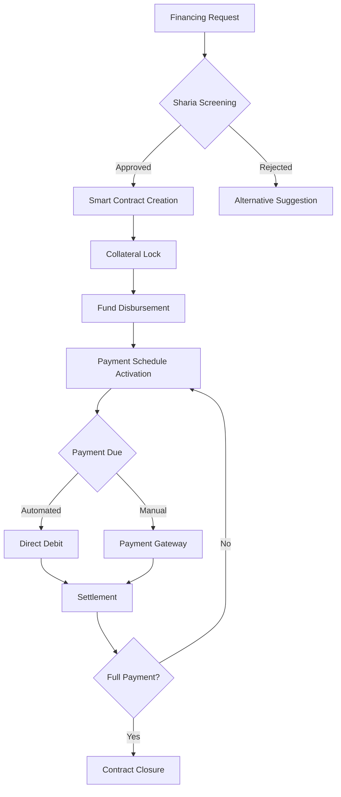

# MasruFi Sharia Crypto Platform - Business Model
## Halal Digital Finance with Blockchain Innovation

### Executive Summary

MasruFi Sharia Crypto Platform represents a revolutionary fork of the traditional MasruFi Framework, specifically designed to provide Sharia-compliant cryptocurrency-based financing solutions. Our platform offers unprecedented flexibility with loan terms ranging from ultra-short (hourly) to long-term (10 years), all while maintaining strict adherence to Islamic finance principles.

---

## 🌙 Core Principles

### Islamic Finance Compliance
- **No Riba (Interest)**: Profit-sharing and asset-backed financing only
- **No Gharar (Uncertainty)**: Transparent terms and conditions
- **No Haram Activities**: Ethical investment screening
- **Risk Sharing**: Mudarabah and Musharakah models
- **Asset-Backed**: All transactions backed by real assets or services

### Supported Crypto Assets
- **Halal-Certified Cryptocurrencies**: BTC, ETH (screened for compliance)
- **Gold-Backed Stablecoins**: PAXG, DGX
- **Commodity-Backed Tokens**: Agricultural and metal-backed tokens
- **Islamic Stablecoins**: HAQQ, Islamic Coin
- **Central Bank Digital Currencies (CBDCs)**: When available

---

## 📊 Product Offerings

### 1. Ultra-Short Term Financing (Hourly to Daily)

#### **Salam Crypto** (Advance Purchase)
- **Duration**: 1 hour to 24 hours
- **Structure**: Pre-payment for future delivery of crypto assets
- **Use Cases**: 
  - Crypto trading liquidity
  - DeFi yield farming positions
  - Short-term arbitrage opportunities
- **Profit Model**: Difference between spot and future delivery price
- **Smart Contract**: Automated execution and settlement

#### **Qard Hassan Flash** (Benevolent Loans)
- **Duration**: 1-12 hours
- **Structure**: Interest-free loans with optional donation
- **Use Cases**:
  - Emergency liquidity needs
  - Gas fee coverage
  - Bridge financing
- **Fee Model**: Platform maintenance fee only (not interest)
- **Collateral**: 150% over-collateralized in halal crypto

### 2. Short-Term Financing (1-30 Days)

#### **Murabaha Crypto** (Cost-Plus Financing)
- **Duration**: 1-30 days
- **Structure**: Purchase and resale with disclosed profit margin
- **Use Cases**:
  - Inventory financing for crypto merchants
  - NFT purchase financing
  - Mining equipment financing
- **Profit Model**: Fixed markup disclosed upfront
- **Payment**: Daily or weekly installments

#### **Ijarah Digital** (Lease Financing)
- **Duration**: 7-30 days
- **Structure**: Lease of digital assets or mining capacity
- **Use Cases**:
  - Cloud mining contracts
  - Staking pool participation
  - DeFi protocol access
- **Revenue Model**: Rental payments
- **Ownership**: Option to purchase at term end

### 3. Medium-Term Financing (1-12 Months)

#### **Musharakah Ventures** (Partnership Financing)
- **Duration**: 1-12 months
- **Structure**: Joint venture profit/loss sharing
- **Use Cases**:
  - DeFi protocol development
  - Crypto startup financing
  - Halal NFT projects
- **Profit Sharing**: Pre-agreed ratios (e.g., 70:30)
- **Risk Sharing**: Proportional to investment

#### **Diminishing Musharakah** (Declining Partnership)
- **Duration**: 3-12 months
- **Structure**: Gradual ownership transfer
- **Use Cases**:
  - Crypto asset acquisition
  - Business expansion
  - Technology development
- **Payment**: Regular buyout installments
- **Exit Strategy**: Full ownership transfer

### 4. Long-Term Financing (1-10 Years)

#### **Sukuk Crypto Bonds**
- **Duration**: 1-10 years
- **Structure**: Asset-backed Islamic bonds
- **Use Cases**:
  - Infrastructure projects
  - Real estate tokenization
  - Large-scale mining operations
- **Returns**: Profit from underlying assets
- **Tradeable**: Secondary market on blockchain

#### **Waqf Endowment Pools**
- **Duration**: Perpetual with 1-10 year commitments
- **Structure**: Charitable endowment investments
- **Use Cases**:
  - Community development
  - Educational initiatives
  - Sustainable projects
- **Returns**: Social impact + modest profits
- **Governance**: DAO-based management

---

## 💰 Payment Management System

### Smart Contract Architecture

```solidity
// Sharia-Compliant Payment Contract
contract ShariaPaymentManager {
    
    struct Financing {
        uint256 id;
        address borrower;
        uint256 principal;
        uint256 profitMargin; // Not interest
        uint256 startTime;
        uint256 duration;
        PaymentSchedule schedule;
        bool isAssetBacked;
    }
    
    struct PaymentSchedule {
        uint256 frequency; // hourly, daily, weekly, monthly
        uint256 installmentAmount;
        uint256 nextDueDate;
        uint256 remainingInstallments;
    }
    
    // Automated payment execution
    function processScheduledPayment(uint256 financingId) external {
        // Sharia-compliant payment processing
        // No late fees (riba), only actual costs
    }
}
```

### Payment Features

#### 1. **Flexible Payment Schedules**
- **Hourly**: For ultra-short term (automated)
- **Daily**: For day traders and short positions
- **Weekly**: For medium-term business cycles
- **Monthly**: For traditional financing
- **Quarterly/Annual**: For long-term sukuk

#### 2. **Multi-Currency Support**
- **Crypto Payments**: BTC, ETH, USDT (halal-verified)
- **Fiat Integration**: USD, EUR, GBP, AED, MYR
- **Cross-Chain**: Polygon, BSC, Avalanche
- **CBDC Ready**: Future central bank digital currencies

#### 3. **Payment Channels**
- **Lightning Network**: For micro-payments (hourly)
- **Layer 2 Solutions**: Reduced gas fees
- **Atomic Swaps**: Cross-chain settlements
- **Batched Transactions**: Cost optimization

#### 4. **Grace Period Management**
- **No Compound Interest**: Only actual costs
- **Negotiation Period**: 3-day grace for discussion
- **Restructuring Options**: Extend term, not interest
- **Charity Option**: Forgiveness for genuine hardship

---

## 🏗️ Technical Architecture

### Blockchain Infrastructure

```yaml
blockchain_layer:
  primary_chain: Ethereum
  secondary_chains:
    - Polygon (low fees)
    - BSC (speed)
    - Avalanche (subnets)
    - HAQQ Network (Islamic chain)
  
  smart_contracts:
    - MurabahContract.sol
    - MusharakahContract.sol
    - SukukContract.sol
    - PaymentRouter.sol
    - ShariaOracle.sol
    
  oracles:
    - Chainlink (price feeds)
    - Band Protocol (cross-chain)
    - Islamic Finance Oracle (compliance)
```

### Payment Processing Flow



### Security Features

#### 1. **Multi-Signature Wallets**
- 2-of-3 for amounts < $10,000
- 3-of-5 for amounts < $100,000
- 5-of-7 for amounts > $100,000
- Time-locked transactions

#### 2. **Audit Trail**
- Immutable blockchain records
- IPFS document storage
- Real-time monitoring
- Regulatory reporting

#### 3. **Risk Management**
- Dynamic collateral adjustment
- Liquidation protection
- Insurance fund (Takaful model)
- Credit scoring (Islamic compliant)

---

## 📈 Revenue Model

### Fee Structure (Sharia-Compliant)

#### 1. **Service Fees**
- **Platform Usage**: 0.1% - 0.5% of transaction
- **Smart Contract Deployment**: Fixed fee
- **Payment Processing**: Actual cost pass-through
- **Advisory Services**: Hourly consultation

#### 2. **Profit Sharing Models**
- **Mudarabah**: 80:20 profit split (customer:platform)
- **Musharakah**: Based on capital contribution
- **Wakalah**: Agency fee for management

#### 3. **Value-Added Services**
- **Sharia Certification**: $100-500 per contract
- **Zakat Calculation**: Automated service
- **Tax Reporting**: Compliant documentation
- **Portfolio Management**: Percentage of AUM

### Projected Financials

```
Year 1: $2M revenue (1,000 active users)
Year 2: $10M revenue (10,000 active users)
Year 3: $50M revenue (50,000 active users)
Year 5: $200M revenue (200,000 active users)
```

---

## 🌍 Market Strategy

### Target Markets

#### Primary Markets
1. **GCC Countries**: UAE, Saudi Arabia, Kuwait
2. **Southeast Asia**: Malaysia, Indonesia, Brunei
3. **Europe**: UK, Germany, France (Muslim populations)
4. **North America**: USA, Canada (Islamic finance demand)

#### Customer Segments
1. **Retail**: Individual crypto traders
2. **SMEs**: Halal businesses
3. **Institutions**: Islamic banks and funds
4. **DeFi Protocols**: Sharia-compliant protocols

### Go-to-Market Strategy

#### Phase 1: Foundation (Months 1-6)
- Sharia board establishment
- Smart contract development
- Regulatory compliance
- Beta testing with 100 users

#### Phase 2: Launch (Months 7-12)
- Public launch in UAE/Malaysia
- $5M seed funding
- 1,000 active users
- $500K monthly volume

#### Phase 3: Expansion (Year 2)
- Multi-country expansion
- Series A funding ($20M)
- 10,000 active users
- $10M monthly volume

#### Phase 4: Scale (Years 3-5)
- Global presence
- Banking licenses
- 200,000+ users
- $1B+ total financing

---

## 🏛️ Governance Structure

### Sharia Supervisory Board
- 5 Islamic finance scholars
- Quarterly reviews
- Fatwa issuance
- Product approval

### Technical Advisory Board
- Blockchain experts
- Security specialists
- Payment system architects
- Risk management professionals

### Community Governance (DAO)
- Token holders voting
- Proposal system
- Treasury management
- Protocol upgrades

---

## 🚀 Implementation Roadmap

### Q1 2024: Research & Development
- [ ] Sharia framework development
- [ ] Smart contract architecture
- [ ] Payment system design
- [ ] Legal structure setup

### Q2 2024: MVP Development
- [ ] Core smart contracts
- [ ] Basic UI/UX
- [ ] Payment gateway integration
- [ ] Security audit

### Q3 2024: Beta Launch
- [ ] Private beta (100 users)
- [ ] Stress testing
- [ ] Regulatory approvals
- [ ] Partnership development

### Q4 2024: Public Launch
- [ ] Marketing campaign
- [ ] Public access
- [ ] Mobile apps
- [ ] Customer support

### 2025 and Beyond
- [ ] Multi-chain expansion
- [ ] Banking license acquisition
- [ ] Global market penetration
- [ ] IPO/Token launch

---

## 📋 Regulatory Compliance

### Financial Regulations
- **AAOIFI Standards**: Full compliance
- **Central Bank Requirements**: Each jurisdiction
- **AML/KYC**: Enhanced due diligence
- **FATF Guidelines**: Crypto compliance

### Sharia Compliance
- **Quarterly Audits**: External Sharia audit
- **Product Certification**: Each product certified
- **Continuous Monitoring**: Real-time compliance
- **Scholar Accessibility**: Direct consultation

---

## 🤝 Partnership Ecosystem

### Strategic Partners
1. **Islamic Banks**: Distribution and liquidity
2. **Crypto Exchanges**: Halal-verified exchanges
3. **Payment Processors**: Visa, Mastercard Islamic
4. **Technology Partners**: AWS, Microsoft Azure

### Integration Partners
- **Accounting Software**: QuickBooks, Xero
- **Banking APIs**: Open Banking connections
- **DeFi Protocols**: Compound, Aave (Sharia-compliant forks)
- **Oracle Networks**: Chainlink, Band Protocol

---

## 💡 Competitive Advantages

1. **First-Mover**: Pioneer in Sharia crypto financing
2. **Flexible Terms**: Hourly to 10-year options
3. **Technology**: Advanced blockchain architecture
4. **Compliance**: Dual compliance (Sharia + Regulatory)
5. **Network Effects**: Growing Islamic fintech ecosystem

---

## 📞 Contact Information

**MasruFi Sharia Crypto Platform**
- Website: www.masrufi-sharia.com
- Email: sharia@masrufi.com
- Telegram: @MasruFiSharia
- LinkedIn: /company/masrufi-sharia

**For Investors**: investors@masrufi.com  
**For Partners**: partners@masrufi.com  
**For Scholars**: sharia-board@masrufi.com

---

*"Bringing Halal Innovation to Digital Finance"*

© 2024 MasruFi Framework by Ali&Co - Sharia-Compliant Crypto Finance Division