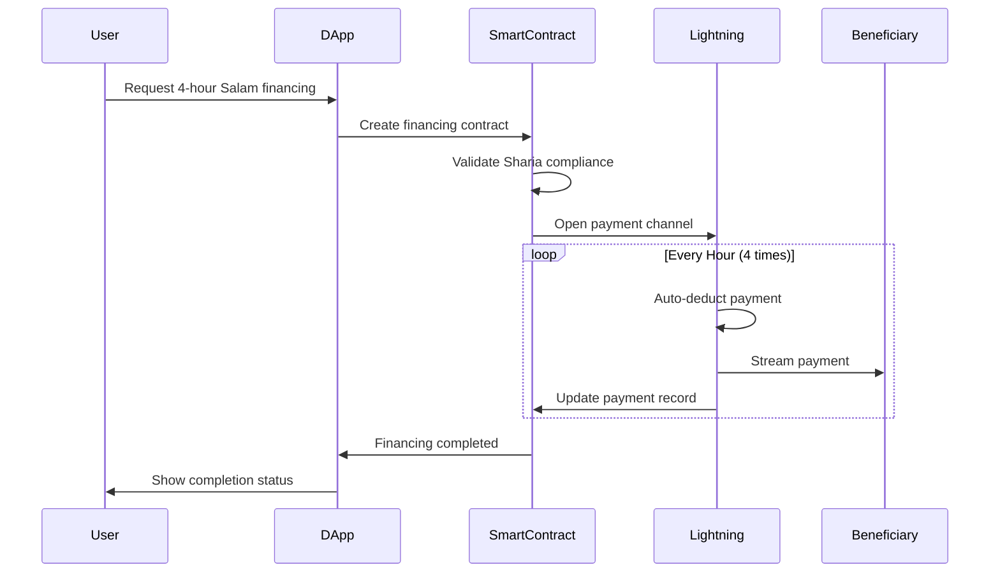

# MasruFi Sharia Payment Architecture
## Technical Implementation Guide for Crypto-Based Islamic Finance

### Table of Contents
1. [Payment System Overview](#payment-system-overview)
2. [Smart Contract Architecture](#smart-contract-architecture)
3. [Payment Processing Flows](#payment-processing-flows)
4. [Integration Architecture](#integration-architecture)
5. [Security & Compliance](#security--compliance)

---

## Payment System Overview

### Core Payment Principles

```typescript
interface ShariaPrinciples {
  noInterest: boolean;        // No Riba
  assetBacked: boolean;       // Real asset backing
  noSpeculation: boolean;     // No Gharar
  profitSharing: boolean;     // Risk sharing
  ethicalPurpose: boolean;    // Halal activities only
}
```

### Payment Timelines

| Term Type | Duration | Payment Frequency | Settlement Method |
|-----------|----------|-------------------|-------------------|
| Ultra-Short | 1-24 hours | Hourly/End of term | Lightning/L2 |
| Short | 1-30 days | Daily/Weekly | Smart Contract |
| Medium | 1-12 months | Weekly/Monthly | Automated ACH |
| Long | 1-10 years | Monthly/Quarterly | Multi-sig |

---

## Smart Contract Architecture

### 1. Master Payment Contract

```solidity
// SPDX-License-Identifier: MIT
pragma solidity ^0.8.19;

import "@openzeppelin/contracts/security/ReentrancyGuard.sol";
import "@openzeppelin/contracts/access/AccessControl.sol";
import "@chainlink/contracts/src/v0.8/interfaces/AggregatorV3Interface.sol";

contract MasruFiShariaPaymentHub is ReentrancyGuard, AccessControl {
    
    bytes32 public constant SHARIA_BOARD = keccak256("SHARIA_BOARD");
    bytes32 public constant PAYMENT_PROCESSOR = keccak256("PAYMENT_PROCESSOR");
    
    enum FinanceType {
        MURABAHA,      // Cost-plus financing
        MUSHARAKAH,    // Partnership
        IJARAH,        // Lease
        SALAM,         // Forward sale
        ISTISNA,       // Manufacturing
        QARD_HASSAN    // Benevolent loan
    }
    
    enum PaymentFrequency {
        HOURLY,
        DAILY,
        WEEKLY,
        MONTHLY,
        QUARTERLY,
        ANNUAL,
        END_OF_TERM
    }
    
    struct IslamicFinancing {
        uint256 id;
        address beneficiary;
        address payer;
        FinanceType financeType;
        uint256 principalAmount;
        uint256 profitMargin;  // Not interest, but agreed profit
        uint256 startTimestamp;
        uint256 maturityTimestamp;
        PaymentFrequency frequency;
        uint256 nextPaymentDue;
        uint256 totalPaid;
        bool isActive;
        bool isAssetBacked;
        string assetDetails;    // IPFS hash
    }
    
    struct PaymentSchedule {
        uint256 financingId;
        uint256 installmentAmount;
        uint256 numberOfInstallments;
        uint256 paidInstallments;
        uint256[] paymentDates;
        uint256[] actualPaymentDates;
        mapping(uint256 => bool) isPaid;
    }
    
    mapping(uint256 => IslamicFinancing) public financings;
    mapping(uint256 => PaymentSchedule) public paymentSchedules;
    mapping(address => uint256[]) public userFinancings;
    
    uint256 public financingCounter;
    uint256 public constant MIN_DURATION = 1 hours;
    uint256 public constant MAX_DURATION = 10 * 365 days;
    
    event FinancingCreated(
        uint256 indexed financingId,
        address indexed beneficiary,
        FinanceType financeType,
        uint256 amount
    );
    
    event PaymentReceived(
        uint256 indexed financingId,
        uint256 installmentNumber,
        uint256 amount,
        uint256 timestamp
    );
    
    event FinancingCompleted(
        uint256 indexed financingId,
        uint256 totalPaid,
        uint256 completionDate
    );
    
    modifier onlyShariaCompliant(FinanceType _type, bool _assetBacked) {
        require(_assetBacked || _type == FinanceType.QARD_HASSAN, 
                "Financing must be asset-backed");
        _;
    }
    
    function createFinancing(
        address _beneficiary,
        FinanceType _type,
        uint256 _principal,
        uint256 _profitMargin,
        uint256 _duration,
        PaymentFrequency _frequency,
        bool _assetBacked,
        string memory _assetDetails
    ) external onlyShariaCompliant(_type, _assetBacked) returns (uint256) {
        require(_duration >= MIN_DURATION && _duration <= MAX_DURATION, 
                "Invalid duration");
        require(_principal > 0, "Invalid principal");
        require(_beneficiary != address(0), "Invalid beneficiary");
        
        uint256 financingId = ++financingCounter;
        
        IslamicFinancing storage financing = financings[financingId];
        financing.id = financingId;
        financing.beneficiary = _beneficiary;
        financing.payer = msg.sender;
        financing.financeType = _type;
        financing.principalAmount = _principal;
        financing.profitMargin = _profitMargin;
        financing.startTimestamp = block.timestamp;
        financing.maturityTimestamp = block.timestamp + _duration;
        financing.frequency = _frequency;
        financing.isActive = true;
        financing.isAssetBacked = _assetBacked;
        financing.assetDetails = _assetDetails;
        
        _createPaymentSchedule(financingId, _frequency, _duration);
        
        userFinancings[_beneficiary].push(financingId);
        userFinancings[msg.sender].push(financingId);
        
        emit FinancingCreated(financingId, _beneficiary, _type, _principal);
        
        return financingId;
    }
    
    function _createPaymentSchedule(
        uint256 _financingId,
        PaymentFrequency _frequency,
        uint256 _duration
    ) private {
        IslamicFinancing memory financing = financings[_financingId];
        PaymentSchedule storage schedule = paymentSchedules[_financingId];
        
        schedule.financingId = _financingId;
        
        uint256 totalAmount = financing.principalAmount + financing.profitMargin;
        uint256 numberOfInstallments = _calculateInstallments(_frequency, _duration);
        
        schedule.numberOfInstallments = numberOfInstallments;
        schedule.installmentAmount = totalAmount / numberOfInstallments;
        
        // Generate payment dates
        uint256 interval = _getPaymentInterval(_frequency);
        for (uint256 i = 1; i <= numberOfInstallments; i++) {
            schedule.paymentDates.push(
                financing.startTimestamp + (interval * i)
            );
        }
        
        financing.nextPaymentDue = schedule.paymentDates[0];
    }
    
    function makePayment(uint256 _financingId) 
        external 
        payable 
        nonReentrant 
    {
        IslamicFinancing storage financing = financings[_financingId];
        PaymentSchedule storage schedule = paymentSchedules[_financingId];
        
        require(financing.isActive, "Financing not active");
        require(msg.sender == financing.payer, "Not authorized payer");
        require(msg.value >= schedule.installmentAmount, "Insufficient payment");
        
        uint256 currentInstallment = schedule.paidInstallments + 1;
        require(currentInstallment <= schedule.numberOfInstallments, 
                "All payments completed");
        
        schedule.isPaid[currentInstallment] = true;
        schedule.paidInstallments++;
        schedule.actualPaymentDates.push(block.timestamp);
        financing.totalPaid += msg.value;
        
        // Transfer to beneficiary
        (bool success, ) = financing.beneficiary.call{value: msg.value}("");
        require(success, "Transfer failed");
        
        emit PaymentReceived(
            _financingId,
            currentInstallment,
            msg.value,
            block.timestamp
        );
        
        // Update next payment due
        if (currentInstallment < schedule.numberOfInstallments) {
            financing.nextPaymentDue = schedule.paymentDates[currentInstallment];
        } else {
            _completeFinancing(_financingId);
        }
    }
    
    function _completeFinancing(uint256 _financingId) private {
        IslamicFinancing storage financing = financings[_financingId];
        financing.isActive = false;
        
        emit FinancingCompleted(
            _financingId,
            financing.totalPaid,
            block.timestamp
        );
    }
    
    function _calculateInstallments(
        PaymentFrequency _frequency,
        uint256 _duration
    ) private pure returns (uint256) {
        if (_frequency == PaymentFrequency.HOURLY) {
            return _duration / 1 hours;
        } else if (_frequency == PaymentFrequency.DAILY) {
            return _duration / 1 days;
        } else if (_frequency == PaymentFrequency.WEEKLY) {
            return _duration / 7 days;
        } else if (_frequency == PaymentFrequency.MONTHLY) {
            return _duration / 30 days;
        } else if (_frequency == PaymentFrequency.QUARTERLY) {
            return _duration / 90 days;
        } else if (_frequency == PaymentFrequency.ANNUAL) {
            return _duration / 365 days;
        } else {
            return 1; // END_OF_TERM
        }
    }
    
    function _getPaymentInterval(
        PaymentFrequency _frequency
    ) private pure returns (uint256) {
        if (_frequency == PaymentFrequency.HOURLY) return 1 hours;
        if (_frequency == PaymentFrequency.DAILY) return 1 days;
        if (_frequency == PaymentFrequency.WEEKLY) return 7 days;
        if (_frequency == PaymentFrequency.MONTHLY) return 30 days;
        if (_frequency == PaymentFrequency.QUARTERLY) return 90 days;
        if (_frequency == PaymentFrequency.ANNUAL) return 365 days;
        return 0; // END_OF_TERM
    }
}
```

### 2. Automated Payment Processor

```solidity
contract AutomatedPaymentProcessor {
    
    using Chainlink for Chainlink.Request;
    
    struct AutoPayment {
        uint256 financingId;
        address token;
        uint256 amount;
        uint256 nextExecutionTime;
        bool isActive;
    }
    
    mapping(address => AutoPayment[]) public userAutoPayments;
    mapping(bytes32 => uint256) public requestToFinancing;
    
    IChainlinkKeeper public keeper;
    MasruFiShariaPaymentHub public paymentHub;
    
    event AutoPaymentScheduled(
        address indexed user,
        uint256 financingId,
        uint256 amount
    );
    
    event AutoPaymentExecuted(
        uint256 indexed financingId,
        uint256 amount,
        uint256 timestamp
    );
    
    function scheduleAutoPayment(
        uint256 _financingId,
        address _token,
        uint256 _amount
    ) external {
        AutoPayment memory newPayment = AutoPayment({
            financingId: _financingId,
            token: _token,
            amount: _amount,
            nextExecutionTime: block.timestamp,
            isActive: true
        });
        
        userAutoPayments[msg.sender].push(newPayment);
        
        emit AutoPaymentScheduled(msg.sender, _financingId, _amount);
    }
    
    function checkUpkeep(
        bytes calldata checkData
    ) external view returns (bool upkeepNeeded, bytes memory performData) {
        // Check if any payments are due
        for (uint i = 0; i < userAutoPayments[msg.sender].length; i++) {
            AutoPayment memory payment = userAutoPayments[msg.sender][i];
            if (payment.isActive && 
                block.timestamp >= payment.nextExecutionTime) {
                upkeepNeeded = true;
                performData = abi.encode(msg.sender, i);
                break;
            }
        }
    }
    
    function performUpkeep(bytes calldata performData) external {
        (address user, uint256 paymentIndex) = abi.decode(
            performData, 
            (address, uint256)
        );
        
        AutoPayment storage payment = userAutoPayments[user][paymentIndex];
        require(payment.isActive, "Payment not active");
        require(block.timestamp >= payment.nextExecutionTime, "Too early");
        
        // Execute payment
        _executePayment(user, payment);
        
        // Update next execution time
        payment.nextExecutionTime = _calculateNextPaymentTime(
            payment.financingId
        );
        
        emit AutoPaymentExecuted(
            payment.financingId,
            payment.amount,
            block.timestamp
        );
    }
    
    function _executePayment(
        address _user,
        AutoPayment memory _payment
    ) private {
        // Transfer tokens from user to payment hub
        IERC20(_payment.token).transferFrom(
            _user,
            address(paymentHub),
            _payment.amount
        );
        
        // Trigger payment in hub
        paymentHub.makePayment(_payment.financingId);
    }
    
    function _calculateNextPaymentTime(
        uint256 _financingId
    ) private view returns (uint256) {
        // Get payment schedule from hub
        return paymentHub.getNextPaymentDue(_financingId);
    }
}
```

### 3. Multi-Currency Payment Gateway

```solidity
contract MultiCurrencyGateway {
    
    using SafeERC20 for IERC20;
    
    struct PaymentMethod {
        address tokenAddress;
        uint8 decimals;
        bool isHalalCertified;
        bool isActive;
        uint256 minAmount;
        uint256 maxAmount;
    }
    
    struct CrossChainPayment {
        uint256 sourceChainId;
        uint256 destChainId;
        address sourceToken;
        address destToken;
        uint256 amount;
        address recipient;
        bytes32 paymentHash;
        bool isCompleted;
    }
    
    mapping(string => PaymentMethod) public supportedTokens;
    mapping(bytes32 => CrossChainPayment) public crossChainPayments;
    
    address public layerZeroEndpoint;
    address public polygonBridge;
    address public avalancheBridge;
    
    event PaymentMethodAdded(string symbol, address token, bool halal);
    event CrossChainPaymentInitiated(
        bytes32 paymentHash,
        uint256 sourceChain,
        uint256 destChain
    );
    
    function addPaymentMethod(
        string memory _symbol,
        address _token,
        uint8 _decimals,
        bool _halalCertified
    ) external onlyRole(SHARIA_BOARD) {
        require(_token != address(0), "Invalid token");
        
        supportedTokens[_symbol] = PaymentMethod({
            tokenAddress: _token,
            decimals: _decimals,
            isHalalCertified: _halalCertified,
            isActive: true,
            minAmount: 10 ** _decimals, // 1 token minimum
            maxAmount: 1000000 * 10 ** _decimals // 1M token maximum
        });
        
        emit PaymentMethodAdded(_symbol, _token, _halalCertified);
    }
    
    function initiatePayment(
        string memory _tokenSymbol,
        uint256 _amount,
        uint256 _financingId
    ) external {
        PaymentMethod memory method = supportedTokens[_tokenSymbol];
        require(method.isActive, "Token not supported");
        require(method.isHalalCertified, "Token not Halal certified");
        require(_amount >= method.minAmount && _amount <= method.maxAmount,
                "Amount out of range");
        
        // Transfer tokens
        IERC20(method.tokenAddress).safeTransferFrom(
            msg.sender,
            address(this),
            _amount
        );
        
        // Convert to base currency if needed
        uint256 baseAmount = _convertToBaseCurrency(
            method.tokenAddress,
            _amount
        );
        
        // Process payment
        _processPayment(_financingId, baseAmount);
    }
    
    function initiateCrossChainPayment(
        uint256 _destChainId,
        address _destToken,
        uint256 _amount,
        address _recipient
    ) external returns (bytes32) {
        bytes32 paymentHash = keccak256(
            abi.encodePacked(
                block.chainid,
                _destChainId,
                msg.sender,
                _recipient,
                _amount,
                block.timestamp
            )
        );
        
        crossChainPayments[paymentHash] = CrossChainPayment({
            sourceChainId: block.chainid,
            destChainId: _destChainId,
            sourceToken: address(0), // Will be set based on payment
            destToken: _destToken,
            amount: _amount,
            recipient: _recipient,
            paymentHash: paymentHash,
            isCompleted: false
        });
        
        // Initiate cross-chain message
        _sendCrossChainMessage(_destChainId, paymentHash);
        
        emit CrossChainPaymentInitiated(
            paymentHash,
            block.chainid,
            _destChainId
        );
        
        return paymentHash;
    }
    
    function _convertToBaseCurrency(
        address _token,
        uint256 _amount
    ) private view returns (uint256) {
        // Use Chainlink price feeds
        AggregatorV3Interface priceFeed = AggregatorV3Interface(
            getPriceFeed(_token)
        );
        
        (
            uint80 roundID,
            int price,
            uint startedAt,
            uint timeStamp,
            uint80 answeredInRound
        ) = priceFeed.latestRoundData();
        
        require(timeStamp > 0, "Price feed error");
        require(block.timestamp - timeStamp < 3600, "Price too old");
        
        return (_amount * uint256(price)) / 10**8;
    }
    
    function _sendCrossChainMessage(
        uint256 _destChainId,
        bytes32 _paymentHash
    ) private {
        // LayerZero implementation
        bytes memory payload = abi.encode(_paymentHash);
        
        ILayerZeroEndpoint(layerZeroEndpoint).send{value: msg.value}(
            uint16(_destChainId),
            abi.encodePacked(address(this)),
            payload,
            payable(msg.sender),
            address(0),
            bytes("")
        );
    }
}
```

---

## Payment Processing Flows

### 1. Hourly Payment Flow (Ultra-Short Term)



### 2. Daily Payment Flow (Short Term)

```typescript
class DailyPaymentProcessor {
    
    async processDailyPayments(): Promise<void> {
        const scheduler = new CronJob('0 0 * * *', async () => {
            const duePayments = await this.getDuePayments();
            
            for (const payment of duePayments) {
                try {
                    // Check wallet balance
                    const balance = await this.checkBalance(payment.wallet);
                    
                    if (balance >= payment.amount) {
                        // Process payment
                        await this.executePayment(payment);
                        
                        // Send notification
                        await this.notifyPaymentSuccess(payment);
                    } else {
                        // Grace period logic (Sharia compliant)
                        await this.initiateGracePeriod(payment);
                    }
                } catch (error) {
                    await this.handlePaymentError(payment, error);
                }
            }
        });
        
        scheduler.start();
    }
    
    private async initiateGracePeriod(payment: Payment): Promise<void> {
        // No penalties or interest
        // Just notification and rescheduling option
        await this.notifyGracePeriod(payment.userId, {
            message: 'Payment due - 3 day grace period activated',
            options: ['Pay Now', 'Request Restructuring', 'Contact Support']
        });
    }
}
```

### 3. Monthly Payment Flow (Medium/Long Term)

```yaml
monthly_payment_flow:
  pre_payment:
    - day_minus_7: Send payment reminder
    - day_minus_3: Send payment details
    - day_minus_1: Final reminder
    
  payment_day:
    - 00:00: Activate payment window
    - 06:00: First auto-debit attempt
    - 12:00: Second attempt if failed
    - 18:00: Third attempt
    - 23:59: Close payment window
    
  post_payment:
    - success: 
        - Update records
        - Issue receipt
        - Calculate remaining balance
    - failure:
        - No late fees (Haram)
        - Grace period activation
        - Restructuring options
```

---

## Integration Architecture

### 1. Banking Integration

```typescript
interface IslamicBankingAPI {
    // Account Services
    validateIBAN(iban: string): Promise<boolean>;
    checkShariaCompliance(accountId: string): Promise<ComplianceStatus>;
    
    // Payment Services
    initiateDirectDebit(params: DirectDebitParams): Promise<PaymentResult>;
    scheduleStandingOrder(params: StandingOrderParams): Promise<OrderId>;
    
    // Compliance Services
    performAMLCheck(customerId: string): Promise<AMLResult>;
    calculateZakat(accountId: string): Promise<ZakatAmount>;
}

class BankingIntegrationService {
    private banks: Map<string, IslamicBankingAPI> = new Map([
        ['ADIB', new ADIBConnector()],      // Abu Dhabi Islamic Bank
        ['DIB', new DIBConnector()],        // Dubai Islamic Bank
        ['AlRajhi', new AlRajhiConnector()], // Al Rajhi Bank
        ['Maybank', new MaybankConnector()], // Maybank Islamic
    ]);
    
    async processPayment(
        bankCode: string,
        payment: IslamicPayment
    ): Promise<PaymentResult> {
        const bank = this.banks.get(bankCode);
        
        if (!bank) {
            throw new Error('Bank not supported');
        }
        
        // Validate Sharia compliance
        const compliance = await bank.checkShariaCompliance(
            payment.accountId
        );
        
        if (compliance.status !== 'COMPLIANT') {
            throw new Error('Account not Sharia compliant');
        }
        
        // Process payment
        return await bank.initiateDirectDebit({
            accountId: payment.accountId,
            amount: payment.amount,
            reference: payment.reference,
            purpose: payment.purpose,
            beneficiary: payment.beneficiary
        });
    }
}
```

### 2. Blockchain Integration

```typescript
class MultiChainPaymentService {
    
    private chains = {
        ethereum: {
            rpc: process.env.ETH_RPC,
            chainId: 1,
            gasToken: 'ETH'
        },
        polygon: {
            rpc: process.env.POLYGON_RPC,
            chainId: 137,
            gasToken: 'MATIC'
        },
        bsc: {
            rpc: process.env.BSC_RPC,
            chainId: 56,
            gasToken: 'BNB'
        },
        haqq: {
            rpc: process.env.HAQQ_RPC,
            chainId: 11235,
            gasToken: 'ISLM'
        }
    };
    
    async routePayment(
        payment: CrossChainPayment
    ): Promise<TransactionReceipt> {
        const sourceChain = this.chains[payment.sourceChain];
        const destChain = this.chains[payment.destChain];
        
        if (payment.sourceChain === payment.destChain) {
            // Same chain transfer
            return this.processDirectTransfer(payment);
        }
        
        // Cross-chain transfer
        if (this.hasBridge(payment.sourceChain, payment.destChain)) {
            return this.processBridgeTransfer(payment);
        }
        
        // Use LayerZero for unsupported routes
        return this.processLayerZeroTransfer(payment);
    }
    
    private async processBridgeTransfer(
        payment: CrossChainPayment
    ): Promise<TransactionReceipt> {
        const bridge = this.getBridge(
            payment.sourceChain,
            payment.destChain
        );
        
        // Lock tokens on source chain
        const lockTx = await bridge.lock({
            token: payment.token,
            amount: payment.amount,
            destChain: payment.destChain,
            recipient: payment.recipient
        });
        
        // Wait for confirmations
        await this.waitForConfirmations(lockTx, 12);
        
        // Mint on destination chain
        const mintTx = await bridge.mint({
            lockTxHash: lockTx.hash,
            proof: await this.generateProof(lockTx)
        });
        
        return mintTx;
    }
}
```

### 3. Fiat Gateway Integration

```typescript
class FiatGatewayService {
    
    async convertFiatToCrypto(
        fiatPayment: FiatPayment
    ): Promise<CryptoPayment> {
        // Validate fiat payment
        const validation = await this.validateFiatSource(fiatPayment);
        
        if (!validation.isHalal) {
            throw new Error('Payment source not Sharia compliant');
        }
        
        // Get best rate from DEX aggregators
        const rate = await this.getBestRate(
            fiatPayment.currency,
            fiatPayment.targetCrypto
        );
        
        // Execute conversion
        const cryptoAmount = fiatPayment.amount * rate.price;
        
        // Process through partner exchange
        const conversion = await this.partnerExchange.convert({
            from: fiatPayment.currency,
            to: fiatPayment.targetCrypto,
            amount: fiatPayment.amount,
            slippage: 0.005 // 0.5% max slippage
        });
        
        return {
            txHash: conversion.txHash,
            amount: conversion.cryptoAmount,
            token: fiatPayment.targetCrypto,
            timestamp: Date.now()
        };
    }
    
    private async validateFiatSource(
        payment: FiatPayment
    ): Promise<ValidationResult> {
        // Check against Sharia compliance database
        const bankCompliance = await this.checkBankCompliance(
            payment.bankCode
        );
        
        const merchantCompliance = await this.checkMerchantCategory(
            payment.merchantCode
        );
        
        return {
            isHalal: bankCompliance && merchantCompliance,
            reason: !bankCompliance ? 'Bank not Sharia compliant' :
                    !merchantCompliance ? 'Merchant category restricted' :
                    'Compliant'
        };
    }
}
```

---

## Security & Compliance

### 1. Security Architecture

```yaml
security_layers:
  network_security:
    - cloudflare_waf: DDoS protection
    - ssl_pinning: Certificate validation
    - api_rate_limiting: 100 req/min per user
    - ip_whitelisting: For admin functions
    
  smart_contract_security:
    - multi_sig_wallets: 3-of-5 for treasury
    - time_locks: 48hr for large withdrawals
    - pause_mechanism: Emergency stop
    - upgrade_pattern: Proxy contracts
    
  payment_security:
    - transaction_limits:
        hourly: $10,000
        daily: $50,000
        monthly: $500,000
    - fraud_detection:
        - ML-based anomaly detection
        - Behavioral analysis
        - Geolocation verification
    - kyc_levels:
        - basic: Up to $1,000/month
        - enhanced: Up to $10,000/month
        - full: Unlimited (with approval)
```

### 2. Sharia Compliance Monitoring

```typescript
class ShariaComplianceEngine {
    
    private prohibitedActivities = [
        'gambling', 'alcohol', 'pork', 'interest-bearing',
        'adult-content', 'weapons', 'tobacco'
    ];
    
    async validateTransaction(
        tx: IslamicTransaction
    ): Promise<ComplianceResult> {
        const checks = await Promise.all([
            this.checkPurpose(tx.purpose),
            this.checkCounterparty(tx.counterparty),
            this.checkAssetBacking(tx.assetReference),
            this.checkProfitStructure(tx.profitModel)
        ]);
        
        const isCompliant = checks.every(check => check.passed);
        
        if (!isCompliant) {
            await this.logNonCompliance(tx, checks);
        }
        
        return {
            isCompliant,
            checks,
            certificate: isCompliant ? 
                await this.generateCertificate(tx) : null
        };
    }
    
    private async checkPurpose(
        purpose: string
    ): Promise<CheckResult> {
        const category = await this.categorizePurpose(purpose);
        
        return {
            passed: !this.prohibitedActivities.includes(category),
            details: `Purpose category: ${category}`
        };
    }
    
    async generateCertificate(
        tx: IslamicTransaction
    ): Promise<ShariaCertificate> {
        const certificate = {
            transactionId: tx.id,
            timestamp: Date.now(),
            scholar: await this.getAvailableScholar(),
            ruling: 'HALAL',
            basis: this.determineBasis(tx),
            expiryDate: Date.now() + (90 * 24 * 60 * 60 * 1000) // 90 days
        };
        
        // Store on IPFS
        const ipfsHash = await this.ipfs.add(
            JSON.stringify(certificate)
        );
        
        // Record on blockchain
        await this.contract.recordCertificate(
            tx.id,
            ipfsHash,
            certificate.scholar
        );
        
        return {
            ...certificate,
            ipfsHash,
            blockchainTx: await this.getLatestTx()
        };
    }
}
```

### 3. Regulatory Reporting

```typescript
class RegulatoryReportingService {
    
    async generateMonthlyReport(): Promise<RegulatoryReport> {
        const report = {
            period: this.getCurrentPeriod(),
            totalVolume: await this.calculateTotalVolume(),
            transactionCount: await this.getTransactionCount(),
            customerMetrics: await this.getCustomerMetrics(),
            complianceMetrics: await this.getComplianceMetrics(),
            amlFlags: await this.getAMLFlags(),
            crossBorderTransactions: await this.getCrossBorderTx()
        };
        
        // Generate reports for each jurisdiction
        const reports = {
            mas: await this.generateMASReport(report),      // Singapore
            cbuae: await this.generateCBUAEReport(report),  // UAE
            bnm: await this.generateBNMReport(report),      // Malaysia
            fca: await this.generateFCAReport(report),      // UK
            sec: await this.generateSECReport(report)       // USA
        };
        
        // Submit to authorities
        await this.submitReports(reports);
        
        return report;
    }
    
    private async generateMASReport(
        data: RegulatoryReport
    ): Promise<MASReport> {
        return {
            reportType: 'PS-N04',
            entityName: 'MasruFi Sharia Platform',
            reportingPeriod: data.period,
            digitalPaymentTokenVolume: data.totalVolume,
            customerAccounts: data.customerMetrics.totalAccounts,
            suspiciousTransactions: data.amlFlags.length,
            crossBorderVolume: data.crossBorderTransactions.volume,
            timestamp: Date.now(),
            signature: await this.signReport(data)
        };
    }
}
```

---

## Implementation Timeline

### Phase 1: Foundation (Q1 2024)
- [ ] Smart contract development
- [ ] Basic payment flows (monthly)
- [ ] Sharia compliance engine v1
- [ ] Security audit

### Phase 2: Advanced Features (Q2 2024)
- [ ] Hourly payment implementation
- [ ] Multi-chain support
- [ ] Automated payment processor
- [ ] Mobile SDK

### Phase 3: Scale (Q3-Q4 2024)
- [ ] Banking integrations
- [ ] Fiat gateways
- [ ] Advanced analytics
- [ ] Global expansion

---

*"Revolutionizing Islamic Finance with Blockchain Technology"*

© 2024 MasruFi Framework by Ali&Co - Technical Architecture Division