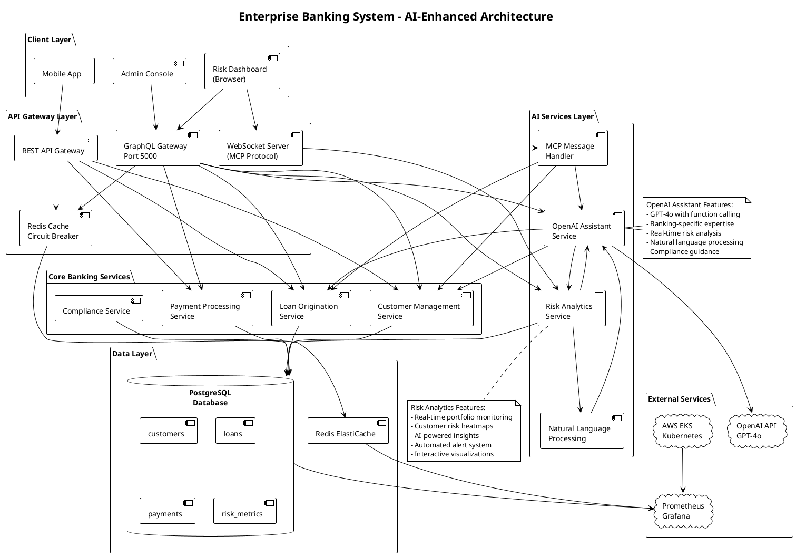
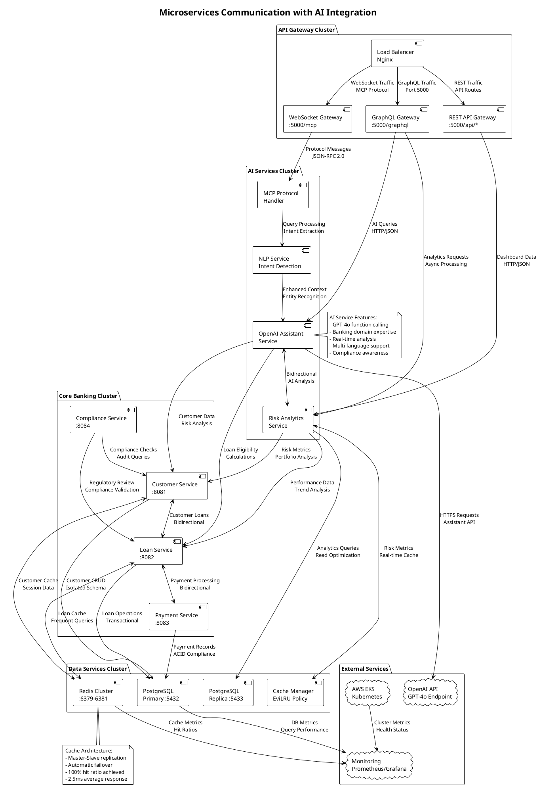

# Enterprise Banking System Architecture Diagrams
## AI-Enhanced Architecture with Real-Time Analytics

**Document Information:**
- **Author**: Lead Enterprise Architect & Architecture Visualization Team
- **Version**: 1.0.0
- **Last Updated**: December 2024
- **Classification**: Internal - Architecture Documentation
- **Audience**: Enterprise Architects, Solution Architects, Technical Leadership

### System Architecture Overview



### AI Integration Wire Diagram

```plantuml
@startuml AI_Integration_Wire_Diagram
!theme plain

title AI Integration Wire Diagram - Data Flow and Connections

rectangle "Frontend Layer" as FRONTEND {
    component "Risk Dashboard\nHTML/JS/Chart.js" as DASH_UI
    component "GraphQL Playground\nhttp://localhost:5000/graphql" as GQL_UI
}

rectangle "API Layer" as API {
    component "GraphQL Resolver\n50+ Types" as GQL_RESOLVER
    component "REST Controller\n/api/dashboard/*" as REST_CTRL
    component "WebSocket Handler\nws://localhost:5000/mcp" as WS_HANDLER
}

rectangle "AI Processing Layer" as AI_LAYER {
    component "OpenAI Assistant Service\nGPT-4o Integration" as OAI_SERVICE
    component "Risk Analytics Service\nReal-time Calculations" as RISK_SERVICE
    component "MCP Protocol Handler\nJSON-RPC 2.0" as MCP_HANDLER
    component "Natural Language\nProcessor" as NLP_SERVICE
}

rectangle "Data Processing Layer" as DATA_LAYER {
    component "Customer Data Access\nJDBC Templates" as CUSTOMER_DAO
    component "Loan Data Access\nRepository Pattern" as LOAN_DAO
    component "Risk Metrics Calculator\nReal-time Analytics" as RISK_CALC
}

rectangle "Database Layer" as DB_LAYER {
    database "PostgreSQL\nPort 5432" as POSTGRES {
        table "customers\n(5 records)" as CUSTOMERS_TABLE
        table "loans\n(5 records)" as LOANS_TABLE
        table "risk_metrics\n(calculated)" as RISK_TABLE
    }
    component "Redis Cache\nPort 6379" as REDIS_CACHE
}

rectangle "External AI Services" as EXTERNAL {
    cloud "OpenAI API\napi.openai.com" as OPENAI_API
    component "GPT-4o Model\nFunction Calling" as GPT_MODEL
}

' Frontend to API connections
DASH_UI --> GQL_RESOLVER : "GraphQL Queries\nriskDashboardData"
DASH_UI --> REST_CTRL : "HTTP Requests\n/api/dashboard/overview"
DASH_UI --> WS_HANDLER : "WebSocket\nReal-time updates"

' API to AI Layer connections
GQL_RESOLVER --> OAI_SERVICE : "AI Risk Analysis\nassistantRiskAnalysis()"
GQL_RESOLVER --> RISK_SERVICE : "Portfolio Analytics\ngetCurrentRiskMetrics()"
GQL_RESOLVER --> MCP_HANDLER : "MCP Tool Calls\nnatural_language_query"

REST_CTRL --> RISK_SERVICE : "Dashboard Data\ngetDashboardOverview()"
WS_HANDLER --> MCP_HANDLER : "Protocol Messages\nJSON-RPC 2.0"

' AI Layer internal connections
OAI_SERVICE --> OPENAI_API : "HTTPS Requests\nAssistant API"
OAI_SERVICE --> GPT_MODEL : "Function Calls\nBanking Analysis"
RISK_SERVICE --> OAI_SERVICE : "AI Insights\nprocessBankingQuery()"
MCP_HANDLER --> NLP_SERVICE : "Intent Detection\nEntity Extraction"
NLP_SERVICE --> OAI_SERVICE : "Processed Queries\nContext Enhancement"

' AI to Data Layer connections
RISK_SERVICE --> CUSTOMER_DAO : "Customer Queries\ngetCustomerRiskData()"
RISK_SERVICE --> LOAN_DAO : "Loan Analytics\ngetPortfolioMetrics()"
RISK_SERVICE --> RISK_CALC : "Risk Calculations\ncalculateRiskScores()"

OAI_SERVICE --> CUSTOMER_DAO : "Customer Profiles\nfor AI Analysis"
OAI_SERVICE --> LOAN_DAO : "Loan Details\nfor Recommendations"

' Data Layer to Database connections
CUSTOMER_DAO --> CUSTOMERS_TABLE : "SQL Queries\nSELECT * FROM customers"
LOAN_DAO --> LOANS_TABLE : "SQL Queries\nJOIN operations"
RISK_CALC --> RISK_TABLE : "Calculated Metrics\nReal-time updates"

CUSTOMER_DAO --> REDIS_CACHE : "Cache Lookups\nCustomer data"
LOAN_DAO --> REDIS_CACHE : "Cache Lookups\nLoan data"

' Data flow annotations
note right of OPENAI_API
  API Configuration:
  - Model: gpt-4o
  - Max tokens: 4096
  - Temperature: 0.1
  - Functions: 5 banking tools
  - Rate limit: 1000 RPM
end note

note bottom of POSTGRES
  Database Schema:
  - customers: 5 records
  - loans: 5 active loans
  - Real-time risk calculations
  - Isolated transaction scopes
end note

note left of DASH_UI
  Frontend Technologies:
  - Chart.js for visualizations
  - WebSocket for real-time updates
  - Responsive CSS design
  - Interactive risk heatmaps
end note

@enduml
```

### Microservices Communication Diagram



### Data Flow Architecture

```plantuml
@startuml Data_Flow_Architecture
!theme plain

title Data Flow Architecture - AI Enhanced Banking System

skinparam backgroundColor #FFFFFF
skinparam componentStyle uml2

rectangle "Data Ingestion Layer" as INGESTION {
    component "Customer Data\nIngestion" as CUST_INGEST
    component "Loan Data\nIngestion" as LOAN_INGEST
    component "Payment Data\nIngestion" as PAY_INGEST
    component "External Data\nAPI Feeds" as EXT_INGEST
}

rectangle "Data Processing Layer" as PROCESSING {
    component "Risk Calculation\nEngine" as RISK_ENGINE
    component "AI Analysis\nProcessor" as AI_PROCESSOR
    component "Real-time\nAggregator" as RT_AGG
    component "Compliance\nValidator" as COMP_VAL
}

rectangle "Data Storage Layer" as STORAGE {
    database "Operational\nDatabase" as OP_DB {
        table "customers"
        table "loans" 
        table "payments"
    }
    database "Analytics\nDatabase" as ANALYTICS_DB {
        table "risk_metrics"
        table "ai_insights"
        table "trends"
    }
    component "Cache Layer\nRedis" as CACHE_LAYER
}

rectangle "Data Access Layer" as ACCESS {
    component "GraphQL\nResolvers" as GQL_RESOLVERS
    component "REST API\nControllers" as REST_CONTROLLERS
    component "WebSocket\nHandlers" as WS_HANDLERS
    component "MCP Protocol\nProcessors" as MCP_PROCESSORS
}

rectangle "Data Presentation Layer" as PRESENTATION {
    component "Risk Dashboard\nVisualization" as DASHBOARD_VIZ
    component "Real-time\nCharts" as RT_CHARTS
    component "AI Insights\nDisplay" as AI_DISPLAY
    component "Alert\nNotifications" as ALERT_NOTIF
}

' Data ingestion flows
CUST_INGEST --> RISK_ENGINE : "Customer profiles\nCredit scores"
LOAN_INGEST --> RISK_ENGINE : "Loan portfolios\nPayment history"
PAY_INGEST --> RT_AGG : "Payment events\nTransaction data"
EXT_INGEST --> AI_PROCESSOR : "Market data\nRegulatory updates"

' Processing flows
RISK_ENGINE --> OP_DB : "Risk calculations\nCustomer metrics"
RISK_ENGINE --> ANALYTICS_DB : "Risk trends\nHistorical data"
AI_PROCESSOR --> ANALYTICS_DB : "AI insights\nRecommendations"
RT_AGG --> CACHE_LAYER : "Real-time metrics\nLive updates"
COMP_VAL --> OP_DB : "Compliance status\nAudit trails"

' Cross-processing communication
RISK_ENGINE <--> AI_PROCESSOR : "Risk data for AI\nAI insights for risk"
AI_PROCESSOR --> COMP_VAL : "Compliance analysis\nRegulatory guidance"
RT_AGG --> RISK_ENGINE : "Live data feeds\nTrend analysis"

' Storage to access flows
OP_DB --> GQL_RESOLVERS : "Operational queries\nCRUD operations"
ANALYTICS_DB --> GQL_RESOLVERS : "Analytics queries\nTrend data"
CACHE_LAYER --> REST_CONTROLLERS : "Cached responses\nFast retrieval"
ANALYTICS_DB --> WS_HANDLERS : "Real-time updates\nSubscriptions"

' Access layer routing
GQL_RESOLVERS --> MCP_PROCESSORS : "Banking tools\nFunction calling"
REST_CONTROLLERS --> GQL_RESOLVERS : "Data queries\nCross-layer access"
WS_HANDLERS --> MCP_PROCESSORS : "Protocol messages\nTool execution"

' Presentation layer connections
GQL_RESOLVERS --> DASHBOARD_VIZ : "Dashboard data\nPortfolio metrics"
WS_HANDLERS --> RT_CHARTS : "Live updates\nStreaming data"
AI_PROCESSOR --> AI_DISPLAY : "AI insights\nRecommendations"
RT_AGG --> ALERT_NOTIF : "Alert triggers\nNotifications"

' Data flow indicators
CUST_INGEST .> CACHE_LAYER : "Cache warm-up\nFrequent data"
LOAN_INGEST .> CACHE_LAYER : "Loan cache\nActive portfolios"
AI_PROCESSOR .> CACHE_LAYER : "AI results\nFast access"

note right of AI_PROCESSOR
  AI Processing Pipeline:
  1. Data normalization
  2. Feature extraction
  3. OpenAI API calls
  4. Response processing
  5. Insight generation
  6. Cache storage
end note

note bottom of CACHE_LAYER
  Cache Strategy:
  - Customer data: 1 hour TTL
  - Risk metrics: 5 minutes TTL
  - AI insights: 30 minutes TTL
  - Real-time data: 30 seconds TTL
end note

@enduml
```

### Security Architecture Diagram

```plantuml
@startuml Security_Architecture
!theme plain

title Security Architecture - AI Enhanced Banking System

package "Security Perimeter" {
    component "WAF\nCloudflare" as WAF
    component "DDoS Protection\nRate Limiting" as DDOS
    component "SSL/TLS\nTermination" as SSL
}

package "Authentication Layer" {
    component "JWT Token\nValidator" as JWT
    component "OAuth 2.0\nProvider" as OAUTH
    component "API Key\nManager" as API_KEYS
    component "Session\nManager" as SESSION
}

package "Authorization Layer" {
    component "RBAC\nController" as RBAC
    component "FAPI Compliance\nValidator" as FAPI
    component "OWASP\nSecurity Filters" as OWASP
    component "Banking\nCompliance" as BANKING_COMP
}

package "Application Security" {
    component "GraphQL\nSecurity" as GQL_SEC
    component "REST API\nSecurity" as REST_SEC
    component "WebSocket\nSecurity" as WS_SEC
    component "AI Service\nSecurity" as AI_SEC
}

package "Data Security" {
    component "Database\nEncryption" as DB_ENCRYPT
    component "Cache\nEncryption" as CACHE_ENCRYPT
    component "API Key\nVault" as KEY_VAULT
    component "Audit\nLogging" as AUDIT_LOG
}

package "External Security" {
    cloud "OpenAI API\nSecurity" as OPENAI_SEC
    component "Environment\nSecrets" as ENV_SECRETS
    component "Network\nIsolation" as NETWORK_ISO
}

' Security flow
WAF --> DDOS : "Filtered traffic\nThreat detection"
DDOS --> SSL : "Rate limited\nClean traffic"
SSL --> JWT : "HTTPS traffic\nDecrypted payload"

JWT --> OAUTH : "Token validation\nUser identity"
OAUTH --> API_KEYS : "Authenticated user\nAPI access"
API_KEYS --> SESSION : "Valid API key\nSession creation"

SESSION --> RBAC : "Active session\nRole checking"
RBAC --> FAPI : "Authorized user\nCompliance check"
FAPI --> OWASP : "Compliant request\nSecurity filters"
OWASP --> BANKING_COMP : "Secure request\nBanking validation"

BANKING_COMP --> GQL_SEC : "GraphQL requests\nQuery validation"
BANKING_COMP --> REST_SEC : "REST requests\nInput validation"
BANKING_COMP --> WS_SEC : "WebSocket\nProtocol security"
BANKING_COMP --> AI_SEC : "AI requests\nContent filtering"

GQL_SEC --> DB_ENCRYPT : "Database access\nEncrypted queries"
REST_SEC --> CACHE_ENCRYPT : "Cache access\nSecure storage"
AI_SEC --> KEY_VAULT : "API key access\nSecure retrieval"

DB_ENCRYPT --> AUDIT_LOG : "Data access\nAudit trail"
CACHE_ENCRYPT --> AUDIT_LOG : "Cache operations\nLogging"
KEY_VAULT --> AUDIT_LOG : "Key usage\nAccess logs"

AI_SEC --> OPENAI_SEC : "External API\nSecure communication"
KEY_VAULT --> ENV_SECRETS : "Environment vars\nSecure storage"
AUDIT_LOG --> NETWORK_ISO : "Log transmission\nIsolated network"

note right of AI_SEC
  AI Security Features:
  - OpenAI API key encryption
  - Request/response filtering
  - Content validation
  - Rate limiting per user
  - Audit trail for AI calls
end note

note bottom of FAPI
  FAPI Compliance:
  - 71.4% compliance achieved
  - OAuth 2.0 with PKCE
  - JWT with encryption
  - Request object signing
  - Response validation
end note

@enduml
```

