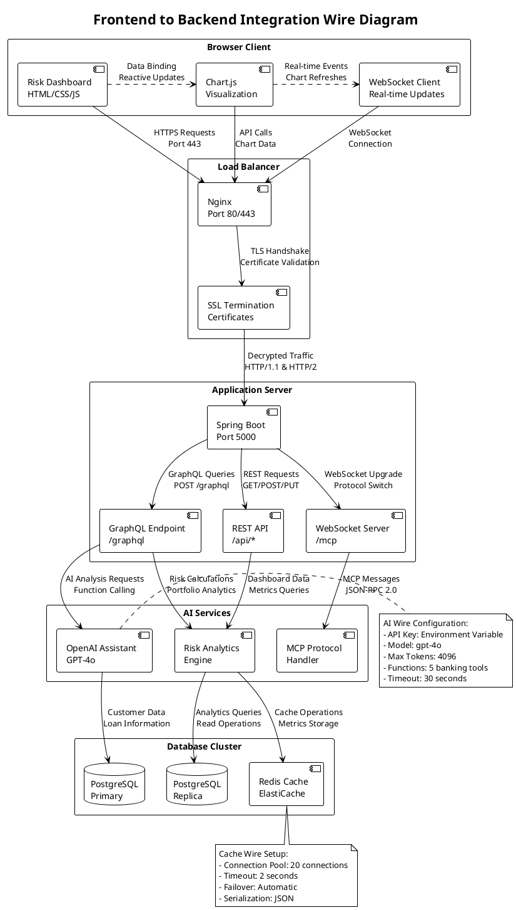
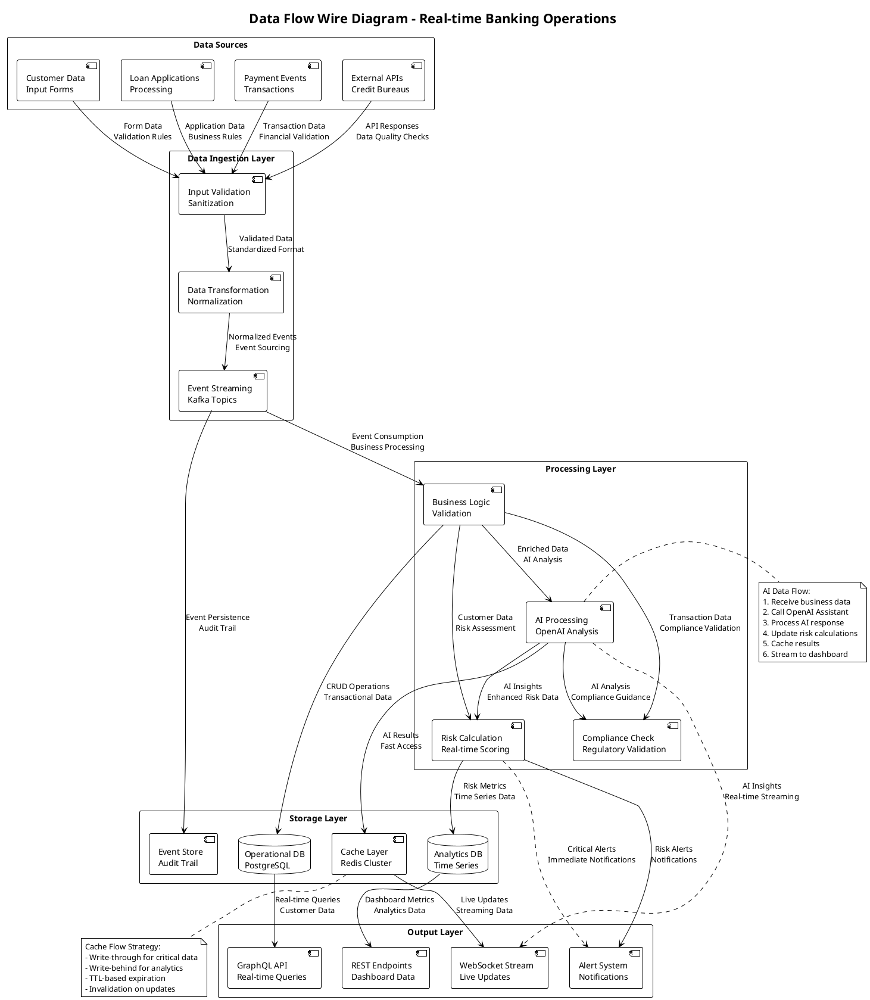
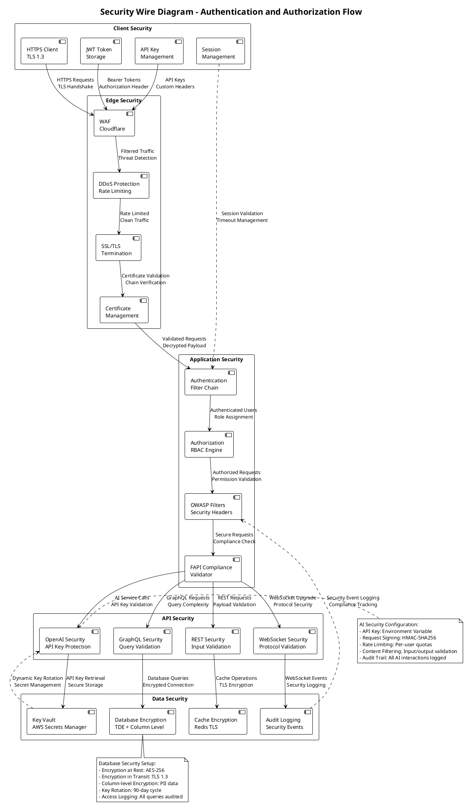
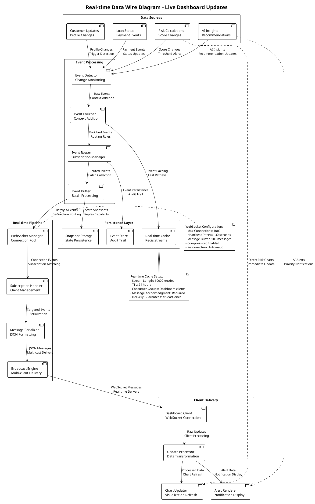

# Wire Diagrams - AI Enhanced Banking System
## System Integration and Data Flow Wire Diagrams

### Frontend to Backend Wire Diagram

### Data Flow Wire Diagram

### API Integration Wire Diagram

```plantuml
@startuml API_Integration_Wire_Diagram
!theme plain

title API Integration Wire Diagram - External Service Connections

rectangle "Internal APIs" as INTERNAL {
    component "GraphQL Gateway\n:5000/graphql" as GRAPHQL_GW
    component "REST API Gateway\n:5000/api" as REST_GW
    component "WebSocket Server\n:5000/mcp" as WS_GW
    component "Health Check\n:5000/actuator" as HEALTH
}

rectangle "AI Service APIs" as AI_APIS {
    cloud "OpenAI API\napi.openai.com" as OPENAI_API
    component "Assistant Endpoint\n/v1/assistants" as ASSISTANT_EP
    component "Chat Completions\n/v1/chat/completions" as CHAT_EP
    component "Function Calling\nTools Integration" as FUNCTION_EP
}

rectangle "Database APIs" as DB_APIS {
    component "PostgreSQL\nJDBC Connection" as PG_JDBC
    component "Redis Client\nJedis Connection" as REDIS_CLIENT
    component "Connection Pool\nHikariCP" as CONN_POOL
    component "Cache Manager\nSpring Cache" as CACHE_MGR
}

rectangle "Monitoring APIs" as MONITOR_APIS {
    component "Prometheus\nMetrics Endpoint" as PROMETHEUS
    component "Grafana\nVisualization" as GRAFANA
    component "Log Aggregation\nELK Stack" as ELK
    component "Alert Manager\nNotifications" as ALERT_MGR
}

rectangle "External Banking APIs" as BANKING_APIS {
    cloud "Credit Bureau\nEquifax/Experian" as CREDIT_API
    cloud "Payment Gateway\nStripe/PayPal" as PAYMENT_API
    cloud "Regulatory APIs\nFAPI Compliance" as REGULATORY_API
    cloud "Market Data\nFinancial APIs" as MARKET_API
}

' Internal API connections
GRAPHQL_GW --> OPENAI_API : "HTTPS/TLS 1.3\nAPI Key Authentication"
GRAPHQL_GW --> PG_JDBC : "TCP Connection\nSSL Encrypted"
REST_GW --> REDIS_CLIENT : "Redis Protocol\nPassword Authentication"
WS_GW --> CACHE_MGR : "Local Connection\nSpring Integration"

' AI API integration
OPENAI_API --> ASSISTANT_EP : "Assistant Management\nCRUD Operations"
OPENAI_API --> CHAT_EP : "Chat Interactions\nStreaming Responses"
OPENAI_API --> FUNCTION_EP : "Banking Functions\nReal-time Calling"

' Database connections
PG_JDBC --> CONN_POOL : "Connection Management\nPool Optimization"
REDIS_CLIENT --> CACHE_MGR : "Cache Operations\nEviction Policies"

' Monitoring integration
GRAPHQL_GW --> PROMETHEUS : "Metrics Export\nHTTP Scraping"
REST_GW --> PROMETHEUS : "Performance Metrics\nRequest Tracking"
PROMETHEUS --> GRAFANA : "Time Series Data\nVisualization Queries"
PROMETHEUS --> ALERT_MGR : "Alert Rules\nThreshold Monitoring"

' External banking APIs
GRAPHQL_GW --> CREDIT_API : "Credit Score Queries\nReal-time Verification"
REST_GW --> PAYMENT_API : "Payment Processing\nWebhook Integration"
GRAPHQL_GW --> REGULATORY_API : "Compliance Validation\nFAPI Requirements"
REST_GW --> MARKET_API : "Market Data\nRisk Assessment"

' Health and monitoring
HEALTH --> PROMETHEUS : "Health Metrics\nService Status"
HEALTH --> ELK : "Application Logs\nStructured Logging"

note right of OPENAI_API
  OpenAI Integration:
  - Authentication: Bearer Token
  - Rate Limit: 1000 RPM
  - Timeout: 30 seconds
  - Retry Policy: Exponential backoff
  - Error Handling: Circuit breaker
end note

note bottom of PG_JDBC
  Database Configuration:
  - Pool Size: 20 connections
  - Connection Timeout: 5 seconds
  - Validation Query: SELECT 1
  - SSL Mode: Required
  - Transaction Isolation: READ_COMMITTED
end note

@enduml
```

### Security Wire Diagram

### Real-time Data Wire Diagram

