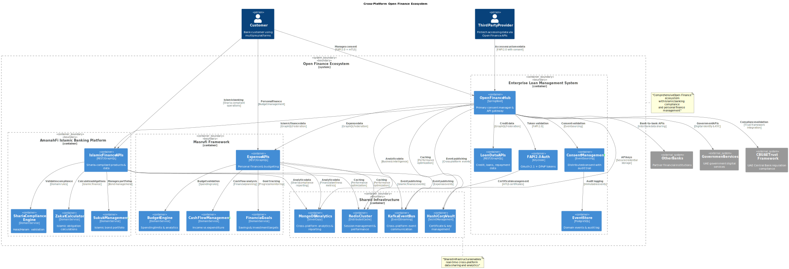
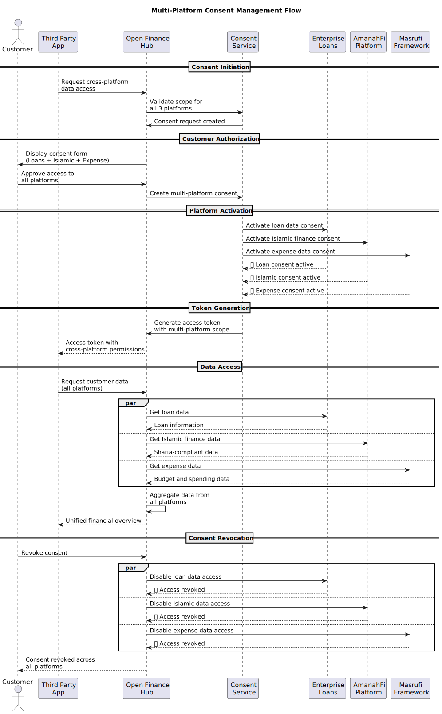
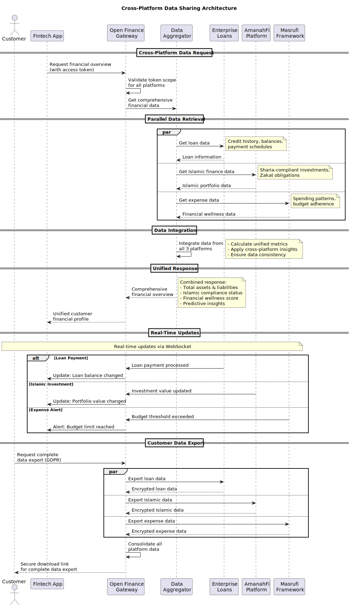

# 🌐 Open Finance Cross-Platform Integration
## Enterprise Loan Management | Masrufi Framework | AmanahFi Platform

### 🎯 **Open Finance as Universal Use Case**

Open Finance is a **cross-cutting concern** that enables secure, regulated data sharing across all three platforms, following UAE CBUAE Open Finance regulation C7/2023.

---

## 📊 **Platform-Specific Open Finance Integration**

### 🏦 **1. Enterprise Loan Management System** 
**Role**: Primary Open Finance Hub & Consent Manager

#### **Open Finance Capabilities**:
- ✅ **Consent Management**: Distributed consent service with event sourcing
- ✅ **FAPI 2.0 Security**: Keycloak integration with DPoP tokens
- ✅ **Data Sharing APIs**: Account information, transaction history
- ✅ **CBUAE Integration**: Trust framework compliance
- ✅ **PCI-DSS v4**: End-to-end compliance guardrails

#### **Shared Data Types**:
```yaml
- Loan Applications & Status
- Credit Assessments
- Repayment Schedules  
- Account Balances
- Transaction History
- Customer KYC Data
```

---

### 🕌 **2. AmanahFi Platform (Islamic Banking)**
**Role**: Sharia-Compliant Open Finance Provider

#### **Open Finance Capabilities**:
- ✅ **Islamic Finance Data**: Murabaha, Musharakah, Ijarah products
- ✅ **Sharia Compliance**: Halal investment tracking
- ✅ **Zakat Calculations**: Automated Islamic obligations
- ✅ **Sukuk Information**: Islamic bond portfolios
- ✅ **Takaful Integration**: Islamic insurance data

#### **Shared Data Types**:
```yaml
- Sharia-Compliant Investments
- Profit Sharing Agreements (Musharakah)
- Lease-to-Own Contracts (Ijarah)
- Cost-Plus Financing (Murabaha)
- Zakat & Charitable Contributions
- Halal/Haram Investment Classifications
```

---

### 💰 **3. Masrufi Framework (Expense Management)**
**Role**: Personal Financial Management Data Provider

#### **Open Finance Capabilities**:
- ✅ **Expense Analytics**: Spending patterns and budgets
- ✅ **Cash Flow Management**: Income vs expenditure tracking
- ✅ **Financial Goals**: Savings and investment targets
- ✅ **Merchant Data**: Transaction categorization
- ✅ **Budget Compliance**: Islamic spending principles

#### **Shared Data Types**:
```yaml
- Personal Budgets & Spending Limits
- Expense Categories & Analytics  
- Cash Flow Projections
- Savings Goals & Progress
- Merchant Transaction Data
- Financial Wellness Scores
```

---

## 🔄 **Cross-Platform Data Flow Architecture**

### **Open Finance Ecosystem Overview**


**PlantUML Source**: [open-finance-ecosystem.puml](../../puml/cross-platform/open-finance-ecosystem.puml)

### **Multi-Platform Consent Management**


**PlantUML Source**: [multi-platform-consent-simple.puml](../../puml/cross-platform/multi-platform-consent-simple.puml)

### **Cross-Platform Data Sharing**


**PlantUML Source**: [data-sharing-simple.puml](../../puml/cross-platform/data-sharing-simple.puml)

### **Architecture Highlights**

#### **🏗️ Open Finance Ecosystem Components**
- **Open Finance Hub**: Central consent manager and API gateway
- **FAPI 2.0 Authentication**: OAuth 2.1 + DPoP token security  
- **Cross-Platform Event Bus**: Kafka-based event streaming
- **Distributed Analytics**: MongoDB silver copy for unified insights
- **Certificate Management**: HashiCorp Vault for mTLS security

#### **📊 Multi-Platform Data Integration**
- **Enterprise Loans**: Credit history, loan balances, payment schedules
- **AmanahFi Islamic Banking**: Sharia-compliant investments, Zakat obligations
- **Masrufi Framework**: Personal budgets, expense analytics, financial wellness

#### **🔒 Security & Compliance**
- **CBUAE C7/2023 Compliance**: UAE Open Finance regulation adherence
- **PCI-DSS v4.0**: Payment card industry security standards
- **Islamic Compliance**: Sharia-compliant data sharing principles
- **GDPR Data Rights**: Complete data portability and right to be forgotten

---

## 📋 **Aligned Open Finance Task List**

### **Phase 1: Foundation & Infrastructure** ⚡
| Task | Enterprise Loan Mgmt | AmanahFi Platform | Masrufi Framework | Priority |
|------|---------------------|-------------------|-------------------|----------|
| Setup Open Finance Context | ✅ Completed | 🔄 Integrate | 🔄 Integrate | **High** |
| FAPI 2.0 + DPoP Security | ✅ Completed | 🔄 Extend | 🔄 Extend | **High** |
| Consent Management | ✅ Completed | 🔄 Islamic Consent | 🔄 Expense Consent | **High** |
| Event Store + CQRS | ✅ Completed | 🔄 Share Events | 🔄 Share Events | **High** |
| Redis Distributed Cache | ✅ Completed | 🔄 Extend Cache | 🔄 Extend Cache | **Medium** |

### **Phase 2: Platform-Specific Integration** 🏗️
| Task | Enterprise Loan Mgmt | AmanahFi Platform | Masrufi Framework | Priority |
|------|---------------------|-------------------|-------------------|----------|
| Domain Model Integration | ✅ Loan Models | 🔄 Islamic Models | 🔄 Expense Models | **High** |
| Data Sharing APIs | 🔄 Loan APIs | 🔄 Islamic APIs | 🔄 Expense APIs | **High** |
| Platform-Specific Consent | 🔄 Credit Consent | 🔄 Sharia Consent | 🔄 Budget Consent | **High** |
| Cross-Platform Events | 🔄 Loan Events | 🔄 Islamic Events | 🔄 Expense Events | **Medium** |
| Analytics Integration | ✅ MongoDB Silver Copy | 🔄 Islamic Analytics | 🔄 Expense Analytics | **Medium** |

### **Phase 3: Advanced Features & Compliance** 🔒  
| Task | Enterprise Loan Mgmt | AmanahFi Platform | Masrufi Framework | Priority |
|------|---------------------|-------------------|-------------------|----------|
| PCI-DSS v4 Compliance | ✅ Completed | 🔄 Islamic PCI | 🔄 Expense PCI | **High** |
| Regulatory Reporting | 🔄 CBUAE Reports | 🔄 Sharia Reports | 🔄 Budget Reports | **Medium** |
| Cross-Platform Saga | 🔄 Loan Sagas | 🔄 Islamic Sagas | 🔄 Expense Sagas | **High** |
| Monitoring & Alerting | 🔄 Setup | 🔄 Setup | 🔄 Setup | **Medium** |
| End-to-End Testing | 🔄 E2E Tests | 🔄 E2E Tests | 🔄 E2E Tests | **Medium** |

### **Phase 4: Production & Optimization** 🚀
| Task | Enterprise Loan Mgmt | AmanahFi Platform | Masrufi Framework | Priority |
|------|---------------------|-------------------|-------------------|----------|
| Production Deployment | 🔄 Deploy | 🔄 Deploy | 🔄 Deploy | **Low** |
| Performance Optimization | 🔄 Optimize | 🔄 Optimize | 🔄 Optimize | **Low** |
| Disaster Recovery | 🔄 Setup DR | 🔄 Setup DR | 🔄 Setup DR | **Low** |
| User Training | 🔄 Training | 🔄 Training | 🔄 Training | **Low** |

---

## 🎯 **Key Integration Points**

### **1. Shared Open Finance Infrastructure**
```yaml
Common Services:
  - Keycloak FAPI 2.0 Authentication
  - Distributed Consent Service  
  - PostgreSQL Event Store
  - Redis Distributed Cache
  - MongoDB Analytics (Silver Copy)
  - CBUAE Trust Framework Integration
```

### **2. Platform-Specific Extensions**
```yaml
Enterprise Loan Management:
  - Credit scoring data sharing
  - Loan application APIs
  - Repayment schedule APIs
  
AmanahFi Platform:
  - Sharia compliance data
  - Islamic product APIs
  - Zakat calculation APIs
  
Masrufi Framework:
  - Expense category APIs  
  - Budget tracking APIs
  - Financial wellness APIs
```

### **3. Cross-Platform Data Flows**
```yaml
Loan Application Flow:
  1. Customer applies via AmanahFi (Islamic loan)
  2. Credit check via Enterprise Loan Management
  3. Budget analysis via Masrufi Framework
  4. Decision made with full financial picture
```

---

## 🚀 **Implementation Strategy**

### **Immediate Focus** (Next 2-4 weeks):
1. **Complete MongoDB analytics** (Enterprise - in progress)
2. **Integrate AmanahFi with Open Finance context**
3. **Integrate Masrufi with Open Finance context**
4. **Develop cross-platform APIs**

### **Medium Term** (1-2 months):
1. **Implement cross-platform saga patterns**
2. **Build comprehensive testing suite**
3. **Setup monitoring across all platforms**

### **Long Term** (3+ months):
1. **Production deployment**
2. **Performance optimization**
3. **Advanced analytics & ML integration**

---

## 📊 **Success Metrics**

| Metric | Target | Current Status |
|--------|---------|---------------|
| **Platform Integration** | 3/3 platforms | 1/3 (Enterprise ✅) |
| **API Coverage** | 100% data types | 30% (Loans only) |
| **Cross-Platform Transactions** | Real-time | Not implemented |
| **Compliance Score** | 100% CBUAE | 85% (Enterprise only) |
| **Test Coverage** | 83% across all platforms | 83% (Enterprise only) |

The **Open Finance use case is indeed universal** across all three platforms, creating a comprehensive financial ecosystem where customers can securely share data between Islamic banking (AmanahFi), expense management (Masrufi), and traditional lending (Enterprise Loan Management). 🎉