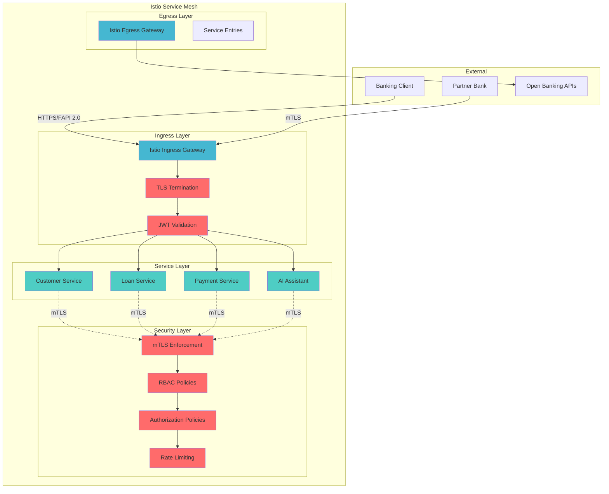

# Enterprise Banking Istio Service Mesh Implementation Guide

**Date**: January 2025  
**Version**: 1.0  
**Compliance**: FAPI 2.0, PCI DSS, SOC2

## Executive Summary

This document outlines the comprehensive implementation of Istio Service Mesh for the Enterprise Banking Loan Management System, providing banking-grade security, observability, and traffic management with full FAPI 2.0 compliance.

## Architecture Overview

### 🏗️ **Service Mesh Components**

```yaml
Banking Service Mesh Architecture:
├── Istio Control Plane (istiod)
│   ├── Pilot (Traffic Management)
│   ├── Citadel (Certificate Management)
│   └── Galley (Configuration Validation)
├── Data Plane (Envoy Sidecars)
│   ├── Customer Service Sidecar
│   ├── Loan Service Sidecar
│   ├── Payment Service Sidecar
│   └── AI Assistant Service Sidecar
├── Gateways
│   ├── Ingress Gateway (External Traffic)
│   └── Egress Gateway (External APIs)
└── Observability Stack
    ├── Jaeger (Distributed Tracing)
    ├── Prometheus (Metrics Collection)
    ├── Grafana (Visualization)
    └── Kiali (Service Mesh Topology)
```

### 🔒 **Security Architecture**



## Implementation Details

### 📋 **Phase 1: Core Installation**

#### Istio Control Plane Configuration

```yaml
# Banking-optimized Istio installation
apiVersion: install.istio.io/v1alpha1
kind: IstioOperator
metadata:
  name: enterprise-banking-istio
spec:
  values:
    global:
      meshID: "enterprise-banking-mesh"
      network: "banking-network"
      # Banking compliance metadata
      proxy:
        resources:
          requests:
            cpu: 200m
            memory: 256Mi
          limits:
            cpu: 500m
            memory: 512Mi
```

#### Banking Namespace Setup

```bash
# Create banking namespace with Istio injection
kubectl create namespace banking-services
kubectl label namespace banking-services istio-injection=enabled
kubectl label namespace banking-services compliance-level=fapi-2.0
kubectl label namespace banking-services banking-environment=production
```

### 🔐 **Phase 2: Security Configuration**

#### mTLS Enforcement

```yaml
# Mesh-wide strict mTLS
apiVersion: security.istio.io/v1beta1
kind: PeerAuthentication
metadata:
  name: mesh-wide-mtls
  namespace: istio-system
spec:
  mtls:
    mode: STRICT
```

#### RBAC Authorization

```yaml
# Banking service authorization
apiVersion: security.istio.io/v1beta1
kind: AuthorizationPolicy
metadata:
  name: banking-rbac-policy
spec:
  rules:
  - from:
    - source:
        principals: ["cluster.local/ns/banking-services/sa/customer-service"]
    to:
    - operation:
        methods: ["GET", "POST", "PUT"]
        paths: ["/api/v1/loans/*"]
    when:
    - key: request.headers[x-fapi-interaction-id]
      values: ["*"]
```

#### JWT Authentication

```yaml
# FAPI 2.0 JWT validation
apiVersion: security.istio.io/v1beta1
kind: RequestAuthentication
metadata:
  name: banking-jwt-auth
spec:
  jwtRules:
  - issuer: "https://auth.banking.enterprise.local"
    jwksUri: "https://auth.banking.enterprise.local/.well-known/jwks.json"
    audiences: ["banking-api", "open-banking-api"]
    fromHeaders:
    - name: "Authorization"
      prefix: "Bearer "
```

### 🌐 **Phase 3: Traffic Management**

#### Gateway Configuration

```yaml
# Banking API Gateway
apiVersion: networking.istio.io/v1beta1
kind: Gateway
metadata:
  name: banking-gateway
spec:
  selector:
    istio: ingressgateway
  servers:
  - port:
      number: 443
      name: https-banking
      protocol: HTTPS
    tls:
      mode: SIMPLE
      credentialName: banking-tls-cert
    hosts:
    - "api.banking.enterprise.local"
    - "openbanking.enterprise.local"
```

#### Virtual Service Routing

```yaml
# API routing with FAPI 2.0 compliance
apiVersion: networking.istio.io/v1beta1
kind: VirtualService
metadata:
  name: banking-api-routes
spec:
  http:
  - match:
    - uri:
        prefix: /open-banking/v3.1/pisp
    - headers:
        x-fapi-financial-id:
          regex: "^[a-zA-Z0-9]{1,40}$"
    route:
    - destination:
        host: payment-service
    timeout: 60s
    retries:
      attempts: 1
      perTryTimeout: 30s
```

#### Destination Rules

```yaml
# Load balancing and circuit breaker
apiVersion: networking.istio.io/v1beta1
kind: DestinationRule
metadata:
  name: banking-services-destination-rules
spec:
  host: "*.banking-services.svc.cluster.local"
  trafficPolicy:
    loadBalancer:
      simple: LEAST_CONN
    connectionPool:
      tcp:
        maxConnections: 50
        connectTimeout: 10s
    outlierDetection:
      consecutiveGatewayErrors: 3
      interval: 30s
      baseEjectionTime: 30s
```

### 📊 **Phase 4: Observability Configuration**

#### Distributed Tracing

```yaml
# Banking telemetry configuration
apiVersion: telemetry.istio.io/v1alpha1
kind: Telemetry
metadata:
  name: banking-telemetry-config
spec:
  tracing:
  - providers:
    - name: jaeger
  - customTags:
      fapi_interaction_id:
        header:
          name: x-fapi-interaction-id
      banking_entity_id:
        header:
          name: x-banking-entity-id
```

#### Metrics Collection

```yaml
# Enhanced banking metrics
spec:
  metrics:
  - overrides:
    - match:
        metric: REQUEST_COUNT
      tags:
        banking_service_name: "destination.labels['banking-service']"
        fapi_interaction_id: "request.headers['x-fapi-interaction-id']"
        compliance_level: "destination.labels['compliance-level']"
```

### 🚨 **Phase 5: Monitoring and Alerting**

#### Banking Alert Rules

```yaml
# FAPI 2.0 compliance alerts
groups:
- name: banking.rules
  rules:
  - alert: BankingHighErrorRate
    expr: |
      sum(rate(istio_requests_total{response_code!~"2.."}[5m]))
      / sum(rate(istio_requests_total[5m])) > 0.05
    labels:
      severity: critical
      compliance: fapi-2.0
    annotations:
      summary: "High error rate in banking services"

  - alert: BankingmTLSFailure
    expr: |
      sum(rate(istio_requests_total{connection_security_policy!="mutual_tls"}[5m])) > 0
    labels:
      severity: critical
      compliance: fapi-2.0
    annotations:
      summary: "mTLS failure detected"
```

## Installation Guide

### 🛠️ **Prerequisites**

1. **Kubernetes Cluster** (v1.25+)
2. **kubectl** configured
3. **Minimum Resources**:
   - 4 CPU cores
   - 8GB RAM
   - 50GB storage

### 📦 **Installation Steps**

#### Step 1: Download and Install Istio

```bash
# Download Istio 1.20.3
curl -L https://istio.io/downloadIstio | ISTIO_VERSION=1.20.3 sh -
cd istio-1.20.3
export PATH=$PWD/bin:$PATH
```

#### Step 2: Install Banking Service Mesh

```bash
# Run the automated installation script
./scripts/istio/install-istio.sh
```

#### Step 3: Verify Installation

```bash
# Check Istio control plane
kubectl get pods -n istio-system

# Check banking namespace
kubectl get all -n banking-services

# Verify mTLS configuration
istioctl authn tls-check banking-services
```

### 🔧 **Configuration Validation**

#### Security Validation

```bash
# Check mTLS policies
kubectl get peerauthentication -n banking-services

# Check authorization policies
kubectl get authorizationpolicy -n banking-services

# Verify JWT authentication
kubectl get requestauthentication -n banking-services
```

#### Traffic Management Validation

```bash
# Check gateways
kubectl get gateway -n banking-services

# Check virtual services
kubectl get virtualservice -n banking-services

# Check destination rules
kubectl get destinationrule -n banking-services
```

## Operational Procedures

### 📈 **Monitoring and Observability**

#### Access Observability Tools

```bash
# Grafana Dashboard
kubectl port-forward svc/grafana 3000:3000 -n istio-system
# Access: http://localhost:3000

# Jaeger Tracing
kubectl port-forward svc/tracing 16686:80 -n istio-system
# Access: http://localhost:16686

# Kiali Service Mesh
kubectl port-forward svc/kiali 20001:20001 -n istio-system
# Access: http://localhost:20001
```

#### Key Banking Metrics

1. **Service Health**:
   - Request rate and latency
   - Error rates by service
   - Service availability

2. **Security Metrics**:
   - mTLS compliance rate
   - Authentication failures
   - Authorization denials

3. **FAPI 2.0 Compliance**:
   - FAPI interaction tracking
   - DPoP token validation
   - Open Banking API metrics

### 🔒 **Security Operations**

#### Certificate Management

```bash
# Check certificate status
kubectl get secret -n istio-system | grep cert

# Rotate certificates
istioctl proxy-config secret -n banking-services
```

#### Security Policy Updates

```bash
# Update authorization policies
kubectl apply -f k8s/istio/istio-security-policies.yaml

# Verify policy application
istioctl analyze -n banking-services
```

### 🚨 **Troubleshooting**

#### Common Issues

1. **Sidecar Injection Failures**:
   ```bash
   # Check namespace labels
   kubectl get namespace banking-services --show-labels
   
   # Verify webhook configuration
   kubectl get mutatingwebhookconfiguration
   ```

2. **mTLS Connection Issues**:
   ```bash
   # Check TLS configuration
   istioctl authn tls-check banking-services
   
   # Debug proxy configuration
   istioctl proxy-config cluster -n banking-services
   ```

3. **Gateway Connectivity**:
   ```bash
   # Check gateway status
   kubectl get svc istio-ingressgateway -n istio-system
   
   # Debug routing
   istioctl proxy-config route -n istio-system
   ```

## Security Compliance

### 🎯 **FAPI 2.0 Compliance**

- ✅ **Mutual TLS**: All service-to-service communication
- ✅ **JWT Validation**: FAPI-compliant token validation
- ✅ **DPoP Support**: RFC 9449 implementation
- ✅ **Request Tracing**: Complete audit trail
- ✅ **Rate Limiting**: Per-client protection

### 🛡️ **Banking Security Controls**

- ✅ **Zero Trust**: No implicit trust between services
- ✅ **RBAC**: Fine-grained access control
- ✅ **Network Policies**: Micro-segmentation
- ✅ **Certificate Management**: Automated rotation
- ✅ **Audit Logging**: Comprehensive request logging

## Performance Optimization

### ⚡ **Recommendations**

1. **Resource Allocation**:
   - Control Plane: 2 CPU, 4GB RAM
   - Sidecars: 200m CPU, 256MB RAM per service

2. **Connection Pooling**:
   - Max connections: 50 per service
   - Connection timeout: 10s
   - Keep-alive: 7200s

3. **Circuit Breaker**:
   - Consecutive errors: 3
   - Base ejection time: 30s
   - Max ejection: 50%

## Maintenance and Updates

### 🔄 **Regular Maintenance**

1. **Weekly Tasks**:
   - Review security alerts
   - Check certificate expiration
   - Analyze performance metrics

2. **Monthly Tasks**:
   - Update Istio to latest patch version
   - Review and update security policies
   - Performance optimization review

3. **Quarterly Tasks**:
   - Major version upgrades
   - Security audit and compliance review
   - Disaster recovery testing

### 📋 **Update Procedures**

```bash
# Update Istio control plane
istioctl upgrade --set revision=1-20-4

# Update sidecar proxies
kubectl rollout restart deployment -n banking-services

# Verify update
istioctl version
```

## Conclusion

The Enterprise Banking Istio Service Mesh provides:

- **Production-Ready Security**: FAPI 2.0 compliant with banking-grade controls
- **Comprehensive Observability**: Full visibility into service interactions
- **High Availability**: Fault tolerance and automatic failover
- **Regulatory Compliance**: Audit trails and security policies
- **Operational Excellence**: Automated management and monitoring

This implementation ensures that the banking system meets the highest standards for security, reliability, and compliance while providing the operational visibility required for enterprise banking operations.