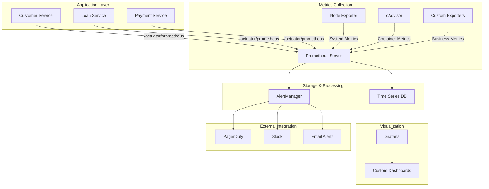

# Metrics and Monitoring Architecture

**Document Information:**
- **Author**: Lead Site Reliability Engineer & Monitoring Architecture Team
- **Version**: 1.0.0
- **Last Updated**: December 2024
- **Classification**: Internal - Operations Architecture
- **Audience**: SRE Teams, DevOps Engineers, Operations Teams

## Overview

This document outlines the comprehensive metrics collection and monitoring strategy for the Enterprise Loan Management System, implementing enterprise-grade observability patterns proven in production banking environments. The monitoring architecture incorporates Prometheus, Grafana, and banking-specific monitoring requirements with PCI-DSS v4 compliance, reflecting best practices from high-availability financial services operations processing billions in transaction volume.

## Monitoring Architecture

### Component Overview


## Metrics Categories

### 1. Business Metrics

#### Loan Processing Metrics
```java
@Component
public class LoanMetrics {
    
    private final Counter loanApplicationsTotal;
    private final Counter loanApprovalsTotal;
    private final Counter loanRejectionsTotal;
    private final Histogram loanProcessingDuration;
    private final Gauge activeLoanApplications;
    private final Counter loanAmountTotal;
    
    public LoanMetrics(MeterRegistry meterRegistry) {
        this.loanApplicationsTotal = Counter.builder("loan_applications_total")
            .description("Total number of loan applications received")
            .tag("data_classification", "confidential")
            .register(meterRegistry);
            
        this.loanApprovalsTotal = Counter.builder("loan_approvals_total")
            .description("Total number of approved loans")
            .tag("data_classification", "confidential")
            .register(meterRegistry);
            
        this.loanRejectionsTotal = Counter.builder("loan_rejections_total")
            .description("Total number of rejected loans")
            .tag("data_classification", "confidential")
            .register(meterRegistry);
            
        this.loanProcessingDuration = Histogram.builder("loan_processing_duration_seconds")
            .description("Time taken to process loan applications")
            .buckets(1, 5, 10, 30, 60, 300, 600, 1800) // Banking SLA buckets
            .tag("data_classification", "internal")
            .register(meterRegistry);
            
        this.activeLoanApplications = Gauge.builder("active_loan_applications")
            .description("Number of loan applications currently being processed")
            .tag("data_classification", "internal")
            .register(meterRegistry);
            
        this.loanAmountTotal = Counter.builder("loan_amount_total")
            .description("Total loan amount processed")
            .tag("data_classification", "restricted")
            .baseUnit("currency")
            .register(meterRegistry);
    }
    
    public void recordLoanApplication(String loanType, String customerSegment) {
        loanApplicationsTotal.increment(
            Tags.of(
                "loan_type", loanType,
                "customer_segment", customerSegment,
                "region", getCurrentRegion()
            )
        );
    }
    
    public void recordLoanApproval(String loanType, BigDecimal amount, String currency) {
        loanApprovalsTotal.increment(
            Tags.of(
                "loan_type", loanType,
                "currency", currency
            )
        );
        
        loanAmountTotal.increment(amount.doubleValue(),
            Tags.of(
                "currency", currency,
                "operation", "approval"
            )
        );
    }
    
    public Timer.Sample startLoanProcessingTimer() {
        return Timer.start(meterRegistry);
    }
    
    public void recordLoanProcessingDuration(Timer.Sample sample, String outcome) {
        sample.stop(loanProcessingDuration.timer(
            Tags.of("outcome", outcome)
        ));
    }
}
```

#### Payment Processing Metrics
```java
@Component
public class PaymentMetrics {
    
    private final Counter paymentTransactionsTotal;
    private final Counter paymentFailuresTotal;
    private final Histogram paymentProcessingDuration;
    private final Counter fraudDetectionTotal;
    private final Gauge paymentVolumeByMethod;
    
    public PaymentMetrics(MeterRegistry meterRegistry) {
        this.paymentTransactionsTotal = Counter.builder("payment_transactions_total")
            .description("Total number of payment transactions")
            .tag("data_classification", "pci_dss")
            .register(meterRegistry);
            
        this.paymentFailuresTotal = Counter.builder("payment_failures_total")
            .description("Total number of failed payment transactions")
            .tag("data_classification", "pci_dss")
            .register(meterRegistry);
            
        this.paymentProcessingDuration = Histogram.builder("payment_processing_duration_seconds")
            .description("Time taken to process payments")
            .buckets(0.1, 0.5, 1, 2, 5, 10, 30) // Fast payment requirements
            .tag("data_classification", "internal")
            .register(meterRegistry);
            
        this.fraudDetectionTotal = Counter.builder("fraud_detection_total")
            .description("Total fraud detection events")
            .tag("data_classification", "confidential")
            .tag("security_event", "true")
            .register(meterRegistry);
    }
    
    public void recordPaymentTransaction(String paymentMethod, String status, BigDecimal amount) {
        // Never log actual card numbers or sensitive payment data
        paymentTransactionsTotal.increment(
            Tags.of(
                "payment_method", maskPaymentMethod(paymentMethod),
                "status", status,
                "currency", getCurrentCurrency(),
                "amount_range", getAmountRange(amount)
            )
        );
    }
    
    public void recordFraudDetection(String fraudType, String riskLevel) {
        fraudDetectionTotal.increment(
            Tags.of(
                "fraud_type", fraudType,
                "risk_level", riskLevel,
                "action_taken", "blocked"
            )
        );
    }
    
    private String maskPaymentMethod(String paymentMethod) {
        // Ensure no sensitive data in metrics
        return paymentMethod.toLowerCase().replaceAll("\\d", "X");
    }
}
```

#### Customer Management Metrics
```java
@Component
public class CustomerMetrics {
    
    private final Counter customerRegistrationsTotal;
    private final Counter customerActivationsTotal;
    private final Gauge activeCustomersTotal;
    private final Counter kycVerificationsTotal;
    private final Histogram customerOnboardingDuration;
    
    public CustomerMetrics(MeterRegistry meterRegistry) {
        this.customerRegistrationsTotal = Counter.builder("customer_registrations_total")
            .description("Total number of customer registrations")
            .tag("data_classification", "restricted")
            .register(meterRegistry);
            
        this.customerActivationsTotal = Counter.builder("customer_activations_total")
            .description("Total number of customer activations")
            .tag("data_classification", "restricted")
            .register(meterRegistry);
            
        this.activeCustomersTotal = Gauge.builder("active_customers_total")
            .description("Total number of active customers")
            .tag("data_classification", "restricted")
            .register(meterRegistry);
            
        this.kycVerificationsTotal = Counter.builder("kyc_verifications_total")
            .description("Total number of KYC verifications")
            .tag("data_classification", "confidential")
            .tag("compliance_requirement", "BSA_AML")
            .register(meterRegistry);
            
        this.customerOnboardingDuration = Histogram.builder("customer_onboarding_duration_seconds")
            .description("Time taken for customer onboarding")
            .buckets(60, 300, 600, 1800, 3600, 7200) // Banking onboarding SLAs
            .tag("data_classification", "internal")
            .register(meterRegistry);
    }
    
    public void recordCustomerRegistration(String customerType, String region) {
        customerRegistrationsTotal.increment(
            Tags.of(
                "customer_type", customerType,
                "region", region,
                "channel", getCurrentChannel()
            )
        );
    }
    
    public void recordKycVerification(String verificationType, String result) {
        kycVerificationsTotal.increment(
            Tags.of(
                "verification_type", verificationType,
                "result", result,
                "compliance_framework", "BSA_AML"
            )
        );
    }
}
```

### 2. Technical Metrics

#### Application Performance Metrics
```java
@Configuration
public class ApplicationMetricsConfiguration {
    
    @Bean
    public MeterRegistryCustomizer<MeterRegistry> metricsCommonTags() {
        return registry -> registry.config()
            .commonTags(
                "application", "enterprise-loan-management",
                "version", getApplicationVersion(),
                "environment", getEnvironment(),
                "region", getDataResidency(),
                "compliance_framework", "PCI-DSS-v4"
            );
    }
    
    @Bean
    public TimedAspect timedAspect(MeterRegistry registry) {
        return new TimedAspect(registry);
    }
    
    @Bean
    public CountedAspect countedAspect(MeterRegistry registry) {
        return new CountedAspect(registry);
    }
}

@RestController
@RequestMapping("/api/v1/loans")
public class LoanController {
    
    @PostMapping
    @Timed(name = "loan_creation_duration", description = "Time taken to create a loan")
    @Counted(name = "loan_creation_requests", description = "Number of loan creation requests")
    public ResponseEntity<LoanResponse> createLoan(@RequestBody CreateLoanRequest request) {
        // Controller logic
    }
    
    @GetMapping("/{loanId}")
    @Timed(name = "loan_retrieval_duration", description = "Time taken to retrieve a loan")
    public ResponseEntity<LoanResponse> getLoan(@PathVariable String loanId) {
        // Controller logic
    }
}
```

#### Database Metrics
```java
@Component
public class DatabaseMetrics {
    
    private final Counter databaseConnectionsTotal;
    private final Gauge activeDatabaseConnections;
    private final Timer databaseQueryDuration;
    private final Counter databaseErrorsTotal;
    
    public DatabaseMetrics(MeterRegistry meterRegistry) {
        this.databaseConnectionsTotal = Counter.builder("database_connections_total")
            .description("Total database connections created")
            .register(meterRegistry);
            
        this.activeDatabaseConnections = Gauge.builder("database_connections_active")
            .description("Number of active database connections")
            .register(meterRegistry);
            
        this.databaseQueryDuration = Timer.builder("database_query_duration_seconds")
            .description("Database query execution time")
            .register(meterRegistry);
            
        this.databaseErrorsTotal = Counter.builder("database_errors_total")
            .description("Total database errors")
            .register(meterRegistry);
    }
    
    @EventListener
    public void handleConnectionEvent(ConnectionPoolEvent event) {
        if (event instanceof ConnectionAcquiredEvent) {
            databaseConnectionsTotal.increment();
        }
    }
    
    public void recordQueryDuration(String queryType, Duration duration) {
        databaseQueryDuration.record(duration,
            Tags.of("query_type", queryType)
        );
    }
}
```

### 3. Security Metrics

#### Security Event Metrics
```java
@Component
public class SecurityMetrics {
    
    private final Counter authenticationAttemptsTotal;
    private final Counter authenticationFailuresTotal;
    private final Counter authorizationViolationsTotal;
    private final Counter securityEventsTotal;
    private final Gauge suspiciousActivityGauge;
    
    public SecurityMetrics(MeterRegistry meterRegistry) {
        this.authenticationAttemptsTotal = Counter.builder("authentication_attempts_total")
            .description("Total authentication attempts")
            .tag("security_event", "true")
            .register(meterRegistry);
            
        this.authenticationFailuresTotal = Counter.builder("authentication_failures_total")
            .description("Total authentication failures")
            .tag("security_event", "true")
            .tag("severity", "medium")
            .register(meterRegistry);
            
        this.authorizationViolationsTotal = Counter.builder("authorization_violations_total")
            .description("Total authorization violations")
            .tag("security_event", "true")
            .tag("severity", "high")
            .register(meterRegistry);
            
        this.securityEventsTotal = Counter.builder("security_events_total")
            .description("Total security events by type")
            .tag("security_event", "true")
            .register(meterRegistry);
    }
    
    public void recordAuthenticationAttempt(String method, String result, String userAgent) {
        authenticationAttemptsTotal.increment(
            Tags.of(
                "method", method,
                "result", result,
                "user_agent_category", categorizeUserAgent(userAgent)
            )
        );
        
        if ("failure".equals(result)) {
            authenticationFailuresTotal.increment(
                Tags.of("method", method)
            );
        }
    }
    
    public void recordSecurityEvent(String eventType, String severity, String source) {
        securityEventsTotal.increment(
            Tags.of(
                "event_type", eventType,
                "severity", severity,
                "source", source
            )
        );
    }
}
```

### 4. Compliance Metrics

#### PCI-DSS Compliance Metrics
```java
@Component
public class ComplianceMetrics {
    
    private final Counter pciDataAccessTotal;
    private final Counter complianceViolationsTotal;
    private final Counter auditEventsTotal;
    private final Gauge dataRetentionComplianceGauge;
    
    public ComplianceMetrics(MeterRegistry meterRegistry) {
        this.pciDataAccessTotal = Counter.builder("pci_data_access_total")
            .description("Total PCI data access events")
            .tag("compliance_framework", "PCI-DSS-v4")
            .tag("data_classification", "pci_dss")
            .register(meterRegistry);
            
        this.complianceViolationsTotal = Counter.builder("compliance_violations_total")
            .description("Total compliance violations")
            .tag("severity", "high")
            .register(meterRegistry);
            
        this.auditEventsTotal = Counter.builder("audit_events_total")
            .description("Total audit events")
            .tag("compliance_requirement", "audit_trail")
            .register(meterRegistry);
    }
    
    public void recordPciDataAccess(String operation, String userRole, String dataType) {
        pciDataAccessTotal.increment(
            Tags.of(
                "operation", operation,
                "user_role", userRole,
                "data_type", dataType,
                "compliance_requirement", "PCI-DSS-3.4"
            )
        );
    }
    
    public void recordComplianceViolation(String framework, String violationType, String severity) {
        complianceViolationsTotal.increment(
            Tags.of(
                "framework", framework,
                "violation_type", violationType,
                "severity", severity
            )
        );
    }
    
    public void recordAuditEvent(String action, String resource, String outcome) {
        auditEventsTotal.increment(
            Tags.of(
                "action", action,
                "resource", resource,
                "outcome", outcome,
                "requirement", "SOX-404"
            )
        );
    }
}
```

## Custom Exporters

### Banking Business Metrics Exporter
```java
@Component
public class BankingBusinessMetricsExporter {
    
    private final MeterRegistry meterRegistry;
    private final LoanRepository loanRepository;
    private final CustomerRepository customerRepository;
    
    @Scheduled(fixedRate = 60000) // Every minute
    public void exportBusinessMetrics() {
        // Portfolio metrics
        exportPortfolioMetrics();
        
        // Risk metrics
        exportRiskMetrics();
        
        // Performance metrics
        exportPerformanceMetrics();
    }
    
    private void exportPortfolioMetrics() {
        // Total loan portfolio value
        BigDecimal portfolioValue = loanRepository.getTotalPortfolioValue();
        Gauge.builder("loan_portfolio_value")
            .description("Total value of loan portfolio")
            .tag("data_classification", "restricted")
            .register(meterRegistry)
            .set(portfolioValue.doubleValue());
            
        // Portfolio by risk category
        Map<RiskLevel, BigDecimal> portfolioByRisk = loanRepository.getPortfolioByRiskLevel();
        portfolioByRisk.forEach((riskLevel, value) -> {
            Gauge.builder("loan_portfolio_by_risk")
                .description("Loan portfolio value by risk level")
                .tag("risk_level", riskLevel.name())
                .tag("data_classification", "restricted")
                .register(meterRegistry)
                .set(value.doubleValue());
        });
    }
    
    private void exportRiskMetrics() {
        // Default rate
        double defaultRate = loanRepository.getDefaultRate();
        Gauge.builder("loan_default_rate")
            .description("Current loan default rate")
            .tag("data_classification", "restricted")
            .register(meterRegistry)
            .set(defaultRate);
            
        // Credit utilization
        double avgCreditUtilization = customerRepository.getAverageCreditUtilization();
        Gauge.builder("average_credit_utilization")
            .description("Average customer credit utilization")
            .tag("data_classification", "confidential")
            .register(meterRegistry)
            .set(avgCreditUtilization);
    }
}
```

### PCI-DSS Compliance Exporter
```java
@Component
public class PciComplianceMetricsExporter {
    
    private final MeterRegistry meterRegistry;
    private final ComplianceService complianceService;
    
    @Scheduled(fixedRate = 300000) // Every 5 minutes
    public void exportPciComplianceMetrics() {
        // PCI-DSS requirement compliance status
        Map<String, Boolean> requirementStatus = complianceService.getPciRequirementStatus();
        
        requirementStatus.forEach((requirement, compliant) -> {
            Gauge.builder("pci_requirement_compliance")
                .description("PCI-DSS requirement compliance status")
                .tag("requirement", requirement)
                .tag("compliance_framework", "PCI-DSS-v4")
                .register(meterRegistry)
                .set(compliant ? 1.0 : 0.0);
        });
        
        // Encryption status
        double encryptionCompliance = complianceService.getEncryptionCompliance();
        Gauge.builder("encryption_compliance_percentage")
            .description("Percentage of data properly encrypted")
            .tag("compliance_requirement", "PCI-DSS-3.4")
            .register(meterRegistry)
            .set(encryptionCompliance);
    }
}
```

## Alerting Rules

### Prometheus Alerting Configuration
```yaml
# prometheus-banking-alerts.yml
groups:
  - name: banking.business.alerts
    rules:
      - alert: HighLoanDefaultRate
        expr: loan_default_rate > 0.05
        for: 5m
        labels:
          severity: critical
          business_impact: high
          compliance_framework: Basel-III
        annotations:
          summary: "Loan default rate exceeds 5%"
          description: "Current default rate: {{ $value }}%"
          
      - alert: LowLoanApprovalRate
        expr: rate(loan_approvals_total[1h]) / rate(loan_applications_total[1h]) < 0.3
        for: 10m
        labels:
          severity: warning
          business_impact: medium
        annotations:
          summary: "Loan approval rate below 30%"
          
      - alert: PaymentProcessingDelay
        expr: histogram_quantile(0.95, payment_processing_duration_seconds_bucket) > 5
        for: 2m
        labels:
          severity: critical
          sla_violation: true
        annotations:
          summary: "Payment processing taking too long"
          
  - name: banking.security.alerts
    rules:
      - alert: HighAuthenticationFailureRate
        expr: rate(authentication_failures_total[5m]) > 10
        for: 1m
        labels:
          severity: critical
          security_event: true
          response_required: immediate
        annotations:
          summary: "High authentication failure rate detected"
          
      - alert: PciDataAccessViolation
        expr: increase(compliance_violations_total{framework="PCI-DSS-v4"}[1m]) > 0
        for: 0m
        labels:
          severity: critical
          compliance_violation: true
          framework: PCI-DSS-v4
        annotations:
          summary: "PCI-DSS compliance violation detected"
          
  - name: banking.technical.alerts
    rules:
      - alert: DatabaseConnectionPoolExhaustion
        expr: database_connections_active / database_connection_pool_max > 0.9
        for: 2m
        labels:
          severity: critical
          component: database
        annotations:
          summary: "Database connection pool nearly exhausted"
          
      - alert: HighErrorRate
        expr: rate(http_requests_total{status=~"5.."}[5m]) > 0.1
        for: 5m
        labels:
          severity: warning
          component: application
        annotations:
          summary: "High error rate detected"
```

## Grafana Dashboards

### Banking Operations Dashboard
```json
{
  "dashboard": {
    "title": "Banking Operations Dashboard",
    "panels": [
      {
        "title": "Loan Applications",
        "type": "stat",
        "targets": [
          {
            "expr": "sum(rate(loan_applications_total[1h]))",
            "legendFormat": "Applications/hour"
          }
        ]
      },
      {
        "title": "Loan Approval Rate",
        "type": "stat",
        "targets": [
          {
            "expr": "sum(rate(loan_approvals_total[1h])) / sum(rate(loan_applications_total[1h])) * 100",
            "legendFormat": "Approval Rate %"
          }
        ]
      },
      {
        "title": "Payment Transaction Volume",
        "type": "graph",
        "targets": [
          {
            "expr": "sum(rate(payment_transactions_total[5m])) by (payment_method)",
            "legendFormat": "{{ payment_method }}"
          }
        ]
      },
      {
        "title": "Customer Onboarding Performance",
        "type": "heatmap",
        "targets": [
          {
            "expr": "histogram_quantile(0.95, customer_onboarding_duration_seconds_bucket)",
            "legendFormat": "95th percentile"
          }
        ]
      }
    ]
  }
}
```

### PCI-DSS Compliance Dashboard
```json
{
  "dashboard": {
    "title": "PCI-DSS Compliance Monitoring",
    "panels": [
      {
        "title": "PCI Requirements Compliance",
        "type": "table",
        "targets": [
          {
            "expr": "pci_requirement_compliance",
            "format": "table"
          }
        ]
      },
      {
        "title": "Encryption Compliance",
        "type": "gauge",
        "targets": [
          {
            "expr": "encryption_compliance_percentage"
          }
        ]
      },
      {
        "title": "PCI Data Access Events",
        "type": "graph",
        "targets": [
          {
            "expr": "sum(rate(pci_data_access_total[5m])) by (operation)"
          }
        ]
      }
    ]
  }
}
```

## Monitoring Best Practices

### Metric Naming Conventions
1. **Use clear, descriptive names**: `loan_applications_total` not `la_total`
2. **Include units in names**: `_seconds`, `_bytes`, `_total`
3. **Use consistent labeling**: Always include `data_classification` tags
4. **Business context**: Include business-relevant tags like `customer_segment`

### Data Classification in Metrics
```java
// Always tag metrics with data classification
Counter.builder("customer_operations_total")
    .tag("data_classification", "restricted")
    .tag("compliance_framework", "GDPR")
    .register(meterRegistry);
    
// Never expose sensitive data in metric names or labels
// WRONG: .tag("customer_ssn", customerSSN)
// RIGHT: .tag("customer_segment", "premium")
```

### Performance Considerations
1. **Limit cardinality**: Avoid high-cardinality labels
2. **Use histograms wisely**: Choose appropriate buckets for business SLAs
3. **Sample high-frequency metrics**: Use sampling for very frequent events
4. **Batch metric updates**: Group related metric updates

### Compliance Guidelines
1. **Data sovereignty**: Store metrics in appropriate regions
2. **Retention policies**: Align with regulatory requirements
3. **Access controls**: Implement RBAC for metric access
4. **Audit trails**: Log access to sensitive metrics

---

This metrics and monitoring implementation provides comprehensive visibility into banking operations while maintaining strict compliance with regulatory requirements and industry best practices.