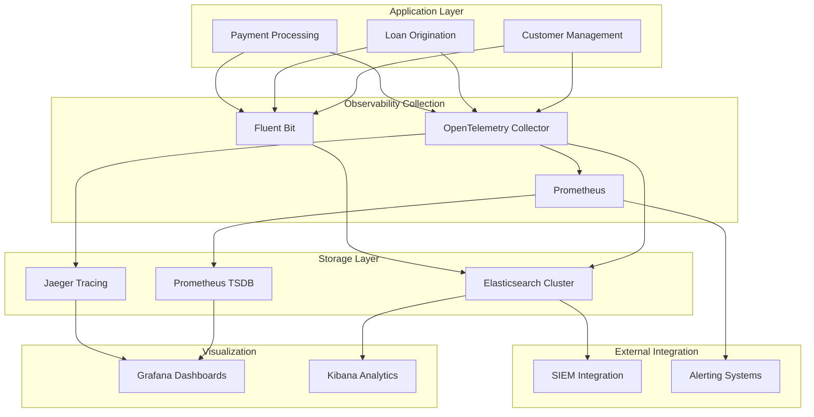

# Enterprise Banking Observability Architecture

## Overview

This document outlines the comprehensive observability architecture for the Enterprise Loan Management System, implementing industry standards for logging, metrics, tracing, and monitoring with PCI-DSS v4 compliance and data sovereignty controls.

## Architecture Principles

### 1. Three Pillars of Observability
- **Logs**: Structured events with business context and compliance metadata
- **Metrics**: Time-series data for performance and business KPIs
- **Traces**: Distributed request flow across microservices

### 2. Industry Standards Compliance
- **OpenTelemetry**: CNCF standard for observability data collection
- **OTLP Protocol**: Vendor-neutral telemetry data transmission
- **Prometheus**: De facto standard for metrics collection
- **Jaeger**: Industry standard for distributed tracing

### 3. Banking Compliance Requirements
- **PCI-DSS v4**: Payment card industry security standards
- **GDPR**: European data protection regulation
- **CCPA**: California consumer privacy act
- **SOX**: Sarbanes-Oxley financial reporting compliance

## Component Architecture



## Data Flow Architecture

### 1. Log Data Flow
```
Application → OpenTelemetry SDK → OTLP → OpenTelemetry Collector
                                           ↓
Fluent Bit ← Application Logs ← File System
     ↓
Data Masking & Classification
     ↓
Regional Storage (Elasticsearch)
     ↓
SIEM Integration & Compliance Reporting
```

### 2. Metrics Data Flow
```
Application → Prometheus Client → /metrics Endpoint
                                       ↓
Prometheus Server ← Service Discovery ← Kubernetes/Docker
     ↓
Time Series Database (TSDB)
     ↓
Grafana Dashboards & Alerting
```

### 3. Tracing Data Flow
```
Application → OpenTelemetry SDK → OTLP → OpenTelemetry Collector
                                           ↓
Jaeger Collector → Jaeger Storage → Jaeger Query
                                         ↓
Grafana Trace Visualization
```

## Observability Components

### OpenTelemetry Collector
**Purpose**: Central hub for telemetry data collection and processing

**Configuration**: `observability/otel/otel-collector-config.yaml`

**Key Features**:
- OTLP receivers (gRPC: 4317, HTTP: 4318)
- PCI-DSS compliant data processing
- Regional data routing
- Multiple exporter support

**Processors**:
- **Memory Limiter**: Prevents OOM conditions
- **Batch Processor**: Efficient data transmission
- **Resource Processor**: Adds service metadata
- **Attributes Processor**: PCI-DSS data classification
- **Transform Processor**: Log enrichment and masking

### Fluent Bit Log Aggregation
**Purpose**: High-performance log processing and forwarding

**Configuration**: `observability/fluentbit/fluent-bit.conf`

**Key Features**:
- Multi-input log collection
- Real-time PCI data masking
- Regional compliance routing
- SIEM integration support

**Parsers**:
- Spring Boot JSON logs
- Banking audit events
- Security events
- Transaction logs

### Elasticsearch Event Store
**Purpose**: Scalable log storage with compliance controls

**Configuration**: `observability/elasticsearch/`

**Key Features**:
- Index templates with banking schema
- Data lifecycle management (ILM)
- Field-level encryption
- Cross-cluster replication for DR

**Indexes**:
- `banking-logs-{region}-{date}`: Application logs
- `banking-audit-{region}-{date}`: Audit trails
- `banking-security-{region}-{date}`: Security events

### Prometheus Monitoring
**Purpose**: Metrics collection and alerting

**Configuration**: `observability/prometheus/prometheus-secure.yml`

**Key Features**:
- Secure HTTPS scraping
- Banking-specific metrics
- PCI-DSS compliance monitoring
- Multi-region aggregation

**Metrics Categories**:
- **Business Metrics**: Transaction volumes, loan approvals
- **Technical Metrics**: Response times, error rates
- **Security Metrics**: Authentication failures, access violations
- **Compliance Metrics**: Data classification, audit completeness

### Jaeger Distributed Tracing
**Purpose**: Request flow visualization across services

**Key Features**:
- End-to-end transaction tracing
- Service dependency mapping
- Performance bottleneck identification
- Error correlation across services

**Trace Context**:
- Transaction ID correlation
- User session tracking
- Business process flows
- Cross-service error propagation

## Data Classification & Compliance

### PCI-DSS v4 Implementation

#### Data Classification Levels
1. **PCI-DSS Scope**: Payment card data requiring highest protection
2. **Restricted**: Banking customer financial data
3. **Confidential**: Personal and business sensitive data
4. **Internal**: Business operational data
5. **Public**: Non-sensitive information

#### Compliance Controls
- **Requirement 10.2.1**: Comprehensive audit logging
- **Requirement 10.3.1**: Log integrity protection
- **Requirement 3.4.1**: Encryption at rest and in transit
- **Requirement 11.3.1**: Regular penetration testing

### Data Sovereignty Controls

#### Regional Configurations
**United States** (`observability/config/data-residency/us-config.yml`):
- CCPA compliance for California residents
- SOX controls for financial reporting
- Cross-border transfer restrictions

**European Union** (`observability/config/data-residency/eu-config.yml`):
- GDPR Article 32: Security of processing
- Data subject rights implementation
- Cross-border transfer mechanisms (SCCs)

**Asia-Pacific** (`observability/config/data-residency/apac-config.yml`):
- Australia Privacy Act 1988
- Singapore PDPA compliance
- Japan APPI requirements

## Performance & Scalability

### Horizontal Scaling
- **OpenTelemetry Collector**: Multiple replicas with load balancing
- **Elasticsearch**: Multi-node cluster with sharding
- **Prometheus**: Federation for multi-region aggregation
- **Fluent Bit**: DaemonSet deployment on each node

### Performance Optimization
- **Async Processing**: Non-blocking log processing
- **Batching**: Efficient data transmission
- **Compression**: Reduced network overhead
- **Caching**: Redis for frequently accessed data

### Capacity Planning
- **Log Volume**: 10,000+ events/second peak capacity
- **Retention**: 7 years for audit logs, 3 years for transaction logs
- **Storage**: Hot/Warm/Cold tier data lifecycle
- **Network**: Regional data residency optimization

## Security Architecture

### Encryption
- **TLS 1.3**: All data in transit
- **AES-256**: Data at rest encryption
- **mTLS**: Service-to-service authentication
- **Certificate Management**: Automated rotation

### Access Controls
- **RBAC**: Role-based access to observability data
- **LDAP Integration**: Corporate identity provider
- **API Keys**: Service authentication
- **IP Whitelisting**: Network-level security

### Data Masking
- **Real-time PCI Masking**: Credit card number protection
- **PII Protection**: Email, phone, SSN masking
- **Configurable Rules**: Business-specific data patterns
- **Audit Trail**: Masking operation logging

## Monitoring & Alerting

### Critical Alerts
- **Security Breaches**: Immediate notification
- **PCI Violations**: Compliance team alerts
- **System Outages**: Operations team notification
- **Data Quality Issues**: Data integrity alerts

### Alert Channels
- **PagerDuty**: Critical incident escalation
- **Slack**: Team notifications
- **Email**: Compliance reporting
- **SMS**: Executive notifications

### SLA Monitoring
- **99.9% Uptime**: Core banking services
- **<100ms Response**: Critical API endpoints
- **<1s Log Processing**: Real-time requirements
- **24/7 Monitoring**: Continuous observability

## SIEM Integration

### Supported Platforms
- **Splunk**: Enterprise SIEM integration
- **IBM QRadar**: Security intelligence platform
- **Microsoft Sentinel**: Cloud-native SIEM
- **Elastic SIEM**: Unified security analytics

### Event Forwarding
- **CEF Format**: Common Event Format compliance
- **Real-time Streaming**: Kafka-based event delivery
- **Threat Intelligence**: STIX/TAXII integration
- **Automated Response**: SOAR platform integration

## Deployment Architecture

### Container Orchestration
```yaml
# Kubernetes Deployment Example
apiVersion: apps/v1
kind: Deployment
metadata:
  name: otel-collector
spec:
  replicas: 3
  selector:
    matchLabels:
      app: otel-collector
  template:
    spec:
      containers:
      - name: otel-collector
        image: otel/opentelemetry-collector-contrib:latest
        resources:
          requests:
            memory: "2Gi"
            cpu: "1000m"
          limits:
            memory: "4Gi"
            cpu: "2000m"
```

### Network Architecture
- **Ingress Controllers**: TLS termination and routing
- **Service Mesh**: Istio for service communication
- **Network Policies**: Kubernetes network security
- **Load Balancers**: High availability and scaling

## Best Practices

### Development Guidelines
1. **Structured Logging**: JSON format with consistent fields
2. **Correlation IDs**: Request tracing across services
3. **Error Handling**: Comprehensive error context
4. **Performance Metrics**: Business and technical KPIs

### Operational Procedures
1. **Log Rotation**: Automated cleanup and archival
2. **Backup Procedures**: Multi-region data protection
3. **Disaster Recovery**: RTO < 4 hours, RPO < 1 hour
4. **Security Monitoring**: 24/7 SOC integration

### Compliance Maintenance
1. **Regular Audits**: Quarterly compliance reviews
2. **Data Retention**: Policy-driven lifecycle management
3. **Access Reviews**: Periodic permission audits
4. **Training Programs**: Team education on compliance

## Metrics & KPIs

### Business Metrics
- **Loan Processing Time**: Average time to approval
- **Transaction Success Rate**: Payment completion percentage
- **Customer Satisfaction**: NPS scoring integration
- **Fraud Detection Rate**: Security effectiveness metrics

### Technical Metrics
- **API Response Time**: Service performance tracking
- **Error Rate**: System reliability metrics
- **Throughput**: Transaction volume handling
- **Resource Utilization**: Infrastructure efficiency

### Compliance Metrics
- **Audit Completeness**: Regulatory requirement coverage
- **Data Classification**: Proper tagging percentage
- **Retention Compliance**: Policy adherence metrics
- **Security Incidents**: Breach detection and response

## Future Enhancements

### Planned Improvements
1. **AI/ML Integration**: Anomaly detection and predictive analytics
2. **Advanced Visualization**: Custom banking dashboards
3. **Real-time Analytics**: Stream processing enhancements
4. **Mobile Observability**: Mobile app telemetry integration

### Technology Roadmap
- **OpenTelemetry 2.0**: Next-generation observability
- **Kubernetes Native**: Cloud-native deployment evolution
- **Edge Computing**: Regional data processing
- **Quantum-Safe Encryption**: Future security preparation

---

This observability architecture provides comprehensive visibility into the enterprise banking system while maintaining strict compliance with industry regulations and security standards.