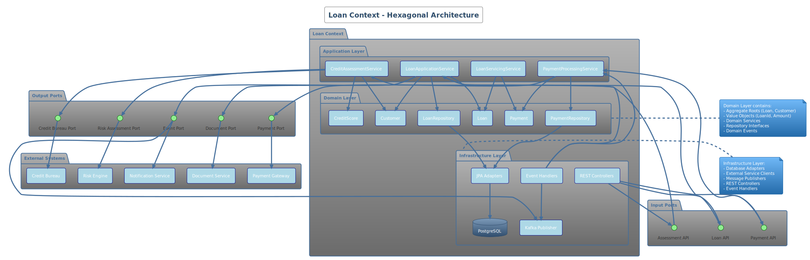

# Loan Context - Hexagonal Architecture

## 🏦 Overview

The Loan Context implements a **Hexagonal Architecture** (Ports & Adapters) pattern for managing the complete loan lifecycle, from application through servicing to closure. This bounded context embodies **Domain-Driven Design** principles with **PCI-DSS v4.0** compliance and **zero-trust security**.

## 🏗️ Architecture Diagram



**PlantUML Source**: [loan-context-architecture.puml](../docs/puml/bounded-contexts/loan-context-architecture.puml)

## 🎯 Domain Responsibilities

### Core Business Capabilities
- **Loan Application Processing**: Digital application with document management
- **Credit Assessment**: Automated scoring with manual review capabilities  
- **Loan Origination**: Contract generation, funding, and documentation
- **Loan Servicing**: Payment processing, account management, modifications
- **Collections Management**: Delinquency handling, recovery, and workout solutions

### Aggregate Roots
```java
@Entity
@AggregateRoot
public class Loan extends Entity<LoanId> {
    private final CustomerId customerId;
    private final ProductCode productCode;
    private final Money principalAmount;
    private final InterestRate rate;
    private final Term term;
    private LoanStatus status;
    
    // Domain methods that enforce business rules
    public void approve(CreditDecision decision) { ... }
    public void disburse(DisbursementRequest request) { ... }
    public void processPayment(PaymentAmount amount) { ... }
}
```

## 🔒 Security Implementation

### PCI-DSS v4.0 Compliance

#### **Requirement 3: Data Protection**
```java
@Entity
public class Customer {
    @Encrypted(algorithm = "AES-256-GCM")
    @Column(name = "ssn_encrypted")
    private String socialSecurityNumber;
    
    @Tokenized
    @Column(name = "account_token")
    private String bankAccountToken;
    
    @Masked(pattern = "XXX-XX-####")
    private String maskedSSN;
}
```

#### **Requirement 6: Secure Development**
```java
@RestController
@RequestMapping("/api/v1/loans")
@PreAuthorize("hasRole('LOAN_OFFICER')")
public class LoanController {
    
    @PostMapping
    @PreAuthorize("hasScope('loan:create')")
    public ResponseEntity<LoanResponse> createLoan(
            @Valid @RequestBody LoanRequest request,
            @RequestHeader("X-Correlation-ID") String correlationId) {
        
        // Input validation and sanitization
        loanInputValidator.validate(request);
        
        // Security audit logging
        auditLogger.logLoanCreation(request, correlationId);
        
        // Business logic execution
        var result = loanApplicationService.processApplication(request);
        
        return ResponseEntity.ok(result);
    }
}
```

#### **Requirement 8: Authentication & Access Control**
```java
@Component
@Slf4j
public class LoanSecurityFilter implements Filter {
    
    @Override
    public void doFilter(ServletRequest request, ServletResponse response, 
                        FilterChain chain) throws IOException, ServletException {
        
        var httpRequest = (HttpServletRequest) request;
        
        // DPoP token validation for FAPI 2.0 compliance
        var dpopProof = httpRequest.getHeader("DPoP");
        if (!dpopValidator.validateProof(dpopProof)) {
            throw new SecurityException("Invalid DPoP proof");
        }
        
        // Certificate-based authentication
        var clientCert = extractClientCertificate(httpRequest);
        if (!certificateValidator.validate(clientCert)) {
            throw new SecurityException("Invalid client certificate");
        }
        
        chain.doFilter(request, response);
    }
}
```

### Data Protection Layers

#### **Application-Level Protection**
```java
@Service
@Transactional
public class LoanApplicationService {
    
    public LoanApplicationResult processApplication(LoanApplicationRequest request) {
        // 1. Input validation and sanitization
        sanitizer.sanitizeInput(request);
        
        // 2. Authorization check
        authorizationService.validateLoanCreation(getCurrentUser(), request);
        
        // 3. Sensitive data handling
        var tokenizedData = tokenizationService.tokenizeSensitiveData(request);
        
        // 4. Business logic
        var loan = loanFactory.createLoan(tokenizedData);
        loanRepository.save(loan);
        
        // 5. Audit logging
        auditService.logLoanApplication(loan.getId(), getCurrentUser());
        
        return LoanApplicationResult.success(loan);
    }
}
```

#### **Database-Level Protection**
```sql
-- Row-Level Security for multi-tenant access
ALTER TABLE loans ENABLE ROW LEVEL SECURITY;

CREATE POLICY loan_access_policy ON loans 
FOR ALL TO loan_application_role 
USING (
    customer_id IN (
        SELECT customer_id FROM customer_access 
        WHERE user_id = current_setting('app.current_user_id')
    )
);

-- Column-level encryption for sensitive data
CREATE EXTENSION IF NOT EXISTS pgcrypto;

-- Audit trigger for all data changes
CREATE TRIGGER loan_audit_trigger 
    AFTER INSERT OR UPDATE OR DELETE ON loans
    FOR EACH ROW EXECUTE FUNCTION audit_trigger_function();
```

## 🔗 Integration Architecture

### Input Ports (APIs)
```java
// Primary ports - what the application offers to the outside world
public interface LoanApplicationPort {
    CompletableFuture<LoanApplicationResult> processApplication(LoanApplicationRequest request);
    CompletableFuture<LoanDetails> getLoan(LoanId loanId);
    CompletableFuture<PaymentResult> processPayment(PaymentRequest request);
}

public interface CreditAssessmentPort {
    CompletableFuture<CreditDecision> assessCredit(CreditAssessmentRequest request);
    CompletableFuture<RiskScore> calculateRiskScore(CustomerId customerId);
}
```

### Output Ports (Dependencies)
```java
// Secondary ports - what the application needs from external systems
public interface CreditBureauPort {
    CompletableFuture<CreditReport> getCreditReport(CustomerId customerId);
    CompletableFuture<CreditScore> getCreditScore(CustomerId customerId);
}

public interface RiskEnginePort {
    CompletableFuture<RiskAssessment> assessRisk(RiskAssessmentRequest request);
    CompletableFuture<FraudScore> calculateFraudScore(TransactionData data);
}

public interface PaymentGatewayPort {
    CompletableFuture<PaymentResult> processPayment(PaymentRequest request);
    CompletableFuture<PaymentStatus> getPaymentStatus(PaymentId paymentId);
}
```

### Event-Driven Integration
```java
@Component
public class LoanEventPublisher {
    
    @EventListener
    public void handleLoanApproved(LoanApprovedEvent event) {
        // Publish to external systems
        eventBus.publish(LoanApprovedIntegrationEvent.from(event));
        
        // Send notifications
        notificationService.notifyLoanApproval(event.getLoanId());
        
        // Update analytics
        analyticsService.recordLoanApproval(event);
    }
    
    @EventListener
    public void handlePaymentReceived(PaymentReceivedEvent event) {
        eventBus.publish(PaymentReceivedIntegrationEvent.from(event));
    }
}
```

## 📊 Domain Events

### Loan Lifecycle Events
```java
// Domain events that represent important business occurrences
public sealed interface LoanDomainEvent 
    permits LoanApplicationSubmitted, LoanApproved, LoanRejected, 
            LoanDisbursed, PaymentReceived, LoanDefaulted, LoanClosed {
    
    LoanId getLoanId();
    Instant getOccurredAt();
    String getEventType();
}

public record LoanApplicationSubmitted(
    LoanId loanId,
    CustomerId customerId,
    Money requestedAmount,
    Instant occurredAt
) implements LoanDomainEvent {
    @Override
    public String getEventType() { return "LoanApplicationSubmitted"; }
}

public record LoanApproved(
    LoanId loanId,
    Money approvedAmount,
    InterestRate rate,
    Term term,
    Instant occurredAt
) implements LoanDomainEvent {
    @Override
    public String getEventType() { return "LoanApproved"; }
}
```

## 🧪 Testing Strategy

### Test-Driven Development
```java
@Test
@DisplayName("Should approve loan when credit score exceeds minimum threshold")
void shouldApproveLoanWithGoodCreditScore() {
    // Given
    var customerId = CustomerId.generate();
    var creditScore = CreditScore.of(750); // Above minimum threshold
    var application = LoanApplicationBuilder.builder()
        .customerId(customerId)
        .requestedAmount(Money.of(50000))
        .build();
    
    when(creditBureauPort.getCreditScore(customerId))
        .thenReturn(CompletableFuture.completedFuture(creditScore));
    
    // When
    var result = loanApplicationService.processApplication(application).join();
    
    // Then
    assertThat(result.isApproved()).isTrue();
    assertThat(result.getLoan().getStatus()).isEqualTo(LoanStatus.APPROVED);
    
    // Verify domain event published
    var events = domainEventCaptor.getAllValues();
    assertThat(events).hasSize(1);
    assertThat(events.get(0)).isInstanceOf(LoanApproved.class);
}

@Test
@DisplayName("Should handle credit bureau timeout gracefully")
void shouldHandleCreditBureauTimeout() {
    // Given
    var application = validLoanApplication();
    var timeoutException = new TimeoutException("Credit bureau timeout");
    
    when(creditBureauPort.getCreditScore(any()))
        .thenReturn(CompletableFuture.failedFuture(timeoutException));
    
    // When & Then
    assertThatThrownBy(() -> 
        loanApplicationService.processApplication(application).join()
    ).hasCauseInstanceOf(CreditAssessmentException.class);
    
    // Verify fallback behavior
    verify(fallbackCreditAssessment).assessCredit(any());
}
```

### Security Testing
```java
@Test
@DisplayName("Should reject loan creation without proper authorization")
void shouldRejectUnauthorizedLoanCreation() {
    // Given
    var unauthorizedUser = TestUser.withRole("CUSTOMER");
    var loanRequest = validLoanRequest();
    
    // When & Then
    assertThatThrownBy(() -> 
        withUser(unauthorizedUser, () -> 
            loanController.createLoan(loanRequest, "correlation-123")
        )
    ).isInstanceOf(AccessDeniedException.class);
}

@Test
@DisplayName("Should mask sensitive data in responses")
void shouldMaskSensitiveDataInResponses() {
    // Given
    var loan = createTestLoan();
    
    // When
    var response = loanController.getLoan(loan.getId()).getBody();
    
    // Then
    assertThat(response.getCustomer().getSsn()).isEqualTo("XXX-XX-1234");
    assertThat(response.getBankAccount()).doesNotContain(loan.getActualAccountNumber());
}
```

## 📈 Performance & Monitoring

### Performance Requirements
- **Loan Application Processing**: P95 < 2 seconds
- **Payment Processing**: P95 < 500ms  
- **Credit Score Retrieval**: P95 < 1 second
- **Database Queries**: P95 < 100ms

### Monitoring Implementation
```java
@Component
public class LoanMetrics {
    
    private final Counter loanApplicationsCounter;
    private final Timer loanProcessingTimer;
    private final Gauge activeLoanCount;
    
    @EventListener
    public void recordLoanApplication(LoanApplicationSubmitted event) {
        loanApplicationsCounter.increment(
            Tags.of(
                "product", event.getProductCode(),
                "channel", event.getChannel()
            )
        );
    }
    
    @Timed(name = "loan.processing.duration", description = "Loan processing time")
    public LoanApplicationResult processLoan(LoanApplicationRequest request) {
        return loanApplicationService.processApplication(request);
    }
}
```

## 🔧 Configuration

### Security Configuration
```yaml
loan-context:
  security:
    encryption:
      algorithm: AES-256-GCM
      key-derivation: PBKDF2
    tokenization:
      enabled: true
      format-preserving: true
    audit:
      enabled: true
      retention-days: 2555  # 7 years for financial records
  
  integration:
    credit-bureau:
      timeout: 5s
      retry-attempts: 3
      circuit-breaker:
        failure-threshold: 50%
        wait-duration: 60s
    
    risk-engine:
      timeout: 2s
      fallback-enabled: true
```

### Database Configuration
```yaml
spring:
  datasource:
    url: jdbc:postgresql://postgres:5432/loandb?sslmode=require
    username: ${DB_USERNAME}
    password: ${DB_PASSWORD}
    hikari:
      connection-test-query: SELECT 1
      maximum-pool-size: 20
      minimum-idle: 5
      connection-timeout: 30000
      idle-timeout: 600000
      max-lifetime: 1800000
  
  jpa:
    properties:
      hibernate:
        dialect: org.hibernate.dialect.PostgreSQL15Dialect
        jdbc.time_zone: UTC
        generate_statistics: true
```

## 🚀 Getting Started

### Prerequisites
- **Java 25.0.2+**
- **PostgreSQL 15+**
- **Redis 7+**
- **Docker & Docker Compose**

### Local Development
```bash
# Start dependencies
docker-compose up -d postgres redis

# Run the application
./gradlew :loan-context:bootRun

# Run tests
./gradlew :loan-context:test

# Generate test coverage report
./gradlew :loan-context:jacocoTestReport
```

### API Examples

#### Create Loan Application
```bash
curl -X POST http://localhost:8080/api/v1/loans \
  -H "Authorization: Bearer ${ACCESS_TOKEN}" \
  -H "DPoP: ${DPOP_PROOF}" \
  -H "Content-Type: application/json" \
  -H "X-Correlation-ID: $(uuidgen)" \
  -d '{
    "customerId": "customer-123",
    "productCode": "PERSONAL_LOAN",
    "requestedAmount": {
      "value": 25000,
      "currency": "USD"
    },
    "term": "P24M",
    "purpose": "DEBT_CONSOLIDATION"
  }'
```

#### Process Payment
```bash
curl -X POST http://localhost:8080/api/v1/loans/loan-123/payments \
  -H "Authorization: Bearer ${ACCESS_TOKEN}" \
  -H "DPoP: ${DPOP_PROOF}" \
  -H "Content-Type: application/json" \
  -d '{
    "amount": {
      "value": 1250.00,
      "currency": "USD"
    },
    "paymentMethod": "ACH",
    "scheduledDate": "2025-01-25"
  }'
```

---

**Loan Context Documentation**  
**Version**: 1.0  
**Security Level**: PCI-DSS v4.0 Compliant  
**Architecture Pattern**: Hexagonal Architecture + DDD
