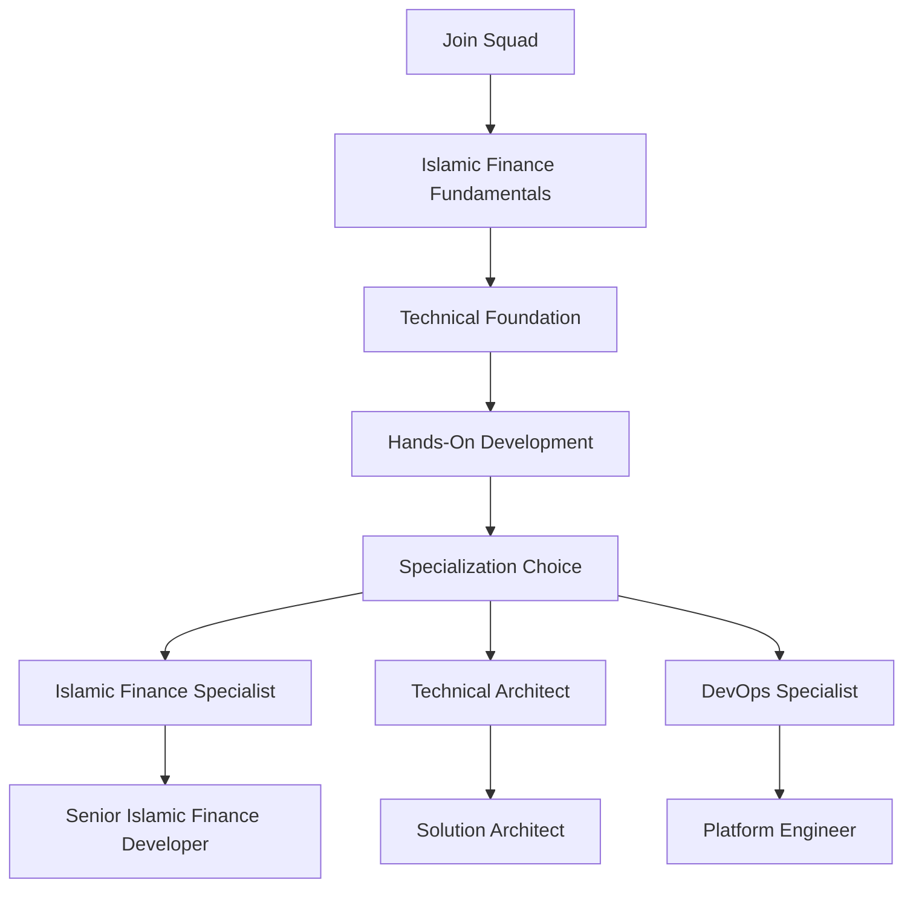

# 👥 MasruFi Framework - Development Squad Guide

[](https://masrufi.com)
[](https://masrufi.com/development)
[](https://masrufi.com/support)

**Document Information:**
- **Document Type**: Development Squad Guide
- **Version**: 1.0.0
- **Last Updated**: December 2024
- **Lead Developer**: Ali&Co Development Team
- **Classification**: Internal Development Guide
- **Audience**: Development Teams, Technical Leads, Software Engineers

## 🎯 Development Squad Overview

The **MasruFi Framework Development Squad** follows agile development principles with a focus on **Islamic Finance expertise**, **enterprise-grade quality**, and **continuous delivery**. This guide provides comprehensive onboarding, development practices, and team collaboration guidelines for delivering world-class Islamic Finance technology solutions.

### **Squad Mission**
*"Deliver innovative, Sharia-compliant Islamic Finance technology that empowers financial institutions to serve the global Muslim community with excellence and integrity."*

### **Squad Values**
1. **🕌 Sharia First**: All development decisions prioritize Islamic principles and compliance
2. **🔧 Technical Excellence**: Commitment to clean code, architecture excellence, and best practices
3. **🤝 Collaborative Innovation**: Cross-functional teamwork and knowledge sharing
4. **📈 Continuous Learning**: Staying current with Islamic Finance regulations and technology trends
5. **🎯 Customer Impact**: Focus on delivering measurable business value
6. **🔒 Security Mindset**: Security and compliance considerations in every development decision

## 🚀 Squad Onboarding Journey

### **Phase 1: Foundation Knowledge (Week 1)**

#### **Islamic Finance Fundamentals**
- **📚 Required Reading**: 
  - [Business Requirements Document](../business/business-requirements.md)
  - AAOIFI Islamic Finance Standards
  - UAE Central Bank Islamic Banking Guidelines
  - Higher Sharia Authority (HSA) Compliance Framework

- **🎯 Learning Objectives**:
  - Understand the 6 core Islamic Finance models
  - Recognize Riba, Gharar, and Haram concepts
  - Learn Sharia compliance validation requirements
  - Grasp multi-jurisdiction regulatory landscape

- **✅ Completion Criteria**:
  - Pass Islamic Finance knowledge assessment (80% minimum)
  - Complete Sharia compliance certification
  - Demonstrate understanding of UAE cryptocurrency integration

#### **Technical Foundation**
- **🏗️ Architecture Deep Dive**:
  - [Software Architecture Documentation](../architecture/software-architecture.md)
  - Hexagonal Architecture principles
  - Domain-Driven Design implementation
  - Event-driven architecture patterns

- **🔧 Technology Stack**:
  ```bash
  # Core Framework
  Java 21 LTS
  Spring Boot 3.3.0+
  Spring Security 6.2+
  Spring Data JPA 3.1+
  
  # Islamic Finance Libraries
  Drools Rules Engine 8.44+
  Web3j Blockchain Integration 4.9+
  Apache Kafka Event Streaming 3.5+
  
  # Database & Cache
  PostgreSQL 15+
  Redis 7.0+
  MongoDB 7.0+ (for document storage)
  
  # Testing Framework
  JUnit 5 Jupiter
  Testcontainers 1.19+
  WireMock 3.0+
  AssertJ 3.24+
  ```

### **Phase 2: Hands-On Development (Week 2-3)**

#### **Development Environment Setup**

```bash
# 1. Clone the repository
git clone https://github.com/COPUR/enterprise-loan-management-system.git
cd enterprise-loan-management-system/masrufi-framework

# 2. Set up development environment
./scripts/setup-dev-environment.sh

# 3. Start local development stack
docker-compose -f docker-compose.dev.yml up -d

# 4. Run integration tests
./gradlew integrationTest

# 5. Start the application
./gradlew bootRun --args='--spring.profiles.active=development'
```

#### **Code Quality Standards**

```gradle
// build.gradle - Quality Gates
apply plugin: 'checkstyle'
apply plugin: 'pmd'
apply plugin: 'spotbugs'
apply plugin: 'jacoco'

checkstyle {
    toolVersion = '10.12.4'
    configFile = file("${rootDir}/config/checkstyle/checkstyle.xml")
}

pmd {
    toolVersion = '6.55.0'
    ruleSetFiles = files("${rootDir}/config/pmd/pmd-rules.xml")
}

jacoco {
    toolVersion = '0.8.10'
}

jacocoTestReport {
    reports {
        xml.required = true
        html.required = true
    }
    afterEvaluate {
        classDirectories.setFrom(files(classDirectories.files.collect {
            fileTree(dir: it, exclude: [
                '**/config/**',
                '**/dto/**',
                '**/entity/**',
                '**/*Application.class'
            ])
        }))
    }
}

// Quality gate thresholds
test {
    finalizedBy jacocoTestReport
    doLast {
        def coverageReport = file("${buildDir}/reports/jacoco/test/jacocoTestReport.xml")
        if (coverageReport.exists()) {
            def coverage = new XmlSlurper().parse(coverageReport)
            def percentage = coverage.counter.find { it.@type == 'INSTRUCTION' }.@covered.toDouble() / 
                           coverage.counter.find { it.@type == 'INSTRUCTION' }.@missed.toDouble() * 100
            if (percentage < 90.0) {
                throw new GradleException("Code coverage is below 90%: ${percentage}%")
            }
        }
    }
}
```

### **Phase 3: Islamic Finance Specialization (Week 3-4)**

#### **Islamic Finance Development Patterns**

```java
// Example: Murabaha Service Implementation
@Service
@Transactional
@Validated
public class MurabahaFinancingService implements IslamicFinancingService<MurabahaContract> {
    
    private final ShariaComplianceValidator shariaValidator;
    private final AssetValidationService assetValidator;
    private final ProfitCalculationService profitCalculator;
    private final DomainEventPublisher eventPublisher;
    
    @Override
    public Result<MurabahaContract> createFinancing(@Valid CreateMurabahaCommand command) {
        return ShariaCompliantTransaction.execute(() -> {
            
            // 1. Validate Sharia compliance
            var complianceResult = shariaValidator.validateMurabaha(command);
            if (!complianceResult.isCompliant()) {
                throw new ShariaViolationException(complianceResult.getViolations());
            }
            
            // 2. Validate asset permissibility
            var assetValidation = assetValidator.validateHalalAsset(command.getAssetSpecification());
            if (!assetValidation.isPermissible()) {
                throw new HaramAssetException(assetValidation.getProhibitionReasons());
            }
            
            // 3. Calculate transparent profit
            var profitCalculation = profitCalculator.calculateMurabahaProfit(
                command.getAssetCost(),
                command.getProfitMargin(),
                command.getFinancingTerm()
            );
            
            // 4. Create Murabaha contract
            var contract = MurabahaContract.create(
                command.getCustomerProfile(),
                command.getAssetSpecification(),
                profitCalculation,
                command.getRepaymentSchedule()
            );
            
            // 5. Publish domain event
            eventPublisher.publish(new MurabahaContractCreatedEvent(contract));
            
            return contract;
        });
    }
}

// Sharia Compliance Validation
@Component
public class ShariaComplianceValidator {
    
    public ShariaComplianceResult validateMurabaha(CreateMurabahaCommand command) {
        var violations = new ArrayList<ShariaViolation>();
        
        // Check for Riba (interest)
        if (hasRibaElement(command)) {
            violations.add(ShariaViolation.RIBA_DETECTED);
        }
        
        // Check for Gharar (uncertainty)
        if (hasGhararElement(command)) {
            violations.add(ShariaViolation.GHARAR_DETECTED);
        }
        
        // Validate asset ownership
        if (!hasValidAssetOwnership(command)) {
            violations.add(ShariaViolation.INVALID_ASSET_OWNERSHIP);
        }
        
        return ShariaComplianceResult.of(violations);
    }
}
```

## 🛠️ Development Workflow & Practices

### **Git Workflow Strategy**

```bash
# Feature Branch Strategy
main              # Production-ready code
├── develop       # Integration branch
├── feature/*     # Feature development
├── release/*     # Release preparation
└── hotfix/*      # Emergency fixes

# Branch Naming Conventions
feature/islamic-finance/murabaha-profit-calculation
feature/uae-crypto/cbdc-wallet-integration
feature/compliance/sharia-validation-engine
bugfix/calculation/profit-margin-rounding
hotfix/security/oauth-token-validation
```

### **Commit Message Standards**

```bash
# Format: <type>(<scope>): <subject>

# Types:
feat:     # New feature
fix:      # Bug fix
docs:     # Documentation changes
style:    # Code style changes
refactor: # Code refactoring
test:     # Adding or updating tests
chore:    # Maintenance tasks

# Examples:
feat(murabaha): add transparent profit calculation engine
fix(compliance): resolve riba detection false positives
docs(api): update Islamic finance endpoint documentation
test(integration): add comprehensive salam contract tests
refactor(domain): improve islamic financing aggregate design
```

### **Code Review Checklist**

#### **Islamic Finance Compliance Review**
- [ ] **Sharia Compliance**: All Islamic principles properly implemented
- [ ] **Riba Elimination**: No interest-based calculations present
- [ ] **Gharar Mitigation**: Uncertainty elements properly addressed
- [ ] **Asset Validation**: Halal asset verification implemented
- [ ] **Real Economic Activity**: Transactions backed by tangible assets

#### **Technical Excellence Review**
- [ ] **Architecture**: Follows hexagonal architecture principles
- [ ] **SOLID Principles**: Code adheres to SOLID design principles
- [ ] **Clean Code**: Readable, maintainable, and well-documented
- [ ] **Test Coverage**: Minimum 90% code coverage achieved
- [ ] **Security**: Security best practices implemented

#### **Enterprise Integration Review**
- [ ] **API Design**: RESTful APIs follow OpenAPI 3.0 specification
- [ ] **Event Design**: Domain events properly structured and versioned
- [ ] **Error Handling**: Comprehensive error handling and logging
- [ ] **Performance**: Performance requirements met (< 2s response time)
- [ ] **Documentation**: API and integration documentation updated

### **Testing Strategy & Standards**

#### **Test Pyramid Implementation**

```java
// Unit Tests (70% of test coverage)
@ExtendWith(MockitoExtension.class)
class MurabahaFinancingServiceTest {
    
    @Mock private ShariaComplianceValidator shariaValidator;
    @Mock private AssetValidationService assetValidator;
    @Mock private ProfitCalculationService profitCalculator;
    
    @InjectMocks private MurabahaFinancingService service;
    
    @Test
    @DisplayName("Should create Murabaha contract when all validations pass")
    void shouldCreateMurabahaContractWhenValidationsPass() {
        // Given
        var command = validMurabahaCommand();
        given(shariaValidator.validateMurabaha(command))
            .willReturn(ShariaComplianceResult.compliant());
        given(assetValidator.validateHalalAsset(any()))
            .willReturn(AssetValidationResult.permissible());
        
        // When
        var result = service.createFinancing(command);
        
        // Then
        assertThat(result.isSuccess()).isTrue();
        assertThat(result.getValue().getContractType()).isEqualTo(MURABAHA);
        verify(shariaValidator).validateMurabaha(command);
    }
}

// Integration Tests (20% of test coverage)
@SpringBootTest
@Testcontainers
@Transactional
class MurabahaIntegrationTest {
    
    @Container
    static PostgreSQLContainer<?> postgres = new PostgreSQLContainer<>("postgres:15")
            .withDatabaseName("masrufi_test")
            .withUsername("test")
            .withPassword("test");
    
    @Container
    static KafkaContainer kafka = new KafkaContainer(DockerImageName.parse("confluentinc/cp-kafka:7.4.0"));
    
    @Autowired private MurabahaFinancingService service;
    @Autowired private TestRestTemplate restTemplate;
    
    @Test
    void shouldProcessMurabahaContractEndToEnd() {
        // Given
        var request = createMurabahaRequest();
        
        // When
        var response = restTemplate.postForEntity(
            "/api/v1/islamic-finance/murabaha", 
            request, 
            MurabahaResponse.class
        );
        
        // Then
        assertThat(response.getStatusCode()).isEqualTo(CREATED);
        assertThat(response.getBody().getContractId()).isNotNull();
    }
}

// End-to-End Tests (10% of test coverage)
@SpringBootTest(webEnvironment = RANDOM_PORT)
@TestMethodOrder(OrderAnnotation.class)
class IslamicFinanceE2ETest {
    
    @Test
    @Order(1)
    void shouldCompleteFullMurabahaLifecycle() {
        // Test complete Murabaha contract lifecycle
        // from creation to final payment
    }
}
```

#### **Sharia Compliance Testing**

```java
@Component
@TestProfile
public class ShariaComplianceTestSuite {
    
    @Test
    @DisplayName("Murabaha contracts must never contain Riba elements")
    void murabahaContractsShouldNeverContainRiba() {
        // Test various Murabaha scenarios for Riba compliance
        var scenarios = List.of(
            validMurabahaScenario(),
            highProfitMarginScenario(),
            earlySettlementScenario(),
            latePaymentScenario()
        );
        
        scenarios.forEach(scenario -> {
            var result = murabahaService.createFinancing(scenario);
            assertThat(result.getShariaCompliance().isRibaFree()).isTrue();
        });
    }
    
    @Test
    @DisplayName("All financed assets must be Halal")
    void allFinancedAssetsMustBeHalal() {
        var halalAssets = List.of("Real Estate", "Vehicles", "Equipment", "Commodities");
        var haramAssets = List.of("Alcohol", "Gambling", "Pork", "Adult Entertainment");
        
        halalAssets.forEach(asset -> {
            var validation = assetValidator.validateHalalAsset(asset);
            assertThat(validation.isPermissible()).isTrue();
        });
        
        haramAssets.forEach(asset -> {
            var validation = assetValidator.validateHalalAsset(asset);
            assertThat(validation.isPermissible()).isFalse();
        });
    }
}
```

## 📊 Performance & Monitoring

### **Performance Standards**

| **Metric** | **Requirement** | **Monitoring** |
|------------|-----------------|----------------|
| **API Response Time** | < 2 seconds (95th percentile) | Prometheus + Grafana |
| **Throughput** | 1000+ transactions/second | Load testing with JMeter |
| **Database Performance** | < 100ms query time | PostgreSQL monitoring |
| **Memory Usage** | < 2GB heap under load | JVM monitoring |

### **Monitoring Implementation**

```java
// Custom Metrics for Islamic Finance
@Component
public class IslamicFinanceMetrics {
    
    private final Counter murabahaContractsCreated;
    private final Timer shariaComplianceValidationTime;
    private final Gauge activeIslamicFinancingContracts;
    
    public IslamicFinanceMetrics(MeterRegistry meterRegistry) {
        this.murabahaContractsCreated = Counter.builder("islamic_finance.murabaha.contracts.created")
            .description("Number of Murabaha contracts created")
            .register(meterRegistry);
            
        this.shariaComplianceValidationTime = Timer.builder("islamic_finance.sharia.validation.time")
            .description("Time taken for Sharia compliance validation")
            .register(meterRegistry);
            
        this.activeIslamicFinancingContracts = Gauge.builder("islamic_finance.contracts.active")
            .description("Number of active Islamic financing contracts")
            .register(meterRegistry, this, IslamicFinanceMetrics::getActiveContractCount);
    }
    
    public void recordMurabahaCreation() {
        murabahaContractsCreated.increment();
    }
    
    public void recordShariaValidation(Duration duration) {
        shariaComplianceValidationTime.record(duration);
    }
}
```

## 🔧 Development Tools & IDE Setup

### **IntelliJ IDEA Configuration**

```xml
<!-- .idea/codeStyles/Project.xml -->
<component name="ProjectCodeStyleConfiguration">
  <code_scheme name="MasruFi Framework" version="173">
    <option name="RIGHT_MARGIN" value="120" />
    <option name="WRAP_WHEN_TYPING_REACHES_RIGHT_MARGIN" value="true" />
    <JavaCodeStyleSettings>
      <option name="IMPORT_LAYOUT_TABLE">
        <value>
          <package name="java" withSubpackages="true" static="false" />
          <package name="javax" withSubpackages="true" static="false" />
          <emptyLine />
          <package name="org" withSubpackages="true" static="false" />
          <package name="com" withSubpackages="true" static="false" />
          <emptyLine />
          <package name="com.masrufi.framework" withSubpackages="true" static="false" />
          <emptyLine />
          <package name="" withSubpackages="true" static="true" />
        </value>
      </option>
    </JavaCodeStyleSettings>
  </code_scheme>
</component>
```

### **Essential IDE Plugins**

```text
# Code Quality
- SonarLint
- CheckStyle-IDEA
- PMDPlugin
- SpotBugs

# Development Productivity
- Spring Boot Assistant
- Lombok Plugin
- MapStruct Support
- JPA Buddy

# Islamic Finance Specific
- Arabic Language Support
- Islamic Calendar Plugin (custom)
- Sharia Compliance Checker (custom)

# Testing & Debugging
- JUnit 5 Support
- Testcontainers Plugin
- REST Client
- Database Navigator
```

### **Development Databases**

```yaml
# docker-compose.dev.yml
version: '3.8'
services:
  postgres-dev:
    image: postgres:15
    environment:
      POSTGRES_DB: masrufi_dev
      POSTGRES_USER: masrufi_dev
      POSTGRES_PASSWORD: dev_password
    ports:
      - "5432:5432"
    volumes:
      - postgres_dev_data:/var/lib/postgresql/data
      - ./scripts/init-dev-db.sql:/docker-entrypoint-initdb.d/init.sql

  redis-dev:
    image: redis:7.0
    ports:
      - "6379:6379"
    command: redis-server --appendonly yes
    volumes:
      - redis_dev_data:/data

  kafka-dev:
    image: confluentinc/cp-kafka:7.4.0
    ports:
      - "9092:9092"
    environment:
      KAFKA_ZOOKEEPER_CONNECT: zookeeper:2181
      KAFKA_ADVERTISED_LISTENERS: PLAINTEXT://localhost:9092
      KAFKA_OFFSETS_TOPIC_REPLICATION_FACTOR: 1

volumes:
  postgres_dev_data:
  redis_dev_data:
```

## 🤝 Team Collaboration & Communication

### **Daily Standup Structure**

```markdown
## Daily Standup Template

### Yesterday's Accomplishments
- [ ] Islamic Finance feature developed
- [ ] Code reviews completed
- [ ] Tests written and passing
- [ ] Documentation updated

### Today's Focus
- [ ] Priority Islamic Finance tasks
- [ ] Sharia compliance validations
- [ ] Integration work with enterprise systems
- [ ] Technical debt reduction

### Blockers & Support Needed
- [ ] Waiting for HSA approval on specific implementation
- [ ] Need clarification on regulatory requirements
- [ ] Technical impediments requiring assistance
- [ ] Knowledge gaps requiring training
```

### **Sprint Planning Guidelines**

#### **Story Point Estimation**

| **Points** | **Complexity** | **Islamic Finance Examples** |
|------------|----------------|------------------------------|
| **1** | Simple configuration | Update profit margin calculation |
| **2** | Minor feature | Add new asset type validation |
| **3** | Standard feature | Implement Salam contract creation |
| **5** | Complex feature | UAE cryptocurrency integration |
| **8** | Major feature | Complete Musharakah implementation |
| **13** | Epic feature | Multi-jurisdiction compliance framework |

#### **Definition of Done**

- [ ] **Functional Requirements**: All acceptance criteria met
- [ ] **Sharia Compliance**: Islamic principles validation passed
- [ ] **Code Quality**: 90%+ test coverage, code review approved
- [ ] **Security**: Security scan passed, no vulnerabilities
- [ ] **Documentation**: API docs and technical docs updated
- [ ] **Integration**: Enterprise system integration tested
- [ ] **Performance**: Performance requirements met
- [ ] **Deployment**: Deployable to staging environment

### **Knowledge Sharing Sessions**

#### **Weekly Technical Sessions**
- **Monday**: Islamic Finance Knowledge Share
- **Wednesday**: Architecture & Design Patterns
- **Friday**: Technology Trends & Innovation

#### **Monthly Deep Dives**
- Sharia Compliance Deep Dive with Islamic Finance experts
- UAE Cryptocurrency and Blockchain Technology
- Enterprise Integration Patterns and Best Practices
- Performance Optimization and Scalability Techniques

## 📚 Learning & Development Path

### **Continuous Learning Framework**

#### **Level 1: Islamic Finance Foundation**
- ✅ Islamic Finance Principles Certification
- ✅ Sharia Compliance Fundamentals
- ✅ UAE Banking Regulatory Framework
- ✅ AAOIFI Standards Understanding

#### **Level 2: Technical Mastery**
- ✅ Hexagonal Architecture Implementation
- ✅ Domain-Driven Design Advanced Patterns
- ✅ Event-Driven Architecture Mastery
- ✅ Spring Boot Advanced Features

#### **Level 3: Specialization Tracks**

##### **Islamic Finance Specialist Track**
- Advanced Sharia Compliance Automation
- Multi-Jurisdiction Islamic Banking Regulations
- Islamic Finance Product Innovation
- Cryptocurrency and Islamic Finance Integration

##### **Technical Architecture Track**
- Enterprise Integration Patterns
- Microservices Architecture Design
- Performance Optimization Techniques
- Security Architecture for Financial Services

##### **DevOps & Platform Track**
- CI/CD Pipeline Optimization
- Cloud-Native Development
- Monitoring and Observability
- Infrastructure as Code

### **Certification Roadmap**



## 🎯 Career Development & Growth

### **Technical Career Ladder**

#### **Junior Islamic Finance Developer (Level 1)**
- Implements basic Islamic Finance features under guidance
- Understands fundamental Sharia compliance principles
- Writes unit tests and maintains code quality standards
- Participates in code reviews and team ceremonies

#### **Islamic Finance Developer (Level 2)**
- Independently develops Islamic Finance features
- Contributes to Sharia compliance validation logic
- Mentors junior developers
- Participates in technical decision making

#### **Senior Islamic Finance Developer (Level 3)**
- Leads complex Islamic Finance feature development
- Designs Sharia compliance frameworks
- Mentors development team members
- Contributes to architecture decisions

#### **Islamic Finance Technical Lead (Level 4)**
- Drives technical strategy for Islamic Finance platform
- Collaborates with Sharia scholars and compliance teams
- Leads cross-functional technical initiatives
- Represents team in architectural discussions

#### **Principal Islamic Finance Engineer (Level 5)**
- Defines enterprise Islamic Finance technology strategy
- Influences industry standards and practices
- Leads innovation in Islamic FinTech
- Mentors and develops technical leaders

### **Growth Opportunities**

#### **Internal Advancement**
- Technical leadership roles within Islamic Finance domain
- Architecture committee participation
- Cross-team collaboration on enterprise initiatives
- Innovation project leadership

#### **External Engagement**
- Islamic Finance technology conference speaking
- Open source contributions to Islamic Finance frameworks
- Industry standards committee participation
- Academic research collaboration

#### **Entrepreneurial Path**
- Internal innovation projects
- Islamic FinTech startup incubation
- Technology consulting opportunities
- Product management transitions

## 🏆 Squad Success Metrics

### **Individual Performance Indicators**

#### **Technical Excellence**
- Code quality scores (SonarQube metrics)
- Test coverage percentage (target: 90%+)
- Code review feedback quality
- Bug detection and resolution time

#### **Islamic Finance Expertise**
- Sharia compliance validation accuracy
- Islamic Finance feature delivery quality
- Regulatory requirement implementation success
- Customer impact measurement

#### **Collaboration & Growth**
- Peer feedback scores
- Mentoring effectiveness
- Knowledge sharing contributions
- Cross-team collaboration success

### **Team Performance Metrics**

#### **Delivery Excellence**
- Sprint goal achievement rate (target: 95%+)
- Feature delivery velocity and predictability
- Production incident rate (target: < 0.1%)
- Customer satisfaction scores (target: 4.5/5)

#### **Quality Standards**
- Automated test execution success rate
- Code review cycle time
- Technical debt reduction percentage
- Security vulnerability resolution time

#### **Islamic Finance Impact**
- Sharia compliance rate (target: 99.9%+)
- Islamic Finance transaction volume growth
- Regulatory audit success rate
- Customer onboarding acceleration

## 📞 Support & Escalation

### **Technical Support Channels**

#### **Internal Support**
- **Slack**: #masrufi-framework-dev
- **Email**: dev-support@masrufi.com
- **Office Hours**: Daily 2-4 PM UAE Time
- **On-Call Rotation**: 24/7 production support

#### **Islamic Finance Expertise**
- **Sharia Scholars**: compliance@masrufi.com
- **Regulatory Experts**: regulatory@masrufi.com
- **UAE Operations**: uae-ops@masrufi.com
- **HSA Liaison**: hsa-support@masrufi.com

#### **External Resources**
- **AAOIFI Support**: standards@aaoifi.org
- **UAE Central Bank**: islamic-banking@centralbank.ae
- **Higher Sharia Authority**: info@hsa.gov.ae
- **Technology Vendors**: As per vendor agreements

### **Escalation Matrix**

| **Issue Type** | **Level 1** | **Level 2** | **Level 3** |
|----------------|-------------|-------------|-------------|
| **Technical Issues** | Senior Developer | Technical Lead | Principal Engineer |
| **Sharia Compliance** | Compliance Developer | Islamic Finance Lead | Sharia Scholar |
| **Regulatory Questions** | Product Manager | Compliance Officer | Legal Team |
| **Production Incidents** | On-Call Engineer | DevOps Lead | Engineering Manager |

---

## 🎉 Welcome to the Squad!

Congratulations on joining the **MasruFi Framework Development Squad**! You're now part of an elite team building the future of Islamic Finance technology. Your contributions will directly impact millions of Muslim customers worldwide and help shape the evolution of Sharia-compliant financial services.

### **Your First 30 Days**
- [ ] Complete Islamic Finance certification
- [ ] Set up development environment
- [ ] Implement your first Murabaha feature
- [ ] Participate in code reviews
- [ ] Attend all team ceremonies
- [ ] Complete onboarding checklist

### **Remember:**
*"Every line of code we write serves the greater purpose of enabling ethical, Sharia-compliant financial services that align with Islamic values and principles."*

**Welcome aboard! 🚀**

---

**Document Control:**
- **Prepared By**: MasruFi Framework Development Team
- **Reviewed By**: Technical Leadership and Islamic Finance Experts
- **Approved By**: Engineering Manager and Compliance Team
- **Next Review**: Quarterly team retrospective and guide updates

*🕌 Building exceptional Islamic Finance technology with passion, precision, and purpose.*