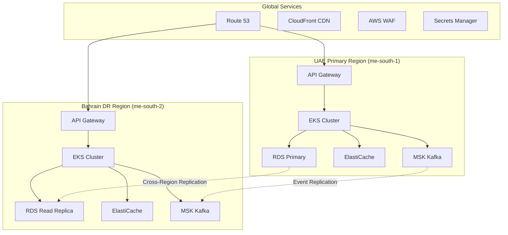

# 🛡️ MasruFi Framework - DevSecOps Team Guide

[](https://masrufi.com)
[](https://masrufi.com/security)
[](https://masrufi.com/operations)

**Document Information:**
- **Document Type**: DevSecOps Team Support Guide
- **Version**: 1.0.0
- **Last Updated**: December 2024
- **DevSecOps Lead**: Ali&Co Security & Operations Team
- **Classification**: Internal Operations Guide
- **Audience**: DevSecOps Engineers, Platform Engineers, Security Teams, Operations Teams

## 🎯 DevSecOps Mission & Vision

### **Mission Statement**
*"Secure, automate, and optimize the entire MasruFi Framework lifecycle while ensuring 100% Sharia compliance, enterprise-grade security, and operational excellence for Islamic Finance operations."*

### **Vision**
*"Be the trusted foundation that enables rapid, secure, and compliant delivery of innovative Islamic Finance technology solutions to serve the global Muslim community."*

### **DevSecOps Principles**
1. **🔒 Security-First**: Security embedded in every stage of the software delivery lifecycle
2. **🕌 Compliance-Native**: Sharia compliance and regulatory requirements automated and validated
3. **⚡ Shift-Left Everything**: Early detection and prevention of issues across all domains
4. **🔄 Continuous Everything**: Continuous integration, delivery, security, and compliance
5. **📊 Observable Excellence**: Full visibility and monitoring across all systems and processes
6. **🤖 Automation-Driven**: Manual processes eliminated through intelligent automation
7. **🌍 Multi-Jurisdiction Ready**: Global compliance and operations capabilities

## 🏗️ Platform Architecture & Infrastructure

### **Cloud-Native Infrastructure Stack**

```yaml
# Platform Technology Stack
Infrastructure:
  Cloud Provider: AWS (Primary), Azure (Secondary)
  Container Platform: Amazon EKS (Kubernetes 1.28+)
  Service Mesh: Istio 1.19+ with mTLS
  Container Runtime: containerd with gVisor security
  
Networking:
  Load Balancer: AWS Application Load Balancer
  API Gateway: Kong Enterprise with Islamic Finance plugins
  CDN: Amazon CloudFront with WAF protection
  DNS: Route 53 with health checks
  
Security:
  Identity Provider: AWS Cognito + Enterprise LDAP
  Secret Management: AWS Secrets Manager + HashiCorp Vault
  Certificate Management: AWS Certificate Manager
  WAF: AWS WAF with Islamic Finance rules
  
Monitoring:
  Metrics: Prometheus + Grafana
  Logging: ELK Stack (Elasticsearch, Logstash, Kibana)
  Tracing: Jaeger with OpenTelemetry
  APM: Datadog APM for Islamic Finance metrics
  
Data:
  Primary Database: Amazon RDS PostgreSQL 15 (Multi-AZ)
  Cache: Amazon ElastiCache Redis 7.0
  Event Streaming: Amazon MSK (Kafka) with SASL/SCRAM
  Document Store: Amazon DocumentDB (MongoDB compatible)
```

### **Multi-Region Architecture**



## 🚀 CI/CD Pipeline Architecture

### **Pipeline Overview**

```yaml
# .github/workflows/masrufi-framework-cicd.yml
name: MasruFi Framework - Secure CI/CD Pipeline

on:
  push:
    branches: [ main, develop, 'release/*' ]
    paths: [ 'masrufi-framework/**' ]
  pull_request:
    branches: [ main, develop ]
    paths: [ 'masrufi-framework/**' ]

env:
  REGISTRY: ghcr.io
  IMAGE_NAME: masrufi/framework
  JAVA_VERSION: '21'
  SONAR_PROJECT_KEY: 'masrufi-framework'

jobs:
  # Stage 1: Security & Compliance Validation
  security-scan:
    name: 🔒 Security & Compliance Scan
    runs-on: ubuntu-latest
    steps:
      - name: Checkout Code
        uses: actions/checkout@v4
        with:
          fetch-depth: 0
          
      - name: Setup Java
        uses: actions/setup-java@v4
        with:
          java-version: ${{ env.JAVA_VERSION }}
          distribution: 'temurin'
          
      # Secret Scanning
      - name: Secret Scan with GitLeaks
        uses: gitleaks/gitleaks-action@v2
        env:
          GITHUB_TOKEN: ${{ secrets.GITHUB_TOKEN }}
          
      # Dependency Vulnerability Scanning
      - name: OWASP Dependency Check
        run: |
          ./gradlew dependencyCheckAnalyze
          
      # SAST - Static Application Security Testing
      - name: SonarQube Security Analysis
        env:
          GITHUB_TOKEN: ${{ secrets.GITHUB_TOKEN }}
          SONAR_TOKEN: ${{ secrets.SONAR_TOKEN }}
        run: |
          ./gradlew sonarqube \
            -Dsonar.projectKey=${{ env.SONAR_PROJECT_KEY }} \
            -Dsonar.security.hotspots.enabled=true \
            -Dsonar.security.vulnerabilities.enabled=true
            
      # Sharia Compliance Validation
      - name: Islamic Finance Compliance Check
        run: |
          ./gradlew shariaComplianceValidation
          
      # License Compliance
      - name: License Compliance Check
        run: |
          ./gradlew checkLicense

  # Stage 2: Build & Test
  build-and-test:
    name: 🏗️ Build & Test
    runs-on: ubuntu-latest
    needs: security-scan
    steps:
      - name: Checkout Code
        uses: actions/checkout@v4
        
      - name: Setup Java
        uses: actions/setup-java@v4
        with:
          java-version: ${{ env.JAVA_VERSION }}
          distribution: 'temurin'
          
      - name: Cache Gradle Dependencies
        uses: actions/cache@v3
        with:
          path: |
            ~/.gradle/caches
            ~/.gradle/wrapper
          key: ${{ runner.os }}-gradle-${{ hashFiles('**/*.gradle*') }}
          
      # Compile & Package
      - name: Compile Application
        run: ./gradlew compileJava compileTestJava
        
      # Unit Tests
      - name: Unit Tests
        run: ./gradlew test
        
      # Integration Tests with Testcontainers
      - name: Integration Tests
        run: ./gradlew integrationTest
        
      # Test Coverage
      - name: Generate Test Coverage Report
        run: ./gradlew jacocoTestReport
        
      # Code Quality Gates
      - name: Quality Gate Check
        run: |
          ./gradlew checkstyleMain pmdMain spotbugsMain
          # Fail if coverage below 90%
          ./gradlew jacocoTestCoverageVerification
          
      # Build Application JAR
      - name: Build Application JAR
        run: ./gradlew bootJar
        
      # Upload Artifacts
      - name: Upload Build Artifacts
        uses: actions/upload-artifact@v4
        with:
          name: masrufi-framework-jar
          path: build/libs/*.jar

  # Stage 3: Container Security & Build
  container-security:
    name: 🐳 Container Security & Build
    runs-on: ubuntu-latest
    needs: build-and-test
    steps:
      - name: Checkout Code
        uses: actions/checkout@v4
        
      - name: Download Build Artifacts
        uses: actions/download-artifact@v4
        with:
          name: masrufi-framework-jar
          path: build/libs/
          
      # Dockerfile Security Scan
      - name: Dockerfile Security Scan
        uses: hadolint/hadolint-action@v3.1.0
        with:
          dockerfile: masrufi-framework/Dockerfile
          
      # Build Container Image
      - name: Build Container Image
        run: |
          docker build -t ${{ env.IMAGE_NAME }}:${{ github.sha }} \
            --file masrufi-framework/Dockerfile \
            --build-arg JAR_FILE=build/libs/*.jar \
            .
            
      # Container Image Vulnerability Scan
      - name: Container Image Security Scan
        uses: aquasecurity/trivy-action@master
        with:
          image-ref: ${{ env.IMAGE_NAME }}:${{ github.sha }}
          format: 'sarif'
          output: 'trivy-results.sarif'
          
      # Container Image Compliance
      - name: Container Islamic Finance Compliance
        run: |
          # Check for halal base images and configurations
          docker run --rm -v $(pwd):/workspace \
            islamic-compliance-scanner:latest \
            /workspace/masrufi-framework/Dockerfile
            
      # Push to Container Registry
      - name: Push to GitHub Container Registry
        if: github.event_name != 'pull_request'
        run: |
          echo ${{ secrets.GITHUB_TOKEN }} | docker login ghcr.io -u ${{ github.actor }} --password-stdin
          docker tag ${{ env.IMAGE_NAME }}:${{ github.sha }} ghcr.io/${{ env.IMAGE_NAME }}:${{ github.sha }}
          docker tag ${{ env.IMAGE_NAME }}:${{ github.sha }} ghcr.io/${{ env.IMAGE_NAME }}:latest
          docker push ghcr.io/${{ env.IMAGE_NAME }}:${{ github.sha }}
          docker push ghcr.io/${{ env.IMAGE_NAME }}:latest

  # Stage 4: Infrastructure Security & Validation
  infrastructure-security:
    name: 🏗️ Infrastructure Security
    runs-on: ubuntu-latest
    needs: container-security
    steps:
      - name: Checkout Code
        uses: actions/checkout@v4
        
      # Terraform Security Scan
      - name: Terraform Security Scan
        uses: aquasecurity/tfsec-action@v1.0.3
        with:
          working_directory: infrastructure/terraform
          
      # Kubernetes Manifest Security
      - name: Kubernetes Security Scan
        uses: azure/k8s-lint@v1
        with:
          manifests: |
            k8s/manifests/*.yaml
            
      # Islamic Finance Infrastructure Compliance
      - name: Infrastructure Compliance Check
        run: |
          # Validate infrastructure meets Islamic finance requirements
          ./scripts/validate-islamic-infrastructure.sh
          
      # Network Security Validation
      - name: Network Security Validation
        run: |
          # Validate network policies and security groups
          ./scripts/validate-network-security.sh

  # Stage 5: Deployment
  deploy:
    name: 🚀 Deploy to Staging
    runs-on: ubuntu-latest
    needs: [security-scan, build-and-test, container-security, infrastructure-security]
    if: github.ref == 'refs/heads/develop'
    environment: staging
    steps:
      - name: Checkout Code
        uses: actions/checkout@v4
        
      # Deploy to Staging EKS
      - name: Deploy to Staging
        run: |
          aws eks update-kubeconfig --region me-south-1 --name masrufi-staging
          helm upgrade --install masrufi-framework \
            ./k8s/helm-charts/masrufi-framework \
            --namespace masrufi-staging \
            --set image.tag=${{ github.sha }} \
            --set environment=staging \
            --wait --timeout=600s
            
      # Health Check
      - name: Health Check
        run: |
          # Wait for deployment to be ready
          kubectl wait --for=condition=ready pod \
            -l app=masrufi-framework \
            -n masrufi-staging \
            --timeout=300s
            
          # Validate health endpoints
          ./scripts/health-check.sh staging
          
      # Islamic Finance Smoke Tests
      - name: Islamic Finance Smoke Tests
        run: |
          ./scripts/run-islamic-finance-smoke-tests.sh staging

  # Stage 6: Production Deployment (Manual Approval)
  deploy-production:
    name: 🏭 Deploy to Production
    runs-on: ubuntu-latest
    needs: deploy
    if: github.ref == 'refs/heads/main'
    environment: production
    steps:
      - name: Production Deployment
        run: |
          # Blue-Green deployment to production
          ./scripts/blue-green-deployment.sh production ${{ github.sha }}
```

## 🔒 Security Framework & Implementation

### **Zero Trust Security Architecture**

```yaml
# Security Configuration
authentication:
  providers:
    - name: enterprise-ldap
      type: ldap
      config:
        url: ldaps://ldap.company.com:636
        base_dn: "dc=company,dc=com"
        user_dn: "ou=users,dc=company,dc=com"
        
    - name: uae-national-id
      type: oauth2
      config:
        authorization_uri: https://id.uae.gov.ae/oauth2/authorize
        token_uri: https://id.uae.gov.ae/oauth2/token
        client_id: ${UAE_CLIENT_ID}
        client_secret: ${UAE_CLIENT_SECRET}

authorization:
  rbac:
    roles:
      - name: islamic-finance-admin
        permissions:
          - "islamic-finance:*:*"
          - "sharia-compliance:*:*"
          - "uae-crypto:*:*"
          
      - name: islamic-finance-operator
        permissions:
          - "islamic-finance:murabaha:create"
          - "islamic-finance:ijarah:create"
          - "sharia-compliance:validate:read"
          
      - name: sharia-scholar
        permissions:
          - "sharia-compliance:*:*"
          - "islamic-finance:*:validate"
          - "audit:compliance:read"

security_policies:
  data_classification:
    - level: public
      encryption: none
      retention: 7_years
      
    - level: internal
      encryption: aes256
      retention: 10_years
      
    - level: confidential
      encryption: aes256_gcm
      retention: 15_years
      hsm_required: true
      
    - level: restricted
      encryption: fips_140_2_level_3
      retention: 25_years
      hsm_required: true
      geographic_restriction: uae_only
```

### **Security Scanning & Validation**

```bash
#!/bin/bash
# scripts/security-scan.sh

set -euo pipefail

echo "🔒 Starting Comprehensive Security Scan for MasruFi Framework"

# 1. Secret Scanning
echo "📋 Scanning for secrets and credentials..."
gitleaks detect --source . --verbose --report-format json --report-path security-reports/secrets.json

# 2. Dependency Vulnerability Scanning
echo "🔍 Scanning dependencies for vulnerabilities..."
./gradlew dependencyCheckAnalyze
if [ $? -ne 0 ]; then
    echo "❌ Critical vulnerabilities found in dependencies"
    exit 1
fi

# 3. SAST - Static Application Security Testing
echo "🔎 Running static application security testing..."
./gradlew sonarqube \
    -Dsonar.security.hotspots.enabled=true \
    -Dsonar.security.vulnerabilities.enabled=true

# 4. Container Image Scanning
echo "🐳 Scanning container images..."
trivy image --exit-code 1 --severity HIGH,CRITICAL masrufi/framework:latest

# 5. Infrastructure as Code Security
echo "🏗️ Scanning infrastructure as code..."
tfsec infrastructure/terraform/ --format json > security-reports/infrastructure.json

# 6. Kubernetes Security Scanning
echo "⚓ Scanning Kubernetes manifests..."
kubesec scan k8s/manifests/*.yaml > security-reports/kubernetes.json

# 7. Islamic Finance Compliance Scan
echo "🕌 Validating Islamic Finance compliance..."
./scripts/sharia-compliance-scan.sh

# 8. Network Security Validation
echo "🌐 Validating network security policies..."
./scripts/network-security-validation.sh

# 9. Cryptographic Implementation Review
echo "🔐 Reviewing cryptographic implementations..."
./scripts/crypto-validation.sh

echo "✅ Security scan completed successfully"
```

### **Sharia Compliance Automation**

```python
#!/usr/bin/env python3
# scripts/sharia-compliance-scan.py

import json
import re
from typing import Dict, List, Tuple
from dataclasses import dataclass

@dataclass
class ShariaViolation:
    severity: str
    rule: str
    description: str
    file_path: str
    line_number: int
    suggestion: str

class ShariaComplianceScanner:
    """Automated Sharia compliance scanner for Islamic Finance code"""
    
    def __init__(self):
        self.violations = []
        self.load_sharia_rules()
    
    def load_sharia_rules(self):
        """Load Sharia compliance rules from configuration"""
        self.riba_patterns = [
            r'interest\s*[*+]\s*principal',
            r'compound\s*interest',
            r'penalty\s*interest',
            r'late\s*payment\s*fee\s*[*+]\s*rate'
        ]
        
        self.gharar_patterns = [
            r'uncertain\s*delivery',
            r'undefined\s*quantity',
            r'speculative\s*trading',
            r'gambling\s*element'
        ]
        
        self.haram_assets = [
            'alcohol', 'gambling', 'pork', 'adult_entertainment',
            'weapons', 'tobacco', 'conventional_insurance'
        ]
    
    def scan_file(self, file_path: str) -> List[ShariaViolation]:
        """Scan a single file for Sharia compliance violations"""
        violations = []
        
        with open(file_path, 'r', encoding='utf-8') as file:
            content = file.read()
            lines = content.split('\n')
            
            for line_num, line in enumerate(lines, 1):
                # Check for Riba violations
                for pattern in self.riba_patterns:
                    if re.search(pattern, line, re.IGNORECASE):
                        violations.append(ShariaViolation(
                            severity='CRITICAL',
                            rule='RIBA_PROHIBITION',
                            description=f'Potential Riba (interest) detected: {pattern}',
                            file_path=file_path,
                            line_number=line_num,
                            suggestion='Replace interest-based calculation with Islamic finance alternative'
                        ))
                
                # Check for Gharar violations
                for pattern in self.gharar_patterns:
                    if re.search(pattern, line, re.IGNORECASE):
                        violations.append(ShariaViolation(
                            severity='HIGH',
                            rule='GHARAR_PROHIBITION',
                            description=f'Potential Gharar (uncertainty) detected: {pattern}',
                            file_path=file_path,
                            line_number=line_num,
                            suggestion='Add clear specifications to eliminate uncertainty'
                        ))
                
                # Check for Haram assets
                for asset in self.haram_assets:
                    if re.search(rf'\b{asset}\b', line, re.IGNORECASE):
                        violations.append(ShariaViolation(
                            severity='CRITICAL',
                            rule='HALAL_ASSET_REQUIREMENT',
                            description=f'Haram asset detected: {asset}',
                            file_path=file_path,
                            line_number=line_num,
                            suggestion='Replace with Halal asset alternative'
                        ))
        
        return violations
    
    def generate_report(self, violations: List[ShariaViolation]) -> Dict:
        """Generate comprehensive Sharia compliance report"""
        return {
            'scan_timestamp': datetime.now().isoformat(),
            'total_violations': len(violations),
            'critical_violations': len([v for v in violations if v.severity == 'CRITICAL']),
            'high_violations': len([v for v in violations if v.severity == 'HIGH']),
            'violations': [
                {
                    'severity': v.severity,
                    'rule': v.rule,
                    'description': v.description,
                    'file_path': v.file_path,
                    'line_number': v.line_number,
                    'suggestion': v.suggestion
                }
                for v in violations
            ],
            'compliance_score': max(0, 100 - (len(violations) * 10)),
            'hsa_approval_required': any(v.severity == 'CRITICAL' for v in violations)
        }

if __name__ == '__main__':
    scanner = ShariaComplianceScanner()
    # Scan implementation would continue here...
```

## 📊 Monitoring & Observability

### **Comprehensive Monitoring Stack**

```yaml
# monitoring/prometheus.yml
global:
  scrape_interval: 15s
  evaluation_interval: 15s

rule_files:
  - "rules/islamic-finance.yml"
  - "rules/security.yml"
  - "rules/performance.yml"

scrape_configs:
  # MasruFi Framework Application Metrics
  - job_name: 'masrufi-framework'
    static_configs:
      - targets: ['masrufi-framework:8080']
    metrics_path: '/actuator/prometheus'
    scrape_interval: 10s
    
  # Islamic Finance Business Metrics
  - job_name: 'islamic-finance-metrics'
    static_configs:
      - targets: ['masrufi-framework:8080']
    metrics_path: '/actuator/prometheus'
    params:
      module: ['islamic-finance']
    
  # Sharia Compliance Metrics
  - job_name: 'sharia-compliance'
    static_configs:
      - targets: ['masrufi-framework:8080']
    metrics_path: '/actuator/prometheus'
    params:
      module: ['sharia-compliance']
      
  # UAE Cryptocurrency Metrics
  - job_name: 'uae-cryptocurrency'
    static_configs:
      - targets: ['masrufi-framework:8080']
    metrics_path: '/actuator/prometheus'
    params:
      module: ['uae-crypto']

# Alerting Rules for Islamic Finance
alerting:
  alertmanagers:
    - static_configs:
        - targets:
          - alertmanager:9093
```

### **Islamic Finance Specific Metrics**

```java
// IslamicFinanceMetricsConfiguration.java
@Configuration
@EnableConfigurationProperties(IslamicFinanceMetricsProperties.class)
public class IslamicFinanceMetricsConfiguration {
    
    @Bean
    public MeterRegistryCustomizer<MeterRegistry> islamicFinanceMetrics() {
        return registry -> {
            // Murabaha Contract Metrics
            Gauge.builder("islamic_finance.murabaha.contracts.active")
                .description("Number of active Murabaha contracts")
                .register(registry);
                
            Counter.builder("islamic_finance.murabaha.contracts.created")
                .description("Total Murabaha contracts created")
                .register(registry);
                
            Timer.builder("islamic_finance.murabaha.creation.duration")
                .description("Time taken to create Murabaha contract")
                .register(registry);
            
            // Sharia Compliance Metrics
            Gauge.builder("sharia_compliance.validation.success_rate")
                .description("Sharia compliance validation success rate")
                .register(registry);
                
            Counter.builder("sharia_compliance.violations.detected")
                .description("Number of Sharia violations detected")
                .tag("violation_type", "riba")
                .register(registry);
                
            Counter.builder("sharia_compliance.violations.detected")
                .description("Number of Sharia violations detected")
                .tag("violation_type", "gharar")
                .register(registry);
            
            // UAE Cryptocurrency Metrics
            Counter.builder("uae_crypto.transactions.processed")
                .description("UAE cryptocurrency transactions processed")
                .register(registry);
                
            Gauge.builder("uae_crypto.wallets.active")
                .description("Number of active UAE crypto wallets")
                .register(registry);
                
            // Performance Metrics
            Timer.builder("islamic_finance.api.response_time")
                .description("Islamic Finance API response time")
                .register(registry);
                
            Gauge.builder("islamic_finance.compliance.score")
                .description("Overall Islamic Finance compliance score")
                .register(registry);
        };
    }
}
```

### **Alerting Rules**

```yaml
# monitoring/rules/islamic-finance.yml
groups:
  - name: islamic-finance-alerts
    rules:
      # Sharia Compliance Alerts
      - alert: ShariaComplianceViolation
        expr: sharia_compliance_violations_detected > 0
        for: 0m
        labels:
          severity: critical
          service: masrufi-framework
          team: islamic-finance
        annotations:
          summary: "Sharia compliance violation detected"
          description: "{{ $value }} Sharia compliance violations detected in the last 5 minutes"
          runbook_url: "https://docs.masrufi.com/runbooks/sharia-compliance"
          
      - alert: LowShariaComplianceScore
        expr: sharia_compliance_score < 95
        for: 5m
        labels:
          severity: warning
          service: masrufi-framework
          team: islamic-finance
        annotations:
          summary: "Sharia compliance score is below threshold"
          description: "Sharia compliance score is {{ $value }}%, below the required 95%"
          
      # Islamic Finance Business Alerts
      - alert: HighMurabahaCreationLatency
        expr: histogram_quantile(0.95, islamic_finance_murabaha_creation_duration_seconds) > 2
        for: 5m
        labels:
          severity: warning
          service: masrufi-framework
          team: islamic-finance
        annotations:
          summary: "High Murabaha contract creation latency"
          description: "95th percentile Murabaha creation time is {{ $value }}s"
          
      - alert: FailedUAECryptoTransactions
        expr: rate(uae_crypto_transactions_failed_total[5m]) > 0.1
        for: 2m
        labels:
          severity: critical
          service: masrufi-framework
          team: cryptocurrency
        annotations:
          summary: "High UAE cryptocurrency transaction failure rate"
          description: "{{ $value }} UAE crypto transactions are failing per second"
          
      # Security Alerts
      - alert: SecurityScanFailure
        expr: security_scan_status == 0
        for: 0m
        labels:
          severity: critical
          service: masrufi-framework
          team: security
        annotations:
          summary: "Security scan failed"
          description: "Security scanning has failed for MasruFi Framework"
          
      - alert: HighSecurityVulnerabilities
        expr: security_vulnerabilities_high + security_vulnerabilities_critical > 0
        for: 0m
        labels:
          severity: critical
          service: masrufi-framework
          team: security
        annotations:
          summary: "High or critical security vulnerabilities detected"
          description: "{{ $value }} high/critical vulnerabilities found"
```

### **Grafana Dashboards**

```json
{
  "dashboard": {
    "id": null,
    "title": "MasruFi Framework - Islamic Finance Operations",
    "tags": ["masrufi", "islamic-finance", "operations"],
    "timezone": "Asia/Dubai",
    "panels": [
      {
        "id": 1,
        "title": "Islamic Finance Overview",
        "type": "stat",
        "targets": [
          {
            "expr": "sum(islamic_finance_contracts_active)",
            "legendFormat": "Active Contracts"
          },
          {
            "expr": "rate(islamic_finance_transactions_total[5m]) * 60",
            "legendFormat": "Transactions/min"
          },
          {
            "expr": "sharia_compliance_score",
            "legendFormat": "Compliance Score"
          }
        ]
      },
      {
        "id": 2,
        "title": "Murabaha Contracts",
        "type": "graph",
        "targets": [
          {
            "expr": "islamic_finance_murabaha_contracts_active",
            "legendFormat": "Active Murabaha Contracts"
          },
          {
            "expr": "rate(islamic_finance_murabaha_contracts_created_total[1h])",
            "legendFormat": "New Contracts/hour"
          }
        ]
      },
      {
        "id": 3,
        "title": "Sharia Compliance Status",
        "type": "gauge",
        "targets": [
          {
            "expr": "sharia_compliance_validation_success_rate * 100",
            "legendFormat": "Compliance Rate %"
          }
        ],
        "thresholds": [
          {
            "color": "red",
            "value": 95
          },
          {
            "color": "yellow",
            "value": 98
          },
          {
            "color": "green",
            "value": 99
          }
        ]
      },
      {
        "id": 4,
        "title": "UAE Cryptocurrency Operations",
        "type": "graph",
        "targets": [
          {
            "expr": "rate(uae_crypto_transactions_processed_total[5m]) * 60",
            "legendFormat": "UAE Crypto Tx/min"
          },
          {
            "expr": "uae_crypto_wallets_active",
            "legendFormat": "Active Wallets"
          }
        ]
      }
    ]
  }
}
```

## 🔄 Incident Response & Management

### **Incident Response Framework**

```yaml
# Incident Classification Matrix
incident_severity:
  P0_CRITICAL:
    description: "Complete service outage or security breach"
    response_time: "5 minutes"
    escalation_time: "15 minutes"
    examples:
      - "MasruFi Framework completely unavailable"
      - "Sharia compliance validation system down"
      - "Security breach in Islamic Finance data"
      - "UAE cryptocurrency system compromise"
    
  P1_HIGH:
    description: "Major functionality impaired"
    response_time: "15 minutes"
    escalation_time: "1 hour"
    examples:
      - "Murabaha contract creation failing"
      - "Sharia compliance false positives"
      - "High error rates in Islamic Finance APIs"
      
  P2_MEDIUM:
    description: "Minor functionality issues"
    response_time: "2 hours"
    escalation_time: "8 hours"
    examples:
      - "Slow response times for Islamic Finance operations"
      - "Non-critical UAE crypto features unavailable"
      
  P3_LOW:
    description: "Minor issues with workarounds"
    response_time: "1 business day"
    escalation_time: "3 business days"
    examples:
      - "Documentation issues"
      - "Minor UI inconsistencies"

# On-Call Rotation
on_call_rotation:
  primary:
    - name: "Senior DevOps Engineer"
      contact: "+971-XX-XXX-XXXX"
      backup: "platform-team@masrufi.com"
      
  islamic_finance_specialist:
    - name: "Islamic Finance Technical Lead"
      contact: "+971-XX-XXX-XXXX"
      backup: "islamic-finance@masrufi.com"
      
  security_specialist:
    - name: "Security Engineer"
      contact: "+971-XX-XXX-XXXX"
      backup: "security@masrufi.com"
      
  sharia_compliance:
    - name: "Sharia Compliance Officer"
    contact: "+971-XX-XXX-XXXX"
    backup: "compliance@masrufi.com"
```

### **Incident Response Playbooks**

```bash
#!/bin/bash
# scripts/incident-response/sharia-compliance-violation.sh

set -euo pipefail

echo "🚨 INCIDENT: Sharia Compliance Violation Detected"
echo "================================================="

# 1. Immediate Response
echo "⚡ Step 1: Immediate Response"
echo "- Timestamp: $(date -u +"%Y-%m-%d %H:%M:%S UTC")"
echo "- Incident ID: INC-$(date +%Y%m%d-%H%M%S)"

# 2. Assess Impact
echo "🔍 Step 2: Impact Assessment"
VIOLATION_COUNT=$(curl -s http://masrufi-framework:8080/actuator/metrics/sharia_compliance_violations_detected | jq '.measurements[0].value')
COMPLIANCE_SCORE=$(curl -s http://masrufi-framework:8080/actuator/metrics/sharia_compliance_score | jq '.measurements[0].value')

echo "- Violation Count: $VIOLATION_COUNT"
echo "- Compliance Score: $COMPLIANCE_SCORE%"

# 3. Determine Severity
if (( $(echo "$VIOLATION_COUNT > 5" | bc -l) )); then
    SEVERITY="P0_CRITICAL"
elif (( $(echo "$COMPLIANCE_SCORE < 95" | bc -l) )); then
    SEVERITY="P1_HIGH"
else
    SEVERITY="P2_MEDIUM"
fi

echo "- Incident Severity: $SEVERITY"

# 4. Notify Stakeholders
echo "📢 Step 3: Stakeholder Notification"
case $SEVERITY in
    P0_CRITICAL)
        # Immediate escalation to Sharia scholars and compliance team
        curl -X POST "$SLACK_WEBHOOK_URL" -d "{
            \"channel\": \"#sharia-compliance-alerts\",
            \"text\": \"🚨 CRITICAL: Sharia compliance violation detected. Count: $VIOLATION_COUNT, Score: $COMPLIANCE_SCORE%\",
            \"username\": \"MasruFi Alert Bot\"
        }"
        
        # SMS to on-call compliance officer
        aws sns publish --phone-number "$COMPLIANCE_ONCALL_PHONE" \
            --message "CRITICAL: Sharia compliance violation in MasruFi Framework. Immediate attention required."
        ;;
    P1_HIGH)
        # High priority notification
        curl -X POST "$SLACK_WEBHOOK_URL" -d "{
            \"channel\": \"#islamic-finance-alerts\",
            \"text\": \"⚠️ HIGH: Sharia compliance issue detected. Score: $COMPLIANCE_SCORE%\",
            \"username\": \"MasruFi Alert Bot\"
        }"
        ;;
esac

# 5. Immediate Mitigation
echo "🛠️ Step 4: Immediate Mitigation"
if [[ "$SEVERITY" == "P0_CRITICAL" ]]; then
    echo "- Enabling strict Sharia validation mode"
    kubectl patch configmap masrufi-config -n production \
        -p '{"data":{"sharia.compliance.strict-mode":"true"}}'
    
    echo "- Blocking non-compliant transactions"
    kubectl patch configmap masrufi-config -n production \
        -p '{"data":{"sharia.compliance.block-violations":"true"}}'
    
    echo "- Restarting MasruFi Framework pods"
    kubectl rollout restart deployment/masrufi-framework -n production
fi

# 6. Investigation
echo "🔍 Step 5: Investigation"
echo "- Collecting logs from last 1 hour"
kubectl logs -l app=masrufi-framework -n production --since=1h > /tmp/masrufi-logs-$(date +%Y%m%d-%H%M%S).log

echo "- Generating compliance report"
curl -s http://masrufi-framework:8080/actuator/sharia-compliance/report > /tmp/compliance-report-$(date +%Y%m%d-%H%M%S).json

echo "- Checking recent transactions for violations"
kubectl exec -it $(kubectl get pods -l app=masrufi-framework -o jsonpath='{.items[0].metadata.name}') -n production -- \
    java -jar app.jar --spring.profiles.active=investigation --generate-violation-report

echo "✅ Incident response completed. Please continue with detailed investigation."
```

## 🏗️ Infrastructure as Code & Automation

### **Terraform Infrastructure**

```hcl
# infrastructure/terraform/main.tf
terraform {
  required_version = ">= 1.6"
  
  required_providers {
    aws = {
      source  = "hashicorp/aws"
      version = "~> 5.0"
    }
    kubernetes = {
      source  = "hashicorp/kubernetes"
      version = "~> 2.20"
    }
    helm = {
      source  = "hashicorp/helm"
      version = "~> 2.10"
    }
  }
  
  backend "s3" {
    bucket  = "masrufi-terraform-state"
    key     = "masrufi-framework/terraform.tfstate"
    region  = "me-south-1"
    encrypt = true
    
    dynamodb_table = "masrufi-terraform-locks"
  }
}

# EKS Cluster for MasruFi Framework
module "eks" {
  source = "terraform-aws-modules/eks/aws"
  version = "~> 19.0"

  cluster_name    = "masrufi-${var.environment}"
  cluster_version = "1.28"

  cluster_endpoint_public_access  = true
  cluster_endpoint_private_access = true

  cluster_addons = {
    coredns = {
      most_recent = true
    }
    kube-proxy = {
      most_recent = true
    }
    vpc-cni = {
      most_recent = true
    }
    aws-ebs-csi-driver = {
      most_recent = true
    }
  }

  vpc_id                   = module.vpc.vpc_id
  subnet_ids               = module.vpc.private_subnets
  control_plane_subnet_ids = module.vpc.intra_subnets

  # Security group rules
  cluster_security_group_additional_rules = {
    islamic_finance_api = {
      description = "Islamic Finance API access"
      protocol    = "tcp"
      from_port   = 8080
      to_port     = 8080
      type        = "ingress"
      cidr_blocks = [module.vpc.vpc_cidr_block]
    }
    
    sharia_compliance_api = {
      description = "Sharia Compliance API access"
      protocol    = "tcp"
      from_port   = 8081
      to_port     = 8081
      type        = "ingress"
      cidr_blocks = [module.vpc.vpc_cidr_block]
    }
  }

  # EKS Managed Node Groups
  eks_managed_node_groups = {
    islamic_finance_nodes = {
      name = "islamic-finance-nodes"
      
      instance_types = ["m5.large", "m5.xlarge"]
      min_size       = 2
      max_size       = 10
      desired_size   = 3

      # Taints for Islamic Finance workloads
      taints = {
        islamic_finance = {
          key    = "workload"
          value  = "islamic-finance"
          effect = "NO_SCHEDULE"
        }
      }

      labels = {
        workload = "islamic-finance"
        compliance = "sharia-approved"
      }
    }
  }

  tags = {
    Environment = var.environment
    Project     = "masrufi-framework"
    Compliance  = "islamic-finance"
    Region      = "uae"
  }
}

# RDS for Islamic Finance Data
resource "aws_db_instance" "islamic_finance_db" {
  identifier = "masrufi-${var.environment}"

  allocated_storage     = 100
  max_allocated_storage = 1000
  storage_type          = "gp3"
  storage_encrypted     = true
  kms_key_id           = aws_kms_key.masrufi_key.arn

  engine         = "postgres"
  engine_version = "15.4"
  instance_class = "db.r5.large"

  db_name  = "masrufi"
  username = "masrufi_admin"
  password = random_password.db_password.result

  vpc_security_group_ids = [aws_security_group.rds.id]
  db_subnet_group_name   = aws_db_subnet_group.islamic_finance.name

  backup_retention_period = 30
  backup_window          = "03:00-04:00"
  maintenance_window     = "sun:04:00-sun:05:00"

  skip_final_snapshot = false
  final_snapshot_identifier = "masrufi-${var.environment}-final-snapshot-${formatdate("YYYY-MM-DD-hhmm", timestamp())}"

  # Enable automated backups
  copy_tags_to_snapshot = true
  delete_automated_backups = false

  # Monitoring
  monitoring_interval = 60
  monitoring_role_arn = aws_iam_role.rds_enhanced_monitoring.arn
  enabled_cloudwatch_logs_exports = ["postgresql"]

  tags = {
    Name        = "masrufi-${var.environment}"
    Environment = var.environment
    Compliance  = "islamic-finance"
    DataClass   = "confidential"
  }
}

# ElastiCache Redis for Islamic Finance Caching
resource "aws_elasticache_replication_group" "islamic_finance_cache" {
  replication_group_id       = "masrufi-${var.environment}"
  description                = "Redis cache for MasruFi Framework"
  
  node_type                  = "cache.r5.large"
  port                       = 6379
  parameter_group_name       = "default.redis7"
  
  num_cache_clusters         = 3
  automatic_failover_enabled = true
  multi_az_enabled          = true
  
  subnet_group_name = aws_elasticache_subnet_group.islamic_finance.name
  security_group_ids = [aws_security_group.elasticache.id]
  
  at_rest_encryption_enabled = true
  transit_encryption_enabled = true
  auth_token                = random_password.redis_auth_token.result
  
  log_delivery_configuration {
    destination      = aws_cloudwatch_log_group.elasticache.name
    destination_type = "cloudwatch-logs"
    log_format       = "json"
    log_type         = "slow-log"
  }

  tags = {
    Name        = "masrufi-${var.environment}-cache"
    Environment = var.environment
    Compliance  = "islamic-finance"
  }
}

# KMS Key for Islamic Finance Data Encryption
resource "aws_kms_key" "masrufi_key" {
  description             = "KMS key for MasruFi Framework encryption"
  deletion_window_in_days = 7
  
  policy = jsonencode({
    Version = "2012-10-17"
    Statement = [
      {
        Sid    = "Enable IAM User Permissions"
        Effect = "Allow"
        Principal = {
          AWS = "arn:aws:iam::${data.aws_caller_identity.current.account_id}:root"
        }
        Action   = "kms:*"
        Resource = "*"
      },
      {
        Sid    = "Allow Islamic Finance Services"
        Effect = "Allow"
        Principal = {
          AWS = aws_iam_role.masrufi_service_role.arn
        }
        Action = [
          "kms:Encrypt",
          "kms:Decrypt",
          "kms:ReEncrypt*",
          "kms:GenerateDataKey*",
          "kms:DescribeKey"
        ]
        Resource = "*"
      }
    ]
  })

  tags = {
    Name        = "masrufi-${var.environment}-key"
    Environment = var.environment
    Compliance  = "islamic-finance"
    Purpose     = "data-encryption"
  }
}
```

### **Kubernetes Manifests**

```yaml
# k8s/manifests/masrufi-framework-deployment.yaml
apiVersion: apps/v1
kind: Deployment
metadata:
  name: masrufi-framework
  namespace: masrufi-production
  labels:
    app: masrufi-framework
    version: v1.0.0
    compliance: islamic-finance
spec:
  replicas: 3
  strategy:
    type: RollingUpdate
    rollingUpdate:
      maxSurge: 1
      maxUnavailable: 0
  selector:
    matchLabels:
      app: masrufi-framework
  template:
    metadata:
      labels:
        app: masrufi-framework
        version: v1.0.0
        compliance: islamic-finance
      annotations:
        prometheus.io/scrape: "true"
        prometheus.io/port: "8080"
        prometheus.io/path: "/actuator/prometheus"
    spec:
      serviceAccountName: masrufi-framework
      securityContext:
        runAsNonRoot: true
        runAsUser: 1000
        fsGroup: 1000
      containers:
      - name: masrufi-framework
        image: ghcr.io/masrufi/framework:latest
        imagePullPolicy: Always
        ports:
        - containerPort: 8080
          name: http
          protocol: TCP
        - containerPort: 8081
          name: management
          protocol: TCP
        
        env:
        - name: SPRING_PROFILES_ACTIVE
          value: "production,islamic-finance,uae"
        - name: DATABASE_URL
          valueFrom:
            secretKeyRef:
              name: masrufi-secrets
              key: database-url
        - name: DATABASE_USERNAME
          valueFrom:
            secretKeyRef:
              name: masrufi-secrets
              key: database-username
        - name: DATABASE_PASSWORD
          valueFrom:
            secretKeyRef:
              name: masrufi-secrets
              key: database-password
        - name: REDIS_URL
          valueFrom:
            secretKeyRef:
              name: masrufi-secrets
              key: redis-url
        - name: KAFKA_BROKERS
          valueFrom:
            configMapKeyRef:
              name: masrufi-config
              key: kafka-brokers
        - name: HSA_API_KEY
          valueFrom:
            secretKeyRef:
              name: masrufi-secrets
              key: hsa-api-key
        - name: UAE_CRYPTO_API_KEY
          valueFrom:
            secretKeyRef:
              name: masrufi-secrets
              key: uae-crypto-api-key
        
        resources:
          requests:
            memory: "1Gi"
            cpu: "500m"
          limits:
            memory: "2Gi"
            cpu: "1000m"
        
        livenessProbe:
          httpGet:
            path: /actuator/health/liveness
            port: 8081
          initialDelaySeconds: 60
          periodSeconds: 10
          timeoutSeconds: 5
          failureThreshold: 3
        
        readinessProbe:
          httpGet:
            path: /actuator/health/readiness
            port: 8081
          initialDelaySeconds: 30
          periodSeconds: 5
          timeoutSeconds: 3
          failureThreshold: 3
        
        startupProbe:
          httpGet:
            path: /actuator/health/startup
            port: 8081
          initialDelaySeconds: 30
          periodSeconds: 10
          timeoutSeconds: 5
          failureThreshold: 10
        
        volumeMounts:
        - name: masrufi-config
          mountPath: /app/config
          readOnly: true
        - name: ssl-certs
          mountPath: /app/ssl
          readOnly: true
        - name: temp-storage
          mountPath: /tmp
      
      volumes:
      - name: masrufi-config
        configMap:
          name: masrufi-config
      - name: ssl-certs
        secret:
          secretName: masrufi-ssl-certs
      - name: temp-storage
        emptyDir:
          sizeLimit: 1Gi
      
      nodeSelector:
        workload: islamic-finance
      
      tolerations:
      - key: "workload"
        operator: "Equal"
        value: "islamic-finance"
        effect: "NoSchedule"
      
      affinity:
        podAntiAffinity:
          preferredDuringSchedulingIgnoredDuringExecution:
          - weight: 100
            podAffinityTerm:
              labelSelector:
                matchExpressions:
                - key: app
                  operator: In
                  values:
                  - masrufi-framework
              topologyKey: kubernetes.io/hostname
```

## 🔄 Backup & Disaster Recovery

### **Backup Strategy**

```bash
#!/bin/bash
# scripts/backup/comprehensive-backup.sh

set -euo pipefail

BACKUP_DATE=$(date +%Y%m%d_%H%M%S)
BACKUP_DIR="/backups/masrufi-framework/$BACKUP_DATE"
S3_BACKUP_BUCKET="masrufi-backups-uae-primary"

echo "🔄 Starting MasruFi Framework Comprehensive Backup"
echo "================================================="
echo "Backup Date: $BACKUP_DATE"
echo "Backup Directory: $BACKUP_DIR"

mkdir -p "$BACKUP_DIR"

# 1. PostgreSQL Database Backup
echo "💾 Backing up PostgreSQL database..."
pg_dump \
    --host="$DB_HOST" \
    --port="$DB_PORT" \
    --username="$DB_USERNAME" \
    --dbname="masrufi" \
    --format=custom \
    --compress=9 \
    --verbose \
    --file="$BACKUP_DIR/masrufi_database_$BACKUP_DATE.dump"

# Islamic Finance specific table backup
pg_dump \
    --host="$DB_HOST" \
    --port="$DB_PORT" \
    --username="$DB_USERNAME" \
    --dbname="masrufi" \
    --table="islamic_finance.*" \
    --format=custom \
    --compress=9 \
    --file="$BACKUP_DIR/islamic_finance_tables_$BACKUP_DATE.dump"

# 2. Redis Cache Backup
echo "🔧 Backing up Redis cache..."
redis-cli --rdb "$BACKUP_DIR/redis_dump_$BACKUP_DATE.rdb"

# 3. Configuration Backup
echo "⚙️ Backing up configurations..."
kubectl get configmaps -n masrufi-production -o yaml > "$BACKUP_DIR/configmaps_$BACKUP_DATE.yaml"
kubectl get secrets -n masrufi-production -o yaml > "$BACKUP_DIR/secrets_$BACKUP_DATE.yaml"

# 4. Kubernetes Manifests Backup
echo "☸️ Backing up Kubernetes manifests..."
kubectl get all -n masrufi-production -o yaml > "$BACKUP_DIR/k8s_resources_$BACKUP_DATE.yaml"

# 5. Monitoring Data Backup
echo "📊 Backing up monitoring data..."
curl -s "http://prometheus:9090/api/v1/admin/tsdb/snapshot" -XPOST > "$BACKUP_DIR/prometheus_snapshot_$BACKUP_DATE.json"

# 6. Islamic Finance Compliance Data
echo "🕌 Backing up Islamic Finance compliance data..."
kubectl exec -n masrufi-production deployment/masrufi-framework -- \
    java -jar app.jar --export-compliance-data="$BACKUP_DIR/compliance_data_$BACKUP_DATE.json"

# 7. Encrypt Backup
echo "🔒 Encrypting backup files..."
tar -czf "$BACKUP_DIR.tar.gz" -C "$(dirname $BACKUP_DIR)" "$(basename $BACKUP_DIR)"
gpg --symmetric --cipher-algo AES256 --compress-algo 1 --s2k-mode 3 \
    --s2k-digest-algo SHA512 --s2k-count 65536 --force-mdc \
    --output "$BACKUP_DIR.tar.gz.gpg" "$BACKUP_DIR.tar.gz"

# 8. Upload to S3
echo "☁️ Uploading to S3..."
aws s3 cp "$BACKUP_DIR.tar.gz.gpg" "s3://$S3_BACKUP_BUCKET/daily/$BACKUP_DATE.tar.gz.gpg" \
    --storage-class STANDARD_IA \
    --server-side-encryption AES256

# 9. Cross-Region Replication
echo "🌍 Replicating to DR region..."
aws s3 cp "s3://$S3_BACKUP_BUCKET/daily/$BACKUP_DATE.tar.gz.gpg" \
    "s3://masrufi-backups-bahrain-dr/daily/$BACKUP_DATE.tar.gz.gpg" \
    --storage-class STANDARD_IA

# 10. Cleanup local backup
echo "🧹 Cleaning up local backup files..."
rm -rf "$BACKUP_DIR" "$BACKUP_DIR.tar.gz" "$BACKUP_DIR.tar.gz.gpg"

# 11. Update backup inventory
echo "📋 Updating backup inventory..."
echo "$BACKUP_DATE,masrufi-framework,success,$(date -u +"%Y-%m-%d %H:%M:%S UTC")" >> /var/log/masrufi-backups.csv

echo "✅ Backup completed successfully"
echo "Backup Location: s3://$S3_BACKUP_BUCKET/daily/$BACKUP_DATE.tar.gz.gpg"
echo "DR Location: s3://masrufi-backups-bahrain-dr/daily/$BACKUP_DATE.tar.gz.gpg"
```

### **Disaster Recovery Plan**

```bash
#!/bin/bash
# scripts/disaster-recovery/failover-to-dr.sh

set -euo pipefail

DR_REGION="me-south-2"  # Bahrain DR region
PRIMARY_REGION="me-south-1"  # UAE primary region
RECOVERY_TIME_OBJECTIVE="4h"
RECOVERY_POINT_OBJECTIVE="1h"

echo "🚨 DISASTER RECOVERY: Failing over to DR region"
echo "=============================================="
echo "DR Region: $DR_REGION"
echo "Primary Region: $PRIMARY_REGION"
echo "RTO: $RECOVERY_TIME_OBJECTIVE"
echo "RPO: $RECOVERY_POINT_OBJECTIVE"

# 1. Assess Primary Region Status
echo "🔍 Step 1: Assessing primary region status..."
PRIMARY_STATUS=$(aws eks describe-cluster --name masrufi-production --region $PRIMARY_REGION --query 'cluster.status' --output text 2>/dev/null || echo "UNAVAILABLE")
echo "Primary region status: $PRIMARY_STATUS"

if [[ "$PRIMARY_STATUS" == "ACTIVE" ]]; then
    echo "⚠️ WARNING: Primary region appears to be active. Confirm disaster scenario."
    read -p "Continue with failover? (yes/no): " CONFIRM
    if [[ "$CONFIRM" != "yes" ]]; then
        echo "Failover cancelled."
        exit 1
    fi
fi

# 2. Activate DR Region
echo "🔄 Step 2: Activating DR region infrastructure..."
cd infrastructure/terraform/dr
terraform init
terraform plan -var="disaster_recovery=true"
terraform apply -auto-approve

# 3. Restore Database from Latest Backup
echo "💾 Step 3: Restoring database from latest backup..."
LATEST_BACKUP=$(aws s3 ls s3://masrufi-backups-bahrain-dr/daily/ --recursive | sort | tail -n 1 | awk '{print $4}')
echo "Latest backup: $LATEST_BACKUP"

# Download and decrypt backup
aws s3 cp "s3://masrufi-backups-bahrain-dr/$LATEST_BACKUP" /tmp/latest_backup.tar.gz.gpg
gpg --decrypt /tmp/latest_backup.tar.gz.gpg > /tmp/latest_backup.tar.gz
tar -xzf /tmp/latest_backup.tar.gz -C /tmp/

# Restore database
DB_ENDPOINT=$(aws rds describe-db-instances --region $DR_REGION --db-instance-identifier masrufi-dr --query 'DBInstances[0].Endpoint.Address' --output text)
pg_restore --host="$DB_ENDPOINT" --username="masrufi_admin" --dbname="masrufi" --verbose /tmp/masrufi_database_*.dump

# 4. Deploy MasruFi Framework to DR Region
echo "🚀 Step 4: Deploying MasruFi Framework to DR region..."
kubectl config use-context masrufi-dr-cluster

# Apply configurations
kubectl apply -f /tmp/configmaps_*.yaml
kubectl apply -f /tmp/secrets_*.yaml

# Deploy application
helm upgrade --install masrufi-framework \
    ./k8s/helm-charts/masrufi-framework \
    --namespace masrufi-production \
    --set image.tag=latest \
    --set environment=disaster-recovery \
    --set database.host="$DB_ENDPOINT" \
    --set region="$DR_REGION" \
    --wait --timeout=600s

# 5. Update DNS for Failover
echo "🌐 Step 5: Updating DNS for failover..."
DR_ALB_DNS=$(kubectl get service masrufi-framework-alb -n masrufi-production -o jsonpath='{.status.loadBalancer.ingress[0].hostname}')

aws route53 change-resource-record-sets --hosted-zone-id ZXXXXXXXXXXXXX --change-batch "{
    \"Changes\": [{
        \"Action\": \"UPSERT\",
        \"ResourceRecordSet\": {
            \"Name\": \"api.masrufi.com\",
            \"Type\": \"CNAME\",
            \"TTL\": 60,
            \"ResourceRecords\": [{\"Value\": \"$DR_ALB_DNS\"}]
        }
    }]
}"

# 6. Verify Service Health
echo "🏥 Step 6: Verifying service health..."
for i in {1..30}; do
    HTTP_STATUS=$(curl -s -o /dev/null -w "%{http_code}" https://api.masrufi.com/actuator/health)
    if [[ "$HTTP_STATUS" == "200" ]]; then
        echo "✅ Service is healthy after $i attempts"
        break
    else
        echo "⏳ Waiting for service health... (attempt $i/30)"
        sleep 10
    fi
done

# 7. Run Islamic Finance Smoke Tests
echo "🕌 Step 7: Running Islamic Finance smoke tests..."
./scripts/test/islamic-finance-smoke-tests.sh disaster-recovery

# 8. Notify Stakeholders
echo "📢 Step 8: Notifying stakeholders..."
curl -X POST "$SLACK_WEBHOOK_URL" -d "{
    \"channel\": \"#masrufi-incidents\",
    \"text\": \"🚨 DISASTER RECOVERY: MasruFi Framework has been successfully failed over to DR region ($DR_REGION). Service is operational.\",
    \"username\": \"DR Bot\"
}"

# 9. Update Monitoring
echo "📊 Step 9: Updating monitoring for DR region..."
# Update Prometheus targets
kubectl patch configmap prometheus-config -n monitoring \
    --patch '{"data":{"prometheus.yml":"$(cat monitoring/prometheus-dr.yml | base64 -w 0)"}}'

kubectl rollout restart deployment/prometheus -n monitoring

echo "✅ DISASTER RECOVERY COMPLETED"
echo "================================"
echo "New service endpoint: https://api.masrufi.com"
echo "Region: $DR_REGION"
echo "Status: Operational"
echo "Next steps: Monitor service health and begin recovery planning"
```

## 📚 Training & Knowledge Management

### **DevSecOps Training Curriculum**

```markdown
# MasruFi Framework DevSecOps Training Program

## Module 1: Islamic Finance Technology Fundamentals (Week 1)
### Learning Objectives:
- Understand Islamic Finance principles and Sharia compliance requirements
- Learn about UAE cryptocurrency integration and regulatory landscape
- Grasp multi-jurisdiction compliance challenges and solutions

### Training Materials:
- [Islamic Finance for Technology Teams](training/islamic-finance-tech.md)
- [UAE Cryptocurrency Landscape](training/uae-crypto-overview.md)
- [Regulatory Compliance Matrix](training/regulatory-compliance.md)

### Hands-On Labs:
- Lab 1: Deploy MasruFi Framework in development environment
- Lab 2: Configure Sharia compliance validation
- Lab 3: Implement UAE cryptocurrency wallet integration

## Module 2: Security & Compliance Automation (Week 2)
### Learning Objectives:
- Implement Zero Trust security architecture
- Automate Sharia compliance validation
- Configure comprehensive security scanning

### Training Materials:
- [Zero Trust Implementation Guide](training/zero-trust-guide.md)
- [Automated Compliance Validation](training/compliance-automation.md)
- [Security Scanning Best Practices](training/security-scanning.md)

### Hands-On Labs:
- Lab 1: Configure OAuth 2.1 with DPoP authentication
- Lab 2: Implement automated Sharia compliance scanning
- Lab 3: Set up comprehensive security monitoring

## Module 3: CI/CD Pipeline Mastery (Week 3)
### Learning Objectives:
- Design secure CI/CD pipelines for Islamic Finance
- Implement GitOps workflows with compliance validation
- Configure multi-region deployment strategies

### Training Materials:
- [Islamic Finance CI/CD Patterns](training/cicd-patterns.md)
- [GitOps for Financial Services](training/gitops-financial.md)
- [Multi-Region Deployment Strategies](training/multi-region-deployment.md)

## Module 4: Monitoring & Incident Response (Week 4)
### Learning Objectives:
- Configure comprehensive monitoring for Islamic Finance operations
- Implement automated alerting for Sharia compliance violations
- Master incident response for financial services

### Certification Requirements:
- Pass Islamic Finance technology assessment (85% minimum)
- Complete hands-on project: Deploy end-to-end MasruFi Framework
- Demonstrate incident response capabilities
- Present DevSecOps improvement proposal
```

## 🎯 Performance Optimization & Tuning

### **JVM Optimization for Islamic Finance**

```bash
#!/bin/bash
# scripts/performance/jvm-tuning.sh

# JVM Arguments for MasruFi Framework Production
JVM_ARGS=(
    # Memory Management
    "-Xmx2g"
    "-Xms2g"
    "-XX:MaxMetaspaceSize=512m"
    "-XX:CompressedClassSpaceSize=128m"
    
    # Garbage Collection (G1GC optimized for Islamic Finance workloads)
    "-XX:+UseG1GC"
    "-XX:MaxGCPauseMillis=200"
    "-XX:G1HeapRegionSize=16m"
    "-XX:G1ReservePercent=15"
    "-XX:InitiatingHeapOccupancyPercent=45"
    
    # Performance Optimization
    "-XX:+UseStringDeduplication"
    "-XX:+OptimizeStringConcat"
    "-XX:+UseCompressedOops"
    "-XX:+UseCompressedClassPointers"
    
    # Islamic Finance Specific Optimizations
    "-Dmasrufi.performance.sharia-validation.cache-size=10000"
    "-Dmasrufi.performance.uae-crypto.connection-pool=50"
    "-Dmasrufi.performance.database.connection-pool=20"
    
    # Monitoring & Debugging
    "-XX:+FlightRecorder"
    "-XX:StartFlightRecording=duration=1h,filename=/app/logs/jfr/masrufi-$(date +%Y%m%d-%H%M%S).jfr"
    "-XX:+UnlockDiagnosticVMOptions"
    "-XX:+DebugNonSafepoints"
    
    # Security
    "-Djava.security.egd=file:/dev/./urandom"
    "-Dcom.sun.management.jmxremote=false"
    
    # Application-specific
    "-Dspring.profiles.active=production,islamic-finance,performance-optimized"
)

echo "JVM Arguments for MasruFi Framework:"
printf '%s\n' "${JVM_ARGS[@]}"
```

## 📞 Support & Escalation Matrix

### **DevSecOps Support Structure**

```yaml
# Team Structure & Responsibilities
teams:
  platform_engineering:
    responsibilities:
      - Infrastructure provisioning and management
      - Kubernetes cluster operations
      - CI/CD pipeline maintenance
      - Performance optimization
    contacts:
      primary: "platform-team@masrufi.com"
      oncall: "+971-XX-XXX-XXXX"
      
  security_engineering:
    responsibilities:
      - Security policy implementation
      - Vulnerability management
      - Compliance automation
      - Incident response
    contacts:
      primary: "security-team@masrufi.com"
      oncall: "+971-XX-XXX-XXXX"
      
  islamic_finance_devops:
    responsibilities:
      - Sharia compliance automation
      - Islamic Finance monitoring
      - UAE cryptocurrency operations
      - Regulatory reporting
    contacts:
      primary: "islamic-devops@masrufi.com"
      oncall: "+971-XX-XXX-XXXX"
      
  site_reliability:
    responsibilities:
      - Service availability
      - Performance monitoring
      - Disaster recovery
      - Capacity planning
    contacts:
      primary: "sre-team@masrufi.com"
      oncall: "+971-XX-XXX-XXXX"

# Escalation Matrix
escalation_levels:
  level_1:
    response_time: "15 minutes"
    team: "platform_engineering"
    scope: "Standard operational issues"
    
  level_2:
    response_time: "30 minutes"
    team: "site_reliability + security_engineering"
    scope: "Service impacting issues"
    
  level_3:
    response_time: "1 hour"
    team: "all_teams + management"
    scope: "Critical business impact"
    
  level_4:
    response_time: "Immediate"
    team: "executive_leadership + external_vendors"
    scope: "Regulatory compliance violations"
```

---

## 🏆 DevSecOps Excellence Framework

### **Continuous Improvement Culture**

The MasruFi Framework DevSecOps team operates under a **continuous improvement mindset** with regular retrospectives, learning sessions, and innovation initiatives. We measure success through:

- **🎯 Operational Excellence**: 99.9% uptime, < 2s response times, zero security incidents
- **🔒 Security Leadership**: Proactive threat detection, automated compliance validation
- **🕌 Islamic Finance Innovation**: Pioneering technology solutions for Sharia-compliant operations
- **🌍 Global Impact**: Enabling Islamic Finance transformation across multiple jurisdictions

### **Team Values**
- **Security First**: Every decision prioritizes security and compliance
- **Islamic Finance Expertise**: Deep understanding of Sharia principles and requirements
- **Operational Excellence**: Relentless focus on reliability and performance
- **Continuous Learning**: Staying ahead of technology and regulatory changes
- **Collaborative Innovation**: Working together to solve complex challenges

**Welcome to the MasruFi Framework DevSecOps Team! Together, we're building the future of secure, compliant, and innovative Islamic Finance technology. 🚀**

---

**Document Control:**
- **Prepared By**: MasruFi Framework DevSecOps Team
- **Reviewed By**: Security, Platform, and Islamic Finance Leadership
- **Approved By**: Chief Technology Officer and Compliance Officer
- **Next Review**: Monthly retrospective and quarterly comprehensive review

*🕌 Securing and automating the future of Islamic Finance technology with excellence and integrity.*