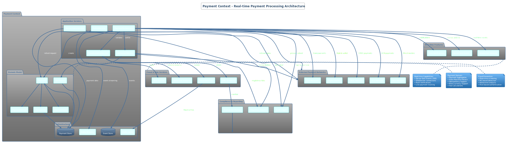

# Payment Context - Real-time Payment Processing

## 💳 Overview

The Payment Context implements **real-time payment processing** with **PCI-DSS v4.0 compliance**, **fraud detection**, and **multi-network settlement**. Built on **hexagonal architecture** with **event-driven patterns**, this context handles high-volume payment transactions with **zero cardholder data storage**.

## 🏗️ Architecture Diagram



**PlantUML Source**: [payment-context-architecture.puml](../docs/puml/bounded-contexts/payment-context-architecture.puml)

## 🎯 Domain Responsibilities

### Core Payment Capabilities
- **Real-time Payment Processing**: Sub-second payment execution
- **Multi-Network Support**: ACH, Wire, Cards, Digital Wallets, CBDC
- **Fraud Detection**: ML-based real-time screening
- **Settlement Management**: Automated clearing and settlement
- **Reconciliation**: Automated payment reconciliation
- **Refund Processing**: Automated and manual refund handling

### Payment Aggregate Root
```java
@Entity
@AggregateRoot
public class Payment extends AggregateRoot<PaymentId> {
    private final CustomerId customerId;
    private final Money amount;
    private final PaymentMethod method;
    private PaymentStatus status;
    private final Instant initiatedAt;
    
    // Domain methods with business rules
    public void authorize(FraudValidationResult fraudResult) {
        if (fraudResult.isHighRisk()) {
            throw new PaymentDeclinedException("High fraud risk detected");
        }
        this.status = PaymentStatus.AUTHORIZED;
        recordDomainEvent(new PaymentAuthorized(this.getId(), amount));
    }
    
    public void settle() {
        if (!isAuthorized()) {
            throw new IllegalStateException("Payment must be authorized before settlement");
        }
        this.status = PaymentStatus.SETTLED;
        recordDomainEvent(new PaymentSettled(this.getId()));
    }
}
```

## 🔒 PCI-DSS v4.0 Security Implementation

### **Requirement 3: Cardholder Data Protection**

#### Zero Cardholder Data Storage
```java
@Service
@Slf4j
public class SecurePaymentProcessor {
    
    public PaymentResult processCardPayment(CardPaymentRequest request) {
        // NEVER store PAN or CVV - immediate tokenization
        var tokenizedCard = tokenizationService.tokenizeCard(request.getCardData());
        
        // Clear sensitive data from memory immediately
        request.clearSensitiveData();
        
        // Process with tokenized data only
        return processPaymentWithToken(tokenizedCard);
    }
    
    @Component
    public static class CardTokenizationService {
        
        public TokenizedCard tokenizeCard(CardData cardData) {
            // Format-preserving encryption for PAN
            var tokenizedPan = fpeService.encrypt(cardData.getPan());
            
            // NEVER store CVV - validate and discard immediately
            cvvValidator.validate(cardData.getCvv());
            
            return TokenizedCard.builder()
                .tokenizedPan(tokenizedPan)
                .expiryMonth(cardData.getExpiryMonth())
                .expiryYear(cardData.getExpiryYear())
                .build();
        }
    }
}
```

#### Data Encryption and Key Management
```java
@Configuration
public class PaymentSecurityConfig {
    
    @Bean
    public AESGCMEncryption paymentDataEncryption() {
        return AESGCMEncryption.builder()
            .keySize(256)
            .keyDerivationFunction("PBKDF2WithHmacSHA256")
            .iterations(100000)
            .keyManagementService(awsKmsService())
            .build();
    }
    
    @Bean
    public TokenizationService tokenizationService() {
        return FormatPreservingEncryption.builder()
            .algorithm("FF1") // NIST approved FPE
            .key(derivedEncryptionKey())
            .build();
    }
}
```

### **Requirement 4: Encryption in Transit**
```java
@RestController
@RequestMapping("/api/v1/payments")
public class PaymentController {
    
    @PostMapping
    @PreAuthorize("hasScope('payment:create')")
    public ResponseEntity<PaymentResponse> processPayment(
            @Valid @RequestBody PaymentRequest request,
            @RequestHeader("DPoP") String dpopProof,
            @RequestHeader("X-Client-Cert") String clientCert,
            HttpServletRequest httpRequest) {
        
        // Validate TLS 1.3 connection
        validateTLSConnection(httpRequest);
        
        // Validate DPoP proof for FAPI 2.0 compliance
        dpopValidator.validateProof(dpopProof, httpRequest.getRequestURL().toString());
        
        // Validate client certificate for mTLS
        certificateValidator.validateClientCertificate(clientCert);
        
        return paymentOrchestrator.processPayment(request);
    }
    
    private void validateTLSConnection(HttpServletRequest request) {
        var sslSession = (SSLSession) request.getAttribute("jakarta.servlet.request.ssl_session");
        if (sslSession == null || !sslSession.getProtocol().equals("TLSv1.3")) {
            throw new SecurityException("TLS 1.3 connection required");
        }
    }
}
```

### **Requirement 6: Secure Application Development**
```java
@Component
public class PaymentInputValidator {
    
    public void validatePaymentRequest(PaymentRequest request) {
        // Prevent SQL injection
        validateSqlInjection(request);
        
        // Prevent XSS
        validateXSSAttempts(request);
        
        // Validate amount format and range
        validateAmount(request.getAmount());
        
        // Validate payment method
        validatePaymentMethod(request.getPaymentMethod());
    }
    
    private void validateAmount(Money amount) {
        if (amount == null || amount.getValue().compareTo(BigDecimal.ZERO) <= 0) {
            throw new ValidationException("Invalid amount");
        }
        
        if (amount.getValue().compareTo(new BigDecimal("1000000")) > 0) {
            throw new ValidationException("Amount exceeds maximum limit");
        }
        
        // Check for decimal precision attacks
        if (amount.getValue().scale() > 2) {
            throw new ValidationException("Invalid decimal precision");
        }
    }
}
```

## ⚡ Real-time Features

### Server-Sent Events for Payment Status
```java
@Controller
public class PaymentEventController {
    
    @GetMapping(value = "/api/v1/payments/{paymentId}/events", 
                produces = MediaType.TEXT_EVENT_STREAM_VALUE)
    @PreAuthorize("hasScope('payment:read')")
    public SseEmitter streamPaymentEvents(@PathVariable String paymentId) {
        
        var emitter = new SseEmitter(TimeUnit.MINUTES.toMillis(30));
        
        // Subscribe to payment events
        eventBus.subscribe(PaymentEvent.class, event -> {
            if (event.getPaymentId().equals(paymentId)) {
                try {
                    emitter.send(SseEmitter.event()
                        .name("payment-update")
                        .data(PaymentEventDto.from(event))
                        .id(event.getEventId())
                    );
                } catch (IOException e) {
                    emitter.completeWithError(e);
                }
            }
        });
        
        return emitter;
    }
}
```

### WebSocket Payment Tracking
```java
@Controller
public class PaymentWebSocketController {
    
    @MessageMapping("/payments/{paymentId}/track")
    @SendToUser("/queue/payment-updates")
    public void trackPayment(@DestinationVariable String paymentId, 
                           StompHeaderAccessor headerAccessor) {
        
        var principal = headerAccessor.getUser();
        validatePaymentAccess(principal, paymentId);
        
        // Start real-time tracking
        paymentTrackingService.startTracking(paymentId, principal.getName());
    }
    
    @EventListener
    public void handlePaymentUpdate(PaymentUpdatedEvent event) {
        messagingTemplate.convertAndSendToUser(
            event.getUserId(),
            "/queue/payment-updates",
            PaymentUpdateDto.from(event)
        );
    }
}
```

## 🛡️ Fraud Detection Integration

### Machine Learning Fraud Scoring
```java
@Service
public class FraudDetectionService {
    
    public CompletableFuture<FraudScore> calculateFraudScore(PaymentRequest request) {
        
        // Collect features for ML model
        var features = FraudFeatures.builder()
            .amount(request.getAmount().getValue())
            .paymentMethod(request.getPaymentMethod())
            .merchantCategory(request.getMerchantCategory())
            .deviceFingerprint(request.getDeviceFingerprint())
            .geolocation(request.getGeolocation())
            .customerBehavior(getCustomerBehavior(request.getCustomerId()))
            .build();
        
        // Real-time ML inference
        return mlFraudDetectionClient.scoreTransaction(features)
            .thenApply(this::interpretFraudScore);
    }
    
    private FraudScore interpretFraudScore(MLFraudResponse mlResponse) {
        var riskLevel = determineRiskLevel(mlResponse.getScore());
        var recommendedAction = determineAction(riskLevel);
        
        return FraudScore.builder()
            .score(mlResponse.getScore())
            .riskLevel(riskLevel)
            .recommendedAction(recommendedAction)
            .features(mlResponse.getFeatureImportance())
            .build();
    }
}
```

### Real-time Fraud Rules Engine
```java
@Component
public class FraudRulesEngine {
    
    public FraudValidationResult validateTransaction(PaymentRequest request) {
        var violations = new ArrayList<FraudRule.Violation>();
        
        // Velocity checks
        if (exceedsVelocityLimits(request)) {
            violations.add(new VelocityLimitViolation(request.getCustomerId()));
        }
        
        // Geolocation checks
        if (suspiciousGeolocation(request)) {
            violations.add(new GeolocationViolation(request.getGeolocation()));
        }
        
        // Device fingerprinting
        if (unknownDevice(request)) {
            violations.add(new UnknownDeviceViolation(request.getDeviceFingerprint()));
        }
        
        // Behavioral analysis
        if (anomalousBehavior(request)) {
            violations.add(new BehavioralAnomalyViolation(request.getCustomerId()));
        }
        
        return FraudValidationResult.builder()
            .violations(violations)
            .riskScore(calculateCompositeRiskScore(violations))
            .build();
    }
}
```

## 🌐 Multi-Network Integration

### Payment Network Adapters
```java
public interface PaymentNetworkPort {
    CompletableFuture<NetworkPaymentResult> processPayment(NetworkPaymentRequest request);
    CompletableFuture<PaymentStatus> getPaymentStatus(String networkTransactionId);
    CompletableFuture<RefundResult> processRefund(RefundRequest request);
}

@Component
public class ACHNetworkAdapter implements PaymentNetworkPort {
    
    @Override
    @Retryable(value = {NetworkException.class}, maxAttempts = 3)
    public CompletableFuture<NetworkPaymentResult> processPayment(NetworkPaymentRequest request) {
        
        return CompletableFuture.supplyAsync(() -> {
            // Format for ACH network
            var achRequest = ACHPaymentRequest.builder()
                .routingNumber(request.getRoutingNumber())
                .accountNumber(request.getTokenizedAccountNumber())
                .amount(request.getAmount())
                .effectiveDate(request.getEffectiveDate())
                .companyName(request.getCompanyName())
                .build();
            
            // Submit to ACH network
            var achResponse = achNetworkClient.submitPayment(achRequest);
            
            return NetworkPaymentResult.builder()
                .networkTransactionId(achResponse.getTransactionId())
                .status(mapACHStatus(achResponse.getStatus()))
                .estimatedSettlementDate(achResponse.getSettlementDate())
                .build();
            
        }, paymentNetworkExecutor);
    }
}

@Component
public class CBDCNetworkAdapter implements PaymentNetworkPort {
    
    @Autowired
    private CordaNetworkService cordaService;
    
    @Override
    public CompletableFuture<NetworkPaymentResult> processPayment(NetworkPaymentRequest request) {
        
        return cordaService.initiateDigitalCurrencyTransfer(
            CBDCTransferRequest.builder()
                .fromWallet(request.getFromWallet())
                .toWallet(request.getToWallet())
                .amount(request.getAmount())
                .currency("UAE-DIRHAM-DIGITAL")
                .build()
        ).thenApply(cordaResponse -> 
            NetworkPaymentResult.builder()
                .networkTransactionId(cordaResponse.getTransactionHash())
                .status(PaymentStatus.PROCESSING)
                .blockchainConfirmations(0)
                .build()
        );
    }
}
```

### Circuit Breaker Pattern for Resilience
```java
@Component
public class ResilientPaymentOrchestrator {
    
    @CircuitBreaker(name = "payment-network", fallbackMethod = "fallbackPaymentProcessing")
    @TimeLimiter(name = "payment-network")
    @Retry(name = "payment-network")
    public CompletableFuture<PaymentResult> processPayment(PaymentRequest request) {
        
        return paymentNetworkAdapter.processPayment(request)
            .thenCompose(networkResult -> 
                recordPaymentResult(request, networkResult)
            );
    }
    
    public CompletableFuture<PaymentResult> fallbackPaymentProcessing(PaymentRequest request, Exception ex) {
        log.warn("Payment network unavailable, queuing for retry: {}", request.getPaymentId(), ex);
        
        // Queue for retry processing
        retryQueue.enqueue(DelayedPaymentRequest.builder()
            .originalRequest(request)
            .retryAfter(Duration.ofMinutes(5))
            .build());
        
        return CompletableFuture.completedFuture(
            PaymentResult.queued(request.getPaymentId())
        );
    }
}
```

## 💾 Event Sourcing & CQRS

### Payment Event Store
```java
@Entity
@Table(name = "payment_events")
public class PaymentEvent {
    @Id
    private String eventId;
    
    @Column(name = "payment_id")
    private String paymentId;
    
    @Column(name = "event_type")
    private String eventType;
    
    @Column(name = "event_data", columnDefinition = "jsonb")
    private String eventData;
    
    @Column(name = "occurred_at")
    private Instant occurredAt;
    
    @Column(name = "sequence_number")
    private Long sequenceNumber;
}

@Repository
public class PaymentEventStore {
    
    public void append(PaymentId paymentId, List<DomainEvent> events) {
        var currentSequence = getLastSequenceNumber(paymentId);
        
        events.forEach(event -> {
            var paymentEvent = PaymentEvent.builder()
                .eventId(UUID.randomUUID().toString())
                .paymentId(paymentId.getValue())
                .eventType(event.getClass().getSimpleName())
                .eventData(jsonSerializer.serialize(event))
                .occurredAt(event.getOccurredAt())
                .sequenceNumber(++currentSequence)
                .build();
                
            paymentEventRepository.save(paymentEvent);
        });
    }
    
    public Payment reconstructFromEvents(PaymentId paymentId) {
        var events = paymentEventRepository
            .findByPaymentIdOrderBySequenceNumber(paymentId.getValue());
            
        var payment = new Payment(paymentId);
        events.forEach(event -> payment.apply(deserializeEvent(event)));
        
        return payment;
    }
}
```

### Payment Read Models
```java
@Entity
@Table(name = "payment_view")
public class PaymentView {
    @Id
    private String paymentId;
    private String customerId;
    private BigDecimal amount;
    private String currency;
    private String status;
    private String paymentMethod;
    private Instant initiatedAt;
    private Instant settledAt;
    private String merchantName;
    private String lastFourDigits; // For display purposes only
}

@Component
public class PaymentViewProjection {
    
    @EventHandler
    public void on(PaymentInitiated event) {
        var view = PaymentView.builder()
            .paymentId(event.getPaymentId())
            .customerId(event.getCustomerId())
            .amount(event.getAmount().getValue())
            .currency(event.getAmount().getCurrency())
            .status("INITIATED")
            .paymentMethod(event.getPaymentMethod())
            .initiatedAt(event.getOccurredAt())
            .lastFourDigits(maskAccountNumber(event.getAccountNumber()))
            .build();
            
        paymentViewRepository.save(view);
    }
    
    @EventHandler
    public void on(PaymentSettled event) {
        paymentViewRepository.findById(event.getPaymentId())
            .ifPresent(view -> {
                view.setStatus("SETTLED");
                view.setSettledAt(event.getOccurredAt());
                paymentViewRepository.save(view);
            });
    }
}
```

## 📊 Performance & Monitoring

### High-Performance Configuration
```yaml
payment-context:
  performance:
    async:
      core-pool-size: 10
      max-pool-size: 50
      queue-capacity: 1000
    database:
      connection-pool:
        maximum-pool-size: 30
        minimum-idle: 10
        connection-timeout: 30000ms
    cache:
      payment-status:
        ttl: 300s
        max-size: 10000
      fraud-scores:
        ttl: 60s
        max-size: 5000

  monitoring:
    metrics:
      payment-processing-time: true
      fraud-detection-time: true
      network-response-time: true
    alerts:
      high-fraud-rate: 5%
      slow-response-time: 2s
      failed-payment-rate: 1%
```

### Performance Metrics
```java
@Component
public class PaymentMetrics {
    
    private final Timer paymentProcessingTimer;
    private final Counter paymentsByMethod;
    private final Counter fraudDetections;
    private final Gauge activePayments;
    
    @EventListener
    public void recordPaymentProcessed(PaymentProcessed event) {
        paymentsByMethod.increment(
            Tags.of(
                "method", event.getPaymentMethod(),
                "result", event.getResult(),
                "network", event.getNetwork()
            )
        );
    }
    
    @EventListener
    public void recordFraudDetection(FraudDetected event) {
        fraudDetections.increment(
            Tags.of(
                "risk-level", event.getRiskLevel(),
                "rule-triggered", event.getRuleTriggered()
            )
        );
    }
}
```

## 🧪 Testing Strategy

### Payment Processing Tests
```java
@Test
@DisplayName("Should process ACH payment successfully with fraud validation")
void shouldProcessACHPaymentWithFraudValidation() {
    // Given
    var paymentRequest = ACHPaymentRequest.builder()
        .customerId("customer-123")
        .amount(Money.of(1500.00))
        .routingNumber("021000021")
        .accountNumber("tokenized-account-456")
        .build();
    
    var fraudScore = FraudScore.lowRisk(0.15);
    when(fraudDetectionService.calculateFraudScore(any()))
        .thenReturn(CompletableFuture.completedFuture(fraudScore));
    
    var networkResult = NetworkPaymentResult.success("ach-txn-789");
    when(achNetworkAdapter.processPayment(any()))
        .thenReturn(CompletableFuture.completedFuture(networkResult));
    
    // When
    var result = paymentOrchestrator.processPayment(paymentRequest).join();
    
    // Then
    assertThat(result.isSuccessful()).isTrue();
    assertThat(result.getPaymentId()).isNotNull();
    assertThat(result.getNetworkTransactionId()).isEqualTo("ach-txn-789");
    
    // Verify fraud check was performed
    verify(fraudDetectionService).calculateFraudScore(paymentRequest);
    
    // Verify payment events
    var events = paymentEventStore.getEvents(result.getPaymentId());
    assertThat(events)
        .extracting(DomainEvent::getEventType)
        .containsExactly("PaymentInitiated", "FraudValidationPassed", "PaymentAuthorized");
}

@Test
@DisplayName("Should decline payment with high fraud score")
void shouldDeclineHighRiskPayment() {
    // Given
    var paymentRequest = cardPaymentRequest();
    var highRiskScore = FraudScore.highRisk(0.95);
    
    when(fraudDetectionService.calculateFraudScore(any()))
        .thenReturn(CompletableFuture.completedFuture(highRiskScore));
    
    // When
    var result = paymentOrchestrator.processPayment(paymentRequest).join();
    
    // Then
    assertThat(result.isDeclined()).isTrue();
    assertThat(result.getDeclineReason()).isEqualTo("HIGH_FRAUD_RISK");
    
    // Verify payment was never sent to network
    verify(cardNetworkAdapter, never()).processPayment(any());
    
    // Verify fraud alert was sent
    verify(fraudAlertService).sendHighRiskAlert(paymentRequest, highRiskScore);
}
```

### Security Tests
```java
@Test
@DisplayName("Should never store PAN in clear text")
void shouldNeverStorePAN() {
    // Given
    var cardData = CardData.builder()
        .pan("4111111111111111")
        .cvv("123")
        .expiryMonth("12")
        .expiryYear("2025")
        .build();
    
    // When
    var tokenizedCard = tokenizationService.tokenizeCard(cardData);
    
    // Then
    assertThat(tokenizedCard.getTokenizedPan()).isNotEqualTo(cardData.getPan());
    assertThat(tokenizedCard.getTokenizedPan()).hasSize(16); // Format preserving
    assertThat(tokenizedCard.getCvv()).isNull(); // CVV should never be stored
    
    // Verify original data is cleared
    assertThat(cardData.getPan()).isNull();
    assertThat(cardData.getCvv()).isNull();
}

@Test
@DisplayName("Should enforce TLS 1.3 for payment endpoints")
void shouldEnforceTLS13() {
    // Given
    var mockRequest = mock(HttpServletRequest.class);
    var mockSession = mock(SSLSession.class);
    
    when(mockRequest.getAttribute("jakarta.servlet.request.ssl_session"))
        .thenReturn(mockSession);
    when(mockSession.getProtocol()).thenReturn("TLSv1.2"); // Older version
    
    // When & Then
    assertThatThrownBy(() -> 
        paymentController.processPayment(validPaymentRequest(), "dpop-proof", 
                                       "client-cert", mockRequest)
    ).isInstanceOf(SecurityException.class)
     .hasMessageContaining("TLS 1.3 connection required");
}
```

## 🚀 API Reference

### Process Payment
```bash
curl -X POST https://api.bank.com/api/v1/payments \
  -H "Authorization: Bearer ${ACCESS_TOKEN}" \
  -H "DPoP: ${DPOP_PROOF}" \
  -H "Content-Type: application/json" \
  -H "X-Client-Cert: ${CLIENT_CERT}" \
  -d '{
    "customerId": "customer-123",
    "amount": {
      "value": 1250.00,
      "currency": "USD"
    },
    "paymentMethod": {
      "type": "ACH",
      "routingNumber": "021000021",
      "accountToken": "tok_1234567890"
    },
    "merchantInfo": {
      "name": "ACME Corp",
      "category": "RETAIL"
    }
  }'
```

### Track Payment Status (SSE)
```javascript
const eventSource = new EventSource('/api/v1/payments/pay_123/events', {
  headers: {
    'Authorization': `Bearer ${accessToken}`
  }
});

eventSource.addEventListener('payment-update', (event) => {
  const update = JSON.parse(event.data);
  console.log('Payment status:', update.status);
  console.log('Network status:', update.networkStatus);
});
```

---

**Payment Context Documentation**  
**Version**: 1.0  
**Security Level**: PCI-DSS v4.0 Compliant  
**Architecture**: Real-time Event-Driven + Hexagonal**