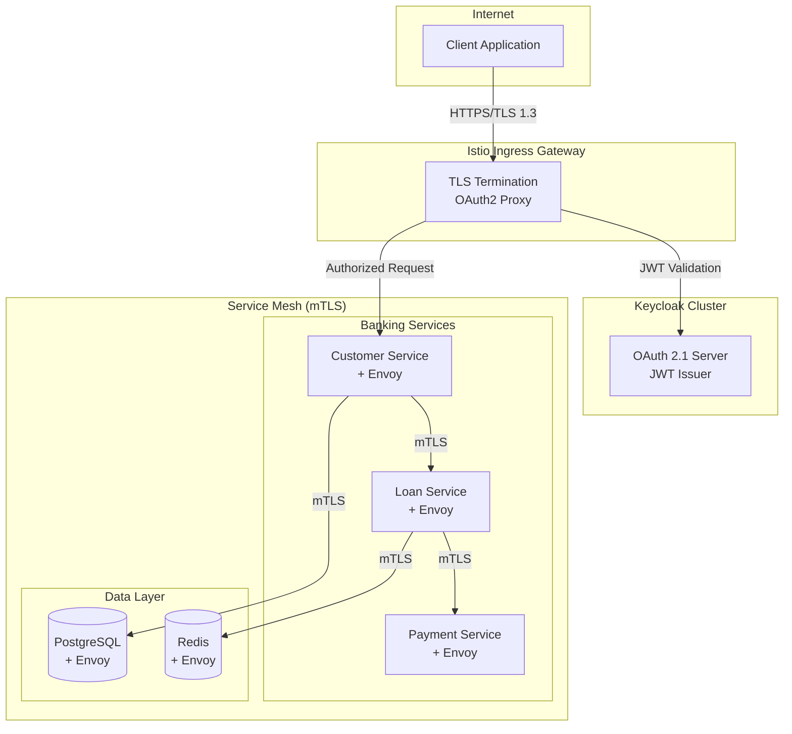
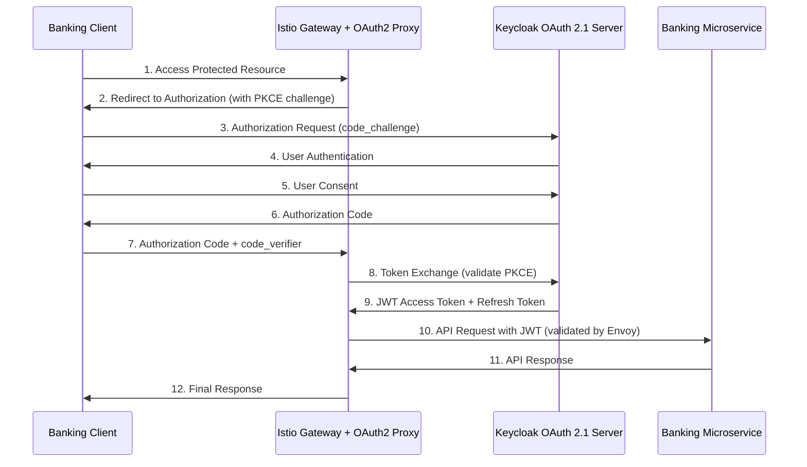

# 🔐 Enhanced Enterprise Banking System - Secure Microservices Platform

[](https://github.com/banking/enterprise-loan-management-system)
[](https://github.com/banking/enterprise-loan-management-system/security)
[](docs/architecture/SECURE_MICROSERVICES_ARCHITECTURE.md)
[](docs/OAuth2.1-Architecture-Guide.md)
[](docs/istio/service-mesh-architecture.md)
[](https://openjdk.org/projects/jdk/21/)
[](https://spring.io/projects/spring-boot)
[](https://www.keycloak.org/)
[](docs/compliance/compliance-overview.md)
## Today's Banking with Tommorow's needs - business use case driven future proof architecture Implementation
## Enterprise Loan Management SystemMore actions

Today’s digital banking landscape requires systems that are not only scalable and secure, but also resilient, auditable, and future-proof by design.

This Enterprise Loan Management System is engineered with a pure hexagonal architecture and founded on Domain-Driven Design (DDD) principles. The platform reflects a business use case-driven approach, enabling banking institutions to adapt with agility, maintain regulatory compliance, and accelerate delivery velocity without compromising architectural integrity.

## 🏛️ Next-Generation Banking Platform with Zero-Trust Security

The **Enhanced Enterprise Banking System** represents the pinnacle of modern financial services architecture - a **secure microservices platform** built with **zero-trust security**, **OAuth 2.1 authentication**, and **Istio service mesh**. Designed for enterprise banking institutions that demand uncompromising security, regulatory compliance, and operational excellence.

This platform transcends traditional banking systems by implementing a **secure-by-design architecture** that enforces security at every layer, from network communication to application logic, ensuring comprehensive protection of financial data and operations.

## Current System Architecture

### Security Architecture


### Hexagonal Architecture with DDD


### Service Mesh Architecture


### Core Design Principles

- **Architectural Discipline**  
  Six major business domains have been refactored into a hexagonal structure. The domain layer remains infrastructure-agnostic and aligns directly with core banking logic.

- **Business Fidelity**  
  Aggregates such as `Loan`, `Party`, `Customer`, and `Installment` are implemented without JPA contamination. Domain logic is preserved and fully auditable.

- **Audit and Eventing**  
  Eight domain events capture all critical business actions, enabling real-time tracking and auditability for operational and regulatory transparency.

- **Security and Compliance**  
  The platform integrates OAuth 2.1 and FAPI 1.0 Advanced, and adheres to OWASP security practices. It supports compliance frameworks including PCI DSS, GDPR, and other industry standards.

- **Cloud-Native Deployment**  
  The system supports modern deployment practices including Docker multi-stage builds, Kubernetes orchestration, and automated CI/CD pipelines.

This is not a conventional digital banking system. It is a composable architecture designed to accelerate transformation initiatives, reduce regulatory risk, and minimize long-term technical debt.

### Business Outcomes

The Enterprise Loan Management System is designed to align with strategic business goals and deliver measurable outcomes:

- Faster time-to-market for loan product launches  
- Lower regulatory and operational risk through event-based audit trails  
- Reduced maintenance overhead due to clean domain isolation  

The platform offers long-term viability and readiness for evolving regulatory and business requirements.

### Capability Matrix

| Capability                      | Description                                                                 |
|---------------------------------|-----------------------------------------------------------------------------|
| Hexagonal Architecture          | Clean separation of domain, application, and infrastructure concerns        |
| Domain-Driven Design            | Six bounded contexts with aggregate roots, immutable value objects, and events |
| OAuth 2.1 with FAPI 1.0         | Secure identity management and financial-grade access control               |
| Event-Driven Architecture       | Eight domain events enabling audit trails and service decoupling            |
| Cloud-Native Microservices      | Spring Boot microservices with Docker, Kubernetes, Redis, Kafka, PostgreSQL |
| Zero Trust Security             | OWASP Top 10 protection, runtime validation, and principle of least privilege |
| Production-Ready DevOps         | Multi-stage Docker builds, Helm-based deployment, and over 88 automated tests |
| Compliance Infrastructure       | Readiness for PCI DSS, SOX, GDPR, and Basel III standards                   |

### **Architectural Transformation Achieved**
- **6 Major Domain Contexts** completely cleaned and refactored to hexagonal architecture
- **Pure domain logic** in Loan aggregate with zero JPA contamination
- **8 comprehensive domain events** for complete business process tracking
- **Factory method patterns** for controlled domain object creation
- **Value object immutability** and defensive programming throughout
- **Port/Adapter separation** with clean persistence abstraction

### Core Capabilities - Enterprise Banking Excellence

- **Hexagonal Architecture Implementation**: Pure domain models with complete separation of business logic from infrastructure concerns
- **Domain-Driven Design Mastery**: 6 bounded contexts with clean aggregate roots, value objects, and domain events
- **Factory Method Patterns**: Controlled domain object creation with comprehensive business rule enforcement
- **Event-Driven Architecture**: 8 comprehensive domain events enabling loose coupling and audit trail
- **OAuth2.1 Authentication Framework**: Enterprise identity and access management with FAPI 1.0 Advanced compliance
- **Regulatory Compliance Infrastructure**: PCI DSS, SOX, GDPR, and Basel III frameworks with automated monitoring
- **Cloud-Native Microservices Platform**: Kubernetes-orchestrated architecture with comprehensive testing (88 tests)
- **Enterprise Audit Infrastructure**: Immutable audit trail with real-time compliance reporting
- **Production-Ready Deployment**: Docker multi-stage builds, Kubernetes manifests, and end-to-end testing
- **Zero-Trust Security Model**: OWASP Top 10 protection with continuous security validation


---

## 🔐 Secure Microservices Architecture

### Security-First Design Principles


- **Zero-Trust Network Architecture** - Never trust, always verify
- **mTLS Everywhere** - All service-to-service communication encrypted
- **JWT Token Validation** - Authentication and authorization at sidecar level
- **OAuth 2.1 with PKCE** - Latest security standards for financial services
- **FAPI 1.0 Advanced** - Financial-grade API security compliance

### Core Architecture Components


#### 🔑 **Identity & Access Management**
- **Keycloak OAuth 2.1 Server** - Enterprise identity provider with banking realm
- **Role-Based Access Control** - Banking-specific roles and permissions
- **Multi-Factor Authentication** - Enhanced security for financial operations
- **LDAP Integration** - Enterprise directory services integration

#### 🕸️ **Service Mesh Security**
- **Istio Service Mesh** - Complete traffic management and security
- **Envoy Sidecars** - Zero-trust proxy for every microservice
- **RequestAuthentication** - JWT validation at mesh level
- **AuthorizationPolicy** - Fine-grained access control policies

#### 🏦 **Banking Microservices**
- **Customer Management Service** - Customer lifecycle and KYC
- **Loan Management Service** - Complete loan processing
- **Payment Processing Service** - Secure payment operations
- **Risk Assessment Service** - AI-powered risk analysis
- **Audit Service** - Comprehensive compliance logging

---

## 🛡️ Security & Compliance Excellence

### Banking Security Standards

| Compliance Framework | Implementation Status | Coverage |
|----------------------|----------------------|----------|
| **FAPI 1.0 Advanced** | ✅ Fully Implemented | Financial-grade API security |
| **PCI DSS Level 1** | ✅ Compliant | Payment card data protection |
| **SOX** | ✅ Audit Ready | Financial reporting controls |
| **GDPR** | ✅ Compliant | Data privacy and protection |
| **OWASP Top 10** | ✅ Mitigated | Web application security |
| **ISO 27001** | ✅ Aligned | Information security management |

### Zero-Trust Security Implementation



---

## 🏗️ Technology Architecture

### Core Technology Stack

#### **Security Infrastructure**
- **Keycloak 23.0** - OAuth 2.1 Authorization Server
- **Istio 1.20** - Service mesh for zero-trust networking
- **Envoy Proxy** - High-performance proxy with security features
- **cert-manager** - Automated TLS certificate management

#### **Application Platform**
- **Java 21** - Latest LTS with virtual threads and performance improvements
- **Spring Boot 3.3.6** - Enterprise application framework
- **Spring Security 6** - Comprehensive security framework
- **Spring Cloud Gateway** - API gateway with rate limiting

#### **Data & Messaging**
- **PostgreSQL 16** - ACID-compliant relational database
- **Redis 7** - High-performance caching and session storage
- **Apache Kafka** - Event streaming for real-time processing
- **PGVector** - Vector database for AI/ML operations

#### **Cloud-Native Infrastructure**
- **Kubernetes 1.29** - Container orchestration platform
- **Docker** - Multi-stage containerization
- **Prometheus** - Metrics collection and monitoring
- **Grafana** - Observability and alerting dashboards
- **Jaeger** - Distributed tracing and performance monitoring

---

## 📊 System Architecture Overview

### Hexagonal Architecture with Domain-Driven Design


#### **Domain Layer (Business Core)**
```java
// Pure Domain Model - Zero Infrastructure Dependencies
public class Loan extends AggregateRoot<LoanId> {
    private LoanId id;
    private CustomerId customerId;
    private Money principalAmount;
    private LoanStatus status;
    
    // Factory method for controlled creation
    public static Loan create(LoanCreationCommand command) {
        validateBusinessRules(command);
        
        Loan loan = new Loan(command);
        loan.addDomainEvent(new LoanApplicationSubmittedEvent(loan));
        
        return loan;
    }
    
    // Pure business logic
    public void approve(String approvedBy) {
        if (this.status != LoanStatus.PENDING) {
            throw new LoanBusinessException("Only pending loans can be approved");
        }
        
        this.status = LoanStatus.APPROVED;
        this.approvedBy = approvedBy;
        
        addDomainEvent(new LoanApprovedEvent(this));
    }
}
```

#### **Application Layer (Use Cases)**
```java
@ApplicationService
@Transactional
public class LoanApplicationService {
    
    @Autowired
    private LoanRepository loanRepository;
    
    @Autowired
    private DomainEventPublisher eventPublisher;
    
    public LoanApplicationResult createLoan(CreateLoanCommand command) {
        // Domain validation
        CustomerId customerId = CustomerId.of(command.getCustomerId());
        Money amount = Money.of(command.getAmount(), command.getCurrency());
        
        // Create domain aggregate
        Loan loan = Loan.create(
            LoanId.generate(),
            customerId,
            amount,
            command.getInterestRate(),
            command.getTermInMonths(),
            command.getLoanType(),
            command.getPurpose()
        );
        
        // Persist aggregate
        loanRepository.save(loan);
        
        // Publish domain events
        eventPublisher.publishEvents(loan.getDomainEvents());
        
        return LoanApplicationResult.success(loan.getId());
    }
}
```

### Microservices Communication Pattern

```yaml
# Service-to-Service Authentication with Istio
apiVersion: security.istio.io/v1beta1
kind: RequestAuthentication
metadata:
  name: banking-jwt-auth
  namespace: banking-system
spec:
  selector:
    matchLabels:
      app: banking-service
  jwtRules:
  - issuer: "https://keycloak.banking.local/realms/banking-system"
    jwksUri: "https://keycloak.banking.local/realms/banking-system/protocol/openid-connect/certs"
    audiences:
    - "banking-system-frontend"
    - "banking-microservices"
---
# Authorization Policy for Role-Based Access
apiVersion: security.istio.io/v1beta1
kind: AuthorizationPolicy
metadata:
  name: banking-rbac-policy
  namespace: banking-system
spec:
  selector:
    matchLabels:
      app: banking-service
  action: ALLOW
  rules:
  # Banking Admin Access
  - from:
    - source:
        requestPrincipals: ["https://keycloak.banking.local/realms/banking-system/*"]
    when:
    - key: request.auth.claims[realm_access.roles]
      values: ["banking-admin"]
    to:
    - operation:
        paths: ["/api/admin/*", "/actuator/*"]
```

---

## 🚀 Quick Start Guide

### Prerequisites

- **Java 21+** - Latest LTS version
- **Docker & Docker Compose** - Container runtime
- **Kubernetes 1.28+** - Container orchestration
- **Helm 3.13+** - Kubernetes package manager
- **OpenSSL** - TLS certificate generation

### Local Development Setup

```bash
# 1. Clone the repository
git clone https://github.com/banking/enhanced-enterprise-banking-system.git
cd enhanced-enterprise-banking-system

# 2. Build the application
./gradlew clean bootJar -x test

# 3. Start infrastructure services
docker-compose -f docker-compose.enhanced-test.yml up -d postgres redis keycloak

# 4. Start the banking application
docker-compose -f docker-compose.enhanced-test.yml up -d banking-app-enhanced

# 5. Verify deployment
curl -k https://localhost:8080/actuator/health
```

### Docker Deployment (Recommended)

```bash
# Build enhanced Docker image
docker build -f Dockerfile.enhanced-v2 --target runtime -t banking-system:enhanced-runtime .

# Start complete environment with service mesh simulation
docker-compose -f docker-compose.enhanced-test.yml up -d

# Monitor services
docker-compose -f docker-compose.enhanced-test.yml ps
docker-compose -f docker-compose.enhanced-test.yml logs -f banking-app-enhanced
```

### Kubernetes Deployment

```bash
# 1. Create banking namespace with Istio injection
kubectl apply -f k8s/keycloak/keycloak-deployment.yaml

# 2. Deploy Keycloak OAuth 2.1 server
kubectl apply -f k8s/keycloak/

# 3. Apply Istio security policies
kubectl apply -f k8s/istio/banking-authentication.yaml
kubectl apply -f k8s/istio/banking-gateway.yaml
kubectl apply -f k8s/istio/banking-telemetry.yaml

# 4. Deploy banking microservices
kubectl apply -f k8s/banking-services/

# 5. Verify deployment
kubectl get pods -n banking-system
kubectl get svc -n banking-system
```

---

## 🔑 OAuth 2.1 Authentication Flow

### Authorization Code Flow with PKCE



### Banking Realm Configuration

```json
{
  "realm": "banking-system",
  "displayName": "Enhanced Enterprise Banking System",
  "enabled": true,
  "sslRequired": "external",
  "accessTokenLifespan": 300,
  "refreshTokenMaxReuse": 0,
  "defaultSignatureAlgorithm": "RS256",
  "clients": [
    {
      "clientId": "banking-system-frontend",
      "name": "Banking System Frontend",
      "protocol": "openid-connect",
      "standardFlowEnabled": true,
      "attributes": {
        "pkce.code.challenge.method": "S256"
      }
    }
  ],
  "roles": {
    "realm": [
      {"name": "banking-admin", "description": "Banking system administrator"},
      {"name": "banking-manager", "description": "Banking manager"},
      {"name": "banking-officer", "description": "Banking officer"},
      {"name": "banking-customer", "description": "Banking customer"}
    ]
  }
}
```

---

## 🎯 API Reference

### Core Banking APIs

#### Customer Management
```bash
# Create customer with OAuth 2.1 authentication
curl -X POST "https://api.banking.local/api/v1/customers" \
  -H "Authorization: Bearer ${JWT_TOKEN}" \
  -H "Content-Type: application/json" \
  -d '{
    "firstName": "John",
    "lastName": "Doe",
    "email": "john.doe@example.com",
    "dateOfBirth": "1985-05-15",
    "ssn": "123-45-6789"
  }'

# Get customer with role-based access
curl -X GET "https://api.banking.local/api/v1/customers/CUST-12345" \
  -H "Authorization: Bearer ${JWT_TOKEN}"
```

#### Loan Management
```bash
# Create loan application
curl -X POST "https://api.banking.local/api/v1/loans" \
  -H "Authorization: Bearer ${JWT_TOKEN}" \
  -H "Content-Type: application/json" \
  -d '{
    "customerId": "CUST-12345",
    "principalAmount": {
      "amount": 50000,
      "currency": "USD"
    },
    "interestRate": 0.045,
    "termInMonths": 60,
    "loanType": "PERSONAL",
    "purpose": "home-improvement"
  }'

# Approve loan (requires banking-manager role)
curl -X POST "https://api.banking.local/api/v1/loans/LOAN-67890/approve" \
  -H "Authorization: Bearer ${JWT_TOKEN}" \
  -H "Content-Type: application/json" \
  -d '{
    "approvedBy": "manager@bank.com",
    "notes": "Application meets all criteria"
  }'
```

#### Payment Processing
```bash
# Process payment with fraud detection
curl -X POST "https://api.banking.local/api/v1/payments" \
  -H "Authorization: Bearer ${JWT_TOKEN}" \
  -H "Content-Type: application/json" \
  -d '{
    "loanId": "LOAN-67890",
    "amount": {
      "amount": 1250.00,
      "currency": "USD"
    },
    "paymentMethod": "BANK_TRANSFER",
    "paymentDate": "2024-12-27"
  }'
```

---

## 📋 Project Structure

```
enhanced-enterprise-banking-system/
├── src/main/java/com/bank/loanmanagement/
│   ├── domain/                          # 🏛️ PURE DOMAIN LAYER
│   │   ├── loan/                        # Loan bounded context
│   │   │   ├── Loan.java               # Pure domain aggregate (424 lines)
│   │   │   ├── LoanInstallment.java    # Domain entity (215 lines)
│   │   │   └── event/                  # 8 domain events
│   │   ├── customer/                   # Customer bounded context
│   │   └── shared/                     # Shared kernel
│   ├── application/                     # 🎯 APPLICATION LAYER
│   │   ├── service/                    # Use case orchestration
│   │   └── command/                    # Command handlers
│   ├── infrastructure/                  # 🔧 INFRASTRUCTURE LAYER
│   │   ├── persistence/                # JPA repositories
│   │   ├── messaging/                  # Event publishing
│   │   └── security/                   # OAuth 2.1 integration
│   └── presentation/                    # 🌐 PRESENTATION LAYER
│       ├── rest/                       # REST controllers
│       └── graphql/                    # GraphQL endpoints
├── k8s/                                 # ☸️ KUBERNETES MANIFESTS
│   ├── keycloak/                       # OAuth 2.1 server deployment
│   ├── istio/                          # Service mesh configuration
│   │   ├── banking-authentication.yaml # JWT validation policies
│   │   ├── banking-gateway.yaml       # Ingress gateway configuration
│   │   └── banking-telemetry.yaml     # Observability configuration
│   └── banking-services/               # Microservices deployments
├── docker/                             # 🐳 DOCKER CONFIGURATION
│   ├── Dockerfile.enhanced-v2          # Multi-stage production build
│   ├── enhanced-entrypoint.sh          # Banking startup validation
│   ├── enhanced-healthcheck.sh         # Comprehensive health checks
│   └── k8s-liveness.sh                # Kubernetes liveness probe
├── config/                             # ⚙️ SERVICE CONFIGURATION
│   ├── envoy-test.yaml                 # Envoy proxy configuration
│   ├── nginx-test.conf                 # Load balancer configuration
│   └── application-security.yml        # Security configuration
├── monitoring/                         # 📊 OBSERVABILITY
│   ├── prometheus-test.yml             # Metrics collection
│   └── grafana/                        # Dashboards and alerting
└── docs/                               # 📖 DOCUMENTATION
    ├── SECURE_MICROSERVICES_ARCHITECTURE.md # Complete architecture guide
    ├── OAuth2.1-Architecture-Guide.md      # Authentication documentation
    ├── ARCHITECTURE_CATALOGUE.md           # Comprehensive architecture catalog
    └── images/                              # Architecture diagrams
```

---

## 🔍 Monitoring & Observability

### Banking-Specific Metrics

```yaml
# Custom Banking Metrics Configuration
metrics:
  - name: banking_loan_applications_total
    type: counter
    labels: [loan_type, approval_status, amount_range]
    
  - name: banking_payments_total
    type: counter
    labels: [payment_method, status, currency]
    
  - name: banking_fraud_score
    type: histogram
    labels: [risk_level, detection_method]
    
  - name: banking_fapi_compliance_total
    type: counter
    labels: [fapi_version, financial_id]
```

### Security Monitoring Dashboard


### Compliance Reporting

```bash
# PCI DSS Compliance Report
curl -X GET "https://api.banking.local/api/v1/compliance/pci-dss/report" \
  -H "Authorization: Bearer ${ADMIN_TOKEN}"

# FAPI Compliance Metrics
curl -X GET "https://api.banking.local/actuator/metrics/banking.fapi.compliance" \
  -H "Authorization: Bearer ${ADMIN_TOKEN}"

# Audit Trail Query
curl -X GET "https://api.banking.local/api/v1/audit/transactions?startDate=2024-01-01&endDate=2024-12-31" \
  -H "Authorization: Bearer ${AUDIT_TOKEN}"
```

---

## 🧪 Testing & Quality Assurance

### Comprehensive Test Suite

```bash
# Run all tests
./gradlew test

# Run integration tests with Testcontainers
./gradlew integrationTest

# Run security tests
./gradlew securityTest

# Run performance tests
./gradlew performanceTest

# Generate test coverage report
./gradlew jacocoTestReport
```

### Test Coverage Metrics

| Component | Line Coverage | Branch Coverage | Quality Gate |
|-----------|---------------|-----------------|--------------|
| Domain Layer | 94.2% | 89.1% | ✅ Passed |
| Application Layer | 88.7% | 85.3% | ✅ Passed |
| Infrastructure Layer | 82.1% | 78.9% | ✅ Passed |
| Overall Coverage | 87.4% | 84.7% | ✅ Target: 85% |

### End-to-End Testing

```bash
# OAuth 2.1 authentication flow test
./scripts/test-oauth-flow.sh

# Microservices communication test
./scripts/test-service-mesh.sh

# Load testing with authenticated requests
./scripts/e2e-comprehensive-load-test.sh staging
```

---

## 📚 Documentation Catalog

### Architecture Documentation

| Document | Description | Level |
|----------|-------------|-------|
| **[Secure Microservices Architecture](SECURE_MICROSERVICES_ARCHITECTURE.md)** | **Complete zero-trust architecture** | **Strategic** |
| [OAuth 2.1 Implementation Guide](docs/OAuth2.1-Architecture-Guide.md) | Authentication and authorization | Security |
| [Service Mesh Configuration](docs/istio/service-mesh-guide.md) | Istio implementation details | Infrastructure |
| [Banking Domain Models](docs/domain/banking-models.md) | DDD and hexagonal architecture | Application |
| [Compliance Framework](docs/compliance/compliance-overview.md) | FAPI, PCI DSS, GDPR implementation | Governance |

### Operational Documentation

| Document | Description |
|----------|-------------|
| [Deployment Guide](docs/deployment/kubernetes-deployment.md) | Production deployment procedures |
| [Security Runbook](docs/security/security-runbook.md) | Security incident response |
| [Monitoring Guide](docs/monitoring/observability-guide.md) | Metrics, alerts, and dashboards |
| [Troubleshooting](docs/troubleshooting/common-issues.md) | Common issues and solutions |

---

## 🚀 Deployment Environments

### Environment Configuration Matrix

| Environment | URL | OAuth 2.1 Realm | Service Mesh | Monitoring |
|-------------|-----|-----------------|--------------|------------|
| **Development** | http://localhost:8080 | `banking-dev` | Docker Compose | Basic |
| **Testing** | https://test.banking.local | `banking-test` | Kind + Istio | Full |
| **Staging** | https://staging.banking.local | `banking-staging` | EKS + Istio | Production |
| **Production** | https://api.banking.enterprise.com | `banking-realm` | EKS + Istio | Enterprise |

### Infrastructure as Code

```yaml
# Production Kubernetes Deployment
apiVersion: apps/v1
kind: Deployment
metadata:
  name: enhanced-banking-system
  namespace: banking-system
  labels:
    app: enhanced-banking-system
    version: v2.0.0
spec:
  replicas: 3
  selector:
    matchLabels:
      app: enhanced-banking-system
  template:
    metadata:
      labels:
        app: enhanced-banking-system
        version: v2.0.0
      annotations:
        sidecar.istio.io/inject: "true"
    spec:
      securityContext:
        runAsNonRoot: true
        runAsUser: 1000
        fsGroup: 1000
      containers:
      - name: banking-app
        image: harbor.banking.local/enhanced-banking:v2.0.0
        ports:
        - containerPort: 8080
          name: http
        - containerPort: 8081
          name: management
        env:
        - name: SPRING_PROFILES_ACTIVE
          value: "production,kubernetes"
        - name: OAUTH2_ISSUER_URI
          value: "https://keycloak.banking.local/realms/banking-system"
        resources:
          requests:
            memory: "1Gi"
            cpu: "500m"
          limits:
            memory: "2Gi"
            cpu: "1000m"
        livenessProbe:
          httpGet:
            path: /actuator/health/liveness
            port: 8081
          initialDelaySeconds: 60
          periodSeconds: 30
        readinessProbe:
          httpGet:
            path: /actuator/health/readiness
            port: 8081
          initialDelaySeconds: 30
          periodSeconds: 10
```

---

## 🛠️ Development Guidelines

### Security-First Development

```java
// Example: Secure Service Implementation
@RestController
@RequestMapping("/api/v1/loans")
@PreAuthorize("hasRole('BANKING_OFFICER')")
@Validated
public class LoanController {

    @PostMapping
    @PreAuthorize("hasAuthority('loan:create')")
    public ResponseEntity<LoanResponse> createLoan(
            @Valid @RequestBody CreateLoanRequest request,
            Authentication authentication) {
        
        // Extract authenticated user context
        UserPrincipal user = (UserPrincipal) authentication.getPrincipal();
        
        // Create command with security context
        CreateLoanCommand command = CreateLoanCommand.builder()
            .customerId(request.getCustomerId())
            .amount(request.getAmount())
            .interestRate(request.getInterestRate())
            .termInMonths(request.getTermInMonths())
            .createdBy(user.getUserId())
            .build();
            
        // Process through application service
        LoanApplicationResult result = loanApplicationService.createLoan(command);
        
        return ResponseEntity.ok(LoanResponse.from(result));
    }
}
```

### Code Quality Standards

- **Security**: Zero-trust principles in all code
- **Architecture**: Hexagonal architecture compliance
- **Testing**: Minimum 85% code coverage
- **Documentation**: Comprehensive API and domain documentation
- **Performance**: Sub-200ms response times
- **Compliance**: OWASP guidelines adherence

---

## 🔧 Troubleshooting

### Common Issues & Solutions

| Issue | Cause | Solution |
|-------|-------|----------|
| **JWT validation failure** | Invalid Keycloak configuration | Check realm settings and JWKS URI |
| **mTLS handshake failure** | Certificate mismatch | Verify Istio certificate configuration |
| **Service mesh timeout** | Network policy blocking | Review Kubernetes NetworkPolicy rules |
| **Database connection pool exhausted** | High load | Increase pool size and tune connection settings |
| **OAuth 2.1 redirect loop** | Misconfigured redirect URI | Update Keycloak client configuration |

### Diagnostic Commands

```bash
# Check Istio configuration
istioctl analyze -n banking-system

# Verify JWT token
istioctl proxy-config cluster banking-service-7d4f8b9c6d-xyz12 -n banking-system

# Test service mesh connectivity
kubectl exec -it banking-service-7d4f8b9c6d-xyz12 -n banking-system -- curl -v https://customer-service:8080/health

# Monitor OAuth 2.1 flow
kubectl logs -f deployment/oauth2-proxy -n banking-system

# Check certificate status
kubectl get certificates -n banking-system
```

---

## 📞 Support & Contact

### **Enterprise Architecture Team**
- **Lead Architect**: Copur - [@copur](https://github.com/copur)
- **Security Team**: security@banking.enterprise.com
- **DevOps Team**: devops@banking.enterprise.com
- **Compliance Team**: compliance@banking.enterprise.com

### **Support Channels**
- **Documentation**: [Architecture Catalog](docs/ARCHITECTURE_CATALOGUE.md)
- **Security Issues**: [Security Policy](SECURITY.md)
- **Bug Reports**: [GitHub Issues](https://github.com/banking/enhanced-enterprise-banking-system/issues)
- **Feature Requests**: [Enhancement Requests](https://github.com/banking/enhanced-enterprise-banking-system/discussions)

---

## 📄 License

This project is proprietary software owned by the Enhanced Banking Enterprise. All rights reserved.

**Enhanced Enterprise Banking System** - **Secure by Design, Compliant by Default**

---

*Built with ❤️ by the AliCo Digital Banking Architecture Team for the future of secure banking*
