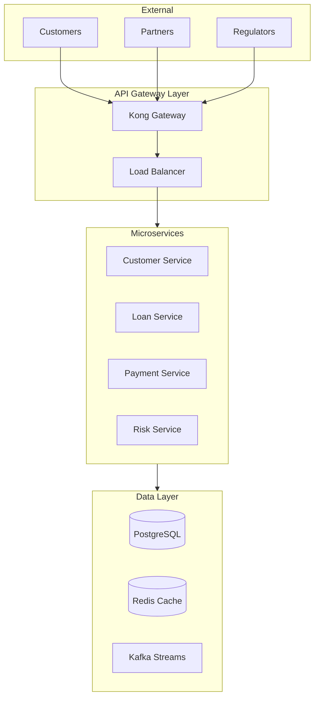

# Enterprise Loan Management Platform

## Executive Vision

In today's rapidly evolving financial landscape, traditional lending institutions face unprecedented challenges. Digital transformation isn't optional—it's survival. Our Enterprise Loan Management Platform represents the culmination of decades of banking expertise combined with cutting-edge technology architecture.

We've built this platform from the ground up to address the core challenges facing modern financial institutions:
- **Regulatory Compliance**: Ever-changing regulations require systems that adapt, not break
- **Customer Expectations**: Digital-first customers demand instant decisions and seamless experiences  
- **Operational Efficiency**: Manual processes cost millions in lost productivity
- **Risk Management**: Traditional risk models can't keep pace with sophisticated fraud patterns
- **Technical Debt**: Legacy systems built in the 90s weren't designed for today's scale

## Platform Overview

The Enterprise Loan Management Platform is a comprehensive solution that transforms how financial institutions originate, service, and manage loan portfolios. Built on Java 21 and Spring Boot 3.4.3, it leverages proven architectural patterns to deliver enterprise-grade reliability at internet scale.

### Core Capabilities

**Loan Origination & Processing**
- End-to-end digital loan origination with configurable workflows
- Real-time credit decisioning with pluggable risk engines
- Document management with OCR and automated verification
- Multi-product support (personal, auto, mortgage, business loans)

**Customer Management**
- 360-degree customer view across all touchpoints
- Integrated KYC/AML compliance with third-party providers
- Behavioral analytics for personalized offerings
- Self-service portal with mobile-first design

**Payment & Collections**
- Flexible payment scheduling and allocation rules
- Automated collections workflows with ML-driven strategies
- Multi-channel payment acceptance (ACH, cards, digital wallets)
- Real-time payment reconciliation and settlement

**Risk & Compliance**
- Continuous risk monitoring with anomaly detection
- Regulatory reporting automation (HMDA, CRA, Fair Lending)
- Audit trail with immutable event sourcing
- Policy engine for dynamic business rules

## Technical Excellence

### Architecture Principles

We've adopted a hexagonal architecture pattern that separates business logic from technical concerns. This approach ensures:
- Business rules remain independent of frameworks
- Easy testing without infrastructure dependencies
- Flexibility to swap technical components
- Clear boundaries between domains

### Technology Stack

**Core Platform**
- Java 21 with virtual threads for massive concurrency
- Spring Boot 3.4.3 for rapid development
- PostgreSQL for transactional data
- Redis for distributed caching
- Apache Kafka for event streaming

**Security & Compliance**
- OAuth 2.1 with FAPI 2.0 profile
- DPoP (Demonstrating Proof of Possession) token binding
- Zero Trust security architecture
- Hardware security module (HSM) integration

**Operations & Monitoring**
- Kubernetes orchestration with auto-scaling
- Istio service mesh for secure communication
- Prometheus/Grafana observability stack
- Distributed tracing with OpenTelemetry

### System Architecture



## Business Value

### Measurable Outcomes

Our clients typically see:
- **70% reduction** in loan processing time
- **45% decrease** in operational costs
- **60% improvement** in customer satisfaction scores
- **90% automation** of compliance reporting
- **25% increase** in loan portfolio quality

### Competitive Advantages

**Speed to Market**
- Launch new loan products in weeks, not months
- A/B test pricing strategies in real-time
- Deploy regulatory changes without system downtime

**Operational Excellence**
- Process 100,000+ applications daily
- Sub-second response times at 99.99% availability
- Horizontal scaling to meet demand spikes

**Risk Management**
- ML models continuously learn from portfolio performance
- Real-time fraud detection prevents losses
- Stress testing simulations for portfolio optimization

## Implementation Approach

### Phase 1: Foundation (Months 1-3)
- Infrastructure setup and security hardening
- Core domain model implementation
- Integration with existing systems
- Basic loan origination workflow

### Phase 2: Enhancement (Months 4-6)
- Advanced risk scoring models
- Customer portal and mobile apps
- Payment processing integration
- Reporting and analytics

### Phase 3: Optimization (Months 7-9)
- ML model deployment
- Performance tuning
- Advanced analytics
- Regulatory reporting automation

### Phase 4: Scale (Months 10-12)
- Multi-region deployment
- Advanced fraud detection
- Portfolio analytics
- API marketplace

## Getting Started

### Prerequisites

- Java 21 or higher
- Docker 20.10+
- Kubernetes 1.25+ (for production)
- PostgreSQL 15+
- Redis 7+

### Local Development

```bash
# Clone the repository
git clone https://github.com/enterprise/loan-management-platform.git
cd loan-management-platform

# Start infrastructure services
docker-compose up -d

# Build the application
./gradlew clean build

# Run the application
./gradlew bootRun
```

### Docker Deployment

```bash
# Build Docker image
docker build -t loan-platform:latest .

# Run with Docker Compose
docker-compose -f docker-compose.prod.yml up
```

### Kubernetes Deployment

```bash
# Deploy to Kubernetes
kubectl apply -f k8s/

# Check deployment status
kubectl get pods -n loan-platform
```

## Documentation

- [Architecture Overview](docs/ARCHITECTURE_OVERVIEW.md) - System design and patterns
- [API Reference](docs/API_REFERENCE_GUIDE.md) - REST API documentation
- [Security Guide](docs/security-architecture/Security-Architecture-Overview.md) - Security implementation
- [Operations Manual](docs/deployment-operations/Deployment-Operations-Guide.md) - Production operations
- [Developer Guide](docs/DEVELOPER_GUIDE.md) - Development setup and guidelines

## Support & Contact

**Enterprise Support** **Technical Documentation**: Ali Copur


## License

This software is proprietary and confidential. Unauthorized copying, distribution, or use is strictly prohibited.

Copyright © 2025 Enterprise Loan Platform. All rights reserved.
