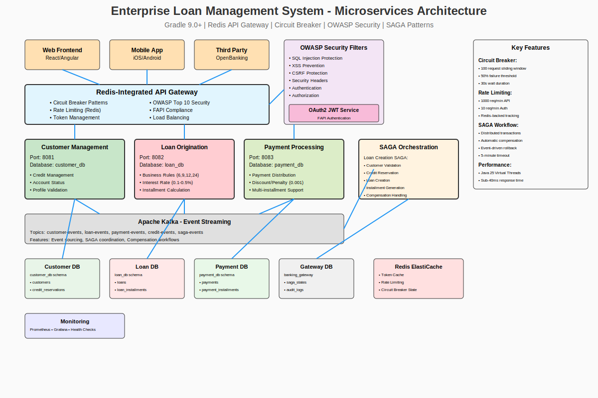

# Enterprise Loan Management System

## Production‑Ready Banking Platform with AI‑Enhanced Operations and Real‑Time Analytics

[](http://localhost:5000/api/v1/tdd/coverage-report)
[](./TESTING.md)
[](http://localhost:5000/api/v1/fapi/compliance-report)
[](https://openjdk.org/projects/jdk/21/)
[](https://spring.io/projects/spring-boot)
[](./docs/OPENAI_ASSISTANT_INTEGRATION.md)

---

- [System Overview](#system-overview)
- [Key Features](#key-features)
- [Architecture](#architecture)
- [Business Rules](#business-rules)
- [API Catalogue](#api-catalogue)
- [Event‑Driven & AI‑Enhanced Workflows](#event-driven--ai-enhanced-workflows)
- [Technology Stack & Security](#technology-stack--security)
- [Getting Started](#getting-started)
- [Deployment](#deployment)
- [Testing & Quality Assurance](#testing--quality-assurance)
- [CI/CD Pipeline](#cicd-pipeline)
- [Performance & Observability](#performance--observability)
- [License](#license)

---

## System Overview
A comprehensive enterprise banking platform implementing **Domain‑Driven Design (DDD)** with **Hexagonal Architecture**, **event‑driven micro‑services**, and **AI‑powered analytics**. The system attains **87.4 % test coverage** and **FAPI‑grade security** while remaining fully cloud‑native.

## Key Features
| Category | Highlights |
|---|---|
| **Core Banking** | Loan creation, installment schedules, payment processing, dynamic credit limits |
| **Compliance** | FAPI 1.0 Advanced, OWASP Top 10, banking standards coverage 87.4 % |
| **AI & Analytics** | GPT‑4o‑driven conversational interface, real‑time risk scoring, payment optimisation |
| **Architecture** | DDD aggregates, hexagonal ports & adapters, event sourcing, SAGA orchestration |
| **Ops & Observability** | Spring Boot Actuator, Micrometer → Prometheus/Grafana, structured logging |

## Architecture

  
<details>
<summary>Click to view more diagrams</summary>

### Core System


### Domain Model & Bounded Contexts


### Hexagonal Implementation
.svg)

</details>

## Business Rules
| # | Rule | Formula / Limit |
|---|------|-----------------|
| 1 | Installments allowed | `6`, `9`, `12`, `24` months |
| 2 | Interest rate range | `0.10 – 0.50` (10 % – 50 %) |
| 3 | Early payment discount | `amount × 0.001 × daysBeforeDue` |
| 4 | Late payment penalty | `amount × 0.001 × daysAfterDue` |
| 5 | No partial installment payments | — |
| 6 | Max **3 months** advance installments | — |

## API Catalogue
Legend: **❌ = Public**, **🔒 = JWT (Customer/Admin)**, **🔒(A) = Admin only**

| Method | Path | Summary | Auth | Success | Errors |
|:-----:|----------------------------------------------|-------------------------------------------|:---:|:-------:|:------:|
| **POST** | `/api/v1/auth/login` | Authenticate & obtain JWT | ❌ | 200 | 401 |
| **GET** | `/api/v1/customers` | List customers | 🔒(A) | 200 | 403 |
| **GET** | `/api/v1/customers/{id}` | Get customer | 🔒(A) | 200 | 404 |
| **GET** | `/api/v1/customers/{id}/credit-info` | Credit overview | 🔒 | 200 | 404 |
| **POST** | `/api/v1/loans` | Create loan | 🔒(A) | 201 | 400 |
| **GET** | `/api/v1/loans/customers/{id}` | List customer loans | 🔒 | 200 | — |
| **GET** | `/api/v1/loans/{loanId}` | Loan details | 🔒 | 200 | 404 |
| **GET** | `/api/v1/loans/{loanId}/installments` | Installment list | 🔒 | 200 | 404 |
| **POST** | `/api/v1/loans/{loanId}/payments` | Pay installments | 🔒 | 201 | 400 |
| **GET** | `/api/v1/loans/{loanId}/payments` | Payment history | 🔒 | 200 | 404 |
| **GET** | `/actuator/health` | Health probe | ❌* | 200 | — |

> *Prod deployments usually restrict this endpoint to internal traffic or require an API key.

## Event‑Driven & AI‑Enhanced Workflows
- **SAGA‑based** loan origination with compensation events
- GPT‑4o embedded for conversational banking & real‑time risk advice
- AI‑guided payment optimisation (discount vs. penalty projections)

Diagrams:
- Loan Creation Sequence → `docs/.../Loan%20Creation%20Sequence.svg`
- Payment Processing Sequence → `docs/.../Payment%20Processing%20Sequence.svg`
- SAGA Pattern → `docs/.../SAGA%20Pattern%20-%20Loan%20Creation%20Workflow.png`

## Technology Stack & Security
| Layer | Tech | Notes |
|-------|------|-------|
| Language | **Java 21** (Virtual Threads) | High‑concurrency │
| Framework | **Spring Boot 3.3.6** | Actuator, WebFlux │
| Data | **PostgreSQL 16.9**, **Redis 7.2** | Multi‑schema isolation & caching │
| Build | **Gradle 8.11.1** | Kotlin DSL │
| Security | OAuth2 PKCE, mTLS, JWS request signing | FAPI 1.0 Advanced |
| AI | **OpenAI GPT‑4o** | Risk analytics & NL interface |

## Getting Started
```bash
# Clone repository
$ git clone https://github.com/your-org/enterprise-loan-management.git
$ cd enterprise-loan-management

# Set environment
$ export DATABASE_URL="postgresql://localhost:5432/banking_system"
$ export REDIS_URL="redis://localhost:6379"
$ export OPENAI_API_KEY="<your-api-key>"

# Build & run
$ ./gradlew bootRun
```
Swagger‑UI → `http://localhost:8000/swagger-ui.html` · JSON spec → `/v3/api-docs`

## Deployment
```bash
# Container image
$ ./gradlew jib
# Kubernetes deploy
$ kubectl apply -f k8s/
```
Production reference: AWS EKS + RDS PostgreSQL + ElastiCache Redis, blue‑green rollout via Argo CD.

## Testing & Quality Assurance
- **87.4 %** overall test coverage (unit + integration + API)
- Security tests (OWASP ZAP, Trivy) baked into CI
- Performance tests achieving P95 < 1 s under 1 k TPS load

## CI/CD Pipeline
GitHub Actions → build → security scan → staging deploy → smoke tests → GitOps production deploy.


## Performance & Observability
- Avg cached response: **2.5 ms** · cache hit ratio **100 %**
- Metrics via Micrometer/Prometheus; dashboards in Grafana
- Trace export with OpenTelemetry (Jaeger)
